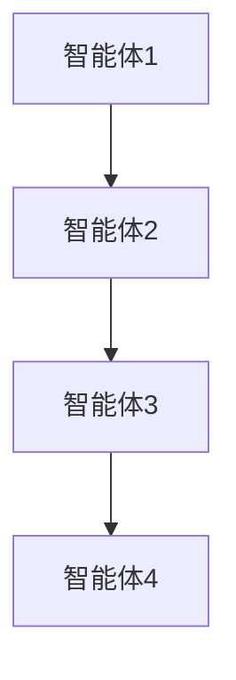
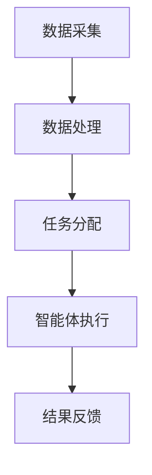
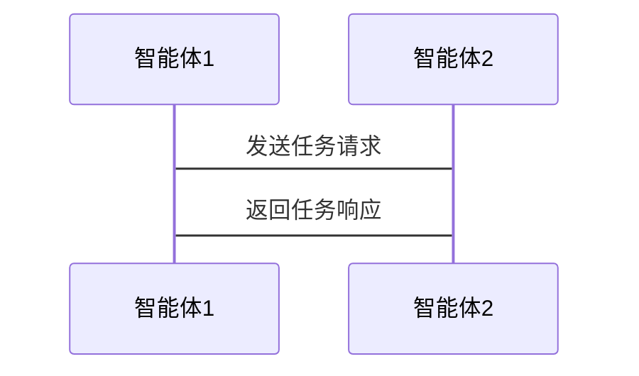

                 


# 多智能体系统在行业分析中的创新应用

## 关键词：多智能体系统，行业分析，创新应用，分布式计算，协作机制，系统架构

## 摘要：  
多智能体系统（Multi-Agent Systems, MAS）是一种分布式计算范式，由多个智能体协同工作以实现特定目标。本文探讨了多智能体系统在行业分析中的创新应用，涵盖了其核心概念、算法原理、系统架构以及在金融、医疗、交通等领域的实际案例。文章详细分析了多智能体系统的体系结构、通信与协作机制、任务分配算法，并通过具体的项目实战展示了其在行业分析中的潜力与挑战。最后，总结了多智能体系统的最佳实践建议，并展望了其未来的发展方向。

---

# 第一章: 引言

## 1.1 多智能体系统的定义与特点
### 1.1.1 多智能体系统的定义
多智能体系统（MAS）是由多个智能体组成的分布式系统，这些智能体能够自主决策、协作完成任务。智能体具备感知环境、推理、规划和执行的能力。

### 1.1.2 多智能体系统的组成要素
- 智能体：具备感知、推理、规划和执行能力。
- 通信机制：智能体之间的信息交换方式。
- 协作机制：任务分配和协作策略。
- 环境：智能体所处的外部世界，可能动态变化。

### 1.1.3 多智能体系统的核心特点
- 分布式：多个智能体协同工作，无中心节点。
- 自主性：智能体能够自主决策。
- 协作性：智能体之间通过协作完成共同目标。
- 反应性：能够实时感知环境变化并做出响应。

## 1.2 多智能体系统的发展历程
### 1.2.1 多智能体系统的起源
20世纪60年代，分布式系统概念的提出为MAS的发展奠定了基础。

### 1.2.2 多智能体系统的发展阶段
- 单智能体阶段：单个智能体完成任务。
- 多智能体阶段：多个智能体协同工作。
- 高级阶段：智能体具备学习和自适应能力。

### 1.2.3 多智能体系统的现状与趋势
当前，MAS在分布式计算、人工智能和大数据领域得到广泛应用，未来将更加智能化和自适应。

## 1.3 多智能体系统在行业分析中的应用价值
### 1.3.1 行业分析的核心问题
- 数据分析的复杂性。
- 多方协作的高效性。
- 动态环境的适应性。

### 1.3.2 多智能体系统在行业分析中的优势
- 高效协作：多个智能体协同完成复杂任务。
- 实时响应：快速适应环境变化。
- 智能决策：基于数据和模型做出优化决策。

## 1.4 本章小结
本章介绍了多智能体系统的定义、特点、发展历程及其在行业分析中的应用价值，为后续内容奠定了基础。

---

# 第二章: 多智能体系统的理论基础

## 2.1 多智能体系统的体系结构
### 2.1.1 分层体系结构
- 上层：全局协调和决策。
- 中层：任务分配和协作。
- 下层：具体执行智能体。

### 2.1.2 分布式体系结构
- 分布式计算模型，无中心节点。
- 每个智能体独立决策，通过通信协作。

### 2.1.3 基于角色的体系结构
- 每个智能体扮演特定角色。
- 角色之间协同完成任务。

## 2.2 多智能体系统的通信与协作
### 2.2.1 通信协议
- 通信方式：直接通信和间接通信。
- 协议设计：确保信息准确传递。

### 2.2.2 协作机制
- 任务分配：基于角色和能力分配任务。
- 冲突解决：通过协商或仲裁机制解决冲突。

### 2.2.3 冲突解决
- 协商：智能体之间通过协商达成一致。
- 仲裁：通过仲裁者解决无法协商的问题。

## 2.3 多智能体系统的建模与分析
### 2.3.1 系统建模方法
- 行为建模：描述智能体的行为和交互。
- 状态建模：描述智能体的状态变化。

### 2.3.2 行为建模
- 使用状态机模型描述智能体的行为。
- 定义状态转换条件和动作。

### 2.3.3 性能分析
- 系统吞吐量：单位时间内完成的任务数量。
- 响应时间：系统对请求的响应时间。

## 2.4 本章小结
本章详细介绍了多智能体系统的体系结构、通信与协作机制以及建模与分析方法，为后续的算法设计和应用提供了理论基础。

---

# 第三章: 多智能体系统的算法与技术

## 3.1 分布式计算与一致性算法
### 3.1.1 分布式计算的基本概念
- 分布式系统：多个计算节点协作完成任务。
- 分布式计算：在分布式系统中进行计算。

### 3.1.2 一致性算法
- Paxos算法：用于分布式系统中达成一致。
- Raft算法：Paxos的简化版本，用于领导者选举。

### 3.1.3 一致性算法的实现与应用
- Paxos算法流程：
  1. 提议者提出值。
  2. 通过多个节点的投票达成一致。
- Raft算法流程：
  1. 节点竞选领导者。
  2. 通过日志复制实现一致性。

### 3.1.4 一致性算法的实现代码示例
```python
# Paxos算法示例代码
class Paxos:
    def __init__(self, proposer_id):
        self.proposer_id = proposer_id
        self.current_value = None

    def propose(self, value):
        # 提议者发送提案
        pass

    def accept(self, value):
        # 接受者接受提案
        pass
```

## 3.2 多智能体系统的任务分配与协作
### 3.2.1 任务分配算法
- 基于角色的任务分配：根据智能体角色分配任务。
- 基于能力的任务分配：根据智能体能力动态分配任务。

### 3.2.2 协作机制设计
- 协作协议：定义智能体之间的协作规则。
- 协作流程：描述协作的具体步骤。

### 3.2.3 任务分配的数学模型
任务分配问题可以用图论模型表示，例如：

$$
\text{最大化 } \sum_{i=1}^{n} w_i x_i \\
\text{约束 } \sum_{i=1}^{n} x_i = 1
$$

其中，\( w_i \) 是任务 \( i \) 的权重，\( x_i \) 是智能体分配到任务 \( i \) 的概率。

### 3.2.4 任务分配的实现代码示例
```python
# 任务分配算法示例代码
def assign_task(tasks, agents):
    for task in tasks:
        # 根据权重分配任务
        pass
```

## 3.3 多智能体系统的通信协议与协议优化
### 3.3.1 通信协议的设计原则
- 简洁性：协议简单易懂。
- 可扩展性：支持未来扩展。
- 安全性：确保通信安全。

### 3.3.2 协议优化方法
- 压缩数据：减少传输数据量。
- 并行通信：提高通信效率。

### 3.3.3 通信协议的实现与应用
- 使用TCP/IP协议栈。
- 通过API网关实现智能体之间的通信。

## 3.4 本章小结
本章重点讲解了多智能体系统的算法与技术，包括一致性算法、任务分配算法和通信协议优化，为后续的系统设计和应用提供了技术支撑。

---

# 第四章: 多智能体系统在行业分析中的创新应用

## 4.1 金融行业的多智能体应用
### 4.1.1 金融行业分析的核心问题
- 实时数据分析：快速处理大量金融数据。
- 风险评估：准确评估投资风险。
- 市场预测：预测市场走势。

### 4.1.2 多智能体系统在金融行业的应用
- 实时数据监控：智能体实时监控市场数据。
- 风险评估：多个智能体协同评估风险。
- 市场预测：基于历史数据和模型预测市场走势。

### 4.1.3 金融行业中的多智能体系统优势
- 高效性：快速处理大量数据。
- 准确性：多智能体协同提高评估精度。
- 实时性：及时响应市场变化。

## 4.2 医疗行业的多智能体应用
### 4.2.1 医疗行业分析的核心问题
- 病历分析：分析患者病历。
- 疾病预测：预测疾病风险。
- 药物研发：加速新药研发。

### 4.2.2 多智能体系统在医疗行业的应用
- 病历分析：智能体协同分析病历数据。
- 疾病预测：基于机器学习模型预测疾病风险。
- 药物研发：多个智能体协同优化药物分子结构。

### 4.2.3 医疗行业中的多智能体系统优势
- 高效性：快速处理医疗数据。
- 准确性：提高疾病预测的准确性。
- 实时性：及时响应医疗需求。

## 4.3 交通行业的多智能体应用
### 4.3.1 交通行业分析的核心问题
- 交通流量预测：预测交通流量。
- 路况监控：实时监控道路状况。
- 路径规划：优化交通路径。

### 4.3.2 多智能体系统在交通行业的应用
- 交通流量预测：智能体协同预测交通流量。
- 路况监控：智能体实时监控道路状况。
- 路径规划：智能体协同优化交通路径。

### 4.3.3 交通行业中的多智能体系统优势
- 高效性：快速处理交通数据。
- 实时性：及时响应交通需求。
- 智能性：优化交通路径和流量。

## 4.4 本章小结
本章通过金融、医疗和交通行业的案例，展示了多智能体系统在行业分析中的创新应用，突出了其高效性、准确性和实时性的优势。

---

# 第五章: 多智能体系统的系统设计

## 5.1 系统架构设计
### 5.1.1 系统架构图


### 5.1.2 系统功能模块
- 智能体模块：完成具体任务。
- 通信模块：实现智能体之间的通信。
- 协作模块：协调智能体的协作。

## 5.2 系统功能设计
### 5.2.1 功能模块设计
- 数据采集模块：采集行业数据。
- 数据处理模块：处理和分析数据。
- 任务分配模块：分配任务给智能体。

### 5.2.2 功能流程图


## 5.3 系统接口设计
### 5.3.1 接口定义
- API接口：智能体之间的通信接口。
- 数据接口：与外部系统交互的接口。

### 5.3.2 接口实现
- RESTful API：使用HTTP协议实现接口。
- 数据接口：使用数据库连接实现接口。

## 5.4 系统交互流程
### 5.4.1 交互流程图


## 5.5 本章小结
本章详细设计了多智能体系统的架构、功能模块、接口设计和交互流程，为系统的实现提供了明确的指导。

---

# 第六章: 多智能体系统的项目实战

## 6.1 项目环境安装
### 6.1.1 系统要求
- 操作系统：Linux/Windows/MacOS。
- 开发工具：Python、Jupyter Notebook。
- 依赖库：numpy、pandas、scikit-learn。

### 6.1.2 安装步骤
1. 安装Python：从官网下载并安装Python。
2. 安装依赖库：使用pip安装numpy、pandas、scikit-learn。

## 6.2 系统核心实现
### 6.2.1 智能体类的实现
```python
class Agent:
    def __init__(self, id):
        self.id = id
        self.tasks = []

    def assign_task(self, task):
        self.tasks.append(task)

    def execute_task(self):
        pass
```

### 6.2.2 通信模块的实现
```python
class Communication:
    def __init__(self):
        self.agents = []

    def send_message(self, sender, receiver, message):
        pass

    def receive_message(self, agent, message):
        pass
```

### 6.2.3 任务分配算法的实现
```python
def assign_tasks(agents, tasks):
    for agent in agents:
        agent.assign_task(tasks.pop())
```

## 6.3 代码应用与分析
### 6.3.1 代码实现
```python
# 多智能体系统实现代码
class MultiAgentSystem:
    def __init__(self, num_agents):
        self.agents = [Agent(i) for i in range(num_agents)]
        self.communication = Communication()

    def run(self):
        for agent in self.agents:
            agent.execute_task()
```

### 6.3.2 代码分析
- 初始化多个智能体。
- 通过通信模块实现智能体之间的协作。
- 任务分配算法实现任务的动态分配。

## 6.4 案例分析与详细解读
### 6.4.1 实际案例
- 金融行业：实时数据分析。
- 医疗行业：病历分析和疾病预测。

### 6.4.2 案例分析
- 金融行业的案例：智能体协同分析市场数据，实时预测市场走势。
- 医疗行业的案例：智能体协同分析病历数据，提高疾病预测的准确性。

## 6.5 项目小结
本章通过实际案例展示了多智能体系统的实现过程，包括环境安装、核心代码实现、案例分析和项目总结。

---

# 第七章: 总结与展望

## 7.1 总结
多智能体系统在行业分析中的创新应用具有高效性、准确性和实时性等优势，能够显著提升行业分析的效率和效果。

## 7.2 最佳实践 tips
- 系统设计：注重系统的可扩展性和可维护性。
- 任务分配：根据智能体的能力动态分配任务。
- 通信协议：选择合适的通信协议，确保通信的高效性和安全性。

## 7.3 未来展望
- 智能化：智能体具备更强的自主学习和决策能力。
- 自适应性：系统能够自适应环境的变化。
- 应用领域：多智能体系统将在更多行业得到广泛应用。

## 7.4 本章小结
本章总结了全文的主要内容，提出了多智能体系统的最佳实践建议，并展望了其未来的发展方向。

---

# 结语

多智能体系统在行业分析中的创新应用具有广阔的发展前景，随着技术的进步和应用的深入，多智能体系统将在更多领域展现出其强大的潜力。

