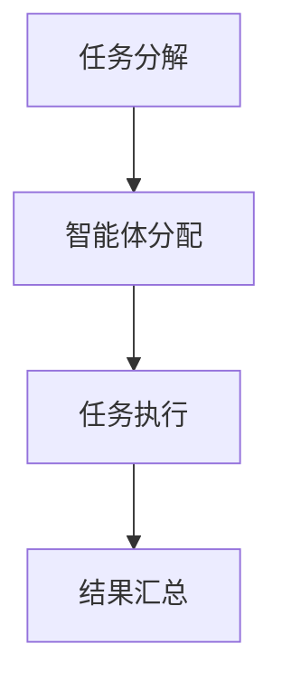
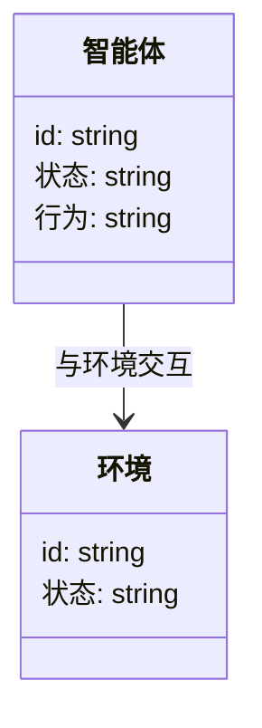
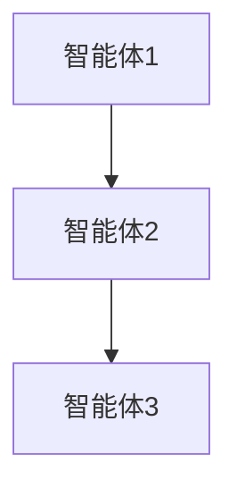
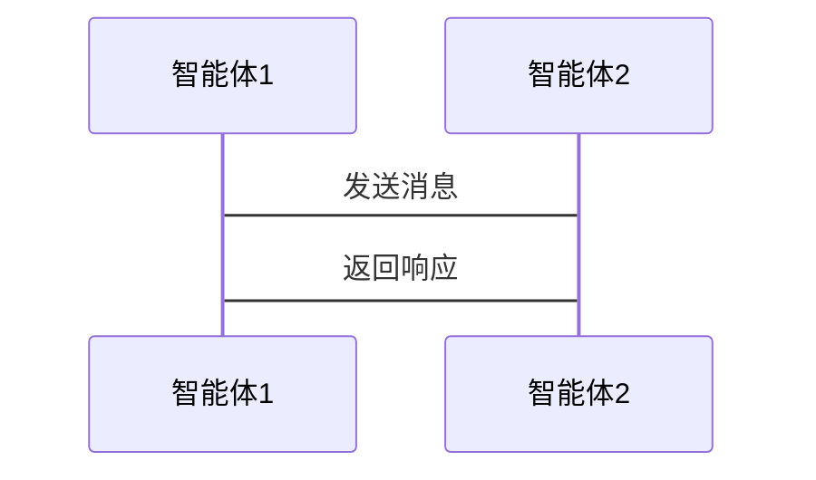

                 


# 多智能体系统在行业分析中的应用

> 关键词：多智能体系统、行业分析、分布式计算、一致性算法、博弈论、系统架构

> 摘要：本文深入探讨了多智能体系统在行业分析中的应用，涵盖其核心概念、算法原理、系统架构、项目实战及最佳实践。通过具体案例分析和详细的技术解读，为读者提供全面的指导和见解。

---

# {{文章标题}}

## 第一章: 多智能体系统概述

### 1.1 多智能体系统的定义与特点
多智能体系统（Multi-Agent Systems, MAS）是指由多个智能体（Agent）组成的系统，这些智能体能够自主决策、协作和通信，以完成特定任务。与单智能体系统相比，MAS具有以下特点：
- **分布式智能**：多个智能体协同工作，避免单点故障。
- **自主性**：每个智能体都能独立决策。
- **协作性**：通过通信和协作完成复杂任务。
- **动态性**：适应环境变化，实时调整策略。

### 1.2 多智能体系统的分类
多智能体系统可以根据任务需求、智能体结构和通信机制进行分类：
- **任务驱动**：根据任务类型分为数据处理、决策支持等。
- **结构驱动**：分为基于规则、基于模型的智能体。
- **通信驱动**：分为同步通信和异步通信。

### 1.3 多智能体系统的应用领域
多智能体系统广泛应用于多个行业：
- **金融行业**：实时数据分析、风险评估。
- **物流行业**：路径优化、资源调度。
- **智能交通**：实时监控、流量管理。
- **医疗行业**：病例分析、治疗方案推荐。

### 1.4 多智能体系统与单智能体系统的区别
| **特性**      | **单智能体系统**            | **多智能体系统**               |
|---------------|-----------------------------|-------------------------------|
| **复杂度**    | 系统简单，任务单一          | 系统复杂，任务多样           |
| **协作性**    | 无协作                      | 高协作                      |
| **扩展性**    | 扩展困难                    | 易扩展                      |

---

## 第二章: 多智能体系统的核心概念与联系

### 2.1 多智能体系统的原理
多智能体系统的核心在于智能体之间的通信与协作。智能体通过消息传递进行通信，利用分布式计算和一致性算法确保数据同步。

### 2.2 实体关系图
```mermaid
er
actor 智能体 {
  id: string
  状态: string
  行为: string
}
actor 环境 {
  id: string
  状态: string
}
```

### 2.3 一致性算法
一致性算法确保分布式系统中数据的一致性。Paxos算法是常用的解决方案，其数学模型如下：
$$ \text{一致性} = \text{所有节点达成共识} $$

### 2.4 博弈论应用
博弈论中的纳什均衡用于分析智能体的策略选择：
$$ \text{纳什均衡} = \text{所有智能体策略稳定} $$

---

## 第三章: 多智能体系统的算法原理

### 3.1 分布式计算
分布式计算通过将任务分解到多个智能体完成，提高计算效率。Mermaid流程图展示如下：


### 3.2 一致性算法
一致性算法如Raft确保数据一致性。Python实现示例：
```python
class RAFT:
    def __init__(self, nodes):
        self.nodes = nodes
        self.current_leader = None

    def elect_leader(self):
        # 简化版选举逻辑
        self.current_leader = max(self.nodes, key=lambda x: x.id)
```

### 3.3 博弈论应用
通过博弈论优化智能体决策。例如，在资源分配中，智能体通过纳什均衡选择最优策略。

---

## 第四章: 多智能体系统架构设计

### 4.1 系统功能设计
系统功能包括数据采集、分析和反馈。Mermaid类图如下：


### 4.2 系统架构设计
采用微服务架构，确保各智能体独立运行。Mermaid架构图：


### 4.3 接口设计
定义RESTful API接口，如：
```http
POST /api/agent/action
```

### 4.4 交互序列图
展示智能体间的通信流程：


---

## 第五章: 项目实战

### 5.1 环境安装
安装必要的库：
```bash
pip install multiagent
```

### 5.2 核心代码实现
实现智能体协作的Python代码：
```python
class Agent:
    def __init__(self, id):
        self.id = id

    def act(self, environment):
        # 具体行为实现
        pass
```

### 5.3 代码解读与分析
分析代码结构，解释每个部分的功能。

### 5.4 案例分析
以股票价格预测为例，展示系统如何协作完成预测任务。

### 5.5 项目总结
总结项目经验，提出改进建议。

---

## 第六章: 最佳实践

### 6.1 关键点总结
- 系统设计要注重扩展性和可维护性。
- 使用成熟的一致性算法确保数据一致性。
- 在智能体间建立良好的通信机制。

### 6.2 注意事项
- 避免过度耦合，保持智能体的独立性。
- 定期监控系统性能，及时优化。

### 6.3 拓展阅读
推荐相关书籍和论文，供读者深入学习。

---

## 附录

### A. 术语表
- **智能体（Agent）**：能够感知环境并采取行动的实体。
- **一致性算法**：确保分布式系统中数据一致性的算法。

### B. 参考文献
- [1] 《分布式系统：概念与设计》
- [2] 《多智能体系统与应用》

---

通过以上结构，读者可以系统地了解多智能体系统在行业分析中的应用，并掌握实际的实现方法。

