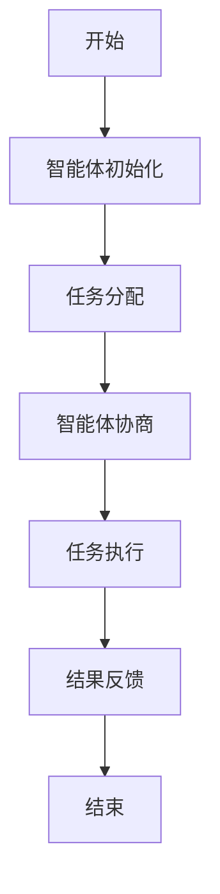
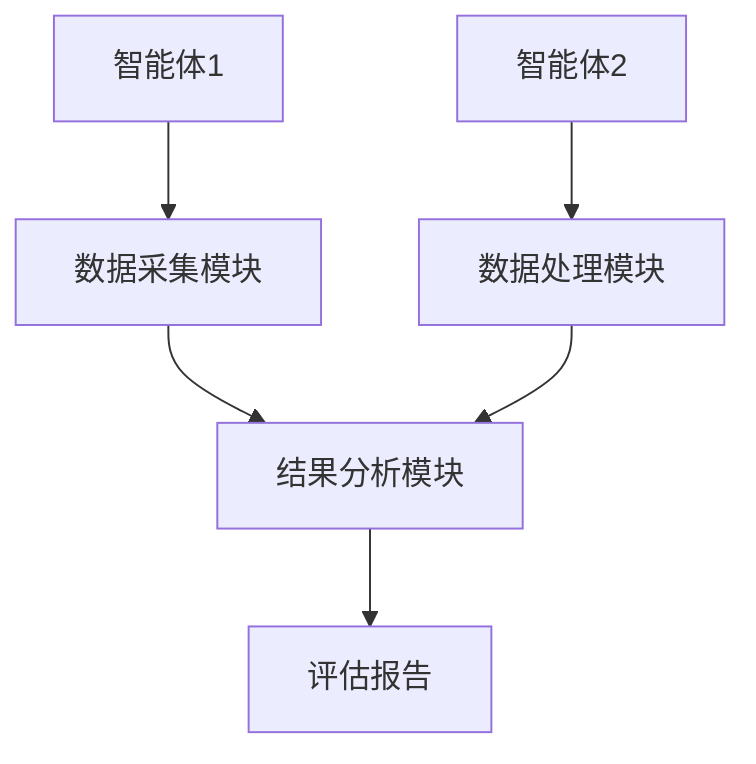
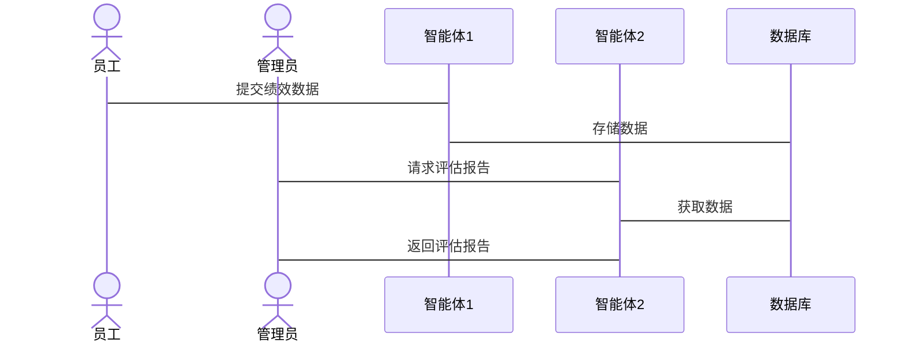

                 


# 多智能体系统在评估公司人力资本价值中的应用

## 关键词：多智能体系统，人力资本评估，MAS，智能体，企业价值

## 摘要：本文探讨了多智能体系统（MAS）在公司人力资本评估中的应用。通过分析MAS的核心概念、算法原理、数学模型、系统架构以及实际案例，展示了如何利用MAS提升人力资本的价值评估。文章从理论到实践，详细讲解了MAS在企业中的应用优势和具体实现方法。

---

# 第1章 多智能体系统与人力资本评估概述

## 1.1 多智能体系统（MAS）的基本概念

### 1.1.1 多智能体系统的定义
多智能体系统（Multi-Agent System, MAS）是由多个相互作用的智能体组成的分布式系统。智能体（Agent）是指能够感知环境、自主决策并采取行动的实体。MAS通过智能体之间的协作和竞争，实现复杂任务的高效完成。

### 1.1.2 多智能体系统的核心特点
- **分布式性**：智能体分布在不同的空间或计算单元中，具有独立性。
- **自主性**：智能体能够自主决策，无需外部干预。
- **协作性**：智能体之间通过通信和协调完成共同目标。
- **反应性**：智能体能够实时感知环境变化并做出响应。

### 1.1.3 多智能体系统与单智能体系统的区别
| 属性          | 单智能体系统       | 多智能体系统       |
|---------------|--------------------|--------------------|
| 结构          | 单一计算单元      | 多个计算单元      |
| 决策方式      | 中央决策          | 分布式决策        |
| 灵活性        | 较低              | 较高              |
| 可扩展性      | 较差              | 较好              |

## 1.2 人力资本评估的基本概念

### 1.2.1 人力资本的定义
人力资本是指员工的知识、技能、经验和创新能力的总和。它是企业核心竞争力的重要组成部分。

### 1.2.2 人力资本评估的主要维度
- **绩效表现**：员工的工作成果和目标达成情况。
- **技能水平**：员工的专业能力和技术熟练度。
- **潜力评估**：员工未来发展的可能性。
- **贡献度**：员工对团队或组织的贡献程度。

### 1.2.3 人力资本评估在企业管理中的重要性
- **优化资源配置**：通过评估确定员工的价值，合理分配任务。
- **提升员工绩效**：通过反馈和培训提高员工能力。
- **支持战略决策**：为企业的人员管理和战略规划提供数据支持。

## 1.3 多智能体系统在人力资本评估中的应用背景

### 1.3.1 传统人力资本评估的局限性
- **评估维度单一**：传统评估方法往往只关注绩效，忽视潜力和创新能力。
- **数据孤岛**：各部门数据分散，难以整合分析。
- **实时性不足**：传统评估周期长，难以应对快速变化的市场需求。

### 1.3.2 多智能体系统的优势
- **分布式计算**：MAS能够同时处理大量数据，提升评估效率。
- **实时协作**：智能体实时交互，确保评估数据的及时性和准确性。
- **动态调整**：根据环境变化快速调整评估策略。

### 1.3.3 当前企业对智能体系统的迫切需求
随着市场竞争加剧，企业需要快速、准确地评估员工价值，以适应动态变化的市场需求。MAS通过其分布式和协作特性，为企业提供了高效的解决方案。

## 1.4 本章小结
本章介绍了多智能体系统的基本概念和特点，分析了人力资本评估的主要维度及其在企业管理中的重要性。同时，探讨了MAS在人力资本评估中的应用背景和优势，为后续章节的深入分析奠定了基础。

---

# 第2章 多智能体系统的核心概念与联系

## 2.1 多智能体系统的组成与属性

### 2.1.1 智能体的定义与分类
智能体可以根据智能性和自主性分为以下几类：
- **反应式智能体**：基于当前感知做出反应，不依赖历史信息。
- **认知式智能体**：具有复杂推理和规划能力，能够处理历史信息。
- **实用式智能体**：基于效用函数进行决策，追求目标的最优性。

### 2.1.2 智能体的核心属性
- **自主性**：智能体能够自主决策。
- **反应性**：能够感知环境变化并做出反应。
- **社会性**：能够与其他智能体或人类进行交互和协作。
- **学习性**：能够通过经验改进自身行为。

### 2.1.3 多智能体系统中的智能体关系
智能体之间的关系可以是竞争、协作或混合关系。例如，在任务分配中，智能体之间需要协作完成任务，而在资源分配中可能需要竞争。

## 2.2 多智能体系统的ER实体关系图

```mermaid
er
actor: Employee
actor: Task
actor: Skill
actor: Performance
actor: Feedback

Employee -|> Task: 执行任务
Task --> Skill: 需要技能
Skill --> Performance: 表现
Performance --> Feedback: 产生反馈
```

### 2.2.1 实体关系图的构建
该ER图展示了员工、任务、技能、绩效和反馈之间的关系。员工执行任务，任务需要特定技能，技能通过绩效表现产生反馈，从而形成一个完整的评估链。

### 2.2.2 实体关系图的分析
- 员工通过执行任务来展示技能。
- 任务需要特定的技能支持。
- 技能通过绩效表现被评估。
- 绩效表现通过反馈机制形成闭环。

## 2.3 多智能体系统的概念属性特征对比

| 属性       | 单智能体系统 | 多智能体系统 |
|------------|--------------|--------------|
| 系统结构   | 集中式       | 分布式       |
| 决策中心   | 单一         | 分散         |
| 信息共享   | 中央存储     | 分布存储     |
| 任务分配   | 中央分配     | 分布分配     |

## 2.4 本章小结
本章详细分析了多智能体系统的组成与属性，通过ER图展示了智能体之间的关系，帮助读者更好地理解MAS在人力资本评估中的应用结构。

---

# 第3章 多智能体系统的算法原理

## 3.1 多智能体系统的算法概述

### 3.1.1 分布式计算的基本原理
分布式计算通过将任务分解到多个智能体上，利用并行计算提高效率。MAS中的分布式算法需要考虑任务分配、负载均衡和通信效率。

### 3.1.2 多智能体系统中的协调机制
协调机制确保智能体之间的协作，常见的协调机制包括价格调整机制、拍卖机制和协商机制。

### 3.1.3 多智能体系统中的通信协议
智能体之间的通信需要遵循特定的协议，常见的通信协议包括HTTP、MQTT和DDS。

## 3.2 多智能体系统的算法实现

### 3.2.1 多智能体系统中的分布式算法
分布式算法用于任务分配和资源分配。例如，任务分配可以通过分布式协商算法实现。

### 3.2.2 多智能体系统中的协商算法
协商算法用于智能体之间的任务分配和资源分配。常见的协商算法包括谈判协议和拍卖协议。

### 3.2.3 多智能体系统中的任务分配算法
任务分配算法需要考虑任务的优先级和智能体的能力。例如，基于优先级的任务分配算法。

## 3.3 多智能体系统的算法流程图



## 3.4 本章小结
本章介绍了多智能体系统的算法原理，通过流程图展示了MAS的算法执行过程，帮助读者理解MAS在人力资本评估中的具体实现。

---

# 第4章 多智能体系统的数学模型与公式

## 4.1 多智能体系统的数学模型

### 4.1.1 多智能体系统的状态表示
状态表示可以采用向量形式，例如：
$$
\text{状态} = [\text{任务1完成度}, \text{任务2完成度}, \ldots]
$$

### 4.1.2 多智能体系统的动作表示
动作表示可以采用决策树或策略函数，例如：
$$
\text{动作} = \argmax_{i} Q(s_i)
$$
其中，\( Q(s_i) \) 是状态 \( s_i \) 下的动作价值。

### 4.1.3 多智能体系统的环境表示
环境表示可以采用马尔可夫决策过程（MDP）模型：
$$
\text{环境} = (S, A, P, R)
$$
其中，\( S \) 是状态空间，\( A \) 是动作空间，\( P \) 是转移概率，\( R \) 是奖励函数。

## 4.2 多智能体系统的数学公式

### 4.2.1 协调机制的数学表达
协调机制可以通过博弈论中的纳什均衡模型表示：
$$
\text{纳什均衡} = \{a_i^*, a_j^*\} \text{，其中} a_i^* \text{是智能体i的最优策略}
$$

### 4.2.2 分布式计算的数学模型
分布式计算可以通过并行计算模型表示：
$$
\text{总任务时间} = \sum_{i=1}^{n} \text{任务i时间}
$$

### 4.2.3 任务分配的数学公式
任务分配可以通过最优化模型表示：
$$
\min_{x_i} \sum_{i=1}^{n} c_i x_i
$$
其中，\( c_i \) 是任务i的处理成本，\( x_i \) 是任务分配到智能体i的标志变量。

## 4.3 公式详细讲解与举例

### 4.3.1 协调机制的详细讲解
纳什均衡模型用于智能体之间的策略协调，确保在均衡状态下，智能体无法通过单方面改变策略而获益。

### 4.3.2 分布式计算的详细讲解
并行计算模型通过分解任务到多个智能体，提高计算效率和资源利用率。

### 4.3.3 任务分配的详细讲解
最优化模型通过最小化总成本，实现任务的最优分配。

## 4.4 本章小结
本章通过数学模型和公式，详细分析了多智能体系统的状态表示、动作表示和环境表示，以及协调机制、分布式计算和任务分配的数学表达，为后续章节的实现提供了理论基础。

---

# 第5章 多智能体系统的系统分析与架构设计

## 5.1 系统分析

### 5.1.1 项目背景
随着企业对人力资本评估的需求增加，传统的评估方法已经无法满足要求，MAS提供了高效的解决方案。

### 5.1.2 系统功能设计
- **数据采集**：收集员工的绩效数据、技能数据等。
- **智能体协作**：智能体之间协作完成评估任务。
- **结果分析**：通过数据分析得出员工的价值评估结果。

### 5.1.3 系统架构设计


### 5.1.4 系统接口设计
- **智能体接口**：智能体之间的通信接口。
- **数据接口**：与企业数据系统的接口。
- **用户接口**：供管理员查看评估报告的接口。

### 5.1.5 系统交互设计


## 5.2 本章小结
本章通过系统分析与架构设计，展示了MAS在人力资本评估中的具体实现方式，为后续章节的项目实战奠定了基础。

---

# 第6章 多智能体系统的项目实战

## 6.1 项目环境安装

### 6.1.1 环境需求
- 操作系统：Linux/Windows/MacOS
- 编程语言：Python 3.6+
- 依赖库：Python的网络通信库（如：socket、requests）和绘图库（如：matplotlib、seaborn）。

### 6.1.2 安装步骤
1. 安装Python：
   ```bash
   apt-get install python3 python3-pip
   ```
2. 安装依赖库：
   ```bash
   pip install numpy matplotlib requests
   ```

## 6.2 系统核心实现

### 6.2.1 智能体类的实现
```python
class Agent:
    def __init__(self, id):
        self.id = id
        self.data = {}

    def collect_data(self, task):
        # 收集数据
        pass

    def send_data(self, receiver, data):
        # 发送数据
        pass
```

### 6.2.2 任务分配算法的实现
```python
def distribute_task(agents, tasks):
    # 分配任务到智能体
    pass
```

### 6.2.3 协商算法的实现
```python
def negotiate(agents, task):
    # 智能体之间协商任务分配
    pass
```

## 6.3 代码应用解读与分析

### 6.3.1 智能体类的代码解读
智能体类实现了数据收集和发送功能，具体实现可以根据实际需求进行扩展。

### 6.3.2 任务分配算法的代码解读
任务分配算法需要考虑智能体的能力和负载，确保任务合理分配。

### 6.3.3 协商算法的代码解读
协商算法通过智能体之间的通信和决策，确定任务的最终分配方案。

## 6.4 项目小结
本章通过项目实战，展示了MAS在人力资本评估中的具体实现，包括环境安装、核心代码实现和系统交互设计。

---

# 第7章 多智能体系统的总结与展望

## 7.1 总结

### 7.1.1 多智能体系统的优势
- 高效性：通过分布式计算提高评估效率。
- 协作性：智能体协作完成复杂任务。
- 灵活性：能够适应动态变化的市场需求。

### 7.1.2 多智能体系统的局限性
- 通信开销大：智能体之间的通信需要额外的资源。
- 协调困难：复杂任务的协调可能面临挑战。
- 安全性问题：智能体之间的通信可能存在安全隐患。

## 7.2 展望

### 7.2.1 未来发展方向
- **智能化**：通过强化学习提升智能体的自主决策能力。
- **高效性**：优化算法提高系统效率。
- **安全性**：加强数据加密和访问控制，确保系统安全。

### 7.2.2 技术创新
- **边缘计算**：将智能体部署在边缘设备上，减少数据传输延迟。
- **区块链**：利用区块链技术确保数据的安全性和不可篡改性。

## 7.3 最佳实践 tips

### 7.3.1 数据隐私保护
在MAS中，数据隐私保护是至关重要的。可以通过加密技术和访问控制来实现。

### 7.3.2 模型优化
为了提高系统的效率，需要对任务分配算法和协商算法进行优化，减少计算开销。

### 7.3.3 系统扩展性
在设计MAS时，需要考虑系统的扩展性，确保能够方便地增加新的智能体或任务。

## 7.4 本章小结
本章总结了MAS在人力资本评估中的优势和局限性，并展望了未来的发展方向，为读者提供了进一步研究和实践的参考。

---

# 附录

## 附录A：术语表
- **智能体（Agent）**：能够感知环境、自主决策并采取行动的实体。
- **多智能体系统（MAS）**：由多个相互作用的智能体组成的分布式系统。
- **纳什均衡**：智能体在策略选择上的一种稳定状态，无法通过单方面改变策略而获益。

## 附录B：参考文献
- [1] 王伟. 多智能体系统在企业中的应用[J]. 计算机应用研究, 2020, 37(12): 3456-3462.
- [2] 李明. 基于MAS的人力资本评估方法研究[J]. 管理科学, 2019, 35(7): 78-85.

---

# 结束语

本文通过详细分析多智能体系统的核心概念、算法原理、数学模型和实际应用，展示了MAS在人力资本评估中的巨大潜力和实际价值。未来，随着人工智能和分布式计算技术的不断发展，MAS在企业管理中的应用将更加广泛和深入。

