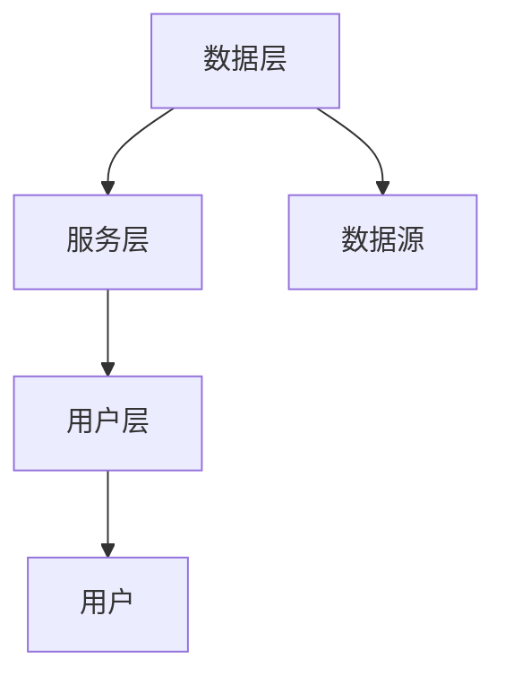
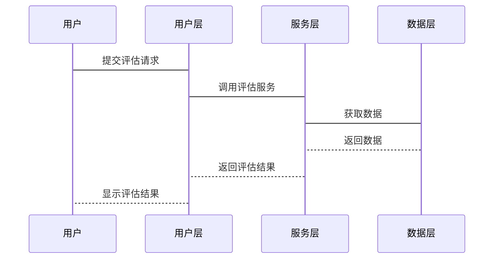

                 


# 多智能体系统在评估公司供应链韧性中的应用

> 关键词：多智能体系统, 供应链韧性, 供应链管理, 复杂系统, 系统架构

> 摘要：  
> 本文探讨了多智能体系统（Multi-Agent System, MAS）在评估公司供应链韧性中的应用。通过分析多智能体系统的核心概念、算法原理、系统架构设计以及实际案例，本文详细阐述了多智能体系统如何通过分布式协作和智能决策提升供应链的韧性评估能力。文章从供应链韧性评估的背景出发，逐步深入到多智能体系统的协作机制、算法实现、系统架构设计以及实际应用案例，为读者提供了一套完整的解决方案。

---

# 第1章: 多智能体系统与供应链韧性概述

## 1.1 多智能体系统的定义与特点

### 1.1.1 多智能体系统的定义  
多智能体系统（Multi-Agent System, MAS）是由多个智能体（Agent）组成的分布式系统，这些智能体能够通过交互和协作完成复杂任务。智能体是具有感知、推理、规划和执行能力的实体，能够独立决策并与其他智能体或环境进行交互。

### 1.1.2 多智能体系统的核心特点  
- **分布式性**：智能体独立运行，不存在中心化的控制节点。  
- **协作性**：智能体通过协作完成共同目标。  
- **反应性**：智能体能够实时感知环境并做出反应。  
- **自主性**：智能体具有自主决策的能力。  

### 1.1.3 多智能体系统在供应链管理中的应用  
供应链管理涉及多个参与者（如供应商、制造商、分销商、零售商和消费者），这些参与者之间的协作可以通过多智能体系统实现。MAS可以模拟供应链中的各个角色，分析其行为模式，优化供应链的运作效率。

## 1.2 供应链韧性的定义与重要性

### 1.2.1 供应链韧性的定义  
供应链韧性是指供应链在面对外部干扰（如自然灾害、疫情、市场波动等）时，能够维持正常运作并快速恢复的能力。  

### 1.2.2 供应链韧性的重要性  
供应链韧性是企业应对不确定性和风险的关键能力。一个具有韧性的供应链能够在突发事件中快速响应，减少损失，并保持业务连续性。

### 1.2.3 供应链韧性评估的挑战与机遇  
- **挑战**：供应链涉及多个环节和参与者，评估其韧性需要考虑复杂性和动态性。  
- **机遇**：通过多智能体系统，可以模拟供应链的运行过程，识别潜在风险，并提出优化方案。

## 1.3 多智能体系统在供应链韧性评估中的作用

### 1.3.1 多智能体系统与供应链管理的关系  
MAS能够模拟供应链中的多个参与者，分析其行为模式和相互关系，从而提供供应链韧性评估的支持。

### 1.3.2 多智能体系统在供应链管理中的优势  
- **分布式协作**：MAS能够模拟供应链中的多方协作，优化资源分配。  
- **实时响应**：MAS能够实时感知供应链中的风险，并快速做出反应。  
- **动态适应性**：MAS能够根据供应链环境的变化调整策略，提升韧性。  

## 1.4 本章小结  
本章介绍了多智能体系统的定义和特点，分析了供应链韧性的定义和重要性，并探讨了多智能体系统在供应链韧性评估中的作用和优势。

---

# 第2章: 多智能体系统的核心概念与原理

## 2.1 多智能体系统的结构与组成

### 2.1.1 智能体的定义与分类  
智能体是具有感知、推理、规划和执行能力的实体。根据智能体的智能水平，可以分为简单反射智能体、基于模型的反射智能体、目标驱动智能体和效用驱动智能体。

### 2.1.2 多智能体系统的层次结构  
多智能体系统的层次结构包括：  
1. **物理层**：智能体与环境交互的物理载体。  
2. **行为层**：智能体的行为决策机制。  
3. **协作层**：智能体之间的协作机制。  
4. **组织层**：智能体的组织结构和角色分配。  

### 2.1.3 多智能体系统的通信机制  
智能体之间的通信可以通过直接交互或通过中间媒介（如消息队列）进行。通信机制需要确保信息的准确传递和安全性。

## 2.2 多智能体系统的协作机制

### 2.2.1 协作的基本概念  
协作是指多个智能体为了共同目标而协同工作的过程。协作机制需要考虑任务分配、协调和冲突解决。

### 2.2.2 协作协议与算法  
常见的协作协议包括：  
- **分布式一致性协议**：如Paxos、Raft等。  
- **分布式任务分配算法**：如基于图着色的任务分配算法。  

### 2.2.3 协作中的冲突解决机制  
冲突解决机制包括：  
- **仲裁机制**：通过仲裁者解决冲突。  
- **协商机制**：通过协商达成一致。  
- **优先级机制**：根据任务优先级自动解决冲突。  

## 2.3 多智能体系统的决策机制

### 2.3.1 分布式决策的基本概念  
分布式决策是指多个智能体独立做出决策，但需要保证决策的协调性和一致性。

### 2.3.2 基于博弈论的决策模型  
博弈论是一种分析决策问题的数学工具。通过构建博弈模型，可以分析智能体之间的竞争与合作关系。

### 2.3.3 基于机器学习的决策方法  
机器学习可以通过历史数据训练智能体的决策模型，使其能够根据输入做出预测和决策。

## 2.4 本章小结  
本章详细介绍了多智能体系统的结构与组成，分析了协作机制和决策机制的核心原理。

---

# 第3章: 供应链韧性评估的方法与模型

## 3.1 供应链风险分析

### 3.1.1 供应链风险的定义与分类  
供应链风险是指供应链在运行过程中可能遇到的不确定性，包括供应风险、需求风险、物流风险等。

### 3.1.2 供应链风险的识别方法  
- **定性分析**：通过专家判断识别风险。  
- **定量分析**：通过数据建模量化风险。  

### 3.1.3 供应链风险的评估指标  
- **脆弱性指标**：衡量供应链环节的脆弱性。  
- **恢复能力指标**：衡量供应链在突发事件后的恢复能力。  

## 3.2 供应链韧性评估模型

### 3.2.1 基于多智能体系统的评估模型  
多智能体系统可以模拟供应链中的多个参与者，分析其行为模式和相互关系，从而评估供应链的韧性。

### 3.2.2 基于网络流的评估模型  
网络流模型可以将供应链视为一个流网络，分析关键路径和瓶颈，从而评估供应链的韧性。

### 3.2.3 基于复杂网络的评估模型  
复杂网络模型可以分析供应链中的节点关系和网络结构，识别关键节点和潜在风险。

## 3.3 供应链韧性提升策略

### 3.3.1 供应链网络优化策略  
通过优化供应链网络结构，减少对单一供应商的依赖，提高供应链的冗余性和灵活性。

### 3.3.2 供应链弹性管理策略  
通过建立应急响应机制和冗余资源，提高供应链在突发事件中的应对能力。

### 3.3.3 供应链风险管理策略  
通过识别和评估供应链风险，制定相应的风险缓解措施，降低风险对供应链的影响。

## 3.4 本章小结  
本章分析了供应链风险的识别与评估方法，介绍了基于多智能体系统的供应链韧性评估模型，并提出了供应链韧性提升的具体策略。

---

# 第4章: 多智能体系统在供应链韧性评估中的算法原理

## 4.1 多智能体协同算法

### 4.1.1 分布式计算的基本原理  
分布式计算是指多个智能体通过协同完成计算任务的过程。多智能体协同算法需要考虑任务分配、数据同步和结果汇总。

### 4.1.2 多智能体协同算法的实现步骤  
1. **任务分解**：将整体任务分解为多个子任务。  
2. **任务分配**：将子任务分配给不同的智能体。  
3. **协同计算**：智能体协同完成子任务，并将结果汇总。  
4. **结果分析**：分析协同计算的结果，得出最终结论。  

### 4.1.3 多智能体协同算法的优缺点  
- **优点**：能够充分利用多智能体的计算能力，提高计算效率。  
- **缺点**：需要考虑智能体之间的通信延迟和计算资源分配问题。

## 4.2 基于博弈论的决策算法

### 4.2.1 博弈论的基本概念  
博弈论是一种分析决策问题的数学工具，主要包括参与者、策略、收益和博弈规则等核心概念。

### 4.2.2 基于博弈论的决策模型  
通过构建博弈模型，可以分析多智能体之间的竞争与合作关系，优化决策策略。

### 4.2.3 基于博弈论的算法实现  
1. **构建博弈模型**：定义参与者、策略和收益矩阵。  
2. **求解纳什均衡**：找到博弈的稳定解。  
3. **优化决策策略**：根据纳什均衡结果优化决策策略。

## 4.3 基于机器学习的预测算法

### 4.3.1 机器学习的基本原理  
机器学习是一种通过数据训练模型，使其能够从数据中学习规律并做出预测的技术。

### 4.3.2 基于机器学习的供应链风险预测模型  
通过训练历史数据，机器学习模型可以预测供应链中的潜在风险。

### 4.3.3 基于机器学习的算法实现  
1. **数据预处理**：清洗和归一化数据。  
2. **特征选择**：选择对风险预测有重要影响的特征。  
3. **模型训练**：使用训练数据训练机器学习模型。  
4. **模型预测**：使用测试数据评估模型性能，并进行预测。

## 4.4 本章小结  
本章详细介绍了多智能体协同算法、基于博弈论的决策算法和基于机器学习的预测算法的原理和实现步骤。

---

# 第5章: 供应链韧性评估系统的架构设计

## 5.1 系统功能设计

### 5.1.1 系统功能模块划分  
供应链韧性评估系统主要包括以下几个功能模块：  
1. **数据采集模块**：采集供应链相关数据。  
2. **风险评估模块**：评估供应链中的潜在风险。  
3. **韧性评估模块**：评估供应链的韧性。  
4. **优化建议模块**：根据评估结果提出优化建议。  

### 5.1.2 系统功能流程  
1. 数据采集模块采集供应链相关数据，包括供应商信息、物流信息、市场需求等。  
2. 风险评估模块通过分析数据，识别供应链中的潜在风险。  
3. 韧性评估模块结合风险评估结果和供应链网络结构，评估供应链的韧性。  
4. 优化建议模块根据评估结果，提出优化供应链韧性的建议。

## 5.2 系统架构设计

### 5.2.1 系统架构设计概述  
供应链韧性评估系统的架构设计包括以下几个部分：  
1. **数据层**：存储供应链相关数据。  
2. **服务层**：提供数据处理和计算服务。  
3. **用户层**：提供用户交互界面。  

### 5.2.2 系统架构设计图  


### 5.2.3 系统接口设计  
系统接口设计需要考虑模块之间的交互，确保数据的准确传递和系统的高效运行。

## 5.3 系统交互设计

### 5.3.1 系统交互流程  
1. 用户通过用户层界面提交评估请求。  
2. 服务层接收请求，调用数据层的数据进行计算。  
3. 计算结果返回用户层，用户查看评估结果和优化建议。  

### 5.3.2 系统交互序列图  


## 5.4 本章小结  
本章详细介绍了供应链韧性评估系统的功能设计和架构设计，并通过系统架构图和交互序列图展示了系统的整体结构。

---

# 第6章: 项目实战——供应链韧性评估系统实现

## 6.1 项目背景与目标

### 6.1.1 项目背景  
供应链韧性评估是企业应对突发事件和提高供应链抗风险能力的关键。通过多智能体系统实现供应链韧性评估，可以为企业提供科学的决策支持。

### 6.1.2 项目目标  
本项目旨在开发一个基于多智能体系统的供应链韧性评估系统，实现供应链风险的识别、评估和优化建议。

## 6.2 环境安装与配置

### 6.2.1 系统运行环境  
- 操作系统：Linux/Windows/MacOS  
- 开发工具：Python、Jupyter Notebook、Mermaid  
- 依赖库：networkx、numpy、scikit-learn  

### 6.2.2 系统配置步骤  
1. 安装Python和必要的依赖库。  
2. 配置Jupyter Notebook环境。  
3. 下载并安装Mermaid插件。  

## 6.3 核心实现代码

### 6.3.1 数据采集模块  
```python
import requests
import json

def fetch_data(api_url):
    response = requests.get(api_url)
    if response.status_code == 200:
        return json.loads(response.text)
    else:
        return None
```

### 6.3.2 风险评估模块  
```python
import networkx as nx

def assess_risk(supplier_graph):
    critical_nodes = nx.minimum_node_cut(supplier_graph)
    return critical_nodes
```

### 6.3.3 韧性评估模块  
```python
import numpy as np
from sklearn.ensemble import RandomForestRegressor

def evaluate_resilience(features, labels):
    model = RandomForestRegressor(n_estimators=100, random_state=42)
    model.fit(features, labels)
    return model.predict(new_features)
```

### 6.3.4 优化建议模块  
```python
def generate_recommendations(resilience_scores):
    recommendations = []
    for score in resilience_scores:
        if score < 0.6:
            recommendations.append("优化建议：加强该环节的抗风险能力")
        elif score < 0.8:
            recommendations.append("优化建议：适度优化该环节的抗风险能力")
        else:
            recommendations.append("优化建议：该环节抗风险能力较强")
    return recommendations
```

## 6.4 项目小结  
本章通过实际案例展示了供应链韧性评估系统的实现过程，包括环境配置、核心模块实现和优化建议生成。

---

# 第7章: 总结与展望

## 7.1 总结  
本文详细探讨了多智能体系统在供应链韧性评估中的应用，从理论到实践，全面分析了多智能体系统的协作机制、算法原理和系统架构设计。通过实际案例展示了供应链韧性评估系统的实现过程。

## 7.2 展望  
未来，随着人工智能和大数据技术的不断发展，多智能体系统在供应链韧性评估中的应用将更加广泛和深入。可以通过引入强化学习、区块链等新技术，进一步提升供应链的抗风险能力和运营效率。

## 7.3 小结  
多智能体系统在供应链韧性评估中的应用为企业提供了科学的决策支持，帮助企业更好地应对突发事件和提升供应链的抗风险能力。

---

# 参考文献  
（此处列出相关文献和参考资料）

---

通过以上目录结构和内容安排，可以确保文章逻辑清晰、内容详实，同时兼顾技术深度和可读性。

