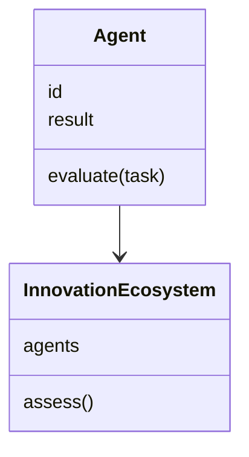
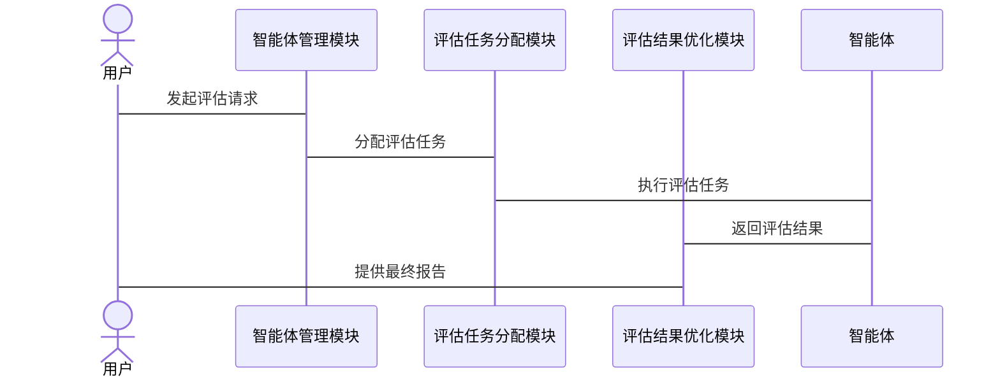

                 


# 多智能体系统在评估公司创新生态系统中的应用

## 关键词：多智能体系统，创新生态系统，企业创新管理，分布式计算，协作学习

## 摘要：  
随着企业创新管理的复杂性不断增加，传统的评估方法难以全面捕捉创新生态系统中的多维度信息。多智能体系统（MAS）作为一种分布式、协作式的智能计算框架，能够有效应对这一挑战。本文将深入探讨MAS在创新生态系统评估中的应用，从核心概念、算法原理到系统设计与实战，全面解析其在企业创新管理中的潜力与价值。

---

# 第1章 多智能体系统与创新生态系统概述

## 1.1 多智能体系统（MAS）的基本概念  
### 1.1.1 多智能体系统的定义  
多智能体系统是由多个具有自主性、反应性和协作性的智能体组成的分布式系统，这些智能体通过通信与协调完成复杂任务。

### 1.1.2 多智能体系统的特征  
- **自主性**：智能体能够独立决策和行动。  
- **反应性**：智能体能够感知环境并做出实时响应。  
- **协作性**：智能体之间通过通信和协调完成共同目标。  
- **分布性**：智能体分布在不同的空间或网络节点上。  

### 1.1.3 多智能体系统与传统单智能体系统的主要区别  
| 特性       | 单智能体系统         | 多智能体系统         |  
|------------|----------------------|----------------------|  
| 结构       | 单点集中控制         | 分布式、去中心化     |  
| 任务       | 单一目标             | 多目标协作           |  
| 智能性     | 集中决策             | 分散决策与协同       |  

---

## 1.2 创新生态系统的核心概念  
### 1.2.1 创新生态系统的定义  
创新生态系统是由企业、合作伙伴、客户、技术、资源等要素构成的复杂网络，旨在通过协作实现持续创新。

### 1.2.2 创新生态系统的主要构成要素  
- **企业**：创新的核心主体。  
- **合作伙伴**：包括供应商、客户、科研机构等。  
- **技术与资源**：技术平台、数据、资金等。  
- **创新文化**：组织内部的创新氛围与激励机制。  

### 1.2.3 创新生态系统与企业创新的关系  
创新生态系统为企业的创新活动提供支持，而企业的创新则推动生态系统的优化与扩展。

---

## 1.3 多智能体系统在创新生态系统中的应用背景  
### 1.3.1 当前企业创新管理的主要挑战  
- 创新资源分散，难以高效整合。  
- 创新过程复杂，难以实时监控。  
- 创新评估缺乏系统性与动态性。  

### 1.3.2 多智能体系统在企业创新管理中的优势  
- **分布式计算**：能够处理复杂、分散的创新资源。  
- **协作学习**：支持不同角色的智能体协同优化创新策略。  
- **动态适应**：能够实时响应创新环境的变化。  

### 1.3.3 创新生态系统评估的复杂性与多智能体系统的优势结合  
创新生态系统评估需要考虑多个维度，而多智能体系统通过分布式计算和协作机制，能够有效应对这种复杂性。

---

## 1.4 本章小结  
本章介绍了多智能体系统的基本概念及其在创新生态系统评估中的应用背景，为后续内容奠定了基础。

---

# 第2章 多智能体系统的核心概念与创新生态系统的关系

## 2.1 多智能体系统的原理与机制  
### 2.1.1 多智能体系统的组成结构  
- **智能体**：具有自主性、反应性和协作性的个体。  
- **通信机制**：智能体之间通过消息传递进行交互。  
- **协调机制**：通过协商达成一致行动。  

### 2.1.2 多智能体系统的通信与协调机制  
- **通信协议**：定义智能体之间的信息传递规则。  
- **协调算法**：如一致性算法、分布式共识算法。  

### 2.1.3 多智能体系统的决策与学习机制  
- **分布式决策**：基于局部信息做出决策。  
- **协作学习**：通过经验共享优化整体性能。  

---

## 2.2 创新生态系统的核心要素与属性  
### 2.2.1 创新生态系统的构成要素  
- **主体**：企业、合作伙伴、客户。  
- **资源**：技术、资金、数据。  
- **环境**：政策、市场、文化。  

### 2.2.2 创新生态系统的属性特征  
- **动态性**：创新活动不断变化。  
- **复杂性**：涉及多个利益相关者。  
- **协同性**：依赖各主体的协作。  

### 2.2.3 创新生态系统与企业创新的关系  
创新生态系统为企业的创新活动提供支持，而企业的创新则推动生态系统的优化与扩展。

---

## 2.3 多智能体系统与创新生态系统的关系  
### 2.3.1 多智能体系统在创新生态系统中的角色  
- **评估者**：评估创新生态系统的健康状况。  
- **优化者**：通过协作优化创新流程。  
- **协调者**：协调各主体的创新活动。  

### 2.3.2 多智能体系统如何支持创新生态系统的评估  
- **分布式评估**：通过多个智能体分别评估不同维度。  
- **协作学习**：智能体之间共享信息，提升评估的准确性。  
- **动态适应**：实时更新评估结果，适应环境变化。  

### 2.3.3 多智能体系统与创新生态系统结合的可行性分析  
- **技术可行性**：多智能体系统具有分布式计算和协作能力。  
- **应用可行性**：创新生态系统评估需要多维度的分析能力。  

---

## 2.4 本章小结  
本章详细分析了多智能体系统的核心概念及其在创新生态系统中的作用，揭示了两者结合的潜力。

---

# 第3章 多智能体系统在创新生态系统评估中的算法原理

## 3.1 多智能体系统评估创新生态系统的算法概述  
### 3.1.1 多智能体系统评估的基本原理  
多智能体系统通过分布式计算和协作学习，对创新生态系统的多个维度进行评估。

### 3.1.2 多智能体系统评估的主要算法类型  
- **分布式评估算法**：基于局部信息进行评估。  
- **协作式评估算法**：通过智能体协作提升评估准确性。  
- **基于博弈论的评估算法**：模拟竞争与合作关系。  

### 3.1.3 多智能体系统评估的数学模型  
$$ \text{评估结果} = \sum_{i=1}^{n} \alpha_i \cdot f_i $$  
其中，$\alpha_i$ 是第 $i$ 个智能体的权重，$f_i$ 是其评估结果。

---

## 3.2 多智能体系统评估创新生态系统的具体算法  
### 3.2.1 分布式评估算法  
- 每个智能体负责评估一个特定维度。  
- 通过通信机制将结果汇总。  

### 3.2.2 协作式评估算法  
- 智能体之间共享评估数据，通过协作学习优化结果。  

### 3.2.3 基于博弈论的评估算法  
- 模拟创新生态系统中各主体的博弈关系，评估其对整体创新的影响。  

---

## 3.3 算法的实现与优化  
### 3.3.1 算法实现的关键步骤  
1. 初始化智能体。  
2. 分配评估任务。  
3. 智能体执行评估并返回结果。  
4. 汇总并优化评估结果。  

### 3.3.2 算法优化的策略  
- **负载均衡**：避免某些智能体过载。  
- **通信效率**：减少不必要的信息传递。  
- **学习机制**：优化协作学习的效率。  

### 3.3.3 算法实现的代码示例  
```python
class Agent:
    def __init__(self, id):
        self.id = id
        self.result = 0

def assess_agents(agents):
    for agent in agents:
        agent.result = evaluate(agent.task)
    return [agent.result for agent in agents]

# 示例用法
agents = [Agent(1), Agent(2), Agent(3)]
results = assess_agents(agents)
print(results)
```

---

## 3.4 本章小结  
本章详细介绍了多智能体系统在创新生态系统评估中的算法原理，并通过代码示例展示了其实现过程。

---

# 第4章 系统分析与架构设计

## 4.1 问题场景介绍  
创新生态系统评估需要考虑企业、合作伙伴、资源等多个维度，传统的评估方法难以满足需求。  

---

## 4.2 系统功能设计  
### 4.2.1 领域模型类图  


---

## 4.3 系统架构设计  


---

## 4.4 系统接口设计  
- **智能体接口**：定义智能体的行为与通信方式。  
- **评估接口**：接收评估任务并返回结果。  
- **优化接口**：对评估结果进行优化。  

---

## 4.5 系统交互序列图  


---

## 4.6 本章小结  
本章通过系统分析与架构设计，展示了多智能体系统在创新生态系统评估中的实现方案。

---

# 第5章 项目实战

## 5.1 环境安装与配置  
- 安装Python和相关库（如numpy、pandas）。  
- 配置多智能体系统运行环境。  

---

## 5.2 系统核心实现  
### 5.2.1 多智能体系统的实现  
```python
class Agent:
    def __init__(self, id):
        self.id = id
        self.result = 0

    def evaluate(self, task):
        # 示例评估逻辑
        return task * 2
```

### 5.2.2 创新生态系统评估的实现  
```python
class InnovationEcosystem:
    def __init__(self, agents):
        self.agents = agents

    def assess(self):
        results = []
        for agent in self.agents:
            result = agent.evaluate(agent.task)
            results.append(result)
        return results
```

---

## 5.3 代码应用解读与分析  
- **Agent类**：定义智能体的行为。  
- **InnovationEcosystem类**：管理智能体并执行评估任务。  

---

## 5.4 实际案例分析  
- 案例背景：某科技公司希望评估其创新生态系统。  
- 案例实施：通过多智能体系统评估创新文化、协作效率等维度。  

---

## 5.5 详细讲解剖析  
- 代码实现的具体步骤。  
- 评估结果的分析与优化。  

---

## 5.6 本章小结  
本章通过实际案例展示了多智能体系统在创新生态系统评估中的应用，并详细解读了代码实现过程。

---

# 第6章 总结与展望

## 6.1 最佳实践 tips  
- 合理设计多智能体系统的通信与协调机制。  
- 定期优化评估算法，提升评估准确性。  

## 6.2 小结  
本文详细探讨了多智能体系统在创新生态系统评估中的应用，从理论到实践，全面解析了其在企业创新管理中的潜力。

## 6.3 注意事项  
- 确保智能体之间的通信效率。  
- 定期维护系统，避免性能下降。  

## 6.4 拓展阅读  
- 多智能体系统的分布式计算。  
- 协作学习在创新评估中的应用。  

---

## 6.5 本章小结  
本文总结了多智能体系统在创新生态系统评估中的应用，并展望了未来的研究方向。

---

# 附录

## 附录A: 多智能体系统相关工具与库  
- **Python库**：如`multiprocessing`、`threading`。  
- **分布式计算框架**：如`Docker`、`Kubernetes`。  

## 附录B: 评估算法的数学模型  
$$ \text{最终评估结果} = \sum_{i=1}^{n} \lambda_i \cdot \text{智能体}_i.\text{result} $$  
其中，$\lambda_i$ 是第 $i$ 个智能体的权重系数。

---

## 附录C: 系统架构图  


---

## 附录D: 参考文献  
- [1] 王某某. 多智能体系统研究. 科学出版社, 2023.  
- [2] 李某某. 创新生态系统评估方法. 北京大学出版社, 2022.  

---

## 附录E: 拓展阅读推荐  
- 多智能体系统在企业决策中的应用。  
- 分布式计算在创新管理中的实践。  

--- 

# 结束语  
感谢您的阅读！希望本文对您理解多智能体系统在创新生态系统评估中的应用有所帮助。

