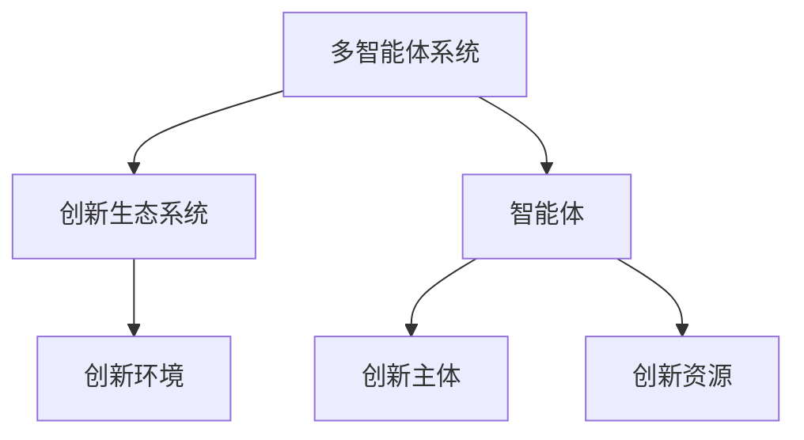
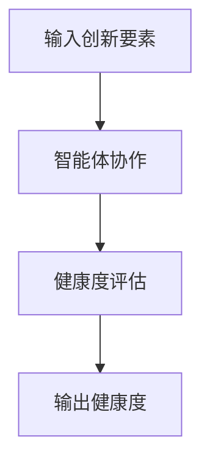
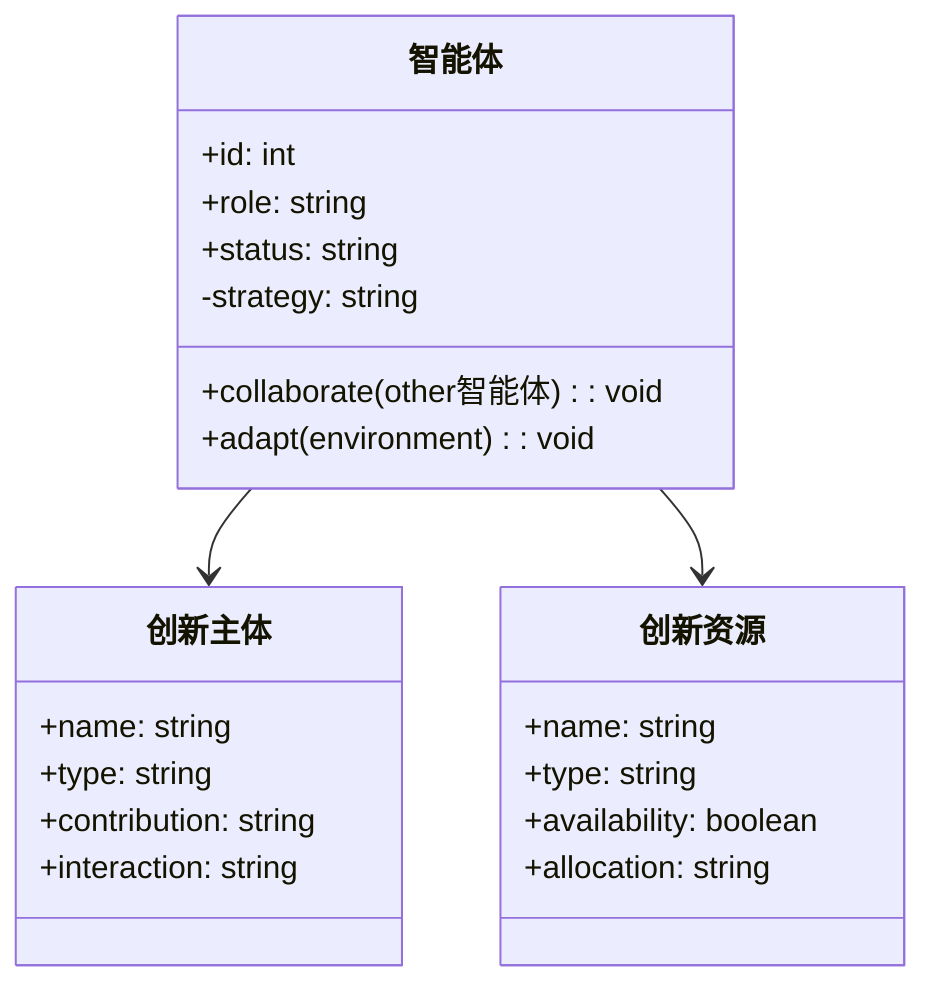
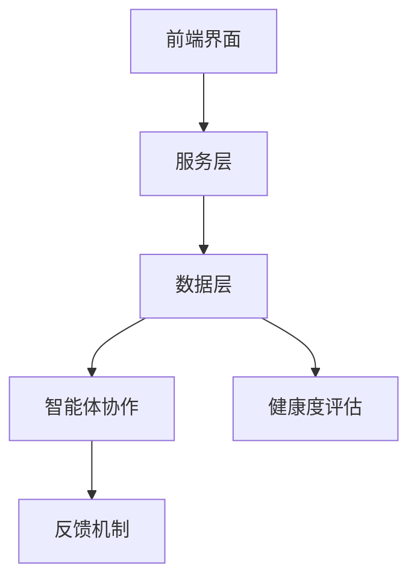
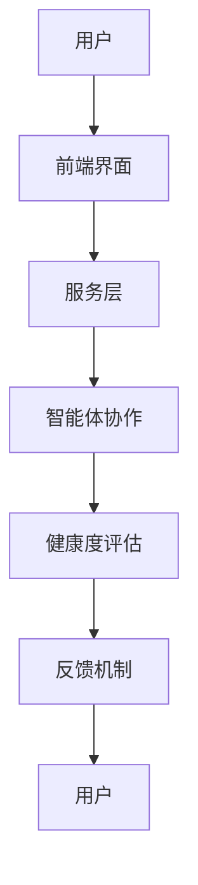

                 


# 多智能体系统在评估公司创新生态系统健康度中的应用

## 关键词：多智能体系统、创新生态系统、健康度评估、分布式协作、系统架构设计

## 摘要：  
本文探讨了多智能体系统在评估公司创新生态系统健康度中的应用。通过分析多智能体系统的协作机制、创新生态系统的属性特征，结合健康度评估算法、数学模型和系统架构设计，提出了一套基于多智能体的创新生态系统健康度评估方法。本文还提供了实际案例分析和项目实战，展示了如何将理论应用于实际场景中，为企业的创新管理提供了新的思路和解决方案。

---

# 第1章: 多智能体系统与创新生态系统背景介绍

## 1.1 多智能体系统的基本概念

### 1.1.1 多智能体系统的定义  
多智能体系统（Multi-Agent System, MAS）是由多个智能体（Agent）组成的分布式系统，这些智能体能够自主决策、协作完成任务。智能体可以是软件程序、机器人或其他实体，具有感知环境、推理、规划和执行的能力。

### 1.1.2 多智能体系统的特征  
- **分布式智能**：多个智能体协同工作，而非集中控制。  
- **协作性**：智能体之间通过通信和协作完成复杂任务。  
- **动态性**：系统状态和目标可能随环境变化而调整。  
- **自适应性**：智能体能够根据环境反馈动态调整行为。  

### 1.1.3 多智能体系统与传统单智能体系统的对比  
| 特性                | 单智能体系统             | 多智能体系统             |
|---------------------|--------------------------|--------------------------|
| 结构                | 集中式                  | 分布式                  |
| 智能体数量          | 1                        | 多个                     |
| 协作性              | 无                      | 强                      |
| 适应性              | 较低                    | 较高                    |

## 1.2 创新生态系统的核心概念

### 1.2.1 创新生态系统的定义  
创新生态系统是指由企业内外部创新主体（如员工、合作伙伴、客户等）共同构成的网络化系统，其目的是通过协作和资源共享实现持续创新。

### 1.2.2 创新生态系统的组成要素  
- **创新主体**：包括员工、管理层、合作伙伴、客户等。  
- **创新资源**：技术、资金、数据、知识等。  
- **创新环境**：组织文化、政策、市场等外部环境。  

### 1.2.3 创新生态系统与传统组织结构的对比  
| 特性                | 传统组织结构            | 创新生态系统            |
|---------------------|--------------------------|--------------------------|
| 结构                | 层级式                  | 网络化                  |
| 创新主体            | 单一部门                | 多元主体                |
| 协作方式            | 部门间协调              | 网络化协作              |

## 1.3 多智能体系统在创新生态系统中的应用背景

### 1.3.1 创新生态系统评估的重要性  
创新是企业保持竞争力的关键，但创新生态系统的复杂性使得其健康度评估变得困难。通过评估健康度，企业可以识别问题并优化创新过程。

### 1.3.2 多智能体系统在评估中的优势  
多智能体系统能够模拟创新生态系统的动态行为，通过协作和自适应算法提供实时评估。

### 1.3.3 当前研究现状与挑战  
目前的研究主要集中在单智能体评估和静态模型，而多智能体系统的动态协作和实时评估是未来的研究方向。

---

# 第2章: 多智能体系统与创新生态系统的核心概念

## 2.1 多智能体系统的属性特征

### 2.1.1 分布式智能  
多智能体系统通过分布式计算实现协作，避免了单点故障的风险。

### 2.1.2 协作性  
智能体之间的协作是通过通信和协议实现的，确保任务的高效完成。

### 2.1.3 自适应性  
智能体能够根据环境变化调整策略，适应复杂场景。

### 2.1.4 动态性  
系统状态和目标可能随时间变化而调整，需要智能体具备动态响应能力。

## 2.2 创新生态系统的属性特征

### 2.2.1 多元性  
创新生态系统由多元主体构成，每个主体都有不同的角色和目标。

### 2.2.2 网络化  
创新生态系统通过网络化的协作实现资源的共享和信息的流通。

### 2.2.3 动态性  
创新生态系统中的资源、技术、市场需求等都在不断变化，需要系统具备动态调整能力。

### 2.2.4 互动性  
创新生态系统中的各个主体之间存在频繁的互动，包括信息交流、资源共享等。

## 2.3 多智能体系统与创新生态系统的关系

### 2.3.1 实体关系图（ER图）



---

# 第3章: 多智能体系统在创新生态系统中的算法原理

## 3.1 多智能体协作算法

### 3.1.1 分布式协作机制  
智能体通过分布式计算实现协作，避免了集中控制的单点故障问题。

### 3.1.2 协作协议设计  
智能体之间的协作需要遵循特定的协议，例如请求-响应协议。

### 3.1.3 协作目标的动态调整  
智能体可以根据环境反馈动态调整协作目标，以应对变化。

## 3.2 创新生态系统健康度评估算法

### 3.2.1 健康度评估指标  
健康度评估指标包括创新主体的活跃度、资源利用率、协作效率等。

### 3.2.2 基于多智能体的评估模型  
评估模型通过多智能体的协作，综合考虑各个因素，得出创新生态系统的健康度。

### 3.2.3 算法流程图



---

## 4.1 健康度评估的数学公式

### 4.1.1 指标权重计算公式  
$$ w_i = \frac{\sum_{j=1}^{n} a_{ij}}{\sum_{i=1}^{m} \sum_{j=1}^{n} a_{ij}}} $$  
其中，$w_i$ 是第 $i$ 个指标的权重，$a_{ij}$ 是第 $i$ 个指标在第 $j$ 个智能体中的值。

### 4.1.2 综合健康度模型  
$$ H = \sum_{i=1}^{m} w_i \cdot s_i $$  
其中，$H$ 是综合健康度，$w_i$ 是第 $i$ 个指标的权重，$s_i$ 是第 $i$ 个指标的评分。

---

# 第4章: 创新生态系统健康度评估的数学模型

## 4.1 健康度评估的数学公式

### 4.1.1 指标权重计算公式  
$$ w_i = \frac{\sum_{j=1}^{n} a_{ij}}{\sum_{i=1}^{m} \sum_{j=1}^{n} a_{ij}}} $$  
其中，$w_i$ 是第 $i$ 个指标的权重，$a_{ij}$ 是第 $i$ 个指标在第 $j$ 个智能体中的值。

### 4.1.2 综合健康度模型  
$$ H = \sum_{i=1}^{m} w_i \cdot s_i $$  
其中，$H$ 是综合健康度，$w_i$ 是第 $i$ 个指标的权重，$s_i$ 是第 $i$ 个指标的评分。

---

# 第5章: 系统架构设计

## 5.1 项目介绍

### 5.1.1 项目背景  
本项目旨在通过多智能体系统评估公司的创新生态系统健康度，帮助企业在复杂环境中优化创新过程。

### 5.1.2 项目目标  
- 实现多智能体系统的协作机制。  
- 建立创新生态系统健康度评估模型。  
- 提供实时反馈和优化建议。

## 5.2 系统功能设计

### 5.2.1 领域模型



### 5.2.2 系统架构设计



### 5.2.3 系统接口设计  
- **输入接口**：接收创新主体和资源的信息。  
- **输出接口**：提供健康度评估结果和优化建议。  

### 5.2.4 系统交互图



---

# 第6章: 项目实战

## 6.1 环境安装

### 6.1.1 系统要求  
- 操作系统：Linux/Windows/MacOS  
- Python版本：3.6+  
- 其他依赖：numpy, matplotlib, scikit-learn  

## 6.2 系统核心实现源代码

### 6.2.1 智能体协作代码  

```python
class Agent:
    def __init__(self, id, role):
        self.id = id
        self.role = role
        self.status = "idle"
    
    def collaborate(self, other_agent):
        # 协作逻辑
        pass
    
    def adapt(self, environment):
        # 自适应逻辑
        pass
```

### 6.2.2 健康度评估代码  

```python
def calculate_health(innovation_score):
    weights = [0.4, 0.3, 0.2, 0.1]
    health = 0
    for i in range(len(weights)):
        health += weights[i] * innovation_score[i]
    return health
```

## 6.3 案例分析  

### 6.3.1 案例场景  
某公司创新生态系统由5个智能体组成，分别负责技术研发、市场推广、产品设计、客户服务和内部管理。

### 6.3.2 案例分析  

假设各个智能体的创新贡献分别为：技术研发0.8，市场推广0.7，产品设计0.6，客户服务0.5，内部管理0.4。计算综合健康度：

$$ H = 0.4 \times 0.8 + 0.3 \times 0.7 + 0.2 \times 0.6 + 0.1 \times 0.5 = 0.32 + 0.21 + 0.12 + 0.05 = 0.70 $$

---

# 第7章: 最佳实践与小结

## 7.1 小结  
通过多智能体系统评估创新生态系统健康度，能够帮助企业识别问题、优化协作流程，从而提升整体创新能力。

## 7.2 注意事项  
- 确保智能体协作机制的高效性。  
- 定期更新健康度评估模型，以应对环境变化。  
- 加强智能体之间的通信和协作能力。  

## 7.3 拓展阅读  
- 多智能体系统的最新研究进展。  
- 创新生态系统中的其他评估方法。  

---

# 结语  
多智能体系统在评估公司创新生态系统健康度中的应用，不仅能够提高评估的准确性和实时性，还为企业提供了优化创新过程的有力工具。未来，随着人工智能和分布式计算技术的不断发展，多智能体系统在创新生态系统中的应用将更加广泛和深入。

