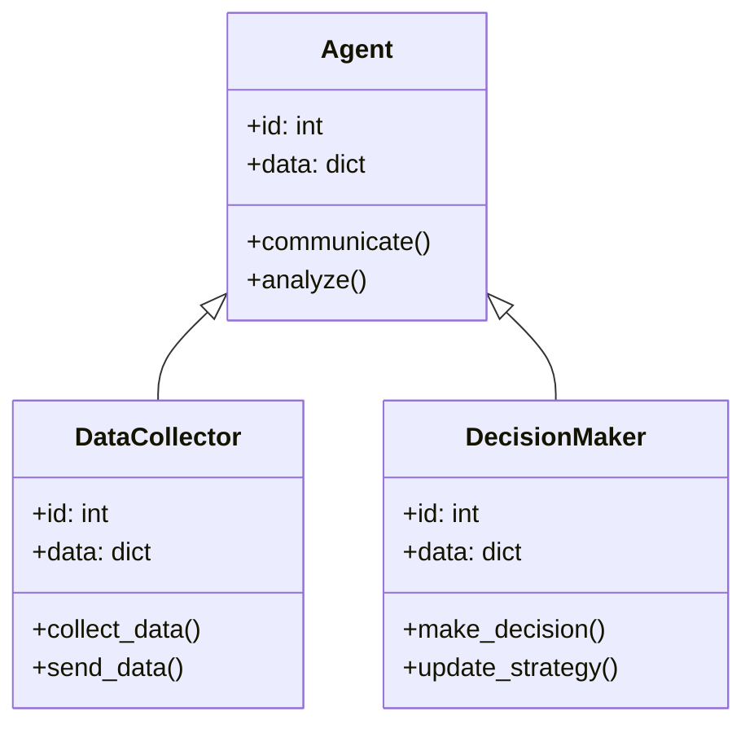
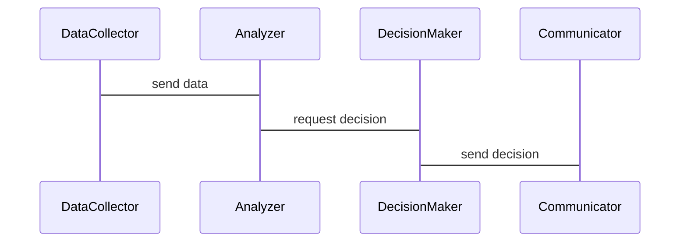

                 


# 多智能体系统在评估公司可持续发展能力中的应用

## 关键词：多智能体系统，可持续发展能力，企业评估，分布式计算，协作机制

## 摘要：随着全球对企业可持续发展的关注日益增加，多智能体系统（MAS）作为一种分布式、协作性强的计算范式，正在被广泛应用于企业可持续发展能力的评估。本文将深入探讨多智能体系统的核心原理、算法设计、系统架构及其在企业评估中的具体应用。通过详细分析多智能体系统在可持续发展评估中的优势与挑战，结合实际案例，本文旨在为读者提供一个全面的技术视角，展示如何利用多智能体系统提升企业的可持续发展能力评估。

---

# 第一部分: 多智能体系统在企业可持续发展评估中的应用概述

## 第1章: 多智能体系统与可持续发展评估的背景介绍

### 1.1 多智能体系统（MAS）的定义与特点

#### 1.1.1 多智能体系统的定义
多智能体系统（Multi-Agent System, MAS）是由多个智能体（Agent）组成的分布式系统，这些智能体能够通过自主决策和协作完成特定任务。MAS的核心在于智能体之间的分布式计算和协作，每个智能体都具有一定的自主性、目标导向性和学习能力。

#### 1.1.2 多智能体系统的核心要素
- **智能体**：具有感知环境、自主决策和执行任务的能力。
- **通信机制**：智能体之间通过某种协议进行信息交换。
- **协作机制**：智能体之间的协作规则，确保任务高效完成。
- **分布式计算**：任务分解和分布执行，避免单点依赖。

#### 1.1.3 多智能体系统与传统单智能体系统的对比
| 特性                 | 单智能体系统             | 多智能体系统             |
|----------------------|--------------------------|--------------------------|
| 系统结构             | 单点式                  | 分布式                  |
| 资源利用率           | 中等                    | 高                     |
| 容错性               | 低                     | 高                     |
| 任务处理能力         | 单一任务为主            | 多任务协作              |

### 1.2 可持续发展能力评估的定义与挑战

#### 1.2.1 可持续发展能力的定义
企业可持续发展能力是指企业在满足当前需求的同时，不损害未来世代的资源利用和发展机会的能力。这包括经济、社会和环境三个维度的综合评估。

#### 1.2.2 企业可持续发展评估的复杂性
- **多维度评估**：需要考虑经济、社会、环境等多个方面。
- **动态性**：企业的内外部环境不断变化，评估结果需要实时更新。
- **数据多样性**：涉及结构化和非结构化数据，数据来源广泛。

#### 1.2.3 多智能体系统在可持续发展评估中的优势
- **分布式计算**：能够高效处理大规模数据。
- **协作能力**：多个智能体协同工作，提升评估的全面性和准确性。
- **自适应性**：智能体能够根据环境变化调整评估策略。

---

## 第2章: 多智能体系统在企业评估中的核心概念与联系

### 2.1 多智能体系统的核心原理

#### 2.1.1 分布式计算与协作机制
分布式计算是多智能体系统的核心，通过任务分解和协作完成复杂任务。协作机制确保智能体之间能够高效协同，避免冲突。

#### 2.1.2 多智能体系统的通信协议
智能体之间的通信需要遵循特定的协议，常见的通信协议包括HTTP、WebSocket等。通信内容通常包括数据交换和命令传递。

#### 2.1.3 多智能体系统的自适应性与学习能力
智能体能够通过机器学习算法不断优化自身的决策模型，提升系统的整体性能。

### 2.2 多智能体系统与可持续发展评估的关系

#### 2.2.1 多智能体系统在企业评估中的应用场景
- **数据采集与处理**：智能体负责收集企业相关的数据，如碳排放、能源消耗等。
- **数据分析与评估**：智能体通过协作分析数据，生成评估报告。
- **实时监控与反馈**：智能体实时监控企业动态，提供反馈和建议。

#### 2.2.2 多智能体系统与企业可持续发展目标的结合
通过MAS，企业可以实现多维度数据的实时监控和评估，为管理层提供科学决策依据。

#### 2.2.3 多智能体系统在企业评估中的优势与局限性
- **优势**：高效协作、数据处理能力强。
- **局限性**：系统复杂性高，维护成本高。

---

## 第3章: 多智能体系统评估企业可持续发展能力的算法原理

### 3.1 多智能体系统的核心算法

#### 3.1.1 分布式一致性算法
分布式一致性算法用于确保多智能体系统中的数据一致性。常见的算法包括Paxos和Raft。

#### 3.1.2 多智能体协作算法
协作算法确保智能体之间的任务分配和协同完成。常见的协作算法包括基于角色的协作和基于任务分解的协作。

#### 3.1.3 多智能体决策算法
决策算法用于智能体在复杂环境中的决策，常见的决策算法包括基于规则的决策和基于机器学习的决策。

### 3.2 算法原理的数学模型与公式

#### 3.2.1 分布式一致性算法的数学模型
$$一致性算法：f(x) = \sum_{i=1}^{n} x_i / n$$

#### 3.2.2 多智能体协作算法的数学模型
$$协作算法：C = \sum_{i=1}^{n} c_i$$

#### 3.2.3 多智能体决策算法的数学模型
$$决策算法：D = \argmax_{i} \sum_{j=1}^{m} w_{ij} \cdot s_j$$

### 3.3 算法实现的Python代码示例

```python
def distributed_consistency(data):
    return sum(data) / len(data)

def multi_agent_collaboration(data):
    pass

def multi_agent_decision(data):
    pass
```

---

## 第4章: 多智能体系统在企业可持续发展评估中的系统架构设计

### 4.1 系统功能设计

#### 4.1.1 数据采集模块
负责收集企业的相关数据，如碳排放、能源消耗等。

#### 4.1.2 数据分析模块
对采集的数据进行分析，生成评估报告。

#### 4.1.3 实时监控模块
实时监控企业动态，提供反馈和建议。

### 4.2 系统架构设计

#### 4.2.1 领域模型类图


#### 4.2.2 系统架构图
```mermaid
top
dataCollector --> analyzer
analyzer --> decisionMaker
decisionMaker --> communicator
communicator --> database
database --> reportGenerator
```

### 4.3 系统接口设计

#### 4.3.1 接口定义
- 数据采集接口：`collect_data()`
- 数据分析接口：`analyze_data()`
- 决策接口：`make_decision()`
- 通信接口：`communicate_with_agents()`

#### 4.3.2 接口交互图


---

## 第5章: 项目实战

### 5.1 项目背景与目标

#### 5.1.1 项目背景
某公司希望通过MAS提升其可持续发展能力的评估效率。

#### 5.1.2 项目目标
- 实现企业数据的实时采集和分析。
- 提供可持续发展能力的评估报告。

### 5.2 核心代码实现

#### 5.2.1 数据采集模块
```python
class DataCollector:
    def collect_data(self):
        pass
```

#### 5.2.2 数据分析模块
```python
class Analyzer:
    def analyze_data(self, data):
        pass
```

#### 5.2.3 决策模块
```python
class DecisionMaker:
    def make_decision(self, data):
        pass
```

### 5.3 案例分析

#### 5.3.1 案例背景
某制造企业希望通过MAS优化其碳排放评估。

#### 5.3.2 实施步骤
1. 数据采集：智能体收集企业的碳排放数据。
2. 数据分析：分析模块生成评估报告。
3. 决策：决策模块提出优化建议。

### 5.4 总结与优化

#### 5.4.1 项目小结
通过MAS实现企业可持续发展能力的评估，提升了评估效率和准确性。

#### 5.4.2 优化建议
- 提高系统的容错性。
- 引入更多的数据源。

---

## 第6章: 总结与展望

### 6.1 全文总结
本文详细介绍了多智能体系统在企业可持续发展能力评估中的应用，从核心概念到算法设计，再到系统架构，为读者提供了全面的技术视角。

### 6.2 未来展望
随着人工智能和分布式计算技术的不断发展，多智能体系统在企业可持续发展评估中的应用将更加广泛和深入。

---

## 参考文献
（此处列出相关的技术文献和资料）

---

通过本文的详细阐述，读者可以深入了解多智能体系统在企业可持续发展能力评估中的应用，掌握其核心原理和实际操作方法，为未来的实践提供有力的技术支持。

