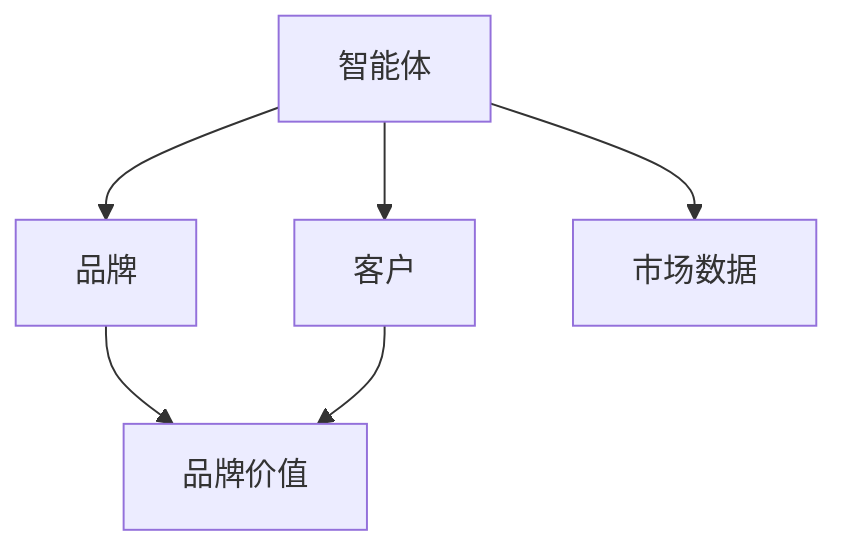
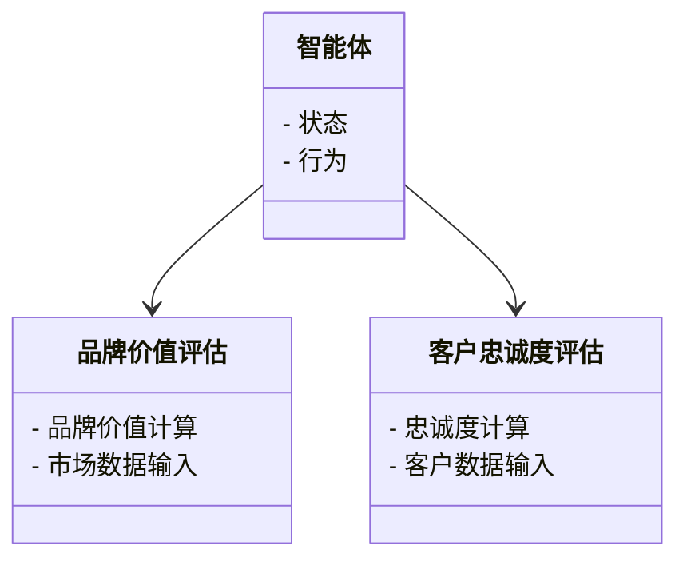
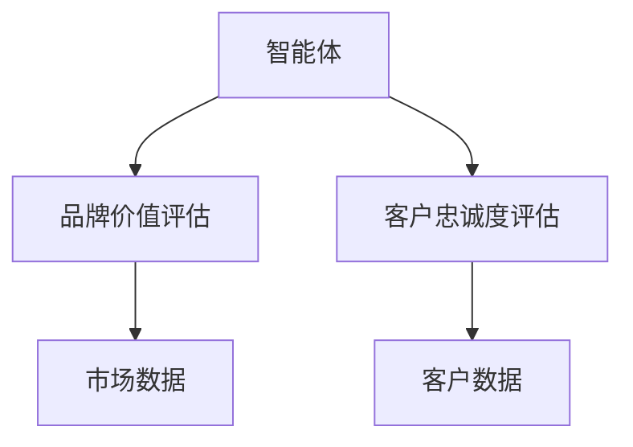

                 


---

# 多智能体系统在评估公司品牌价值和客户忠诚度中的作用

> 关键词：多智能体系统（MAS）、品牌价值评估、客户忠诚度、协同过滤算法、贝叶斯网络、系统架构设计

> 摘要：本文探讨了多智能体系统在评估公司品牌价值和客户忠诚度中的应用，详细分析了多智能体系统的定义、核心算法、系统架构设计以及实际案例，揭示了MAS在提升品牌价值评估和客户忠诚度分析中的优势和潜力。

---

## 第一部分: 多智能体系统与品牌价值评估概述

### 第1章: 多智能体系统概述

#### 1.1 多智能体系统的定义与特点

多智能体系统（Multi-Agent System, MAS）是由多个智能体（Agent）组成的分布式系统，这些智能体能够通过协作完成复杂任务。以下是MAS的核心特点：

- **自主性**：智能体能够独立决策和行动。
- **反应性**：能够感知环境并实时响应。
- **协作性**：通过通信和协作完成共同目标。
- **分布式性**：智能体之间不存在中心控制点。

#### 1.2 品牌价值与客户忠诚度的定义

- **品牌价值**：品牌在市场中的综合价值，包括品牌知名度、客户认知度和市场表现。
- **客户忠诚度**：客户对品牌或产品的长期支持程度，通常通过客户保留率和满意度来衡量。

### 1.3 多智能体系统在品牌价值评估中的优势

- **数据整合能力**：MAS能够整合来自不同来源的数据，如销售数据、客户反馈和市场趋势。
- **实时分析**：通过实时数据处理，MAS能够提供动态的品牌价值评估。
- **精准预测**：利用机器学习算法，MAS可以预测品牌价值的变化趋势。

### 第2章: 多智能体系统在品牌价值评估中的背景与意义

#### 2.1 品牌价值评估的传统方法

- **财务指标法**：基于销售额、利润等财务指标评估品牌价值。
- **市场表现法**：通过市场份额和品牌知名度进行评估。
- **消费者感知法**：通过调查和问卷收集消费者对品牌的看法。

#### 2.2 客户忠诚度评估的传统方法

- **客户满意度分析**：通过调查问卷评估客户对产品或服务的满意度。
- **客户生命周期价值分析**：通过预测客户在其生命周期内的价值来评估忠诚度。
- **客户保留率分析**：通过计算客户保留率来衡量忠诚度。

#### 2.3 多智能体系统在品牌价值与客户忠诚度评估中的优势

- **提高评估的准确性**：MAS能够整合多维度数据，提供更准确的评估结果。
- **实现多维度数据的整合分析**：通过MAS，可以将销售数据、客户反馈和市场趋势等数据整合起来，进行综合分析。
- **提供实时动态评估能力**：MAS能够实时处理数据，提供动态的品牌价值和客户忠诚度评估。

---

## 第二部分: 多智能体系统的核心概念与原理

### 第3章: 多智能体系统的核心概念

#### 3.1 智能体的定义与分类

- **反应式智能体**：仅根据当前环境信息做出反应。
- **基于模型智能体**：利用内部模型和知识库做出决策。
- **实用效用型智能体**：根据效用函数优化决策。

#### 3.2 多智能体系统中的实体关系图

以下是多智能体系统中的实体关系图：



---

### 第4章: 多智能体系统的核心算法原理

#### 4.1 多智能体系统中的协同算法

- **协同过滤算法**：通过分析用户行为数据，推荐相似用户的偏好。
- **聚类分析算法**：将客户分为不同的群体，分析群体特征。
- **贝叶斯网络算法**：通过概率推理分析客户行为和市场趋势。

#### 4.2 品牌价值与客户忠诚度评估的数学模型

##### 4.2.1 品牌价值评估的数学模型

$$ V_b = \alpha \cdot C + \beta \cdot S + \gamma \cdot L $$

其中，$V_b$ 表示品牌价值，$C$ 表示客户忠诚度，$S$ 表示市场表现，$L$ 表示品牌寿命，$\alpha, \beta, \gamma$ 表示权重系数。

##### 4.2.2 客户忠诚度评估的数学模型

$$ L_c = \theta \cdot S + \phi \cdot T + \psi \cdot E $$

其中，$L_c$ 表示客户忠诚度，$S$ 表示客户满意度，$T$ 表示客户信任度，$E$ 表示客户期望值，$\theta, \phi, \psi$ 表示权重系数。

---

## 第三部分: 多智能体系统的系统架构与实现

### 第5章: 系统架构设计

#### 5.1 系统功能设计

以下是系统功能设计的类图：



#### 5.2 系统架构设计

以下是系统架构设计的架构图：



---

### 第6章: 项目实战

#### 6.1 环境安装

- **Python环境**：安装Python 3.x
- **依赖库**：安装numpy、pandas、scikit-learn

#### 6.2 核心代码实现

以下是协同过滤算法的Python代码：

```python
from sklearn.metrics.pairwise import cosine_similarity

def collaborative_filtering(rating_matrix):
    # 计算余弦相似度
    similarity = cosine_similarity(rating_matrix)
    # 找到最相似的用户
    similar_users = similarity.argsort(axis=0)[:,::-1][:,1:6]
    return similar_users
```

#### 6.3 实际案例分析

通过上述代码，我们可以分析客户的购买行为，预测品牌忠诚度的变化趋势。

---

## 第四部分: 总结与展望

### 第7章: 总结

多智能体系统通过整合多维度数据，能够提供更准确的品牌价值和客户忠诚度评估。通过协同算法和贝叶斯网络，MAS能够实现动态评估和精准预测。

### 7.1 展望

未来，随着人工智能技术的发展，MAS在品牌价值和客户忠诚度评估中的应用将更加广泛。我们可以通过优化算法和增加数据维度来进一步提高评估的准确性。

---

通过以上内容，我们可以看到多智能体系统在评估公司品牌价值和客户忠诚度中的巨大潜力。希望本文能够为相关领域的研究和实践提供有价值的参考。

