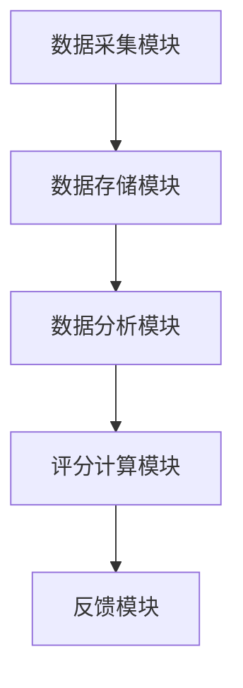
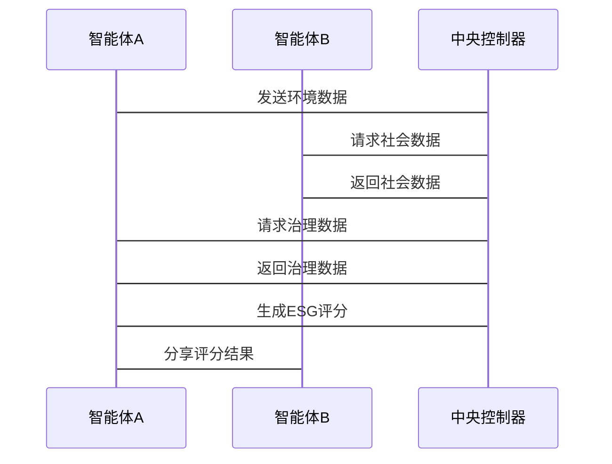

                 


# 多智能体系统在评估公司治理和ESG因素中的应用

## 关键词：
多智能体系统，公司治理，ESG，分布式计算，一致性算法，协作优化

## 摘要：
本文探讨了多智能体系统（MAS）在公司治理和ESG评估中的应用，分析了MAS的核心概念、算法原理及其在ESG评分优化中的作用。通过具体案例，展示了MAS在实时监控和反馈机制中的优势，为企业治理提供了新的思路。

---

## 目录

# 第一部分: 多智能体系统与公司治理概述

## 第1章: 多智能体系统的核心概念

### 1.1 多智能体系统的定义与特点
#### 1.1.1 多智能体系统的定义
多智能体系统（Multi-Agent System, MAS）是由多个智能体（Agent）组成的分布式系统，每个智能体能够自主决策并与其他智能体协作，共同完成复杂任务。

#### 1.1.2 多智能体系统的核心特点
- **自主性**：智能体能够独立决策。
- **反应性**：能够感知环境并做出实时反应。
- **协作性**：多个智能体通过通信和协作完成共同目标。
- **分布式性**：智能体分布在不同的物理或逻辑位置。

#### 1.1.3 多智能体系统与传统单智能体系统的区别
| 特性         | 单智能体系统         | 多智能体系统         |
|--------------|--------------------|--------------------|
| 决策中心化   | 单一决策中心       | 分散决策中心       |
| 协作方式     | 无协作或单线协作     | 多方协作           |
| 复杂性       | 较低                | 较高                |

### 1.2 公司治理的基本概念
#### 1.2.1 公司治理的定义
公司治理是指通过公司章程、制度和机制，确保公司有效运作、风险控制和利益相关者权益保护的管理活动。

#### 1.2.2 公司治理的主要目标
- 提高公司运作效率
- 保护股东、债权人和员工的权益
- 实现企业可持续发展

#### 1.2.3 公司治理的主体与客体关系
- **主体**：董事会、管理层、股东、利益相关者
- **客体**：公司运营、战略制定、风险管理

### 1.3 ESG因素的定义与重要性
#### 1.3.1 ESG的定义
ESG（Environmental, Social, Governance）是衡量企业可持续发展能力的重要指标，包括环境影响、社会责任和公司治理三个方面。

#### 1.3.2 ESG的三个维度
- **环境（Environmental）**：企业对环境保护的贡献，如碳排放、能源使用。
- **社会（Social）**：企业在社会中的责任，如员工权益、社区贡献。
- **治理（Governance）**：公司治理结构和透明度。

#### 1.3.3 ESG在公司治理中的作用
- 提供企业可持续发展的评估标准。
- 帮助投资者识别高风险和高潜力企业。
- 促进企业内部管理优化。

---

## 第2章: 多智能体系统在公司治理中的应用背景

### 2.1 当前公司治理面临的挑战
#### 2.1.1 传统公司治理的局限性
- 信息孤岛问题：各部门间数据不共享，导致决策效率低下。
- 监测成本高：难以实时监控企业运营和ESG表现。
- 单一决策模式：依赖少数高管决策，风险集中。

#### 2.1.2 数字化转型对治理的需求
- 数据驱动决策：需要实时数据支持。
- 分布式协作：各部门需要高效协作。
- 灵活性和适应性：快速响应市场变化。

#### 2.1.3 ESG因素对公司治理的影响
- ESG成为投资决策的重要因素。
- ESG表现影响企业声誉和融资成本。
- 政府监管趋严，企业需要满足更多ESG要求。

### 2.2 多智能体系统在公司治理中的优势
#### 2.2.1 提高决策效率
MAS通过分布式计算和协作，快速整合数据，提供实时决策支持。

#### 2.2.2 增强信息透明度
智能体间实时通信，确保信息透明，减少信息不对称。

#### 2.2.3 优化资源配置
通过智能体协作，合理分配资源，提高公司整体效率。

---

## 第3章: 多智能体系统与ESG评估的结合

### 3.1 ESG评估的核心要素
#### 3.1.1 环境因素（Environmental）
- 碳排放量
- 能源使用效率
- 可再生能源使用比例

#### 3.1.2 社会因素（Social）
- 员工满意度
- 社区参与度
- 供应链社会责任

#### 3.1.3 治理因素（Governance）
- 董事会结构
- 透明度
- 内部控制和风险管理

### 3.2 多智能体系统在ESG评估中的应用
#### 3.2.1 数据采集与分析
- 智能传感器采集环境数据。
- 自然语言处理分析企业报告。
- 数据挖掘技术提取关键指标。

#### 3.2.2 多智能体协作优化ESG评分
- 智能体协同分析环境、社会、治理三个维度的数据。
- 使用一致性算法确保评分结果一致性和准确性。
- 通过协作优化算法，提升ESG评分的客观性和准确性。

#### 3.2.3 实时监控与反馈机制
- 实时监控企业ESG表现。
- 自动触发预警机制，及时反馈异常情况。
- 根据反馈结果，动态调整评估策略。

---

## 第4章: 多智能体系统的算法原理

### 4.1 分布式计算与一致性算法
#### 4.1.1 分布式计算的基本概念
分布式计算是将计算任务分布在多个节点上，通过协作完成任务。

#### 4.1.2 一致性算法
- **Paxos算法**：用于分布式系统中达成一致性的协议。
- **Raft算法**：用于分布式系统中的领导者选举和日志同步。

#### 4.1.3 一致性算法在多智能体系统中的应用
- 保证系统中各智能体的数据一致性。
- 提高系统可靠性和容错性。

### 4.2 协作与通信机制
#### 4.2.1 智能体之间的通信协议
- 使用HTTP或WebSocket进行实时通信。
- 定义统一的数据格式和接口标准。

#### 4.2.2 协作任务分配算法
- 基于角色分配任务。
- 根据智能体能力动态分配任务。

#### 4.2.3 信息共享与隐私保护
- 使用加密技术保护隐私。
- 设计访问控制机制，确保信息共享安全。

---

## 第5章: 多智能体系统的数学模型与公式

### 5.1 一致性协议的数学模型
#### 5.1.1 一致性协议的基本公式
$$ \text{一致性协议的目标是确保所有智能体的值 } v_i \text{ 达到一致} $$

#### 5.1.2 一致性协议的收敛性分析
$$ \text{收敛性证明：若协议正确实施，系统将收敛到一致状态} $$

### 5.2 多智能体协作的优化模型
#### 5.2.1 协作任务的数学表达
$$ \text{目标函数：} f(x_1, x_2, ..., x_n) \text{ 最小化或最大化} $$

#### 5.2.2 优化目标的数学公式
$$ \min_{x_i} \sum_{i=1}^{n} f_i(x_i) $$

---

## 第6章: 系统分析与架构设计

### 6.1 问题场景介绍
- 实时监控企业ESG表现。
- 多部门协作优化ESG评分。
- 需要高效的数据处理和反馈机制。

### 6.2 系统功能设计
#### 6.2.1 数据采集模块
- 采集环境、社会、治理三方面的数据。
- 使用传感器和API获取实时数据。

#### 6.2.2 数据分析模块
- 使用机器学习模型分析数据。
- 生成ESG评分并提出优化建议。

### 6.3 系统架构设计


### 6.4 系统接口设计
- 数据接口：REST API。
- 通信接口：WebSocket实时通信。

### 6.5 系统交互流程


---

## 第7章: 项目实战

### 7.1 环境安装
- 安装Python和相关库（如Django、Flask）。
- 安装分布式计算库（如Django Channels）。

### 7.2 核心代码实现
```python
class Agent:
    def __init__(self, id):
        self.id = id
        self.data = None

    def receive(self, message):
        self.data = message
        self.process()

    def process(self):
        # 数据处理逻辑
        pass

    def send(self, message):
        # 发送消息
        pass
```

### 7.3 实际案例分析
- 某企业使用MAS优化ESG评分，提升透明度和决策效率。

### 7.4 项目小结
通过MAS实现高效的ESG评估，提升公司治理能力。

---

## 第8章: 总结与展望

### 8.1 总结
多智能体系统为公司治理和ESG评估提供了高效、协作的解决方案，能够实时监控和优化企业表现。

### 8.2 应用前景
随着技术进步，MAS在公司治理中的应用将更加广泛，推动企业可持续发展。

### 8.3 最佳实践 tips
- 确保数据安全和隐私保护。
- 定期优化算法，提高系统效率。
- 培训相关人员，提升系统使用能力。

---

## 附录

### 附录A: 扩展阅读
- 推荐书籍和论文。

### 附录B: 工具和库
- 分布式计算库：Django Channels、Celery。
- 机器学习库：Scikit-learn、TensorFlow。

---

本文通过详细分析多智能体系统在公司治理和ESG评估中的应用，展示了其在提升企业透明度、优化决策效率和实现可持续发展中的巨大潜力。希望本文能为相关领域的研究和实践提供有价值的参考。

---

* 本文版权归作者所有，转载请注明出处，并保留原文链接。

