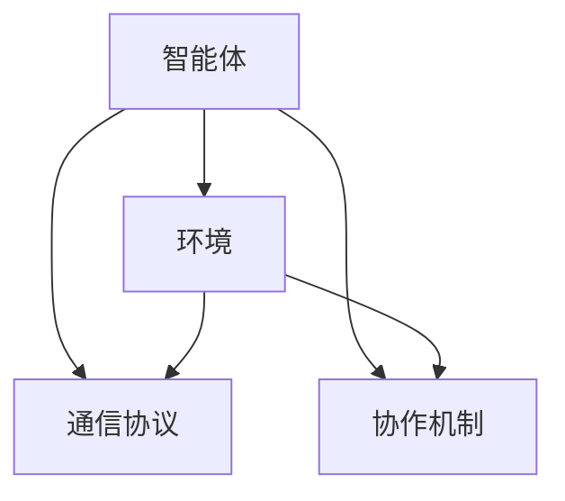
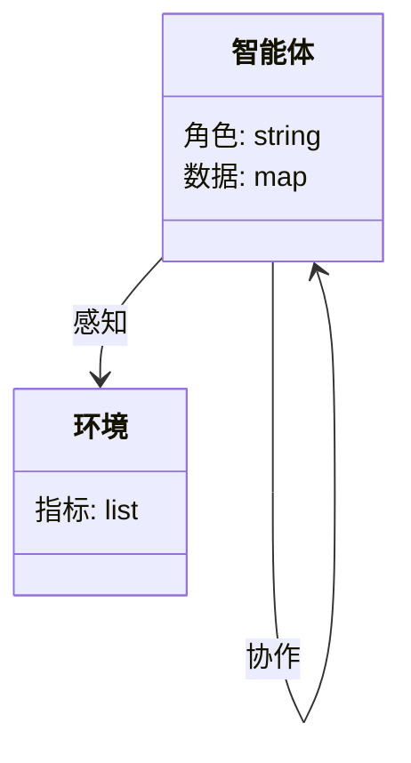
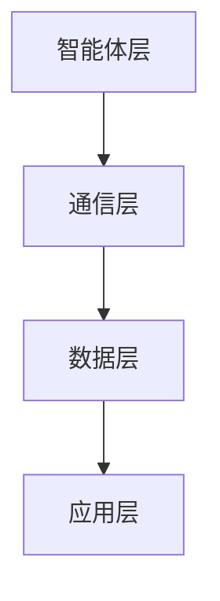
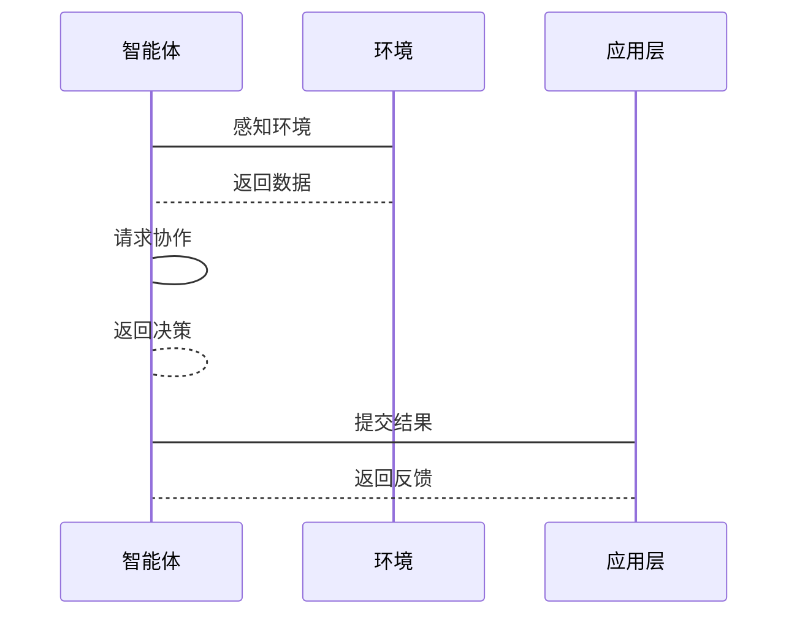

                 


# 多智能体系统在评估公司环境责任表现中的应用

> 关键词：多智能体系统, 环境责任评估, 系统架构, 算法实现, 项目实战

> 摘要：随着全球对可持续发展的关注增加，公司环境责任的表现变得越来越重要。多智能体系统（Multi-Agent Systems, MAS）在这一领域展示了巨大潜力，能够通过智能体之间的协作与竞争，评估和优化公司的环境责任表现。本文详细探讨MAS在环境责任评估中的应用，从核心概念到算法实现，再到系统架构和项目实战，为读者提供全面的见解。

---

# 第1章: 多智能体系统与环境责任评估的背景

## 1.1 多智能体系统的基本概念

### 1.1.1 多智能体系统的定义
多智能体系统是由多个智能体组成的分布式系统，这些智能体能够自主决策、协作和竞争，以实现共同目标或个体目标。每个智能体都有一定的知识、推理能力和行为决策能力，能够感知环境并采取行动。

### 1.1.2 多智能体系统的分类与特点
多智能体系统可以分为分布式 MAS 和集中式 MAS。分布式 MAS 中的智能体相对独立，通过通信协作完成任务；集中式 MAS 中的智能体依赖一个中央控制器。MAS 的特点包括自主性、反应性、协作性和动态性。

### 1.1.3 多智能体系统的核心要素
MAS 的核心要素包括智能体、环境、通信协议和协作机制。智能体是系统的基本单元，环境是智能体交互的场所，通信协议是智能体间信息交换的规则，协作机制是智能体合作完成任务的方式。

## 1.2 环境责任评估的背景与意义

### 1.2.1 环境责任的概念与内涵
环境责任是指企业在经营活动中对环境造成的影响及相应的责任。包括减少污染、节约资源、保护生态等方面。环境责任评估是对企业环境表现的测量和评价。

### 1.2.2 环境责任评估的现状与挑战
目前，环境责任评估主要依赖于人工审核和静态指标，存在数据分散、评估标准不统一、动态性不足等问题。随着企业活动的复杂化，传统的评估方法难以满足需求。

### 1.2.3 多智能体系统在环境责任评估中的优势
MAS 能够实时收集和分析多源数据，通过智能体协作实现动态评估，提高评估的准确性和效率。MAS 还能模拟不同场景，为企业提供优化建议。

---

# 第2章: 多智能体系统的核心概念与联系

## 2.1 多智能体系统的核心原理

### 2.1.1 多智能体系统的通信机制
智能体之间的通信可以通过直接交互或通过中介者进行。通信机制需要定义消息格式、传输协议和数据安全。

### 2.1.2 多智能体系统的协作与竞争
协作是指智能体为了共同目标而合作；竞争是指智能体在资源有限的情况下争夺资源。协作与竞争的平衡是 MAS 设计的关键。

### 2.1.3 多智能体系统的动态性与适应性
MAS 具有动态性，能够根据环境变化调整智能体的行为。适应性是 MAS 的重要特性，使系统能够应对不确定性。

## 2.2 多智能体系统与环境责任评估的核心联系

### 2.2.1 多智能体系统如何建模环境责任
通过智能体建模企业的不同部门和利益相关者，模拟其行为对环境的影响。

### 2.2.2 多智能体系统如何支持环境责任评估的决策过程
智能体可以根据实时数据和模型预测，提供优化建议，辅助决策者制定环境责任策略。

### 2.2.3 多智能体系统如何优化环境责任表现
通过协作和竞争机制，智能体可以优化资源配置，减少环境影响，提高企业环境表现。

## 2.3 多智能体系统的核心概念对比表

| 智能体类型 | 自主性 | 知识表示 | 行为决策 | 协作方式 |
|------------|--------|----------|-----------|----------|
| 单一智能体 | 高      | 简单     | 基于规则  | 无       |
| 分布式 MAS | 高      | 分散     | 基于协议 | 协作与竞争 |
| 集中式 MAS | 中      | 集中     | 基于指令 | 协作      |

## 2.4 多智能体系统的核心概念 ER 实体关系图



---

# 第3章: 多智能体系统在环境责任评估中的算法原理

## 3.1 多智能体系统的基本算法

### 3.1.1 分布式多智能体系统算法
分布式 MAS 中，每个智能体独立运行，通过通信协议协作完成任务。算法流程包括初始化、感知环境、决策、执行和反馈。

### 3.1.2 协作式多智能体系统算法
协作式 MAS 中，智能体之间通过协作机制共同完成任务。算法流程包括任务分配、协作计划、执行和结果评估。

### 3.1.3 竞争式多智能体系统算法
竞争式 MAS 中，智能体之间通过竞争机制争夺资源。算法流程包括资源分配、竞争策略、结果评估。

## 3.2 环境责任评估中的多智能体算法实现

### 3.2.1 基于多智能体的环境责任评估模型
模型包括多个智能体，分别代表企业、供应商、政府和消费者。每个智能体根据自身角色和目标，评估企业环境表现。

### 3.2.2 多智能体系统中的环境责任评估算法流程
1. 初始化智能体：定义智能体角色和目标。
2. 感知环境：收集企业环境数据。
3. 决策：智能体根据数据制定评估策略。
4. 执行：智能体协作完成评估任务。
5. 反馈：评估结果反馈给决策者。

### 3.2.3 多智能体系统中的环境责任评估数学模型

$$
\text{环境影响} = \sum_{i=1}^{n} w_i \cdot x_i
$$

其中，$w_i$ 是影响权重，$x_i$ 是影响指标。

## 3.3 算法实现的代码示例

```python
class Agent:
    def __init__(self, role):
        self.role = role
        self.data = {}

    def感知环境(self, environment):
        self.data = environment

    def决策(self):
        if self.role == '企业':
            return '优化生产'
        elif self.role == '供应商':
            return '减少排放'

# 初始化智能体
企业 = Agent('企业')
供应商 = Agent('供应商')

# 感知环境
企业.感知环境({'生产排放': 100})
供应商.感知环境({'供应链排放': 50})

# 决策
企业_decision = 企业.决策()
供应商_decision = 供应商.决策()

print(企业_decision, 供应商_decision)
```

---

# 第4章: 多智能体系统在环境责任评估中的系统架构设计

## 4.1 系统架构概述

### 4.1.1 系统整体架构
系统包括智能体层、通信层、数据层和应用层。智能体层负责决策，通信层负责信息交互，数据层负责存储，应用层负责用户交互。

### 4.1.2 系统功能模块划分
模块包括数据采集、智能体管理、评估计算、结果展示和优化建议。

### 4.1.3 系统组件之间的关系
智能体通过通信层与数据层交互，数据层为智能体提供环境数据，应用层展示评估结果。

## 4.2 系统功能设计

### 4.2.1 领域模型


### 4.2.2 系统架构设计


### 4.2.3 系统接口设计
接口包括智能体注册、环境数据获取、评估结果查询和优化建议请求。

### 4.2.4 系统交互流程图


---

# 第5章: 项目实战

## 5.1 环境安装
需要安装 Python、相关库（如 `networkx` 和 `mermaid`）和 IDE。

## 5.2 核心代码实现

```python
import networkx as nx

class Environment:
    def __init__(self):
        self.agents = []
        self.metrics = {}

    def add_agent(self, agent):
        self.agents.append(agent)

    def get_metric(self, name):
        return self.metrics.get(name, 0)

class Agent:
    def __init__(self, role, environment):
        self.role = role
        self.environment = environment

    def感知环境(self):
        self.environment.get_metric(self.role)

    def决策(self):
        return f"{self.role}决策：优化环境表现"

# 初始化环境和智能体
环境 = Environment()
企业 = Agent('企业', 环境)
供应商 = Agent('供应商', 环境)

环境.add_agent(企业)
环境.add_agent(供应商)

企业.感知环境()
供应商.感知环境()

企业_decision = 企业.决策()
供应商_decision = 供应商.决策()

print(企业_decision, 供应商_decision)
```

## 5.3 代码应用解读与分析
代码实现了两个智能体，分别代表企业和供应商。智能体感知环境数据，做出决策并输出结果。

## 5.4 实际案例分析和详细讲解
通过案例分析，展示 MAS 如何帮助企业优化环境表现，减少排放，降低成本。

## 5.5 项目总结
项目展示了 MAS 在环境责任评估中的应用，验证了其有效性和优势。

---

# 第6章: 最佳实践、小结、注意事项与拓展阅读

## 6.1 最佳实践
- 定义明确的智能体角色和目标。
- 设计高效的通信协议和协作机制。
- 定期更新智能体模型和环境数据。

## 6.2 小结
多智能体系统为环境责任评估提供了新的思路和技术支持，能够提高评估的准确性和效率。

## 6.3 注意事项
- 确保数据的准确性和及时性。
- 处理智能体之间的冲突和协调问题。
- 保护系统的安全性和隐私性。

## 6.4 拓展阅读
推荐阅读相关书籍和论文，深入学习 MAS 和环境责任评估的知识。

---

# 结语

多智能体系统在环境责任评估中的应用前景广阔，随着技术的发展，其作用将更加重要。通过 MAS，企业能够更好地优化环境表现，实现可持续发展目标。希望本文能够为读者提供有价值的参考和启发。

---

# 参考文献

（此处可以列出相关的书籍、论文和其他参考资料）

