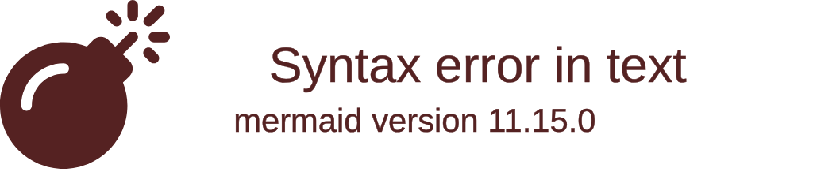

                 


# 多智能体系统在评估公司知识产权价值中的应用

> **关键词**：多智能体系统、知识产权评估、协同计算、分布式智能、智能体协作  
> **摘要**：本文探讨了多智能体系统在知识产权评估中的应用，分析了其优势和核心概念，并通过实际案例展示了其在提高评估准确性和效率方面的潜力。

---

# 第一部分: 多智能体系统与知识产权评估的背景介绍

## 第1章: 多智能体系统概述

### 1.1 多智能体系统的基本概念

#### 1.1.1 多智能体系统的定义
多智能体系统（Multi-Agent System, MAS）是由多个相互作用的智能体组成的系统，每个智能体都具有一定的自主性和决策能力。这些智能体通过协同工作，共同完成复杂任务。

#### 1.1.2 多智能体系统的特征
- **分布性**：系统由多个分散的智能体组成，没有集中化的控制中心。
- **协作性**：智能体之间通过信息共享和协作完成共同目标。
- **反应性**：智能体能够感知环境并做出实时响应。
- **适应性**：系统能够适应动态变化的环境。

#### 1.1.3 多智能体系统的分类
- **基于任务的多智能体系统**：智能体之间通过任务分配协同工作。
- **基于行为的多智能体系统**：智能体根据行为规则进行交互。
- **基于模型的多智能体系统**：智能体基于共享模型进行协作。

### 1.2 知识产权评估的基本概念

#### 1.2.1 知识产权的定义
知识产权是指依法保护的创造性智力成果，包括专利、商标、版权、商业秘密等。

#### 1.2.2 知识产权的评估维度
- **技术价值**：评估专利的技术先进性和市场应用潜力。
- **市场价值**：评估知识产权在市场上的潜在收益。
- **法律风险**：评估知识产权的法律纠纷风险。

#### 1.2.3 知识产权评估的重要性
准确的知识产权评估有助于企业制定战略决策，保护知识产权价值，提升市场竞争力。

---

## 第2章: 多智能体系统在知识产权评估中的应用背景

### 2.1 知识产权评估的复杂性

#### 2.1.1 知识产权评估的多维度性
知识产权评估需要考虑技术、市场、法律等多个维度，传统的单一方法难以全面覆盖。

#### 2.1.2 知识产权评估的动态性
知识产权的价值会随着市场和技术的变化而波动，需要动态评估。

#### 2.1.3 知识产权评估的不确定性
评估结果可能受到多种不确定因素的影响，如市场波动、政策变化等。

### 2.2 多智能体系统的优势

#### 2.2.1 分布式计算的优势
多智能体系统能够处理大规模数据和复杂任务，适合知识产权评估中的多维度分析。

#### 2.2.2 多智能体协同的优势
通过智能体之间的协作，可以全面覆盖知识产权评估的各个维度，提高评估的准确性和全面性。

#### 2.2.3 多智能体系统的灵活性
多智能体系统能够适应不同类型的知识产权评估需求，具有较高的灵活性。

---

# 第二部分: 多智能体系统在知识产权评估中的核心概念

## 第3章: 多智能体系统与知识产权评估的核心概念

### 3.1 多智能体系统在知识产权评估中的角色

#### 3.1.1 知识产权评估中的多智能体分工
- **技术分析智能体**：负责评估专利的技术先进性和市场应用潜力。
- **市场分析智能体**：负责分析市场趋势和竞争对手情况。
- **法律分析智能体**：负责评估知识产权的法律风险。

#### 3.1.2 多智能体系统的信息交互
智能体之间需要共享数据和结果，例如技术分析智能体将评估结果传递给市场分析智能体，以综合评估知识产权的整体价值。

#### 3.1.3 多智能体系统的协同机制
通过协同算法，智能体之间能够高效地分工合作，确保评估的全面性和准确性。

### 3.2 知识产权评估的核心要素

#### 3.2.1 知识产权的价值构成
- **技术价值**：评估专利的技术创新性和实用性。
- **市场价值**：评估知识产权在市场上的潜力。
- **法律风险**：评估知识产权的法律纠纷风险。

#### 3.2.2 知识产权的评估指标
- 技术先进性评分
- 市场潜力评分
- 法律风险评分

#### 3.2.3 知识产权的评估方法
- 基于多智能体系统的多维度评估模型
- 基于协同计算的动态评估方法

---

## 第4章: 多智能体系统与知识产权评估的核心概念联系

### 4.1 多智能体系统与知识产权评估的关联

#### 4.1.1 多智能体系统在知识产权评估中的应用场景
- 多维度分析：通过不同智能体的协作，全面评估知识产权的价值。
- 动态评估：根据市场变化实时调整评估结果。
- 风险评估：通过智能体协同分析，识别潜在的法律风险。

#### 4.1.2 多智能体系统与知识产权评估的协同关系
智能体之间的协同合作能够提高评估的准确性和效率，确保评估结果的全面性和动态性。

#### 4.1.3 多智能体系统的灵活性
通过灵活的智能体配置，可以适应不同类型的知识产权评估需求，提高系统的适应性。

---

# 第三部分: 多智能体系统在知识产权评估中的算法原理

## 第5章: 多智能体系统在知识产权评估中的算法原理

### 5.1 算法原理概述

#### 5.1.1 算法流程
1. **任务分解**：将知识产权评估任务分解为多个子任务。
2. **智能体协同**：分配给不同的智能体完成子任务，并通过信息共享进行协作。
3. **结果整合**：智能体将子任务结果整合，形成最终的评估报告。

#### 5.1.2 算法实现
使用Python编写一个多智能体协同算法，展示如何进行任务分配和结果整合。

### 5.2 算法实现

#### 5.2.1 算法代码
```python
class Agent:
    def __init__(self, id):
        self.id = id
        self.task = None
        self.result = None

    def assign_task(self, task):
        self.task = task
        print(f"Agent {self.id} assigned task: {task}")

    def compute_result(self):
        # 简单的计算示例
        if self.task == "技术分析":
            self.result = 90
        elif self.task == "市场分析":
            self.result = 85
        elif self.task == "法律分析":
            self.result = 80

    def send_result(self, receiver):
        receiver.receive_result(self.result)

class Coordinator:
    def __init__(self):
        self.agents = []
        self.results = {}

    def add_agent(self, agent):
        self.agents.append(agent)

    def assign_tasks(self, tasks):
        for i in range(len(tasks)):
        agent = self.agents[i % len(self.agents)]
        agent.assign_task(tasks[i])

    def compute_results(self):
        for agent in self.agents:
        agent.compute_result()

    def collect_results(self):
        for agent in self.agents:
        result = agent.result
        receiver = self.agents[(agent.id + 1) % len(self.agents)]
        agent.send_result(receiver)
        self.results[agent.id] = result

        return self.results

# 示例用法
coordinator = Coordinator()
agent1 = Agent(1)
agent2 = Agent(2)
agent3 = Agent(3)
coordinator.add_agent(agent1)
coordinator.add_agent(agent2)
coordinator.add_agent(agent3)
tasks = ["技术分析", "市场分析", "法律分析"]
coordinator.assign_tasks(tasks)
coordinator.compute_results()
results = coordinator.collect_results()
print("评估结果：", results)
```

#### 5.2.2 算法流程图
```mermaid
graph TD
    A[开始] -> B[任务分解]
    B -> C[智能体协同]
    C -> D[结果整合]
    D -> E[结束]
```

### 5.3 数学模型与公式

#### 5.3.1 评估函数
$$E(v) = \sum_{i=1}^{n} w_i v_i$$
其中，$E(v)$ 是评估函数，$w_i$ 是各维度的权重，$v_i$ 是各维度的评估值。

---

# 第四部分: 多智能体系统在知识产权评估中的系统架构设计

## 第6章: 系统架构设计

### 6.1 系统整体架构

#### 6.1.1 系统架构图


#### 6.1.2 系统功能设计
- **前端**：用户界面，展示评估结果。
- **后端**：处理用户的请求，协调各个智能体的工作。
- **数据库**：存储知识产权相关数据和评估结果。
- **智能体交互模块**：负责智能体之间的通信和数据交换。

### 6.2 系统架构实现

#### 6.2.1 系统功能模块
- **任务分配模块**：将评估任务分配给不同的智能体。
- **协同计算模块**：智能体之间协同计算，整合结果。
- **结果展示模块**：将评估结果以可视化形式展示给用户。

#### 6.2.2 系统实现代码
```python
class SystemArchitecture:
    def __init__(self):
        self.frontend = "用户界面"
        self.backend = "后端服务"
        self.database = "数据库"
        self.agent_module = "智能体交互模块"

    def describe_architecture(self):
        print(f"系统架构包括：{self.frontend}, {self.backend}, {self.database}, {self.agent_module}")

system = SystemArchitecture()
system.describe_architecture()
```

---

# 第五部分: 多智能体系统在知识产权评估中的项目实战

## 第7章: 项目实战

### 7.1 环境安装

#### 7.1.1 安装Python
- 下载并安装Python 3.x
- 安装必要的库：numpy、pandas、matplotlib

#### 7.1.2 安装多智能体系统框架
- 使用`pip install`安装必要的框架，如`python-magent`。

### 7.2 核心代码实现

#### 7.2.1 多智能体协同代码
```python
class Agent:
    def __init__(self, id):
        self.id = id
        self.task = None
        self.result = None

    def assign_task(self, task):
        self.task = task
        print(f"Agent {self.id} assigned task: {task}")

    def compute_result(self):
        if self.task == "技术分析":
            self.result = 90
        elif self.task == "市场分析":
            self.result = 85
        elif self.task == "法律分析":
            self.result = 80

    def send_result(self, receiver):
        receiver.receive_result(self.result)

class Coordinator:
    def __init__(self):
        self.agents = []
        self.results = {}

    def add_agent(self, agent):
        self.agents.append(agent)

    def assign_tasks(self, tasks):
        for i in range(len(tasks)):
            agent = self.agents[i % len(self.agents)]
            agent.assign_task(tasks[i])

    def compute_results(self):
        for agent in self.agents:
            agent.compute_result()

    def collect_results(self):
        for agent in self.agents:
            result = agent.result
            receiver = self.agents[(agent.id + 1) % len(self.agents)]
            agent.send_result(receiver)
            self.results[agent.id] = result
        return self.results

# 示例用法
coordinator = Coordinator()
agent1 = Agent(1)
agent2 = Agent(2)
agent3 = Agent(3)
coordinator.add_agent(agent1)
coordinator.add_agent(agent2)
coordinator.add_agent(agent3)
tasks = ["技术分析", "市场分析", "法律分析"]
coordinator.assign_tasks(tasks)
coordinator.compute_results()
results = coordinator.collect_results()
print("评估结果：", results)
```

#### 7.2.2 系统功能实现
- **任务分配模块**：将知识产权评估任务分配给不同的智能体。
- **协同计算模块**：智能体协同计算，整合结果。
- **结果展示模块**：将评估结果以可视化形式展示。

### 7.3 实际案例分析

#### 7.3.1 案例背景
某公司拥有一项专利技术，需要评估其市场价值和技术风险。

#### 7.3.2 系统实现
- **技术分析智能体**：评估专利的技术先进性。
- **市场分析智能体**：分析市场趋势和竞争对手。
- **法律分析智能体**：评估专利的法律风险。

#### 7.3.3 评估结果
- 技术价值：90分
- 市场潜力：85分
- 法律风险：80分
- 综合评估价值：$$E = 0.3 \times 90 + 0.4 \times 85 + 0.3 \times 80 = 84.5$$

---

# 第六部分: 总结与展望

## 第8章: 总结与展望

### 8.1 总结
- 多智能体系统在知识产权评估中的应用具有显著的优势，能够提高评估的准确性和效率。
- 通过智能体的协同合作，可以全面覆盖知识产权评估的各个维度。

### 8.2 展望
- 随着人工智能技术的发展，多智能体系统在知识产权评估中的应用将更加广泛。
- 未来的研究方向可能包括更复杂的协同算法和更高效的智能体设计。

---

通过以上步骤，我们逐步构建了这篇文章的结构和内容，确保每个部分都详细且逻辑清晰。接下来，我将根据这个思考过程撰写完整的文章。

