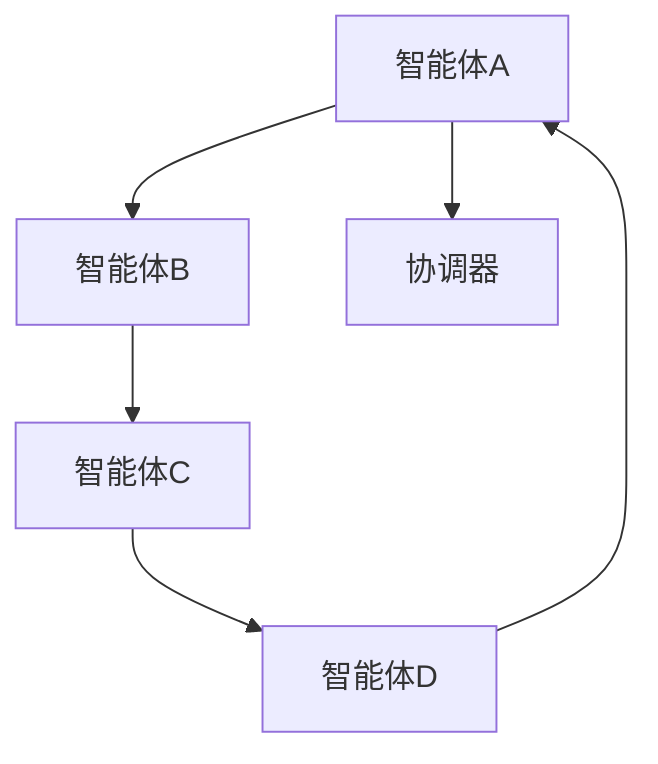
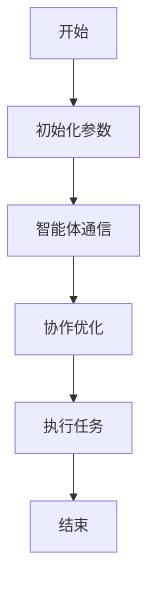
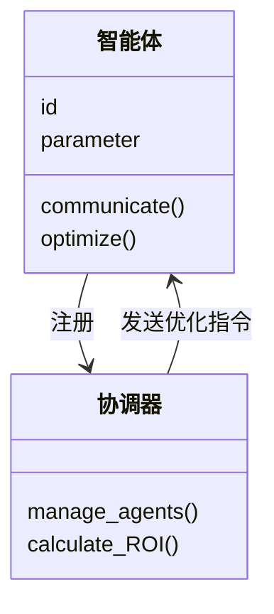
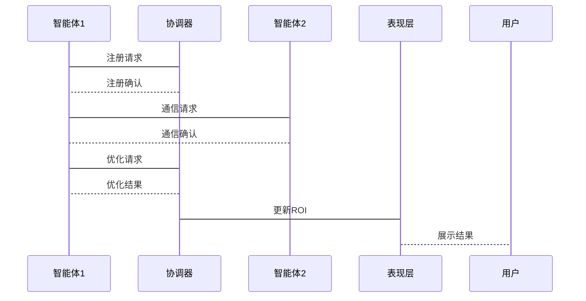

                 


# 多智能体系统在评估公司研发投资回报率中的应用

> 关键词：多智能体系统，研发投资回报率，协作优化，分布式计算，系统架构设计

> 摘要：本文探讨了多智能体系统在评估公司研发投资回报率中的应用，通过分析多智能体系统的定义、核心概念、算法原理、系统架构设计、项目实战及最佳实践，详细阐述了多智能体系统在复杂动态环境下的协作优化能力及其在ROI评估中的优势。

---

## 第一部分: 多智能体系统与研发投资回报率评估的背景介绍

### 第1章: 多智能体系统的定义与特点

#### 1.1 多智能体系统的定义
##### 1.1.1 多智能体系统的概念
多智能体系统（Multi-Agent System, MAS）是由多个智能体（Agent）组成的分布式系统，每个智能体具有一定的自主性、反应性和协作性，能够通过通信和协作完成复杂任务。

##### 1.1.2 多智能体系统的特征
- **自主性**：智能体能够自主决策和行动。
- **反应性**：能够感知环境并实时响应。
- **协作性**：多个智能体之间可以协作完成任务。
- **分布性**：智能体分布在网络中，不存在中央控制节点。

##### 1.1.3 多智能体系统与传统单智能体系统的区别
| 特性             | 多智能体系统（MAS）                   | 单智能体系统（SAS）                   |
|------------------|--------------------------------------|--------------------------------------|
| 结构             | 分布式架构，多个智能体协作           | 集中式架构，单个智能体主导           |
| 管理复杂度       | 高，需要协调多个智能体的行为         | 低，单个智能体独立运行               |
| 应用场景         | 适用于复杂、动态环境下的任务处理   | 适用于简单、静态环境下的任务处理   |

#### 1.2 多智能体系统的应用场景
##### 1.2.1 分布式问题求解
多智能体系统在分布式计算中表现出色，例如分布式数据库的优化和大规模网络中的路由优化。

##### 1.2.2 协作与竞争环境
在电子商务、交通管理等领域，多智能体系统能够模拟多方协作与竞争，提供更优的解决方案。

##### 1.2.3 动态与复杂环境中的决策
多智能体系统能够快速响应环境变化，适用于金融市场、灾害应急响应等复杂动态环境。

#### 1.3 多智能体系统的架构
##### 1.3.1 分层架构
将系统分为多个层次，如感知层、决策层和执行层，每个层次负责不同的功能。

##### 1.3.2 分布式架构
智能体分布在网络中，通过通信协议进行交互，适用于大规模分布式系统。

##### 1.3.3 协作式架构
智能体之间通过协作完成任务，强调智能体之间的通信与协调。

#### 1.4 多智能体系统的实现技术
##### 1.4.1 通信协议
智能体之间通过特定协议进行信息交换，例如FIPA（Foundation for Intelligent Physical Agents）。

##### 1.4.2 协作算法
包括分布式一致性算法、分布式优化算法等。

##### 1.4.3 状态管理
通过状态机模型管理智能体的执行状态，确保系统的可靠性。

#### 1.5 本章小结
本章介绍了多智能体系统的定义、特点及其在分布式计算和复杂环境中的应用优势。

---

### 第2章: 研发投资回报率评估的背景与挑战

#### 2.1 研发投资回报率的定义
##### 2.1.1 ROI的计算公式
$$ ROI = \frac{\text{净收益}}{\text{投资成本}} \times 100\% $$

##### 2.1.2 ROI评估的关键因素
- 投资金额
- 项目周期
- 收益预测
- 风险评估

##### 2.1.3 ROI评估的复杂性
- 数据的不确定性和不完整性
- 市场动态变化
- 项目执行中的不确定性

#### 2.2 研发投资回报率评估的传统方法
##### 2.2.1 财务指标法
基于财务指标进行评估，如净现值（NPV）和内部收益率（IRR）。

##### 2.2.2 项目管理法
通过项目管理工具（如JIRA）进行项目跟踪和评估。

##### 2.2.3 市场分析法
结合市场调研和预测模型进行评估。

#### 2.3 传统方法的局限性
##### 2.3.1 数据不足
传统方法依赖于历史数据，难以应对新兴领域的不确定性。

##### 2.3.2 计算复杂性
复杂的项目涉及多个变量，传统方法难以准确评估。

##### 2.3.3 动态变化的市场环境
市场环境的快速变化使得传统静态评估方法难以适应。

#### 2.4 多智能体系统在ROI评估中的优势
##### 2.4.1 分布式数据处理
多智能体系统能够实时收集和处理分布在网络中的数据，提高评估的准确性。

##### 2.4.2 实时协作
智能体之间的实时协作能够快速响应市场变化，优化评估结果。

##### 2.4.3 复杂环境下的决策能力
多智能体系统能够在复杂环境下进行分布式决策，提高评估的鲁棒性。

#### 2.5 本章小结
本章分析了传统ROI评估方法的局限性，并介绍了多智能体系统在应对这些挑战中的优势。

---

### 第3章: 多智能体系统在研发投资回报率评估中的核心概念

#### 3.1 多智能体系统的协作机制
##### 3.1.1 协作协议
智能体之间通过协议进行通信和协作，例如CORBA和JAX-RPC。

##### 3.1.2 协作算法
包括分布式协商算法和分布式优化算法。

##### 3.1.3 协作策略
制定协作规则以实现最优目标，例如基于拍卖的资源分配策略。

#### 3.2 多智能体系统的通信模型
##### 3.2.1 通信协议
智能体之间的通信需要遵循特定协议，如HTTP和WebSocket。

##### 3.2.2 消息队列
使用消息队列（如RabbitMQ）实现异步通信。

##### 3.2.3 事件驱动
通过事件驱动机制实现智能体之间的实时交互。

#### 3.3 多智能体系统的协作协议
##### 3.3.1 协商机制
智能体之间通过协商确定任务分配和资源分配。

##### 3.3.2 一致性协议
通过一致性算法（如Paxos和Raft）确保系统的一致性。

##### 3.3.3 安全协议
通过加密和身份认证确保通信的安全性。

#### 3.4 多智能体系统的协作协议示意图



#### 3.5 本章小结
本章详细介绍了多智能体系统在协作机制和通信模型方面的核心概念，为后续的算法设计奠定了基础。

---

### 第4章: 多智能体系统在研发投资回报率评估中的算法原理

#### 4.1 多智能体协同优化算法
##### 4.1.1 算法概述
通过分布式优化算法实现多智能体之间的协同优化。

##### 4.1.2 算法流程
1. 初始化：每个智能体初始化其参数。
2. 通信：智能体之间交换信息。
3. 协作优化：基于通信信息进行优化计算。
4. 执行：根据优化结果执行任务。

#### 4.2 算法流程图



#### 4.3 算法实现
##### 4.3.1 Python代码实现

```python
import random

class Agent:
    def __init__(self, id):
        self.id = id
        self.parameter = random.uniform(0, 1)

    def communicate(self, other):
        # 通信函数，交换参数
        temp = self.parameter
        self.parameter = other.parameter
        other.parameter = temp

    def optimize(self):
        # 简单优化算法，返回优化后的参数
        return self.parameter * 2

# 初始化多个智能体
agents = [Agent(i) for i in range(5)]

# 通信和优化
for agent in agents:
    if agent.id % 2 == 0:
        agent.communicate(agents[agent.id % 2 + 1])
    agent.optimize()

# 输出结果
for agent in agents:
    print(f"Agent {agent.id}的最终参数为：{agent.parameter}")
```

##### 4.3.2 算法数学模型
优化目标为：
$$ \text{Maximize} \sum_{i=1}^{n} \text{Parameter}_i $$

约束条件：
$$ 0 \leq \text{Parameter}_i \leq 1 $$

##### 4.3.3 通俗易懂的解释
通过智能体之间的通信和优化，每个智能体的参数被调整以达到全局最优。这类似于多个团队成员在项目中协作，最终实现整体目标的最大化。

#### 4.4 本章小结
本章通过算法流程图和Python代码详细讲解了多智能体系统在研发投资回报率评估中的协同优化算法，为后续的系统设计提供了理论基础。

---

## 第五章: 系统分析与架构设计

### 5.1 问题场景介绍
研发投资回报率评估系统需要实时监控多个项目的执行情况，并根据市场变化动态调整评估策略。

### 5.2 系统功能设计
#### 5.2.1 系统功能模型


#### 5.2.2 功能模块
- 智能体管理模块
- 通信模块
- 优化模块
- ROI计算模块

### 5.3 系统架构设计
#### 5.3.1 分层架构
- 数据层：存储项目数据
- 逻辑层：处理优化算法
- 表现层：展示评估结果

#### 5.3.2 分布式架构
- 使用微服务架构设计
- 每个智能体作为独立的服务运行

#### 5.3.3 交互序列图


### 5.4 本章小结
本章通过系统分析和架构设计，明确了多智能体系统在研发投资回报率评估中的实现方式。

---

## 第六章: 项目实战

### 6.1 环境安装
#### 6.1.1 安装Python和必要的库
```bash
pip install numpy pandas matplotlib
```

#### 6.1.2 安装多智能体框架
```bash
pip install mesa
```

### 6.2 核心代码实现
#### 6.2.1 智能体类实现
```python
class InvestmentAgent:
    def __init__(self, id, initial_investment):
        self.id = id
        self.investment = initial_investment
        self.return_on_investment = 0.0

    def update_ro

