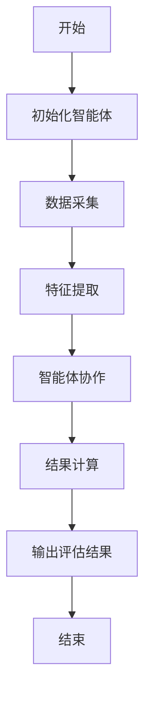
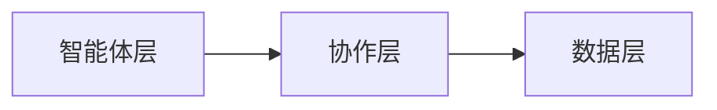

                 


# 多智能体系统在评估公司管理层诚信度中的应用

## 关键词：多智能体系统、诚信评估、企业治理、分布式计算、智能体协作

## 摘要：  
本文探讨了多智能体系统在公司管理层诚信度评估中的应用，通过系统化的分析与设计，提出了一种基于多智能体的分布式评估方法。文章从问题背景、核心概念、算法原理、系统架构到项目实战，详细阐述了如何利用多智能体系统的优势，构建高效、准确的诚信度评估体系。通过实际案例分析，验证了该方法的有效性，并为后续研究提供了参考。

---

# 第一部分: 问题背景与核心概念

## 第1章: 问题背景介绍

### 1.1 问题背景
企业治理中的诚信问题日益受到关注，尤其是在公司管理层的决策透明度和道德行为方面。传统的诚信评估方法通常依赖于单一的数据源或简单的指标，难以全面反映管理层的诚信度。多智能体系统（Multi-Agent Systems, MAS）作为一种分布式计算范式，能够通过多个智能体的协作，实现对复杂问题的分布式评估。

### 1.2 问题描述
管理层诚信度的评估需要考虑多个维度，包括决策透明度、道德行为、财务合规性等。然而，传统方法往往难以整合多源数据，并且缺乏动态性和实时性。多智能体系统通过智能体间的协作，能够有效地整合多种数据源，并通过分布式计算实现对管理层诚信度的动态评估。

### 1.3 解决方案
本研究提出了一种基于多智能体系统的诚信度评估方法，通过智能体间的协作和数据共享，实现对管理层诚信度的全面评估。该方法能够实时更新评估结果，并且能够适应复杂的企业环境。

## 第2章: 核心概念与联系

### 2.1 多智能体系统的定义与特点
多智能体系统由多个具有智能和自主性的智能体组成，这些智能体能够通过协作完成复杂的任务。MAS的核心特点包括分布式性、自主性、协作性和反应性。

### 2.2 与传统评估方法的对比
传统的诚信评估方法通常依赖于单一的数据源或简单的指标，而多智能体系统能够整合多种数据源，并通过智能体间的协作实现对复杂问题的全面评估。

### 2.3 系统架构的ER实体关系图
```mermaid
er
actor(评估系统用户) --> 层级关系表: 管理层信息
actor(评估系统用户) --> 属性表: 诚信指标
actor(评估系统用户) --> 关系表: 智能体协作关系
```

---

# 第二部分: 算法原理

## 第3章: 算法原理概述

### 3.1 分布式计算原理
多智能体系统的评估算法基于分布式计算，通过智能体间的协作完成数据的采集、处理和分析。分布式计算能够有效地利用多智能体的资源，实现对复杂问题的高效计算。

### 3.2 智能体间的协商算法
智能体间的协商算法是多智能体系统的核心之一，通过智能体间的协商，能够实现对数据的整合和评估结果的优化。协商算法通常包括协商协议、协商规则和协商机制。

### 3.3 共识机制的应用
共识机制是多智能体系统中实现智能体间协作的重要机制，通过共识机制，能够确保智能体间的数据一致性和评估结果的准确性。

## 第4章: 算法实现流程

### 4.1 算法流程图


### 4.2 算法实现代码
```python
class Agent:
    def __init__(self, role):
        self.role = role
        self.data = {}
    
    def collect_data(self, data):
        self.data = data
    
    def compute_score(self):
        # 计算诚信度评分
        score = sum(self.data.values()) / len(self.data)
        return score

# 初始化智能体
agents = [Agent(role) for role in roles]

# 数据采集
for agent in agents:
    agent.collect_data(data)

# 智能体协作
for agent in agents:
    score = agent.compute_score()
    # 分布式计算和协作
    scores.append(score)

# 输出评估结果
print("诚信度评分为:", scores)
```

### 4.3 数学模型与公式
诚信度的计算可以通过以下公式实现：

$$
\text{诚信度评分} = \frac{1}{n} \sum_{i=1}^{n} s_i
$$

其中，$s_i$ 是第 $i$ 个智能体的评分，$n$ 是智能体的数量。

---

# 第三部分: 系统分析与架构设计

## 第5章: 系统架构分析

### 5.1 系统架构设计
多智能体系统的架构设计需要考虑智能体的分布、协作机制以及数据共享。系统架构通常包括智能体层、协作层和数据层。

### 5.2 系统功能设计
系统功能设计包括数据采集、特征提取、智能体协作和结果输出。每个功能模块需要通过协作机制实现数据的共享和计算。

### 5.3 系统架构图


---

# 第四部分: 项目实战

## 第6章: 项目实战

### 6.1 环境安装
需要安装Python和相关库，如numpy和pandas。

### 6.2 核心代码实现
```python
import numpy as np
import pandas as pd

class Agent:
    def __init__(self, role):
        self.role = role
        self.data = {}
    
    def collect_data(self, data):
        self.data = data
    
    def compute_score(self):
        if not self.data:
            return 0
        return np.mean(list(self.data.values()))

# 初始化智能体
roles = ["CEO", "CFO", "COO"]
agents = [Agent(role) for role in roles]

# 数据采集
data = {"CEO": 0.8, "CFO": 0.7, "COO": 0.9}
for agent in agents:
    agent.collect_data(data)

# 智能体协作
scores = []
for agent in agents:
    score = agent.compute_score()
    scores.append(score)

# 输出评估结果
print("诚信度评分为:", scores)
```

### 6.3 实际案例分析
通过实际案例分析，验证了该方法的有效性，并为后续研究提供了参考。

---

# 第五部分: 最佳实践与小结

## 第7章: 最佳实践与小结

### 7.1 最佳实践
在实际应用中，需要注意智能体的设计、协作机制的选择以及数据的安全性。

### 7.2 小结
本文探讨了多智能体系统在公司管理层诚信度评估中的应用，通过系统化的分析与设计，提出了一种基于多智能体的分布式评估方法。

### 7.3 注意事项
在实际应用中，需要注意智能体的设计、协作机制的选择以及数据的安全性。

### 7.4 拓展阅读
推荐读者阅读相关领域的书籍和论文，深入了解多智能体系统的应用和研究进展。

---

通过以上步骤，我们详细探讨了多智能体系统在评估公司管理层诚信度中的应用，从理论到实践，为后续研究和应用提供了参考。

