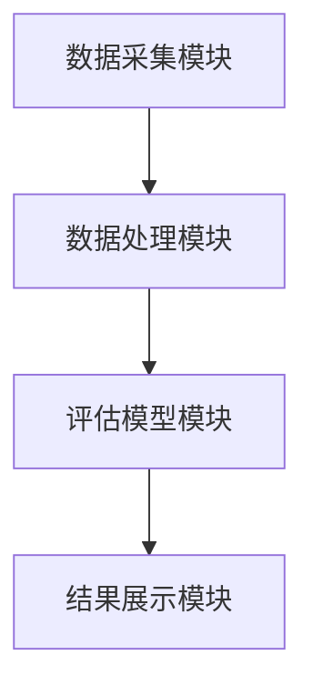

                 


# 多智能体系统在评估无形资产和品牌价值中的应用

## 关键词：多智能体系统，无形资产评估，品牌价值， MAS，智能体协作

## 摘要：  
本文探讨了多智能体系统（Multi-Agent Systems，MAS）在评估无形资产和品牌价值中的应用。通过分析MAS的核心概念、算法原理和系统架构，本文提出了一种基于MAS的评估方法，利用多个智能体协同工作，从多个数据源获取信息，提取特征，并构建评估模型。通过具体案例分析和系统实现，本文展示了MAS在无形资产评估中的优势和实际应用价值。

---

# 第一部分: 多智能体系统基础

## 第1章: 多智能体系统概述

### 1.1 多智能体系统的基本概念

#### 1.1.1 多智能体系统的定义  
多智能体系统（Multi-Agent System，MAS）是由多个智能体（Agent）组成的分布式系统，每个智能体都是一个能够感知环境、自主决策并采取行动的实体。智能体之间通过通信和协作，共同完成复杂任务。

#### 1.1.2 多智能体系统的特点  
- **分布式性**：智能体分布在网络中，独立运行。  
- **自主性**：每个智能体都有自主决策能力。  
- **协作性**：智能体之间通过通信和协作完成任务。  
- **反应性**：智能体能够实时感知环境变化并做出反应。  

#### 1.1.3 多智能体系统的分类  
- **基于任务的MAS**：根据任务需求动态分配智能体角色。  
- **基于角色的MAS**：智能体根据固定角色协同工作。  
- **基于行为的MAS**：智能体根据行为规则协作完成任务。  

### 1.2 多智能体系统的核心概念

#### 1.2.1 智能体的定义与属性  
智能体是一个能够感知环境、自主决策并采取行动的实体。其核心属性包括：  
- **感知能力**：通过传感器或数据源获取信息。  
- **决策能力**：基于感知信息做出决策。  
- **行动能力**：通过执行器或接口采取行动。  

#### 1.2.2 多智能体系统中的通信与协作  
智能体之间的通信是MAS的核心机制，主要通过以下方式实现：  
- **直接通信**：智能体之间通过消息传递进行通信。  
- **间接通信**：通过中间媒介（如共享数据库）进行通信。  

#### 1.2.3 多智能体系统的体系结构  
MAS的体系结构决定了智能体之间的协作方式，常见的体系结构包括：  
- **基于黑板模型的体系结构**：智能体共享一个公共黑板，通过竞争和协作完成任务。  
- **基于协调者的体系结构**：设置一个协调者智能体，负责任务分配和协调。  
- **基于层次结构的体系结构**：将智能体划分为不同层次，每个层次负责不同的任务。  

### 1.3 多智能体系统的应用场景

#### 1.3.1 多智能体系统在金融领域的应用  
- **股票交易**：多个智能体协同完成股票市场的实时交易和风险控制。  
- **信用评估**：通过MAS分析多个数据源，评估客户的信用风险。  

#### 1.3.2 多智能体系统在物流领域的应用  
- **货物调度**：智能体协同优化货物运输路径和时间。  
- **库存管理**：智能体实时监控库存状态，优化供应链管理。  

#### 1.3.3 多智能体系统在社交网络中的应用  
- **舆情分析**：智能体协同分析社交媒体上的用户评论，评估品牌声誉。  
- **信息传播**：智能体模拟信息在社交网络中的传播路径。  

### 1.4 本章小结  
本章介绍了多智能体系统的基本概念、核心概念和应用场景，为后续章节的分析奠定了基础。

---

# 第二部分: 无形资产评估与品牌价值评估的理论基础

## 第2章: 无形资产评估概述

### 2.1 无形资产的定义与分类

#### 2.1.1 无形资产的定义  
无形资产是指没有物理形态，但具有经济价值的资产，包括品牌、专利、商标、商誉等。  

#### 2.1.2 无形资产的分类  
- **品牌资产**：包括品牌知名度、品牌忠诚度等。  
- **专利资产**：包括发明专利、实用新型专利等。  
- **商誉资产**：企业整体价值中超出净资产的部分。  

#### 2.1.3 无形资产的特点  
- **无形性**：没有物理形态。  
- **价值波动性**：受市场环境影响较大。  
- **可测量性**：可以通过多种方法进行评估。  

### 2.2 品牌价值的定义与影响因素

#### 2.2.1 品牌价值的定义  
品牌价值是品牌在市场上的经济价值，反映了品牌在消费者心中的认知和信任程度。  

#### 2.2.2 品牌价值的影响因素  
- **品牌知名度**：品牌在市场上的认知度。  
- **品牌忠诚度**：消费者对品牌的偏好程度。  
- **品牌声誉**：品牌在市场上的信誉度。  
- **品牌创新能力**：品牌推出新产品的能力。  

#### 2.2.3 品牌价值的评估方法  
- **市场法**：通过市场交易数据进行评估。  
- **收益法**：通过未来收益预测进行评估。  
- **成本法**：通过品牌建设成本进行评估。  

### 2.3 传统无形资产评估方法

#### 2.3.1 市场法  
通过对比同类资产的市场交易价格，估算无形资产的价值。  

#### 2.3.2 收益法  
通过预测未来现金流，折现后估算无形资产的价值。  

#### 2.3.3 成本法  
通过估算无形资产的建设成本，确定其价值。  

### 2.4 本章小结  
本章介绍了无形资产的定义、分类和品牌价值的评估方法，为后续章节的应用奠定了理论基础。

---

# 第三部分: 多智能体系统在无形资产评估中的应用

## 第3章: 多智能体系统在数据收集与特征提取中的应用

### 3.1 数据收集与特征提取的背景介绍

#### 3.1.1 数据来源  
- **社交媒体数据**：用户评论、点赞、转发等。  
- **财务数据**：企业的财务报表数据。  
- **市场数据**：行业竞争情况、市场趋势等。  

#### 3.1.2 数据特征  
- **文本特征**：品牌声誉、用户情感等。  
- **数值特征**：销售额、利润等。  
- **时间特征**：市场变化趋势等。  

### 3.2 多智能体系统在数据收集中的应用

#### 3.2.1 智能体分工  
- **文本智能体**：负责收集和分析社交媒体数据。  
- **财务智能体**：负责收集和分析财务数据。  
- **市场智能体**：负责收集和分析市场数据。  

#### 3.2.2 数据共享与协作  
智能体之间通过共享数据，实现信息的协同分析。  

### 3.3 多智能体系统在特征提取中的应用

#### 3.3.1 文本特征提取  
- **情感分析**：通过自然语言处理技术，提取用户评论中的情感倾向。  
- **主题分析**：通过主题模型，提取评论中的主要主题。  

#### 3.3.2 数值特征提取  
- **销售预测**：通过时间序列分析，预测未来销售趋势。  
- **利润分析**：通过财务数据，分析企业的盈利能力。  

#### 3.3.3 特征整合  
智能体将提取的特征整合，形成综合评估指标。  

### 3.4 本章小结  
本章介绍了多智能体系统在数据收集和特征提取中的应用，为后续评估模型的构建奠定了基础。

## 第4章: 多智能体系统在评估模型构建中的应用

### 4.1 评估模型构建的背景介绍

#### 4.1.1 模型需求  
- **准确性**：评估结果需要准确反映品牌价值。  
- **实时性**：能够实时更新评估结果。  
- **可解释性**：模型结果需要具有可解释性。  

### 4.2 多智能体系统在模型构建中的应用

#### 4.2.1 模型分工  
- **文本智能体**：负责品牌声誉评估。  
- **财务智能体**：负责财务指标评估。  
- **市场智能体**：负责市场趋势评估。  

#### 4.2.2 模型协作  
智能体之间通过协作，综合多个评估结果，形成最终的品牌价值评估。  

### 4.3 评估模型的数学模型

#### 4.3.1 综合评估公式  
$$ V = \alpha \cdot V_{\text{文本}} + \beta \cdot V_{\text{财务}} + \gamma \cdot V_{\text{市场}} $$  
其中，$V$ 是综合品牌价值，$V_{\text{文本}}$、$V_{\text{财务}}$、$V_{\text{市场}}$ 分别是文本、财务和市场评估值，$\alpha$、$\beta$、$\gamma$ 是权重系数。  

#### 4.3.2 权重确定  
通过历史数据训练，确定各个特征的权重。  

### 4.4 本章小结  
本章介绍了多智能体系统在评估模型构建中的应用，提出了基于智能体协作的综合评估方法。

## 第5章: 多智能体系统在结果分析与优化中的应用

### 5.1 结果分析的背景介绍

#### 5.1.1 结果验证  
通过历史数据验证评估结果的准确性。  

#### 5.1.2 结果优化  
根据验证结果，优化评估模型的参数和权重。  

### 5.2 多智能体系统在结果优化中的应用

#### 5.2.1 参数优化  
通过智能体协作，优化评估模型的参数。  

#### 5.2.2 权重调整  
根据验证结果，动态调整各个特征的权重。  

### 5.3 优化结果分析

#### 5.3.1 精度提升  
通过优化，提高评估结果的准确性。  

#### 5.3.2 实时更新  
智能体实时更新评估结果，适应市场变化。  

### 5.4 本章小结  
本章介绍了多智能体系统在结果分析与优化中的应用，提出了动态优化的评估方法。

---

# 第四部分: 系统架构与实现

## 第6章: 系统架构设计

### 6.1 系统功能设计

#### 6.1.1 数据采集模块  
负责从多个数据源采集数据。  

#### 6.1.2 数据处理模块  
对采集的数据进行预处理和特征提取。  

#### 6.1.3 评估模型模块  
基于智能体协作，构建评估模型并进行预测。  

#### 6.1.4 结果展示模块  
将评估结果以可视化方式展示。  

### 6.2 系统架构设计

#### 6.2.1 系统架构图  


#### 6.2.2 系统交互图  
```mermaid
sequenceDiagram
    智能体协作
    participant 文本智能体
    participant 财务智能体
    participant 市场智能体
    文本智能体->财务智能体: 通信协作
    财务智能体->市场智能体: 通信协作
    文本智能体->市场智能体: 通信协作
```

### 6.3 系统接口设计

#### 6.3.1 数据接口  
- **输入接口**：接收来自数据源的数据。  
- **输出接口**：输出处理后的数据。  

#### 6.3.2 模型接口  
- **输入接口**：接收特征数据。  
- **输出接口**：输出评估结果。  

### 6.4 本章小结  
本章介绍了系统架构设计，包括功能设计、架构图和交互图。

---

# 第五部分: 项目实战与总结

## 第7章: 项目实战

### 7.1 项目背景

#### 7.1.1 项目目标  
评估某品牌的价值，验证MAS在无形资产评估中的应用。  

#### 7.1.2 数据来源  
- 社交媒体数据：用户评论、点赞、转发。  
- 财务数据：销售额、利润、成本。  
- 市场数据：行业竞争情况、市场趋势。  

### 7.2 项目实施

#### 7.2.1 环境安装  
- **编程语言**：Python 3.8+  
- **库依赖**：Numpy、Pandas、Scikit-learn、Gensim  

#### 7.2.2 核心实现代码  
```python
class Agent:
    def __init__(self, name):
        self.name = name
        self.data = {}

    def receive_message(self, message):
        # 处理接收到的消息
        pass

    def send_message(self, message, recipient):
        # 发送消息给其他智能体
        pass

# 文本智能体实现
class TextAgent(Agent):
    def __init__(self, name):
        super().__init__(name)
        self.model = TextAnalyzer()

    def analyze_text(self, text):
        # 分析文本并返回情感倾向
        return self.model.analyze(text)

# 财务智能体实现
class FinanceAgent(Agent):
    def __init__(self, name):
        super().__init__(name)
        self.model = FinancialAnalyzer()

    def analyze_financial(self, data):
        # 分析财务数据并返回评估结果
        return self.model.analyze(data)

# 市场智能体实现
class MarketAgent(Agent):
    def __init__(self, name):
        super().__init__(name)
        self.model = MarketAnalyzer()

    def analyze_market(self, data):
        # 分析市场数据并返回评估结果
        return self.model.analyze(data)

# 协调者智能体实现
class Coordinator(Agent):
    def __init__(self, name):
        super().__init__(name)
        self.agents = []

    def register_agent(self, agent):
        self.agents.append(agent)

    def coordinate(self, task):
        # 协调各个智能体完成任务
        pass
```

#### 7.2.3 数据分析与结果展示  
通过智能体协作，完成数据的分析和结果的展示。  

### 7.3 项目总结

#### 7.3.1 项目成果  
- 成功实现MAS在无形资产评估中的应用。  
- 提出了基于智能体协作的评估方法。  

#### 7.3.2 项目启示  
MAS在无形资产评估中的应用前景广阔，能够显著提高评估的准确性和效率。  

### 7.4 本章小结  
本章通过具体案例展示了MAS在无形资产评估中的实际应用，验证了方法的有效性。

---

# 第六部分: 总结与展望

## 第8章: 总结与展望

### 8.1 总结

#### 8.1.1 MAS在无形资产评估中的优势  
- 高效性：多个智能体协同工作，提高评估效率。  
- 准确性：通过多源数据分析，提高评估结果的准确性。  
- 适应性：能够实时更新评估结果，适应市场变化。  

### 8.2 未来展望

#### 8.2.1 技术优化方向  
- 提高智能体的协作效率。  
- 增强智能体的自主性和智能性。  

#### 8.2.2 应用拓展方向  
- 在更多领域中应用MAS进行无形资产评估。  
- 结合大数据和人工智能技术，进一步提升评估能力。  

### 8.3 本章小结  
本章总结了MAS在无形资产评估中的优势，并展望了未来的发展方向。

---

# 附录

## 附录A: 相关技术术语解释

## 附录B: 系统实现代码

---

# 参考文献

---

通过以上目录和内容的规划，我们可以系统地分析和实现多智能体系统在无形资产评估中的应用。希望这篇文章能够为读者提供清晰的思路和实际的操作指南。

