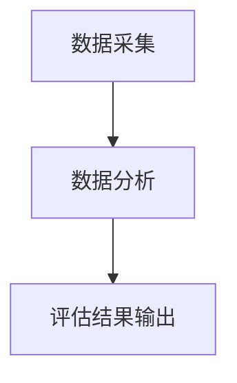
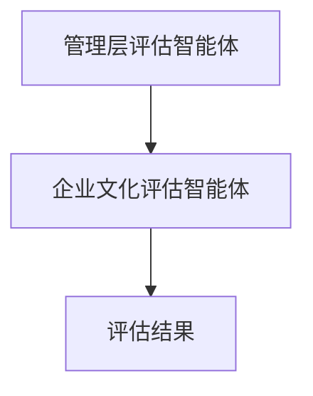

                 


# 多智能体系统在评估管理层质量和公司文化中的应用

> 关键词：多智能体系统（MAS）、管理层质量评估、企业文化评估、分布式计算、博弈论模型、系统架构设计

> 摘要：本文探讨了多智能体系统（MAS）在企业管理中的应用，特别是在评估管理层质量和公司文化方面的创新方法。通过分析MAS的核心概念、算法原理、系统架构设计以及实际案例，本文为读者提供了从理论到实践的全面指导，展示了如何利用MAS技术提升企业管理的科学性和效率。

---

# 第一部分：多智能体系统与企业管理概述

---

# 第1章：多智能体系统（MAS）概述

## 1.1 多智能体系统的基本概念

### 1.1.1 多智能体系统的定义

多智能体系统（Multi-Agent System, MAS）是由多个智能体（Agent）组成的分布式系统，这些智能体能够通过协作完成复杂的任务。智能体是具有感知、推理、决策和行动能力的实体，可以是软件程序、机器人或其他智能系统。

$$
\text{MAS} = \{\text{Agent}_1, \text{Agent}_2, \ldots, \text{Agent}_n\}
$$

### 1.1.2 多智能体系统的特征

| 特征                | 描述                                   |
|---------------------|--------------------------------------|
| 分布式性             | 智能体分布在不同的位置，独立运行       |
| 协作性               | 智能体通过协作完成共同目标             |
| 反应性               | 能够实时感知环境并做出响应             |
| 自主性               | 智能体具有自主决策的能力               |

### 1.1.3 多智能体系统的分类

1. **基于智能体的智能性**：
   - 单智能体系统
   - 多智能体系统
2. **基于任务的协作性**：
   - 协作式多智能体系统
   - 对抗式多智能体系统

## 1.2 多智能体系统在企业管理中的应用背景

### 1.2.1 传统企业管理模式的局限性

传统的企业管理模式依赖于层级制和主观评估，存在以下问题：
- **信息孤岛**：部门间缺乏有效沟通，数据难以共享。
- **决策延迟**：决策过程依赖于高层，反应速度慢。
- **评估主观性**：管理层质量评估依赖于主观判断，缺乏客观依据。

### 1.2.2 多智能体系统在现代企业管理中的优势

- **实时协作**：智能体可以实时协作，快速响应企业需求。
- **数据驱动**：通过多智能体系统的数据共享，提升决策的客观性。
- **动态适应**：智能体能够根据环境变化自主调整行为。

### 1.2.3 企业文化和管理层质量评估的复杂性

企业文化和管理层质量评估涉及多个维度：
- **管理层能力**：决策能力、领导力、执行力。
- **企业文化**：企业价值观、企业氛围、员工凝聚力。

## 1.3 本书的研究目标与意义

### 1.3.1 研究目标

- 探讨MAS在企业管理中的应用。
- 提出基于MAS的管理层质量评估和企业文化评估方法。

### 1.3.2 研究意义

- 提升企业管理的科学性和效率。
- 为企业文化建设和管理层优化提供新思路。

### 1.3.3 本书的结构安排

- 第一部分：MAS的基本概念与应用背景。
- 第二部分：MAS的核心概念与模型。
- 第三部分：MAS在管理层质量评估中的算法原理。
- 第四部分：MAS在企业文化评估中的系统架构设计。
- 第五部分：项目实战与案例分析。
- 第六部分：总结与展望。

---

# 第2章：多智能体系统的核心概念与模型

## 2.1 多智能体系统的构成要素

### 2.1.1 智能体的定义与特征

智能体（Agent）是具有以下特征的实体：
- **自主性**：能够自主决策。
- **反应性**：能够感知环境并做出反应。
- **协作性**：能够与其他智能体协作。

### 2.1.2 智能体的分类

| 类型       | 描述                                       |
|------------|------------------------------------------|
| 单智能体    | 单个智能体独立运行                         |
| 多智能体    | 多个智能体协作完成任务                     |
| 协作式智能体 | 智能体之间协作完成共同目标                 |
| 对抗式智能体 | 智能体之间存在竞争关系                   |

### 2.1.3 智能体之间的关系

- **协作关系**：智能体之间通过协作完成任务。
- **竞争关系**：智能体之间通过竞争优化结果。
- **中立关系**：智能体之间无直接关系。

## 2.2 多智能体系统的模型构建

### 2.2.1 多智能体系统的建模方法

1. **基于角色的建模**：
   - 定义智能体的角色和职责。
   - 通过角色分配任务。
2. **基于规则的建模**：
   - 定义智能体的行为规则。
   - 通过规则驱动智能体行为。

### 2.2.2 多智能体系统的动态模型

$$
\text{动态模型} = \{\text{状态}, \text{行为}, \text{转换规则}\}
$$

### 2.2.3 多智能体系统的评价指标

| 指标         | 描述                                       |
|--------------|------------------------------------------|
| 系统效率     | 系统完成任务的效率                         |
| 系统稳定性   | 系统运行的稳定性                           |
| 系统可扩展性 | 系统扩展的难易程度                         |

## 2.3 多智能体系统与企业文化的关联

### 2.3.1 企业文化的核心要素

- **企业价值观**：企业的核心价值观。
- **企业氛围**：企业的组织氛围。
- **员工凝聚力**：员工的团队凝聚力。

### 2.3.2 多智能体系统如何反映企业文化

- 通过智能体的协作行为反映企业文化的协作性。
- 通过智能体的决策过程反映企业的决策文化。

### 2.3.3 多智能体系统如何影响企业文化

- 通过智能体的协作优化企业文化。
- 通过智能体的动态行为影响企业的组织氛围。

---

# 第3章：多智能体系统在管理层质量评估中的算法原理

## 3.1 分布式计算与多智能体协作

### 3.1.1 分布式计算的基本原理

- 分布式计算将任务分解为多个子任务，分别在不同的计算节点上执行。

### 3.1.2 多智能体协作的实现机制

- **任务分配**：智能体根据自身能力分配任务。
- **信息共享**：智能体之间共享信息。
- **协作决策**：智能体基于共享信息做出决策。

### 3.1.3 分布式计算在管理层评估中的应用

- **任务分解**：将管理层评估任务分解为多个子任务。
- **信息共享**：智能体之间共享管理层评估数据。
- **协作决策**：智能体基于共享数据做出评估决策。

## 3.2 多智能体系统中的博弈论模型

### 3.2.1 博弈论的基本概念

- **博弈**：两个或多个参与者之间的互动。
- **策略**：参与者在博弈中的行为选择。
- **收益**：参与者在博弈中的收益。

### 3.2.2 多智能体系统中的博弈模型

- **纳什均衡**：所有参与者都采取最优策略的状态。
- **帕累托最优**：所有参与者都无法通过单方面改变策略而获得更大收益的状态。

### 3.2.3 博弈论在管理层评估中的应用

- **管理层博弈**：管理层之间的博弈反映了管理决策的过程。
- **博弈模型构建**：构建博弈模型用于分析管理层决策。

## 3.3 基于多智能体的评分算法

### 3.3.1 算法的基本思路

1. **任务分解**：将管理层评估任务分解为多个子任务。
2. **信息共享**：智能体之间共享评估信息。
3. **协作决策**：智能体基于共享信息做出评估决策。

### 3.3.2 算法的实现步骤

1. **初始化**：初始化智能体及其任务。
2. **信息共享**：智能体之间共享信息。
3. **决策计算**：智能体基于共享信息做出决策。
4. **结果输出**：输出评估结果。

### 3.3.3 算法的优缺点分析

- **优点**：
  - 提高评估的客观性。
  - 提高评估的效率。
- **缺点**：
  - 实施成本高。
  - 算法复杂性高。

---

# 第4章：多智能体系统在企业文化评估中的系统架构设计

## 4.1 系统功能设计

### 4.1.1 企业文化评估系统功能

1. **数据采集**：采集企业文化数据。
2. **数据分析**：分析企业文化数据。
3. **评估结果输出**：输出企业文化评估结果。

### 4.1.2 系统功能流程图



## 4.2 系统架构设计

### 4.2.1 系统架构图



### 4.2.2 系统接口设计

1. **智能体接口**：智能体之间的通信接口。
2. **用户接口**：用户与系统的交互接口。

### 4.2.3 系统交互序列图

```mermaid
sequenceDiagram
    actor 用户
    agent 智能体1
    agent 智能体2
    用户 -> 智能体1: 发送任务
    智能体1 -> 智能体2: 信息共享
    智能体2 -> 用户: 输出结果
```

---

# 第5章：项目实战与案例分析

## 5.1 项目背景介绍

### 5.1.1 项目目标

- 实现基于MAS的企业文化评估系统。

### 5.1.2 项目需求

- 数据采集模块。
- 数据分析模块。
- 评估结果输出模块。

## 5.2 核心代码实现

### 5.2.1 环境安装

- 安装Python和相关库（如numpy、pandas）。

### 5.2.2 核心代码

```python
class Agent:
    def __init__(self, id):
        self.id = id
        self.data = {}
    
    def collect_data(self, task):
        self.data[task] = self.analyze_data(task)
    
    def analyze_data(self, task):
        # 数据分析逻辑
        return 1
    
    def share_data(self, agent):
        agent.data[self.id] = self.data.copy()
```

### 5.2.3 代码解读

- `Agent`类：智能体类，包含数据采集、数据分析和数据共享方法。
- `collect_data`方法：采集数据。
- `analyze_data`方法：分析数据。
- `share_data`方法：共享数据。

## 5.3 实际案例分析

### 5.3.1 案例背景

- 某公司管理层评估项目。

### 5.3.2 案例分析

- 数据采集：采集管理层数据。
- 数据分析：分析管理层数据。
- 评估结果输出：输出评估结果。

### 5.3.3 案例总结

- 通过MAS技术，提升了企业管理层评估的效率和准确性。

---

# 第6章：总结与展望

## 6.1 最佳实践 tips

- **数据质量**：确保数据的准确性和完整性。
- **算法优化**：优化算法提高评估效率。
- **系统维护**：定期维护系统确保其正常运行。

## 6.2 小结

- 本文探讨了MAS在企业管理中的应用。
- 提出了基于MAS的管理层质量和企业文化评估方法。

## 6.3 注意事项

- 企业实施MAS技术需要充分考虑数据安全和隐私保护。

## 6.4 拓展阅读

- 《Multi-Agent Systems: Complexity and Cognitive Architectures》
- 《Game Theory and Business Strategy》

---

通过以上内容，我们详细探讨了多智能体系统在企业管理中的应用，特别是在评估管理层质量和公司文化方面的创新方法。希望本文能为读者提供从理论到实践的全面指导，帮助企业在管理实践中更好地应用MAS技术。

