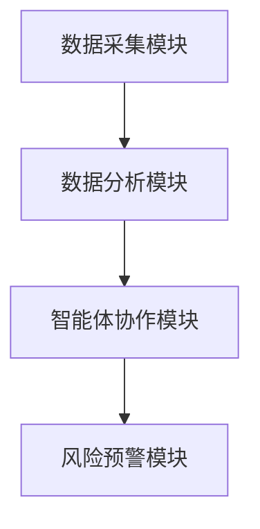

                 

<think>
好的，我将按照您的要求撰写一篇关于《多智能体系统在识别价值陷阱中的应用：防范投资风险》的技术博客文章。首先，我会先分析和理解相关概念，然后逐步展开内容。

---

# 多智能体系统在识别价值陷阱中的应用：防范投资风险

## 关键词：多智能体系统、价值陷阱、投资风险、人工智能、金融分析

## 摘要：
本文探讨了多智能体系统在识别价值陷阱中的应用，分析了多智能体系统的基本原理及其在投资风险管理中的优势。文章从理论基础、算法实现到实际应用，详细阐述了如何利用多智能体系统来提高投资决策的准确性，帮助投资者防范价值陷阱带来的风险。

---

# 第一部分: 多智能体系统与价值陷阱识别基础

## 第1章: 多智能体系统与价值陷阱概述

### 1.1 多智能体系统的基本概念
#### 1.1.1 多智能体系统的定义与特点
多智能体系统（Multi-Agent System, MAS）由多个智能体（Agent）组成，这些智能体通过协作和竞争完成复杂的任务。其特点包括：
- **分布性**：智能体独立决策，无中心化控制。
- **协作性**：智能体之间通过信息共享和协同完成目标。
- **动态性**：系统环境和智能体状态动态变化。
- **自主性**：每个智能体都能自主感知环境并做出决策。

#### 1.1.2 多智能体系统的核心要素
- **智能体**：具有感知、决策、行动能力的实体。
- **环境**：智能体所处的外部环境，包括数据源和交互对象。
- **通信机制**：智能体之间交换信息的方式。
- **协作协议**：定义智能体之间的合作规则。

#### 1.1.3 多智能体系统与传统单智能体系统的区别
| 属性 | 单智能体系统 | 多智能体系统 |
|------|--------------|--------------|
| 结构  | 单一控制中心 | 分布式结构    |
| 智能  | 集中决策     | 分散决策     |
| 灵活性 | 较低         | 较高         |

### 1.2 价值陷阱的定义与特征
#### 1.2.1 价值陷阱的定义
价值陷阱是指某些股票或资产表面上看似具有投资价值，但实际上存在隐藏的问题或风险，导致其实际价值远低于表观价值。

#### 1.2.2 价值陷阱的主要特征
- **表观低估值**：市盈率、市净率等指标显示低估值。
- **隐藏风险**：如财务造假、行业衰退等。
- **短期波动**：价格波动剧烈，容易误导投资者。

#### 1.2.3 价值陷阱在投资中的表现形式
- **虚假盈利**：公司通过会计造假虚增利润。
- **行业周期性**：行业处于衰退期，但公司仍维持高估值。
- **管理层问题**：管理层内部问题导致公司价值下降。

### 1.3 多智能体系统在投资中的应用前景
#### 1.3.1 多智能体系统在金融领域的优势
- **分布式计算能力**：能够处理海量金融数据。
- **协作能力**：多个智能体可以从不同角度分析问题。
- **动态适应性**：能够快速适应市场变化。

#### 1.3.2 多智能体系统在识别价值陷阱中的潜力
- **多维度分析**：多个智能体分别从财务、行业、市场等角度分析。
- **信息共享**：智能体之间共享信息，提高分析准确性。
- **风险预警**：通过协同工作，提前发现潜在风险。

#### 1.3.3 多智能体系统投资应用的挑战与机遇
- **挑战**：智能体之间的协调难度大，数据隐私问题。
- **机遇**：提高投资决策的准确性和效率。

---

## 第2章: 多智能体系统的核心原理

### 2.1 多智能体系统的组成与功能
#### 2.1.1 智能体的定义与分类
- **智能体类型**：根据功能分为感知型、决策型、执行型。
- **功能分类**：分为数据采集智能体、分析智能体、预警智能体等。

#### 2.1.2 多智能体系统的组成结构
- **感知层**：负责数据的采集和初步处理。
- **决策层**：基于感知数据进行分析和决策。
- **执行层**：根据决策结果采取行动。

#### 2.1.3 智能体之间的交互机制
- **信息共享**：通过通信模块共享数据。
- **任务分配**：智能体之间动态分配任务。
- **协同决策**：通过协商达成一致决策。

### 2.2 多智能体系统的协同机制
#### 2.2.1 协作与竞争关系
- **协作**：智能体之间互相帮助，共同完成任务。
- **竞争**：智能体之间竞争资源，提高整体效率。

#### 2.2.2 信息共享与决策协调
- **信息共享**：智能体之间通过通信模块共享数据。
- **决策协调**：通过协商机制达成一致决策。

#### 2.2.3 多智能体系统中的任务分配
- **任务分解**：将整体任务分解为多个子任务。
- **任务分配**：根据智能体的能力分配任务。

### 2.3 多智能体系统与价值陷阱识别的关系
#### 2.3.1 价值陷阱识别的核心要素
- **财务数据**：如收入、利润、资产负债表等。
- **市场数据**：如股价、成交量、市场情绪等。
- **行业数据**：如行业趋势、竞争环境等。

#### 2.3.2 多智能体系统在价值陷阱识别中的作用
- **多维度分析**：从财务、市场、行业等多个角度分析。
- **实时监控**：持续监控市场变化，及时发现风险。
- **协同分析**：智能体之间协同工作，提高分析效率。

#### 2.3.3 多智能体系统与传统投资分析方法的对比
| 方法 | 传统投资分析 | 多智能体系统 |
|------|---------------|--------------|
| 数据源 | 单一数据源     | 多数据源     |
| 分析维度 | 较少         | 多维         |
| 决策效率 | 较低         | 较高         |

---

## 第3章: 多智能体系统在价值陷阱识别中的算法原理

### 3.1 多智能体系统中的典型算法
#### 3.1.1 分散式算法
- **特点**：每个智能体独立运行，无需中央控制。
- **应用场景**：适合分布式数据处理和实时分析。

#### 3.1.2 集中式算法
- **特点**：所有智能体的信息汇总到中央节点进行处理。
- **应用场景**：适合需要全局优化的场景。

#### 3.1.3 混合式算法
- **特点**：结合分散式和集中式算法的优点。
- **应用场景**：复杂任务的分布式协作。

### 3.2 价值陷阱识别的算法选择
#### 3.2.1 基于多智能体的分类算法
- **K近邻算法（K-Nearest Neighbor, KNN）**：用于分类市场数据。
- **支持向量机（Support Vector Machine, SVM）**：用于分类财务数据。

#### 3.2.2 基于多智能体的回归算法
- **线性回归（Linear Regression）**：用于预测股价走势。
- **随机森林（Random Forest）**：用于预测市场风险。

#### 3.2.3 基于多智能体的聚类算法
- **K均值聚类（K-Means Clustering）**：用于识别市场中的相似股票。

### 3.3 多智能体系统算法的实现流程
#### 3.3.1 数据采集与预处理
- **数据源**：包括财务报表、市场数据、行业报告等。
- **数据清洗**：去除无效数据，填充缺失值。

#### 3.3.2 算法选择与参数设置
- **选择算法**：根据任务需求选择合适的算法。
- **参数调优**：通过实验调整算法参数，提高准确率。

#### 3.3.3 算法实现与结果分析
- **实现代码**：编写Python代码实现算法。
- **结果分析**：通过混淆矩阵、准确率等指标评估算法性能。

---

## 第4章: 多智能体系统在价值陷阱识别中的系统架构

### 4.1 系统功能模块划分
#### 4.1.1 数据采集模块
- **功能**：从多种数据源采集数据，如金融数据库、新闻网站等。
- **实现**：使用API接口获取实时数据。

#### 4.1.2 数据分析模块
- **功能**：对采集到的数据进行分析，识别价值陷阱。
- **实现**：使用机器学习算法进行预测和分类。

### 4.2 系统架构设计
#### 4.2.1 系统架构图


#### 4.2.2 智能体协作模块
- **功能**：协调多个智能体之间的协作和通信。
- **实现**：使用消息队列（如Kafka）进行异步通信。

### 4.3 系统接口设计
#### 4.3.1 API接口
- **输入**：投资者提供的股票代码。
- **输出**：价值陷阱识别结果，如风险评分、预警信息等。

#### 4.3.2 交互流程
1. 用户输入股票代码。
2. 数据采集模块获取相关数据。
3. 数据分析模块进行分析。
4. 智能体协作模块协调多个算法。
5. 系统输出识别结果。

---

## 第5章: 项目实战

### 5.1 环境安装
- **Python版本**：Python 3.8以上。
- **依赖库安装**：使用pip安装numpy、pandas、scikit-learn等库。

### 5.2 核心实现代码
```python
import numpy as np
from sklearn import svm
from sklearn.neighbors import KNeighborsClassifier

# 数据采集模块
class DataCollector:
    def collect_data(self):
        # 从数据库或API获取数据
        return np.random.rand(100, 10)

# 数据分析模块
class ValueTrapAnalyzer:
    def analyze(self, data):
        # 使用SVM进行分类
        clf = svm.SVC()
        clf.fit(data[:, :5], data[:, 5])
        return clf.predict(data[:, :5])

# 多智能体协作模块
class MultiAgentCoordinator:
    def coordinate_agents(self, agents):
        # 协调多个智能体
        results = []
        for agent in agents:
            results.append(agent.analyze(data))
        return results

# 使用示例
data_collector = DataCollector()
data = data_collector.collect_data()
analyzer = ValueTrapAnalyzer()
result = analyzer.analyze(data)
print(result)
```

### 5.3 案例分析
#### 5.3.1 案例背景
假设我们有一个包含100只股票的数据集，目标是识别其中的价值陷阱。

#### 5.3.2 实现步骤
1. 数据采集模块获取股票数据。
2. 数据分析模块使用SVM进行分类。
3. 多智能体协作模块协调多个算法进行分析。
4. 输出识别结果。

#### 5.3.3 结果分析
通过混淆矩阵和准确率评估算法性能，优化参数以提高识别准确率。

---

## 第6章: 总结与展望

### 6.1 总结
本文详细探讨了多智能体系统在识别价值陷阱中的应用，从理论基础到算法实现，再到系统设计，全面分析了多智能体系统的优势和挑战。

### 6.2 展望
未来，随着人工智能技术的不断发展，多智能体系统在金融领域的应用将更加广泛。可以通过以下方式进一步优化：
- **算法优化**：研究更高效的多智能体算法。
- **数据源扩展**：引入更多数据源，如社交媒体数据。
- **系统集成**：将多智能体系统与其他金融工具结合使用。

---

以上是整篇文章的目录和内容概要，您可以根据需要进一步扩展每个部分的具体内容。

