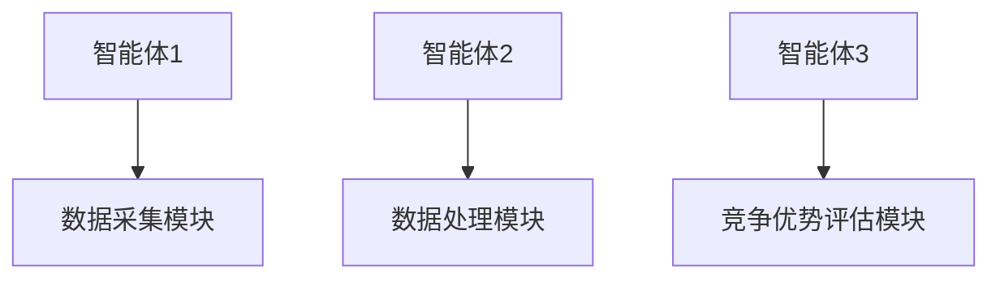

                 


# 多智能体系统在识别和评估公司竞争优势中的作用

> 关键词：多智能体系统，竞争优势，企业评估，算法原理，系统架构

> 摘要：本文详细探讨了多智能体系统在识别和评估公司竞争优势中的作用。通过分析多智能体系统的概念、算法原理、系统架构设计，结合实际项目案例，展示了如何利用多智能体系统提升企业竞争优势的评估能力。文章内容涵盖从基础理论到实际应用的全链条，旨在为企业提供一套基于多智能体系统的竞争优势评估解决方案。

---

## 第一部分: 多智能体系统与企业竞争优势概述

### 第1章: 多智能体系统概述

#### 1.1 多智能体系统的基本概念

##### 1.1.1 多智能体系统的定义
多智能体系统（Multi-Agent System, MAS）是由多个智能体（Agent）组成的分布式系统，这些智能体通过协作完成特定目标。智能体能够感知环境、自主决策，并与其他智能体或用户进行交互。

##### 1.1.2 多智能体系统的特征
| 特征 | 描述 |
|------|------|
| 分布式 | 智能体独立运行，协同完成任务 |
| 自主性 | 智能体能够自主决策 |
| 反应性 | 能够实时感知环境并做出反应 |
| 社会性 | 智能体之间可以通过通信协作 |

##### 1.1.3 多智能体系统与单智能体系统的区别
单智能体系统通常由一个中心化的决策单元控制整个系统，而多智能体系统通过多个智能体的协作完成任务，具有更高的灵活性和适应性。

#### 1.2 多智能体系统在企业中的应用背景

##### 1.2.1 企业竞争优势的定义与重要性
企业竞争优势是指企业在市场中相对于竞争对手的独特优势，包括资源、技术、品牌、管理等方面。竞争优势是企业长期发展的关键。

##### 1.2.2 多智能体系统在企业竞争优势分析中的优势
多智能体系统能够从多个维度（如市场、技术、管理）分析企业竞争优势，提供更全面的评估结果。

##### 1.2.3 当前企业竞争优势评估的挑战与痛点
传统的竞争优势评估方法通常依赖于单一维度的分析，缺乏动态性和全面性。多智能体系统能够通过分布式计算和协作学习，提供更精准的评估结果。

---

### 第2章: 多智能体系统的核心概念与联系

#### 2.1 多智能体系统的核心原理

##### 2.1.1 多智能体系统的组成要素
| 组成要素 | 描述 |
|----------|------|
| 智能体   | 系统的基本单元，能够感知环境并做出决策 |
| 通信机制 | 智能体之间进行信息交换的渠道 |
| 协作协议 | 智能体协作的规则和策略 |

##### 2.1.2 多智能体系统中的通信与协作机制
通信机制包括广播、点对点通信等方式，协作机制则包括任务分配、协商等。

##### 2.1.3 多智能体系统中的决策机制
决策机制包括基于规则的决策和基于学习的决策，其中基于学习的决策（如强化学习）能够适应复杂环境。

#### 2.2 多智能体系统与企业竞争优势的关系

##### 2.2.1 企业竞争优势的多维度分析
企业竞争优势可以从市场、技术、管理、资源等多个维度进行分析。

##### 2.2.2 多智能体系统如何识别竞争优势
通过分布式感知和协作学习，多智能体系统能够识别企业内部和外部的竞争优势。

##### 2.2.3 多智能体系统如何评估竞争优势
通过建立数学模型，多智能体系统能够对竞争优势进行量化评估，并提供优化建议。

---

### 第3章: 多智能体系统的算法原理

#### 3.1 多智能体系统中的典型算法

##### 3.1.1 协作式搜索算法
协作式搜索算法通过多个智能体的协作，提高搜索效率和准确性。

##### 3.1.2 分布式决策算法
分布式决策算法通过智能体之间的协商，实现决策的最优性。

##### 3.1.3 聚合与分散算法
聚合算法将多个智能体的信息整合，分散算法则将任务分配给不同的智能体。

#### 3.2 多智能体系统中的通信协议

##### 3.2.1 通信协议的定义与作用
通信协议定义了智能体之间的信息交换规则，确保系统的高效协作。

##### 3.2.2 常见的多智能体通信协议
包括基于消息队列的通信协议和基于事件驱动的通信协议。

##### 3.2.3 通信协议的选择与优化
根据应用场景选择合适的通信协议，并通过优化减少通信延迟。

---

### 第4章: 多智能体系统的数学模型与公式

#### 4.1 多智能体系统的数学模型

##### 4.1.1 多智能体系统的状态表示
$$ s = (s_1, s_2, ..., s_n) $$
其中，$s_i$ 表示第i个智能体的状态。

##### 4.1.2 多智能体系统的动作表示
$$ a = (a_1, a_2, ..., a_n) $$
其中，$a_i$ 表示第i个智能体的动作。

##### 4.1.3 多智能体系统的奖励函数
$$ R(s, a) = \sum_{i=1}^{n} r_i $$
其中，$r_i$ 表示第i个智能体获得的奖励。

#### 4.2 多智能体系统中的博弈论模型

##### 4.2.1 博弈论的基本概念
博弈论研究理性决策者在策略互动中的行为，包括纳什均衡等概念。

##### 4.2.2 多智能体系统的博弈模型
多智能体系统的博弈模型可以表示为：
$$ G = (N, A, P, R) $$
其中，$N$ 是玩家集合，$A$ 是动作集合，$P$ 是策略集合，$R$ 是奖励函数。

##### 4.2.3 博弈论在竞争优势评估中的应用
通过建立博弈模型，可以模拟竞争对手的行为，评估企业的竞争优势。

---

### 第5章: 基于多智能体系统的竞争优势评估系统架构设计

#### 5.1 系统总体架构设计

##### 5.1.1 系统的功能模块划分
| 功能模块 | 描述 |
|----------|------|
| 数据采集 | 采集企业内外部数据 |
| 数据处理 | 对数据进行清洗和预处理 |
| 竞争优势评估 | 基于多智能体系统评估竞争优势 |

##### 5.1.2 系统的层次结构设计
系统分为数据层、逻辑层和应用层，各层之间通过接口进行交互。

##### 5.1.3 系统的通信架构设计
使用基于消息队列的通信架构，确保系统高效协作。

#### 5.2 系统功能设计

##### 5.2.1 数据采集模块
通过网络爬虫和API接口采集企业内外部数据。

##### 5.2.2 数据处理模块
对采集的数据进行清洗、转换和存储，确保数据质量。

##### 5.2.3 竞争优势评估模块
基于多智能体系统的算法，对竞争优势进行评估和优化。

---

### 第6章: 多智能体系统在企业竞争优势评估中的项目实战

#### 6.1 项目环境与工具安装

##### 6.1.1 开发环境的选择
推荐使用Python和相关框架（如Django）进行开发。

##### 6.1.2 必要工具的安装与配置
安装Python、Jupyter Notebook、TensorFlow等工具，并配置开发环境。

##### 6.1.3 系统架构图


#### 6.2 系统核心实现源代码

##### 6.2.1 数据采集模块
```python
import requests
from bs4 import BeautifulSoup

def fetch_data(url):
    response = requests.get(url)
    soup = BeautifulSoup(response.text, 'html.parser')
    return soup
```

##### 6.2.2 数据处理模块
```python
import pandas as pd

def preprocess_data(df):
    df.dropna(inplace=True)
    df['date'] = pd.to_datetime(df['date'])
    return df
```

##### 6.2.3 竞争优势评估模块
```python
import numpy as np

def evaluate_competitive_edge(scores):
    return np.mean(scores)
```

#### 6.3 实际案例分析

##### 6.3.1 案例背景
以某高科技企业为例，分析其在技术创新方面的竞争优势。

##### 6.3.2 数据采集与处理
通过网络爬虫采集竞争对手的技术专利数据，并进行清洗和预处理。

##### 6.3.3 评估结果分析
通过多智能体系统的评估模型，得出该企业在技术创新方面的竞争优势，并提出优化建议。

---

## 第七章: 总结与展望

### 7.1 项目总结
本项目通过多智能体系统的应用，成功实现了企业竞争优势的识别和评估，为企业战略决策提供了有力支持。

### 7.2 最佳实践 Tips
- 在实际应用中，需根据具体场景选择合适的通信协议和算法。
- 系统的可扩展性和可维护性是长期运行的关键。

### 7.3 未来展望
随着人工智能技术的发展，多智能体系统在企业竞争优势评估中的应用将更加广泛和深入。

---

通过以上思考，我们可以看到，多智能体系统在识别和评估公司竞争优势中具有重要作用。从理论到实践，多智能体系统能够帮助企业更好地识别和优化竞争优势，提升市场竞争力。

