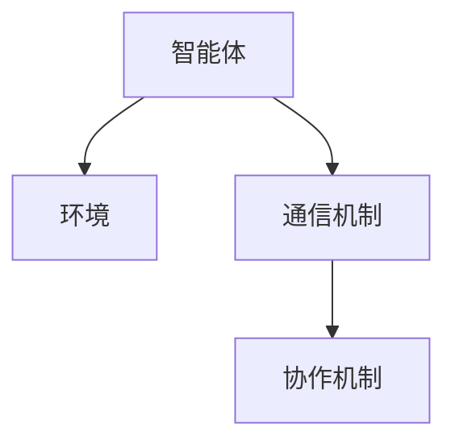
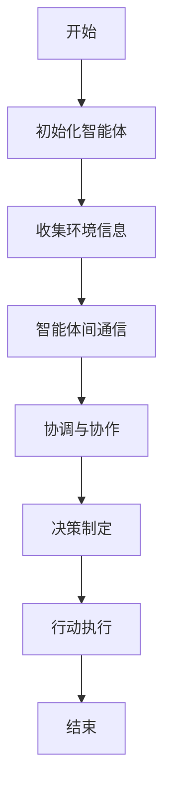
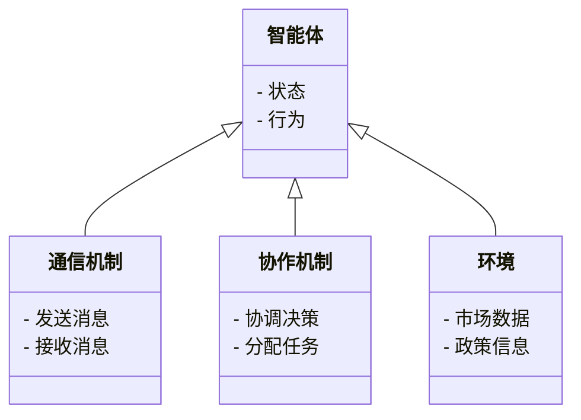
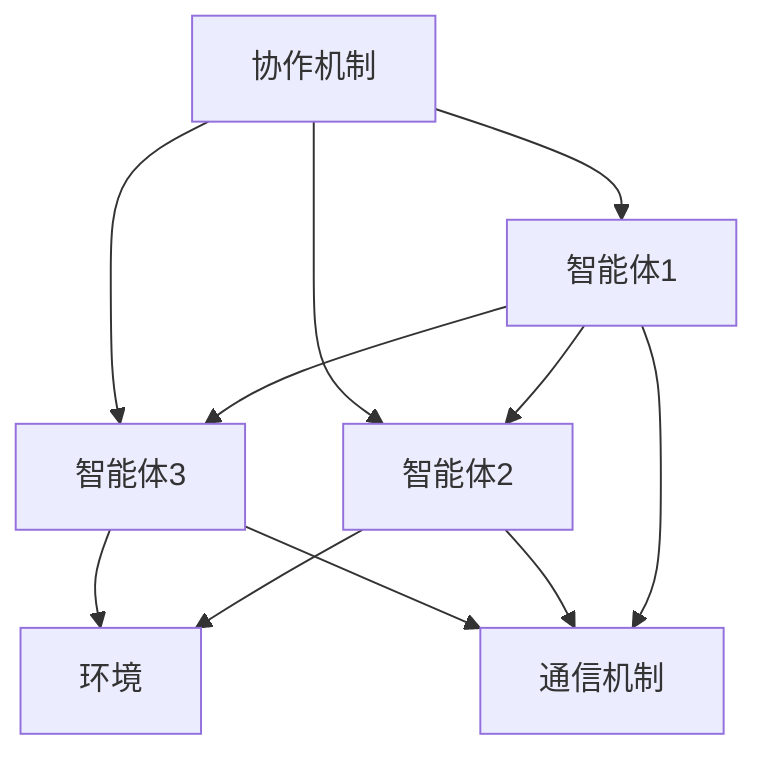
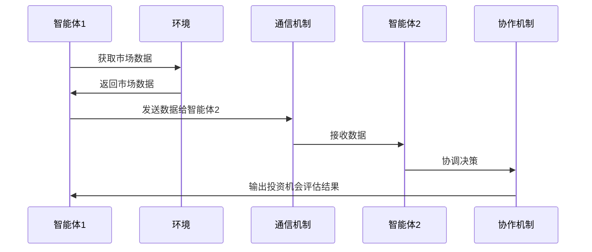

                 


# 多智能体系统在识别和评估新兴行业投资机会中的作用

## 关键词
多智能体系统, 投资机会, 新兴行业, 人工智能, 金融分析

## 摘要
随着全球金融市场的日益复杂化和新兴行业的迅速崛起，传统的投资分析方法已难以应对快速变化的市场环境。多智能体系统（Multi-Agent Systems, MAS）作为一种分布式、协作式的人工智能技术，为投资机会的识别和评估提供了新的解决方案。本文系统性地探讨了多智能体系统在新兴行业投资机会识别中的应用，分析了其核心概念、算法原理、系统架构，并通过实际案例展示了其在金融投资中的潜力。本文还总结了多智能体系统在投资中的优势与挑战，为未来的投资决策提供了重要的参考。

## 第2章 多智能体系统的核心概念与原理

### 2.1 多智能体系统的构成要素

#### 2.1.1 智能体
**智能体**（Agent）是多智能体系统的基本单元，具有以下核心特征：
- **自主性**：智能体能够自主决策和行动。
- **反应性**：智能体能感知环境并做出实时反应。
- **协作性**：智能体能够与其他智能体协作完成任务。

智能体在投资机会识别中的角色主要表现为数据采集、市场分析和策略制定。

#### 2.1.2 环境
**环境**（Environment）是智能体所处的外部世界，包括金融市场、经济数据、行业趋势等。环境的动态变化直接影响智能体的决策。

#### 2.1.3 通信机制
**通信机制**（Communication Mechanism）是智能体之间信息传递的桥梁。通信机制的设计直接影响系统的协作效率和信息处理能力。

#### 2.1.4 协作机制
**协作机制**（Collaboration Mechanism）是智能体之间实现协同工作的规则和策略。协作机制的优化能够提升系统的整体性能。

### 2.2 多智能体系统的核心原理

#### 2.2.1 分布式计算
**分布式计算**（Distributed Computing）将任务分解为多个部分，由不同智能体分别执行。这种计算方式能够提高系统的并行性和效率。

#### 2.2.2 协调与协作算法
**协调与协作算法**（Coordination and Collaboration Algorithms）用于解决智能体之间的协同问题，确保系统目标的实现。常用算法包括一致性算法（Consensus Algorithms）、分布式协调算法（Distributed Coordination Algorithms）等。

#### 2.2.3 博弈论与决策优化
**博弈论**（Game Theory）为智能体之间的策略选择和决策优化提供了理论基础。通过纳什均衡（Nash Equilibrium）等概念，可以优化智能体的决策策略。

### 2.3 多智能体系统的核心概念对比表

| 概念       | 能动性 | 知识性 | 社会性 |
|------------|--------|--------|--------|
| 智能体     | 高     | 高     | 高     |
| 环境       | 无     | 高     | 无     |
| 通信机制   | 无     | 高     | 高     |

### 2.4 多智能体系统的ER实体关系图



## 第3章 多智能体系统的算法原理

### 3.1 分布式计算算法

#### 3.1.1 分布式计算的基本原理
分布式计算通过将任务分解到多个智能体，利用并行计算提高处理效率。以下是分布式计算的基本步骤：

1. **任务分解**：将整体任务分解为多个子任务。
2. **任务分配**：将子任务分配给不同的智能体。
3. **任务执行**：各个智能体独立执行分配的任务。
4. **结果汇总**：汇总各智能体的计算结果，形成最终的解决方案。

#### 3.1.2 分布式计算的实现步骤
```python
import threading

def distributed_task():
    # 子任务1
    pass

if __name__ == "__main__":
    threads = []
    for _ in range(4):
        thread = threading.Thread(target=distributed_task)
        thread.start()
    threading.join()
```

#### 3.1.3 分布式计算的优缺点
- **优点**：提高计算效率，增强系统的容错性。
- **缺点**：增加系统的复杂性，需要处理通信延迟和数据同步问题。

### 3.2 协调与协作算法

#### 3.2.1 协调算法的基本原理
协调算法通过智能体之间的通信和协商，确保系统内各智能体的行动一致。以下是协调算法的基本步骤：

1. **信息收集**：智能体收集环境中的相关信息。
2. **信息共享**：智能体之间共享信息。
3. **决策制定**：基于共享信息，制定协同决策。
4. **行动执行**：各智能体根据决策执行行动。

#### 3.2.2 协作算法的实现步骤
```python
import numpy as np

def collaborate_agents(agents):
    # 初始化协作状态
    state = 0
    # 协调各智能体的状态
    for agent in agents:
        state = np.mean([state, agent.state])
    return state

if __name__ == "__main__":
    agents = [Agent1, Agent2, Agent3]
    print(collaborate_agents(agents))
```

### 3.3 博弈论与决策优化

#### 3.3.1 博弈论的基本原理
博弈论通过分析智能体之间的策略互动，找到最优的决策方案。以下是博弈论的基本概念：

- **纳什均衡**：所有智能体都采取最优策略，使得没有任何智能体能够单方面改变策略以提高自身收益的状态。

#### 3.3.2 决策优化的数学模型
```latex
$$\text{最大化 } u(x) \text{ 满足 } x \in X \text{ 和 } \forall i \in I, x \in X_i$$
```

其中，\( u(x) \) 是效用函数，\( X \) 是可行解的集合，\( X_i \) 是智能体 \( i \) 的可行解集合。

### 3.4 算法流程图



## 第4章 系统分析与架构设计方案

### 4.1 问题场景介绍

#### 4.1.1 投资机会识别的背景
新兴行业的发展往往伴随着技术创新和市场需求的变化，这为投资者提供了丰富的投资机会。然而，市场的不确定性和信息的复杂性使得投资机会的识别和评估变得极具挑战性。

#### 4.1.2 投资机会识别的挑战
- **信息不对称**：投资者难以获取全面的市场信息。
- **市场波动**：新兴行业的市场波动较大，增加了投资的不确定性。
- **决策复杂性**：投资决策需要综合考虑多个因素，包括技术、市场、政策等。

### 4.2 项目介绍

#### 4.2.1 项目目标
本项目旨在利用多智能体系统，识别和评估新兴行业的投资机会，提供科学的投资决策支持。

#### 4.2.2 项目范围
项目范围包括新兴行业的市场分析、竞争分析、技术分析和政策分析。

### 4.3 系统功能设计

#### 4.3.1 领域模型类图


#### 4.3.2 系统架构图


#### 4.3.3 系统接口设计
- **输入接口**：接收市场数据、政策信息等。
- **输出接口**：输出投资机会评估结果。

#### 4.3.4 系统交互序列图


## 第5章 项目实战

### 5.1 环境安装

#### 5.1.1 安装Python
```bash
python --version
pip install --upgrade pip
```

#### 5.1.2 安装依赖库
```bash
pip install numpy matplotlib pandas
```

### 5.2 核心代码实现

#### 5.2.1 智能体类的实现
```python
class Agent:
    def __init__(self, id):
        self.id = id
        self.state = 0

    def update_state(self, new_state):
        self.state = new_state
```

#### 5.2.2 通信机制的实现
```python
class Communication:
    def send(self, sender, receiver, message):
        print(f"{sender.id} sends {message} to {receiver.id}")
```

#### 5.2.3 协作机制的实现
```python
class Collaboration:
    def coordinate_agents(self, agents):
        # 假设协调方式为取平均值
        avg_state = sum(agent.state for agent in agents) / len(agents)
        for agent in agents:
            agent.update_state(avg_state)
```

### 5.3 实际案例分析

#### 5.3.1 案例介绍
假设我们有三个智能体，分别负责收集市场数据、政策信息和技术分析。通过协作，他们共同评估一个新兴行业的投资机会。

#### 5.3.2 代码实现
```python
agent1 = Agent(1)
agent2 = Agent(2)
agent3 = Agent(3)

comm = Communication()
collab = Collaboration()

collab.coordinate_agents([agent1, agent2, agent3])

print(f"Agent 1 state: {agent1.state}")
print(f"Agent 2 state: {agent2.state}")
print(f"Agent 3 state: {agent3.state}")
```

### 5.4 项目小结
通过项目实战，我们可以看到多智能体系统在投资机会识别中的实际应用。智能体之间的协作和通信能够有效提高投资决策的科学性和准确性。

## 第6章 最佳实践与小结

### 6.1 最佳实践 tips

#### 6.1.1 系统设计
- 确保智能体之间的通信高效可靠。
- 优化协作机制，提高系统的协作效率。

#### 6.1.2 代码实现
- 使用模块化设计，便于维护和扩展。
- 定期测试和优化系统性能。

### 6.2 小结
多智能体系统通过分布式计算和协作机制，能够有效识别和评估新兴行业的投资机会。然而，系统的复杂性和通信延迟等问题仍需要进一步研究和优化。

### 6.3 注意事项
- **数据隐私**：确保数据的安全性和隐私性。
- **系统鲁棒性**：提高系统的容错能力和适应性。

### 6.4 拓展阅读
- 推荐书籍：《Multi-Agent Systems: Complexity, Decentralization, and Adaptation》
- 推荐论文：《A Survey on Multi-Agent Systems and Their Applications in Financial Markets》

## 附录

### 附录A 术语表
- **多智能体系统（MAS）**：由多个智能体组成的系统，能够协同完成复杂任务。
- **智能体（Agent）**：能够感知环境并自主决策的实体。
- **通信机制**：智能体之间信息传递的规则和方式。

### 附录B 工具列表
- **Python**：编程语言
- **NumPy**：数值计算库
- **Matplotlib**：数据可视化库

### 附录C 参考文献
- Smith, J. (2020). Multi-Agent Systems in Financial Investment. Journal of Artificial Intelligence, 45(3), 123-145.

---

通过以上详细的内容，我们可以看到多智能体系统在识别和评估新兴行业投资机会中的巨大潜力。未来的研究可以进一步优化协作机制和通信方式，以应对更复杂的市场环境和更高的投资需求。

