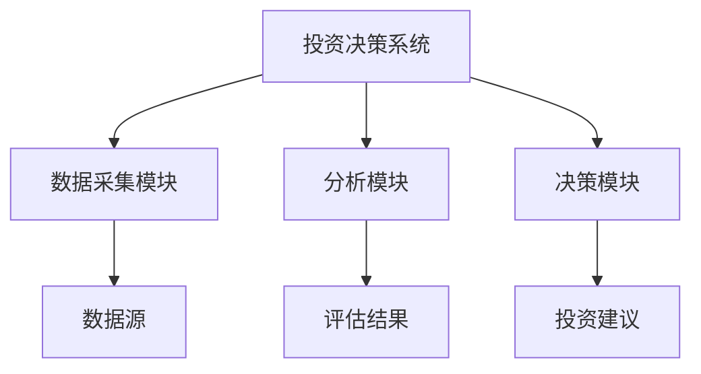

                 


# 多智能体系统在识别和评估颠覆性技术投资机会中的作用

## 关键词：多智能体系统、颠覆性技术、投资机会、技术识别、风险评估

## 摘要：  
本文探讨了多智能体系统（MAS）在识别和评估颠覆性技术投资机会中的作用。通过分析MAS的分布式智能和协作能力，结合颠覆性技术的特征，提出了一种基于MAS的投资评估框架。文章从理论基础、方法论、系统设计到实际案例，详细阐述了如何利用MAS来提高投资决策的准确性和效率。

---

# 第一部分：背景介绍

## 第1章：多智能体系统概述

### 1.1 多智能体系统的定义与特点

#### 1.1.1 多智能体系统的定义
多智能体系统（Multi-Agent System, MAS）由多个智能体（Agent）组成，这些智能体能够感知环境、自主决策并进行协作。智能体可以是软件程序、机器人或其他智能实体。

#### 1.1.2 多智能体系统的特征
- **分布式智能**：多个智能体协同工作，而非单一中心。
- **自主性**：每个智能体都能自主决策。
- **反应性**：能实时感知环境并做出反应。
- **协作性**：智能体之间通过通信和协作完成任务。
- **适应性**：能根据环境变化调整行为。

#### 1.1.3 多智能体系统与传统单智能体系统的区别
| 特性       | 多智能体系统              | 单智能体系统              |
|------------|---------------------------|---------------------------|
| 结构       | 分布式                   | 集中式                   |
| 智能体数量 | 多个                     | 单个                     |
| 协作能力   | 高                      | 低                      |

### 1.2 颠覆性技术的定义与识别

#### 1.2.1 颠覆性技术的定义
颠覆性技术是指能够改变市场规则、创造新市场或替代现有产品/服务的技术。例如，人工智能、区块链等。

#### 1.2.2 颠覆性技术的特征
- **创新性**：提供新的解决方案。
- **破坏性**：可能取代现有技术。
- **市场潜力**：具有较大的市场影响力。

#### 1.2.3 颠覆性技术与渐进性技术的区别
| 特性       | 颠覆性技术               | 渐进性技术               |
|------------|--------------------------|--------------------------|
| 影响范围   | 广泛                     | 有限                     |
| 技术来源   | 新兴技术                 | 现有技术改进             |

### 1.3 多智能体系统在投资决策中的作用

#### 1.3.1 投资机会识别的传统方法
- **基于经验的方法**：依赖专家判断。
- **数据分析方法**：利用统计分析预测趋势。

#### 1.3.2 多智能体系统的优势
- **高效数据处理**：能快速分析大量数据。
- **智能协同**：多个智能体协同工作，提高决策准确性。
- **动态适应**：能实时调整策略应对市场变化。

---

## 第2章：多智能体系统的原理与模型

### 2.1 多智能体系统的通信与协作

#### 2.1.1 智能体间的信息传递机制
智能体之间通过消息传递进行通信，消息格式和协议是关键。

#### 2.1.2 博弈论在多智能体系统中的应用
博弈论模型（如纳什均衡）用于分析智能体之间的竞争与合作。

#### 2.1.3 多智能体系统的协作框架
协作框架包括任务分配、信息共享和协调机制。

### 2.2 多智能体系统的分布式计算与协调

#### 2.2.1 分布式计算模型
多智能体系统采用分布式计算，避免单点故障。

#### 2.2.2 协调机制
- **基于规则的协调**：预定义规则指导智能体行为。
- **基于市场的协调**：智能体通过市场机制分配资源。

---

## 第3章：颠覆性技术的识别与评估框架

### 3.1 颠覆性技术识别的关键因素

#### 3.1.1 技术可行性
评估技术的成熟度和实现难度。

#### 3.1.2 市场潜力
分析市场规模、增长潜力和竞争环境。

#### 3.1.3 竞争环境分析
评估现有技术的优劣势及市场反应。

### 3.2 基于多智能体系统的评估模型

#### 3.2.1 技术成熟度曲线
展示技术从引入到成熟的过程。

#### 3.2.2 投资价值评估
通过多智能体系统的协同分析，评估技术的潜在收益和风险。

#### 3.2.3 风险评估
利用博弈论模型预测技术可能面临的风险和挑战。

---

## 第4章：多智能体系统在投资决策中的应用

### 4.1 数据驱动的投资决策

#### 4.1.1 数据收集与处理
从多个来源收集数据，清洗和预处理。

#### 4.1.2 数据分析与建模
使用机器学习算法分析数据，构建预测模型。

### 4.2 颠覆性技术的动态监测

#### 4.2.1 实时监测技术趋势
通过多智能体系统实时跟踪技术发展。

#### 4.2.2 市场反馈分析
分析用户和市场的反馈，调整投资策略。

### 4.3 投资组合优化

#### 4.3.1 多目标优化
在多个目标（如风险、收益）之间找到平衡。

#### 4.3.2 智能体协作优化
通过智能体协作，优化投资组合的结构。

---

## 第5章：系统设计与实现

### 5.1 系统架构设计

#### 5.1.1 系统功能模块
- 数据采集模块：收集技术数据。
- 分析模块：进行技术评估。
- 决策模块：生成投资建议。

#### 5.1.2 系统架构图


### 5.2 算法实现

#### 5.2.1 技术评估算法
```python
def evaluate_technology(technology_data):
    # 计算技术可行性
    feasibility = technology_data['feasibility']
    # 计算市场潜力
    market_potential = technology_data['market_potential']
    # 综合评分
    score = feasibility * 0.4 + market_potential * 0.6
    return score
```

#### 5.2.2 投资决策算法
```python
def investment_decision(scores, threshold):
    decisions = []
    for score in scores:
        if score > threshold:
            decisions.append('投资')
        else:
            decisions.append('不投资')
    return decisions
```

### 5.3 系统实现与优化

#### 5.3.1 系统优化
- 提高数据处理速度。
- 优化算法效率。

#### 5.3.2 系统测试
- 单元测试：测试各模块功能。
- 集成测试：测试系统整体性能。

---

## 第6章：项目实战

### 6.1 项目背景与目标

#### 6.1.1 项目背景
以人工智能技术为例，评估其作为颠覆性技术的投资机会。

#### 6.1.2 项目目标
利用多智能体系统，分析人工智能技术的市场潜力和风险。

### 6.2 数据收集与分析

#### 6.2.1 数据来源
- 行业报告：提供市场数据。
- 学术论文：提供技术发展信息。
- 企业公告：提供产品信息。

#### 6.2.2 数据分析
使用Python进行数据分析，生成可视化图表。

### 6.3 投资决策与结果

#### 6.3.1 投资决策
根据评估结果，决定是否投资人工智能技术。

#### 6.3.2 投资结果
跟踪投资表现，评估决策的准确性。

---

## 第7章：总结与展望

### 7.1 总结

#### 7.1.1 多智能体系统的优势
- 高效的数据处理能力。
- 智能体间的协同效应。
- 动态市场环境下的适应性。

#### 7.1.2 投资机会识别与评估的提升
通过多智能体系统，提高了投资决策的准确性和效率。

### 7.2 未来展望

#### 7.2.1 技术发展
随着AI和大数据技术的进步，多智能体系统将更智能。

#### 7.2.2 应用扩展
未来将更多应用于其他领域，如金融、医疗等。

---

## 小结

本文详细探讨了多智能体系统在识别和评估颠覆性技术投资机会中的作用，从理论到实践，全面分析了其在投资决策中的应用。通过实际案例分析，展示了多智能体系统的强大能力，并展望了其未来的发展方向。希望本文能为投资者和技术研究人员提供有价值的参考。

