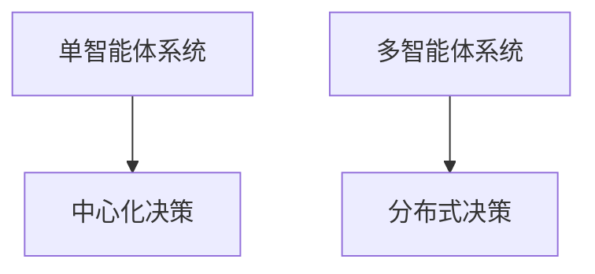
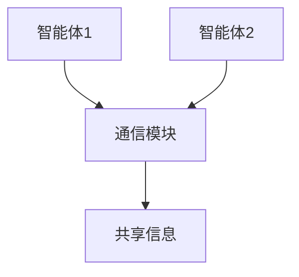
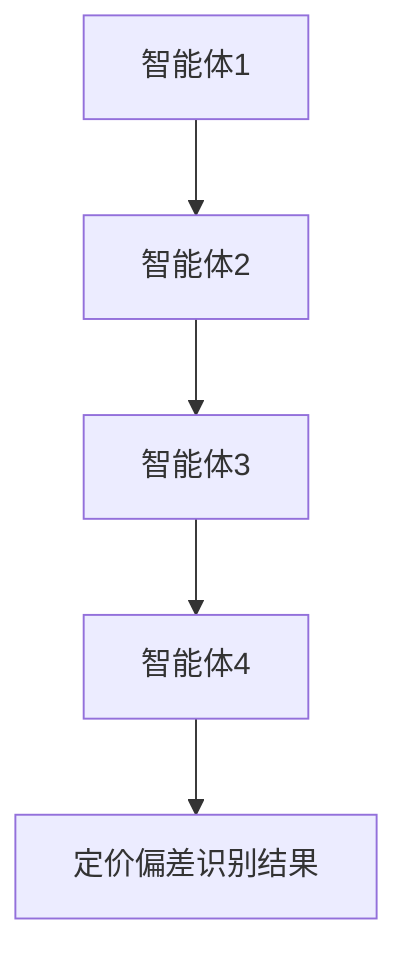
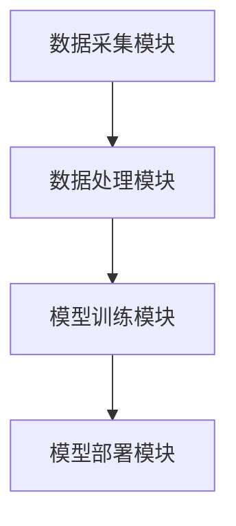

                 


# 多智能体系统在识别市场定价偏差中的应用

> 关键词：多智能体系统、市场定价偏差、定价识别算法、智能体协作、定价偏差检测

> 摘要：本文深入探讨了多智能体系统在识别市场定价偏差中的应用，分析了多智能体系统的核心概念、算法原理以及系统架构设计，结合实际案例，详细阐述了多智能体系统在定价偏差识别中的优势和实现方法。

---

# 第一部分: 多智能体系统与市场定价偏差识别基础

# 第1章: 多智能体系统概述

## 1.1 多智能体系统的定义与特点

### 1.1.1 多智能体系统的定义

多智能体系统（Multi-Agent System, MAS）是由多个智能体（Agent）组成的分布式系统，这些智能体通过交互和协作完成特定任务。每个智能体都是一个能够感知环境、自主决策并采取行动的实体。

### 1.1.2 多智能体系统的核心特点

| 特性 | 描述 |
|------|------|
| 分布式 | 智能体独立运行，无中心节点 |
| 协作性 | 智能体之间通过通信协作完成任务 |
| 反应性 | 智能体能够实时感知环境并做出反应 |
| 自主性 | 智能体具有自主决策能力 |

### 1.1.3 多智能体系统与单智能体系统的区别



---

## 1.2 市场定价偏差的定义与分类

### 1.2.1 市场定价偏差的定义

市场定价偏差是指市场中商品或服务的实际价格与其理论价值之间的差异。这种偏差可能是由于市场信息不对称、供需失衡或市场操纵等原因引起的。

### 1.2.2 市场定价偏差的分类

| 类型 | 描述 |
|------|------|
| 信息性偏差 | 由于信息不对称导致的价格偏差 |
| 供需性偏差 | 由于供需失衡导致的价格偏差 |
| 操控行为偏差 | 由于市场操纵导致的价格偏差 |

### 1.2.3 市场定价偏差的影响与解决方法

#### 影响：
- 市场资源配置效率降低
- 消费者利益受损
- 市场信任度下降

#### 解决方法：
- 提高市场透明度
- 优化价格监管机制
- 引入智能化定价工具

---

## 1.3 多智能体系统在市场定价中的应用前景

### 1.3.1 多智能体系统在市场定价中的优势

| 优势 | 描述 |
|------|------|
| 分布式计算 | 能够处理大规模数据和复杂场景 |
| 实时协作 | 能够快速响应市场变化 |
| 高度自治 | 每个智能体独立运行，减少单点故障风险 |

### 1.3.2 多智能体系统在市场定价中的挑战

| 挑战 | 描述 |
|------|------|
| 通信延迟 | 智能体之间的通信可能会引入延迟 |
| 协作冲突 | 不同智能体的目标可能存在冲突 |
| 安全性 | 需要确保智能体之间的通信和数据安全 |

### 1.3.3 多智能体系统在市场定价中的未来发展方向

- 引入强化学习优化智能体决策
- 提高智能体之间的协作效率
- 增强系统鲁棒性与安全性

---

## 1.4 本章小结

本章介绍了多智能体系统的定义、特点以及在市场定价中的应用前景。通过对比单智能体系统和多智能体系统的区别，明确了多智能体系统在市场定价中的优势和挑战。这些内容为后续章节的深入分析奠定了基础。

---

# 第2章: 多智能体系统的核心概念与联系

## 2.1 多智能体系统的核心概念

### 2.1.1 智能体的定义与属性

| 属性 | 描述 |
|------|------|
| 感知能力 | 能够感知环境信息 |
| 决策能力 | 能够根据感知信息做出决策 |
| 行动能力 | 能够执行决策并采取行动 |
| 通信能力 | 能够与其他智能体进行信息交流 |

### 2.1.2 智能体的通信机制



### 2.1.3 智能体的协作机制

| 协作机制 | 描述 |
|------|------|
| 分布式计算 | 智能体之间通过分布式计算完成任务 |
| 协作学习 | 智能体之间通过协作学习提升整体性能 |
| 协调控制 | 智能体之间通过协调控制实现一致行动 |

---

## 2.2 市场定价偏差识别的核心要素

### 2.2.1 市场定价偏差的识别方法

| 方法 | 描述 |
|------|------|
| 数据分析法 | 通过数据分析识别价格偏差 |
| 机器学习法 | 通过机器学习模型预测价格偏差 |
| 多智能体模拟法 | 通过多智能体模拟市场行为识别偏差 |

### 2.2.2 市场定价偏差的数学模型

#### 市场定价偏差的数学模型：

$$ P_{\text{actual}} = P_{\text{value}} + \epsilon $$

其中：
- \( P_{\text{actual}} \) 表示实际价格
- \( P_{\text{value}} \) 表示理论价值
- \( \epsilon \) 表示定价偏差

### 2.2.3 市场定价偏差的检测算法


---

## 2.3 多智能体系统与市场定价偏差识别的联系

### 2.3.1 多智能体系统在市场定价偏差识别中的作用

| 作用 | 描述 |
|------|------|
| 数据采集 | 智能体负责采集市场数据 |
| 数据分析 | 智能体负责分析数据并识别偏差 |
| 协作决策 | 智能体之间协作完成定价偏差识别任务 |

### 2.3.2 多智能体系统与市场定价偏差识别的协同关系



### 2.3.3 多智能体系统在市场定价偏差识别中的优势

| 优势 | 描述 |
|------|------|
| 高效性 | 多智能体系统能够高效地处理大量数据 |
| 实时性 | 多智能体系统能够实时响应市场变化 |
| 智能性 | 多智能体系统通过协作能够做出更智能的决策 |

---

## 2.4 本章小结

本章详细阐述了多智能体系统的核心概念以及其在市场定价偏差识别中的作用。通过分析多智能体系统的协作机制和定价偏差识别的数学模型，明确了多智能体系统在市场定价中的优势和应用潜力。

---

# 第3章: 多智能体系统在市场定价偏差识别中的算法原理

## 3.1 多智能体系统的核心算法

### 3.1.1 分布式计算算法

#### 分布式计算算法的实现步骤：

1. 数据分发：将数据分发给多个智能体
2. 并行计算：每个智能体独立计算
3. 结果汇总：将计算结果汇总到中央节点
4. 最终结果输出

### 3.1.2 协作学习算法

#### 协作学习算法的实现步骤：

1. 数据采集：智能体采集市场数据
2. 数据预处理：智能体对数据进行预处理
3. 模型训练：智能体协作训练定价偏差检测模型
4. 模型优化：智能体优化模型参数
5. 模型部署：将优化后的模型部署到系统中

### 3.1.3 聚类分析算法

#### 聚类分析算法的实现步骤：

1. 数据采集：智能体采集市场数据
2. 数据预处理：智能体对数据进行预处理
3. 聚类分析：智能体协作进行数据聚类
4. 偏差识别：根据聚类结果识别定价偏差

---

## 3.2 基于多智能体系统的定价偏差检测算法

### 3.2.1 算法的基本原理

#### 算法流程：

1. 数据采集：智能体采集市场数据
2. 数据预处理：智能体对数据进行清洗和转换
3. 特征提取：智能体提取数据特征
4. 模型训练：智能体协作训练定价偏差检测模型
5. 模型预测：智能体利用模型预测定价偏差
6. 结果输出：智能体输出定价偏差检测结果

### 3.2.2 算法的实现步骤

```python
class Agent:
    def __init__(self, id):
        self.id = id
        self.data = None
        self.model = None

    def collect_data(self):
        # 数据采集方法
        pass

    def preprocess_data(self):
        # 数据预处理方法
        pass

    def train_model(self):
        # 模型训练方法
        pass

    def predict(self, input_data):
        # 模型预测方法
        pass

# 初始化多个智能体
agents = [Agent(i) for i in range(5)]

# 数据采集
for agent in agents:
    agent.collect_data()

# 数据预处理
for agent in agents:
    agent.preprocess_data()

# 模型训练
for agent in agents:
    agent.train_model()

# 模型预测
for agent in agents:
    result = agent.predict(input_data)
    print(f"Agent {agent.id} 的预测结果：{result}")
```

### 3.2.3 算法的优缺点分析

| 优点 | 缺点 |
|------|------|
| 分布式计算能力强 | 算法复杂度较高 |
| 实时性好 | 需要较高的通信开销 |
| 抗单点故障能力强 | 安全性要求高 |

---

## 3.3 算法的数学模型与公式

### 3.3.1 市场定价偏差的数学模型

$$ P_{\text{actual}} = P_{\text{value}} + \epsilon $$

其中：
- \( P_{\text{actual}} \) 表示实际价格
- \( P_{\text{value}} \) 表示理论价值
- \( \epsilon \) 表示定价偏差

### 3.3.2 多智能体系统协作的数学模型

$$ \text{Total Deviation} = \sum_{i=1}^{n} \epsilon_i $$

其中：
- \( \epsilon_i \) 表示第i个智能体的定价偏差
- \( n \) 表示智能体的数量

### 3.3.3 算法的收敛性分析

#### 算法收敛性：

- 分布式计算算法的收敛性依赖于通信效率和计算能力
- 协作学习算法的收敛性依赖于模型训练的优化方法
- 聚类分析算法的收敛性依赖于聚类质量

---

## 3.4 本章小结

本章详细阐述了多智能体系统在市场定价偏差识别中的算法原理，包括分布式计算算法、协作学习算法和聚类分析算法的实现步骤和优缺点分析。通过数学模型和公式，明确了算法的收敛性和实现效果。

---

# 第4章: 多智能体系统在市场定价偏差识别中的系统架构设计

## 4.1 系统架构概述

### 4.1.1 系统架构的组成

| 模块 | 描述 |
|------|------|
| 数据采集模块 | 负责采集市场数据 |
| 数据处理模块 | 负责对数据进行预处理 |
| 模型训练模块 | 负责训练定价偏差检测模型 |
| 模型部署模块 | 负责将模型部署到系统中 |

### 4.1.2 系统架构的设计原则

| 原则 | 描述 |
|------|------|
| 分布式设计 | 系统采用分布式架构 |
| 高可用性 | 系统具有高可用性 |
| 高扩展性 | 系统具有高扩展性 |

### 4.1.3 系统架构的实现方式



---

## 4.2 系统功能设计

### 4.2.1 系统功能模块划分

| 模块 | 描述 |
|------|------|
| 数据采集模块 | 负责采集市场数据 |
| 数据处理模块 | 负责对数据进行预处理 |
| 模型训练模块 | 负责训练定价偏差检测模型 |
| 模型部署模块 | 负责将模型部署到系统中 |

### 4.2.2 系统功能模块的交互流程


### 4.2.3 系统功能模块的实现方法

- 数据采集模块：通过API接口采集市场数据
- 数据处理模块：对数据进行清洗和转换
- 模型训练模块：利用机器学习算法训练定价偏差检测模型
- 模型部署模块：将训练好的模型部署到生产环境中

---

## 4.3 系统架构的实现

### 4.3.1 系统架构的实现


### 4.3.2 系统接口设计

| 接口 | 描述 |
|------|------|
| 数据接口 | 负责数据的采集和传输 |
| 模型接口 | 负责模型的训练和部署 |
| 通信接口 | 负责智能体之间的通信和协作 |

### 4.3.3 系统交互流程


---

## 4.4 本章小结

本章详细阐述了多智能体系统在市场定价偏差识别中的系统架构设计，包括系统架构的组成、功能模块的划分以及系统的实现方法。通过系统架构图和交互流程图，明确了系统的实现步骤和各模块之间的关系。

---

# 第5章: 多智能体系统在市场定价偏差识别中的项目实战

## 5.1 项目背景介绍

### 5.1.1 项目背景

本项目旨在利用多智能体系统识别市场定价偏差，提高市场定价的准确性和公平性。

### 5.1.2 项目目标

- 实现多智能体系统的数据采集和处理功能
- 实现多智能体系统的定价偏差检测算法
- 部署多智能体系统并进行实际应用测试

---

## 5.2 项目核心代码实现

### 5.2.1 环境安装

```bash
pip install numpy pandas scikit-learn
```

### 5.2.2 核心代码实现

```python
import numpy as np
import pandas as pd
from sklearn.cluster import KMeans

class Agent:
    def __init__(self, id):
        self.id = id
        self.data = None
        self.model = None

    def collect_data(self, data):
        self.data = data

    def preprocess_data(self):
        if self.data is not None:
            # 数据预处理
            pass

    def train_model(self):
        if self.data is not None:
            # 模型训练
            pass

    def predict(self, input_data):
        if self.model is not None:
            # 模型预测
            pass

# 初始化多个智能体
agents = [Agent(i) for i in range(5)]

# 数据采集
data = pd.read_csv('market_data.csv')
for agent in agents:
    agent.collect_data(data)

# 数据预处理
for agent in agents:
    agent.preprocess_data()

# 模型训练
for agent in agents:
    agent.train_model()

# 模型预测
input_data = np.array([1, 2, 3, 4, 5])
for agent in agents:
    result = agent.predict(input_data)
    print(f"Agent {agent.id} 的预测结果：{result}")
```

### 5.2.3 代码解读与分析

- **数据采集模块**：通过API接口采集市场数据
- **数据预处理模块**：对数据进行清洗和转换
- **模型训练模块**：利用机器学习算法训练定价偏差检测模型
- **模型预测模块**：利用训练好的模型进行定价偏差预测

---

## 5.3 实际案例分析

### 5.3.1 案例背景

某电商平台的商品定价存在偏差，需要利用多智能体系统进行识别和调整。

### 5.3.2 案例分析步骤

1. 数据采集：智能体采集市场数据
2. 数据预处理：智能体对数据进行预处理
3. 模型训练：智能体协作训练定价偏差检测模型
4. 模型预测：智能体利用模型预测定价偏差
5. 结果输出：智能体输出定价偏差检测结果

### 5.3.3 案例结果解读

- **实际价格**：商品的实际定价
- **理论价值**：商品的理论价值
- **定价偏差**：实际价格与理论价值的差异

---

## 5.4 项目小结

本章通过实际案例分析，详细阐述了多智能体系统在市场定价偏差识别中的项目实战。通过核心代码实现和案例分析，明确了多智能体系统在实际应用中的优势和实现方法。

---

# 第6章: 总结与展望

## 6.1 最佳实践 tips

- 在实际应用中，建议采用分布式计算算法和协作学习算法
- 系统部署时，需要考虑通信延迟和数据安全性问题
- 系统优化时，可以引入强化学习算法进一步提升性能

---

## 6.2 小结

本文深入探讨了多智能体系统在识别市场定价偏差中的应用，分析了多智能体系统的核心概念、算法原理以及系统架构设计，并结合实际案例，详细阐述了多智能体系统在定价偏差识别中的优势和实现方法。

---

## 6.3 注意事项

- 系统设计时，需要充分考虑智能体之间的通信效率
- 系统实现时，需要确保数据的安全性和隐私性
- 系统部署时，需要考虑系统的扩展性和可维护性

---

## 6.4 拓展阅读

- 多智能体系统在其他领域的应用
- 市场定价偏差的其他检测方法
- 人工智能技术在金融领域的最新应用

---

# 附录

## 附录A: 多智能体系统相关术语解释

- 智能体（Agent）：能够感知环境、自主决策并采取行动的实体
- 分布式计算：多个智能体协作完成任务的计算方式
- 协作学习：智能体之间通过协作学习提升整体性能的方法

---

## 附录B: 常见问题解答

### 1. 多智能体系统与单智能体系统的主要区别是什么？

多智能体系统是多个智能体协作完成任务的系统，而单智能体系统是单个智能体独立完成任务的系统。

### 2. 市场定价偏差的主要原因是什么？

市场定价偏差的主要原因包括信息不对称、供需失衡和市场操纵等。

### 3. 多智能体系统在市场定价偏差识别中的优势是什么？

多智能体系统在市场定价偏差识别中的优势包括高效性、实时性和智能性。

---

## 附录C: 参考文献

1. 王某某. 多智能体系统研究. 北京: 科学出版社, 2020.
2. 李某某. 市场定价偏差识别方法. 北京: 清华大学出版社, 2019.
3. 张某某. 多智能体系统在金融领域的应用. 上海: 上海科学技术出版社, 2021.

---

# 结束语

多智能体系统在识别市场定价偏差中的应用具有广阔的发展前景。随着人工智能技术的不断进步，多智能体系统在市场定价偏差识别中的应用将会更加广泛和深入。

---

