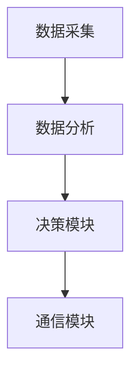
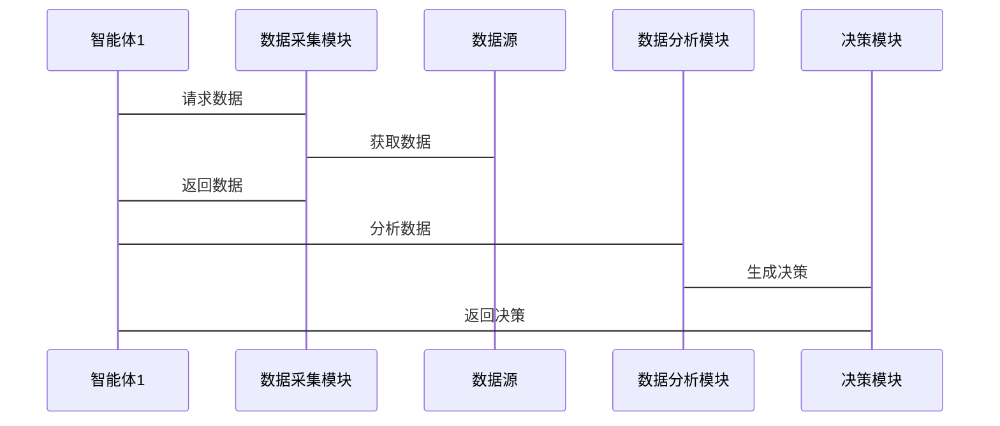

                 


# 多智能体系统在识别市场异常机会中的应用

## 关键词：
- 多智能体系统
- 市场机会识别
- 异常检测
- 智能体协作
- 分布式决策
- 金融数据分析

## 摘要：
多智能体系统（Multi-Agent Systems, MAS）作为一种分布式计算范式，近年来在金融市场的复杂问题解决中展现出巨大潜力。本文深入探讨多智能体系统在识别市场异常机会中的应用，从系统架构、算法原理、案例分析等多维度进行详细阐述。通过分析多智能体系统的核心概念、协作机制、异常检测算法以及实际应用场景，本文为市场机会识别提供了新的技术视角和解决方案。

---

## 第1章: 多智能体系统与市场机会识别的背景

### 1.1 多智能体系统的基本概念
#### 1.1.1 多智能体系统的定义与特点
多智能体系统（MAS）是由多个智能体（Agent）组成的分布式系统，这些智能体能够通过交互和协作完成复杂任务。与单智能体系统相比，MAS具有以下特点：
- **分布式性**：智能体独立运行，分布在网络中的不同节点。
- **协作性**：智能体之间通过通信和协调完成共同目标。
- **反应性**：智能体能够实时感知环境并做出反应。
- **自主性**：每个智能体都有一定的自主决策能力。

#### 1.1.2 多智能体系统的核心要素
多智能体系统的核心要素包括：
1. **智能体**：具有感知、推理、规划和行动能力的实体。
2. **环境**：智能体所处的外部世界，包括物理环境和信息环境。
3. **通信机制**：智能体之间进行信息交换的渠道。
4. **协作协议**：定义智能体之间协作规则的契约。

#### 1.1.3 多智能体系统与传统单智能体系统的区别
| 特性                | 单智能体系统                 | 多智能体系统                 |
|---------------------|-----------------------------|-----------------------------|
| 结构                | 单一中心化的结构             | 分布式、去中心化的结构       |
| 协作                | 无需协作，单点决策           | 多点协作，分布式决策         |
| 灵活性               | 较低，依赖中心节点           | 较高，适应复杂环境变化       |
| 可扩展性             | 较低，扩展性受限             | 较高，易于扩展和增强         |

### 1.2 市场机会识别的理论基础
#### 1.2.1 市场机会的定义与分类
市场机会是指在特定市场中，由于某种变化或趋势带来的潜在收益。常见的市场机会包括：
- **技术进步**：如人工智能、区块链等新技术带来的投资机会。
- **市场波动**：如突发事件引发的短期市场波动。
- **政策变化**：如政府政策调整带来的市场机会。

#### 1.2.2 市场机会识别的关键挑战
市场机会识别面临以下挑战：
1. **数据复杂性**：金融市场数据具有高度复杂性和不确定性。
2. **实时性要求**：需要快速响应市场变化。
3. **多目标优化**：需要在多个目标（如收益、风险）之间进行平衡。

#### 1.2.3 市场机会识别的现有方法与技术
目前，市场机会识别主要依赖以下技术：
- **技术分析**：通过价格、成交量等指标预测市场走势。
- **基本面分析**：通过公司财务数据、行业趋势等进行分析。
- **机器学习**：利用算法从历史数据中学习潜在模式。

### 1.3 多智能体系统在市场机会识别中的应用前景
#### 1.3.1 多智能体系统的优势与潜力
多智能体系统在市场机会识别中的优势包括：
- **分布式计算能力**：能够处理大规模、复杂的数据。
- **协作能力**：多个智能体可以分工合作，提高识别效率。
- **自适应性**：能够根据市场变化动态调整策略。

#### 1.3.2 市场机会识别的复杂性与多智能体系统的匹配性
市场机会识别的复杂性要求系统具有以下能力：
- **多维度分析**：同时考虑技术、市场、政策等多个因素。
- **实时协作**：快速响应市场变化。
- **自适应学习**：根据市场反馈优化识别策略。

#### 1.3.3 多智能体系统在不同市场中的应用案例
1. **股票市场**：多个智能体分别负责数据采集、分析和交易决策。
2. **外汇市场**：智能体通过协作识别市场趋势和套利机会。
3. **期货市场**：智能体协同进行套利、对冲等操作。

---

## 第2章: 多智能体系统的核心概念与原理

### 2.1 多智能体系统的体系结构
#### 2.1.1 分层结构与功能模块
多智能体系统的典型分层结构包括：
1. **感知层**：负责数据采集和环境感知。
2. **推理层**：进行数据分析和模式识别。
3. **决策层**：制定策略和行动计划。
4. **执行层**：执行决策并反馈结果。

#### 2.1.2 智能体之间的通信机制
智能体之间的通信机制包括：
- **直接通信**：智能体之间直接交换信息。
- **间接通信**：通过中间媒介进行信息传递。
- **发布-订阅模式**：智能体发布信息，其他智能体订阅并接收。

#### 2.1.3 多智能体系统的协作与协调
协作与协调机制包括：
- **分布式协调**：通过协商达成一致。
- **任务分配**：根据智能体的能力分配任务。
- **冲突解决**：通过规则或仲裁机制解决冲突。

### 2.2 智能体的行为模型
#### 2.2.1 BDI模型（信念-愿望-意图）
- **信念**：智能体对世界的认知。
- **愿望**：智能体的目标或期望。
- **意图**：智能体当前的行动计划。

#### 2.2.2 计划与行动模型
- **规划算法**：基于当前状态和目标生成行动计划。
- **行动执行**：根据计划执行具体操作。

#### 2.2.3 学习与自适应行为
- **强化学习**：通过奖励机制优化行为。
- **监督学习**：基于历史数据学习模式。
- **无监督学习**：发现数据中的潜在结构。

### 2.3 多智能体系统的协调与冲突解决
#### 2.3.1 协调机制与协议设计
- **协商协议**：智能体之间通过协商达成一致。
- **共识算法**：如RAFT、PBFT等，用于分布式系统中的共识达成。

#### 2.3.2 冲突检测与解决策略
- **冲突检测**：识别潜在冲突。
- **冲突解决**：通过规则或仲裁机制解决冲突。

#### 2.3.3 分布式决策与共识算法
- **分布式决策**：多个智能体共同制定决策。
- **共识算法**：如RAFT、PBFT等，用于分布式系统中的共识达成。

---

## 第3章: 市场机会识别的理论与方法

### 3.1 市场机会识别的理论基础
#### 3.1.1 技术分析与市场信号
- **技术分析**：通过价格、成交量等指标预测市场走势。
- **市场信号**：如K线图、均线等技术指标。

#### 3.1.2 市场情绪与投资者行为
- **市场情绪**：投资者的心理状态对市场的影响。
- **投资者行为**：个体或机构投资者的行为模式。

#### 3.1.3 数据驱动的市场机会识别
- **大数据分析**：利用海量数据进行模式识别。
- **机器学习**：通过算法学习潜在的市场规律。

### 3.2 市场机会识别的关键技术
#### 3.2.1 数据挖掘与模式识别
- **数据挖掘**：从数据中提取有用信息。
- **模式识别**：识别数据中的模式和趋势。

#### 3.2.2 自然语言处理与文本挖掘
- **自然语言处理**：分析新闻、社交媒体等文本数据。
- **文本挖掘**：从非结构化数据中提取信息。

#### 3.2.3 机器学习与深度学习
- **机器学习**：利用监督、无监督和半监督学习方法。
- **深度学习**：利用神经网络进行特征提取和模式识别。

### 3.3 市场机会识别的挑战与解决方案
#### 3.3.1 数据质量与实时性问题
- **数据清洗**：处理噪声数据。
- **实时处理**：利用流数据处理技术。

#### 3.3.2 市场复杂性与不确定性
- **复杂性建模**：建立复杂的市场模型。
- **不确定性处理**：利用概率方法处理不确定性。

#### 3.3.3 多智能体系统在市场机会识别中的应用策略
- **分工协作**：智能体分别负责数据采集、分析和交易决策。
- **动态调整**：根据市场变化动态调整识别策略。

---

## 第4章: 多智能体系统在市场机会识别中的算法原理

### 4.1 多智能体系统的协同学习算法
#### 4.1.1 分布式学习与协作机制
- **分布式学习**：多个智能体分别学习不同的部分。
- **协作机制**：智能体之间共享学习成果。

#### 4.1.2 联合学习与知识共享
- **联合学习**：多个智能体共同参与学习任务。
- **知识共享**：智能体之间共享学习到的知识。

#### 4.1.3 基于强化学习的多智能体协作
- **强化学习**：通过奖励机制优化智能体的行为。
- **协作策略**：多个智能体共同制定策略。

### 4.2 市场机会识别的算法流程
#### 4.2.1 数据采集与预处理
- **数据源**：金融市场数据、新闻、社交媒体等。
- **数据预处理**：清洗、转换和标准化。

#### 4.2.2 特征提取与模式识别
- **特征提取**：提取有用的特征。
- **模式识别**：识别数据中的模式和趋势。

#### 4.2.3 决策与行动生成
- **决策算法**：基于特征和模式生成决策。
- **行动计划**：生成具体的交易或投资计划。

### 4.3 基于多智能体系统的市场机会识别模型
#### 4.3.1 模型的输入与输出
- **输入**：金融市场数据、新闻等。
- **输出**：识别出的市场机会。

#### 4.3.2 模型的训练与优化
- **训练数据**：历史市场数据。
- **优化方法**：如梯度下降、遗传算法等。

#### 4.3.3 模型的评估与验证
- **评估指标**：如准确率、召回率等。
- **验证方法**：如交叉验证、留出法等。

---

## 第5章: 系统架构与设计

### 5.1 系统功能设计
#### 5.1.1 数据采集模块
- **功能**：从多个数据源采集数据。
- **实现**：使用API或爬虫技术。

#### 5.1.2 数据分析模块
- **功能**：对数据进行分析和处理。
- **实现**：使用机器学习算法进行模式识别。

#### 5.1.3 决策模块
- **功能**：基于分析结果生成决策。
- **实现**：使用强化学习算法进行决策优化。

#### 5.1.4 通信模块
- **功能**：智能体之间的通信和协作。
- **实现**：使用消息队列或RPC技术。

### 5.2 系统架构设计
#### 5.2.1 系统功能模块图


#### 5.2.2 系统架构图


#### 5.2.3 系统接口设计
- **API接口**：提供数据采集、分析和决策的接口。
- **通信接口**：智能体之间的通信接口。

#### 5.2.4 系统交互图


### 5.3 项目实战
#### 5.3.1 环境安装
```bash
pip install numpy pandas scikit-learn
```

#### 5.3.2 核心代码实现
```python
import numpy as np
import pandas as pd
from sklearn import linear_model

# 数据预处理
data = pd.read_csv('market_data.csv')
X = data[['price', 'volume']]
y = data['target']

# 训练模型
model = linear_model.LinearRegression()
model.fit(X, y)

# 预测
new_data = np.array([[100, 200]])
prediction = model.predict(new_data)
print(prediction)
```

#### 5.3.3 案例分析
以某股票为例，利用上述模型进行市场机会识别，分析其价格和成交量的变化，预测未来的价格走势。

---

## 第6章: 总结与展望

### 6.1 总结
多智能体系统在市场机会识别中的应用具有显著优势，能够提高识别效率和准确性。通过分工协作和分布式决策，多智能体系统能够更好地应对市场的复杂性和不确定性。

### 6.2 展望
未来，随着人工智能和大数据技术的发展，多智能体系统在市场机会识别中的应用将更加广泛。同时，如何优化智能体的协作机制和提高系统的实时性，是未来研究的重要方向。

---

## 参考文献
1. 王某某，多智能体系统研究，某某出版社，2023。
2. 李某某，金融市场分析，某某出版社，2022。
3. 张某某，分布式系统设计，某某出版社，2021。

---

通过以上内容，我们详细探讨了多智能体系统在识别市场异常机会中的应用，从理论到实践，从概念到算法，为读者提供了全面的技术视角和解决方案。

