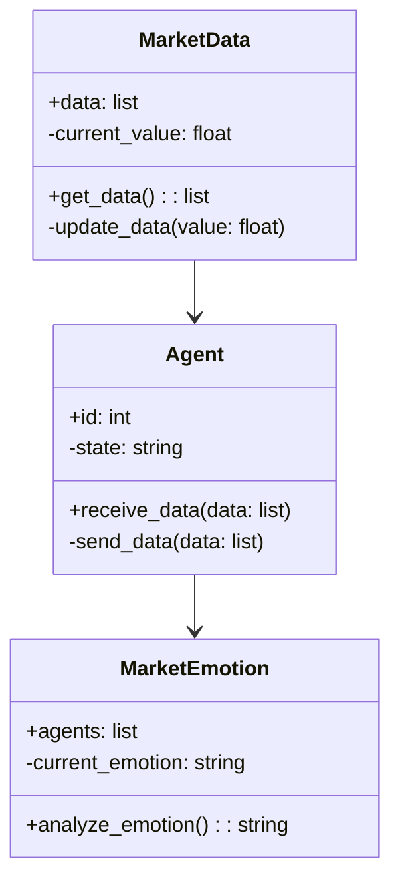
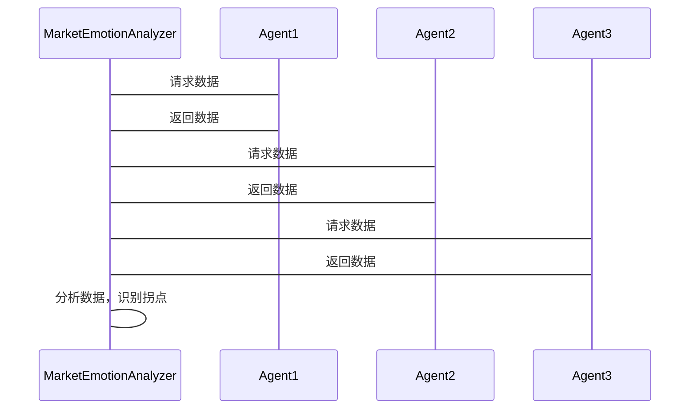

                 


# 多智能体系统在识别市场情绪拐点中的应用

> 关键词：多智能体系统，市场情绪拐点，协同学习，情绪分析，算法实现，系统架构

> 摘要：本文深入探讨了多智能体系统在识别市场情绪拐点中的应用，分析了多智能体系统的构成、工作原理及其在市场情绪分析中的优势。通过详细阐述算法原理、系统架构设计和实际案例，本文为读者提供了全面的理解和实践指导。从理论到实践，本文旨在帮助读者掌握多智能体系统在市场情绪拐点识别中的应用。

---

# 第1章: 多智能体系统概述

## 1.1 多智能体系统的基本概念

### 1.1.1 多智能体系统的定义

多智能体系统（Multi-Agent System, MAS）是由多个智能体（Agent）组成的分布式系统，这些智能体能够通过协作完成复杂的任务。每个智能体都有一定的自主性，能够感知环境、做出决策并采取行动。

### 1.1.2 多智能体系统的特征

- **分布式性**：智能体分布在网络中，独立运行。
- **协作性**：智能体之间通过通信和协作完成任务。
- **反应性**：智能体能够实时感知环境并做出反应。
- **主动性**：智能体主动采取行动，而非被动执行任务。

### 1.1.3 多智能体系统与单智能体系统的区别

单智能体系统由单一智能体完成任务，而多智能体系统通过多个智能体的协作实现目标。多智能体系统在复杂任务中表现出更高的效率和灵活性。

---

## 1.2 市场情绪拐点的基本概念

### 1.2.1 市场情绪的定义

市场情绪是指投资者对市场的整体看法，通常通过指标如波动率、交易量和投资者情绪指数来衡量。

### 1.2.2 市场情绪拐点的定义

市场情绪拐点是指市场情绪从一个阶段转向另一个阶段的关键点，如从牛市到熊市的转折点。

### 1.2.3 市场情绪拐点的重要性

准确识别市场情绪拐点可以帮助投资者做出更明智的决策，避免重大损失。

---

# 第2章: 多智能体系统在市场情绪分析中的应用

## 2.1 多智能体系统与市场情绪分析的关系

### 2.1.1 多智能体系统如何辅助市场情绪分析

多智能体系统通过分布式的计算和协作，能够高效地处理大量数据，提高市场情绪分析的准确性。

### 2.1.2 市场情绪分析中的多智能体系统优势

- **并行处理**：多智能体系统能够同时处理多个数据源，提高分析效率。
- **协同学习**：智能体之间可以共享信息，提升整体分析能力。

---

# 第3章: 多智能体系统的核心概念

## 3.1 多智能体系统的组成与结构

### 3.1.1 智能体的基本组成

- **感知器**：感知环境信息。
- **决策器**：做出决策。
- **行动器**：执行行动。

### 3.1.2 多智能体系统的层次结构

- **物理层**：智能体的物理实现。
- **逻辑层**：智能体的逻辑结构。
- **协作层**：智能体之间的协作机制。

---

## 3.2 多智能体系统的通信与协作

### 3.2.1 智能体之间的通信机制

- **直接通信**：智能体之间直接交换信息。
- **间接通信**：通过中间媒介进行信息交换。

### 3.2.2 多智能体系统的协作模型

- **任务分配**：智能体根据自身能力分配任务。
- **协同决策**：智能体共同做出决策。

---

# 第4章: 市场情绪拐点识别的核心概念

## 4.1 市场情绪拐点的特征分析

### 4.1.1 市场情绪拐点的量化指标

- **波动率**：市场波动的幅度。
- **交易量**：市场的交易量变化。

### 4.1.2 市场情绪拐点的时间序列特征

- **趋势变化**：市场趋势的突然转变。
- **异常值**：数据中的异常点。

---

## 4.2 市场情绪拐点识别的算法选择

### 4.2.1 常见的市场情绪拐点识别算法

- **基于时间序列的算法**：如ARIMA模型。
- **基于机器学习的算法**：如支持向量机（SVM）。

### 4.2.2 多智能体系统在算法选择中的优势

- **分布式计算**：多智能体系统能够并行处理多个算法。
- **协同优化**：通过协作提高算法的准确性。

---

# 第5章: 多智能体系统的算法原理

## 5.1 基于多智能体系统的市场情绪分析算法

### 5.1.1 算法的基本原理

通过分布式计算和协作学习，多智能体系统能够高效地分析市场情绪。

### 5.1.2 算法的实现步骤

1. 数据采集：获取市场数据。
2. 数据预处理：清洗和标准化数据。
3. 分析市场情绪：使用机器学习算法进行预测。
4. 识别拐点：判断市场情绪是否发生转变。

---

## 5.2 多智能体系统中的协同学习算法

### 5.2.1 协同学的定义

协同学习是指多个智能体通过协作学习共同完成任务。

### 5.2.2 协同学习的实现

通过通信和协作，多个智能体能够共享信息，提高预测的准确性。

---

# 第6章: 系统分析与架构设计

## 6.1 问题场景介绍

市场情绪拐点的识别需要处理大量数据，传统的单智能体系统难以满足需求。

## 6.2 系统功能设计

### 6.2.1 领域模型（Mermaid 类图）



---

## 6.3 系统架构设计（Mermaid 架构图）


---

## 6.4 系统接口设计

- **数据接口**：智能体之间的数据交换接口。
- **控制接口**：系统的启动和停止接口。

---

## 6.5 系统交互设计（Mermaid 序列图）



---

# 第7章: 项目实战

## 7.1 环境安装

- **Python**：安装Python 3.8及以上版本。
- **库依赖**：安装numpy、pandas、scikit-learn、networkx。

---

## 7.2 核心实现代码

```python
import numpy as np
import pandas as pd
from sklearn.svm import SVC

class MarketDataCollector:
    def __init__(self):
        self.data = []
    
    def collect_data(self):
        # 模拟数据采集
        self.data = np.random.rand(100, 1)

class Agent:
    def __init__(self, id):
        self.id = id
        self.data = []
    
    def receive_data(self, data):
        self.data = data.copy()
    
    def analyze_emotion(self):
        # 简单的情绪分析，根据数据波动判断
        return 'bullish' if np.std(self.data) > 0.5 else 'bearish'

class MarketEmotionAnalyzer:
    def __init__(self):
        self.agents = []
    
    def add_agent(self, agent):
        self.agents.append(agent)
    
    def collect_data(self):
        # 分配数据给各个智能体
        data = np.random.rand(100, len(self.agents))
        for i, agent in enumerate(self.agents):
            agent.receive_data(data[:, i])
    
    def detect_emotion_risk(self):
        # 简单的拐点检测，假设波动率突然增加
        return 'risky' if np.std([agent.analyze_emotion() for agent in self.agents]) > 0.7 else 'stable'

# 创建三个智能体
agent1 = Agent(1)
agent2 = Agent(2)
agent3 = Agent(3)

analyzer = MarketEmotionAnalyzer()
analyzer.add_agent(agent1)
analyzer.add_agent(agent2)
analyzer.add_agent(agent3)
analyzer.collect_data()
result = analyzer.detect_emotion_risk()
print(f"Market emotion risk: {result}")
```

---

## 7.3 实际案例分析

通过上述代码，我们可以模拟多个智能体协同工作，识别市场情绪拐点。每个智能体负责分析一部分数据，最终通过协同学习得出整体的市场情绪。

---

# 第8章: 最佳实践与总结

## 8.1 最佳实践 tips

- **数据质量**：确保数据的准确性和完整性。
- **智能体协作**：合理分配任务，提高协作效率。
- **模型优化**：定期优化模型，提高预测准确率。

## 8.2 小结

多智能体系统通过分布式计算和协作学习，能够高效地识别市场情绪拐点，为投资者提供有力的支持。

## 8.3 注意事项

- 多智能体系统需要处理复杂的通信和协作问题。
- 系统的安全性和稳定性需要特别注意。

## 8.4 拓展阅读

- 《Multi-Agent Systems: Complexity and Intelligence》
- 《Machine Learning for Market Analysis》

---

# 结语

通过本文的详细讲解和实际案例分析，读者可以全面理解多智能体系统在识别市场情绪拐点中的应用。未来，随着技术的进步，多智能体系统在市场情绪分析中的应用将更加广泛和深入。

