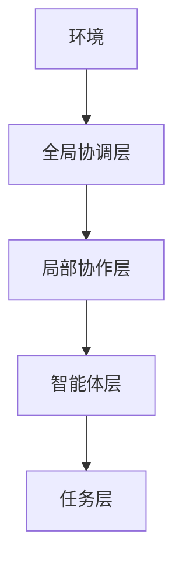
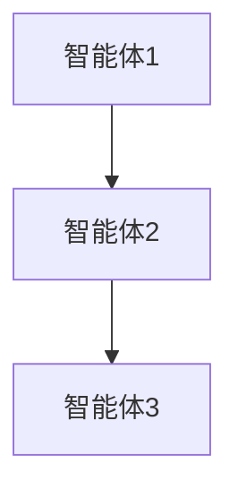
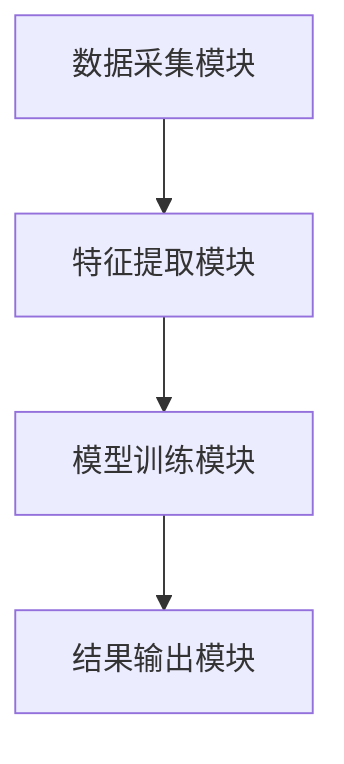
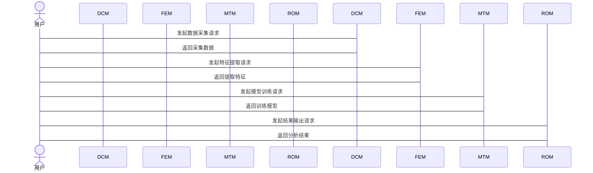

                 


```markdown
# 多智能体系统在识别市场结构性变化中的应用

> 关键词：多智能体系统、市场结构性变化、行为建模、分布式决策、系统架构设计

> 摘要：  
> 本文探讨了多智能体系统在识别市场结构性变化中的应用，从多智能体系统的定义、核心概念、行为建模，到市场数据的特征提取、多智能体系统在市场变化识别中的应用，再到系统的架构设计和项目实战。通过详细讲解多智能体系统在金融市场中的实际应用案例，分析了多智能体系统如何通过协作与竞争机制识别市场结构性变化，并提供了系统架构设计和实现的具体方法。文章最后总结了多智能体系统在识别市场结构性变化中的优势与挑战，为读者提供了深入的见解和实践指导。

---

# 第一部分：多智能体系统概述

# 第1章：多智能体系统的基本概念

## 1.1 多智能体系统的定义与特征

### 1.1.1 多智能体系统的定义
多智能体系统（Multi-Agent System, MAS）是由多个智能体（Agent）组成的分布式系统，这些智能体能够通过交互和协作完成复杂的任务。与传统的单智能体系统相比，多智能体系统具有更高的灵活性和适应性。

### 1.1.2 多智能体系统的核心特征
- **分布式性**：智能体是独立的个体，具有自主性。
- **协作性**：智能体之间通过通信和协调完成共同目标。
- **反应性**：智能体能够感知环境并实时调整行为。
- **动态性**：系统中的智能体和环境都是动态变化的。

### 1.1.3 多智能体系统与传统单智能体系统的对比
| 对比维度 | 多智能体系统 | 单智能体系统 |
|----------|--------------|--------------|
| 结构     | 分布式       | 集中式       |
| 灵活性   | 高           | 低           |
| 并行性   | 高           | 低           |

## 1.2 多智能体系统的组成与结构

### 1.2.1 多智能体系统的组成要素
- **智能体**：具有感知、决策和行动能力的个体。
- **环境**：智能体所处的外部世界，包括物理环境和任务环境。
- **通信机制**：智能体之间交换信息的渠道。
- **协作机制**：智能体之间协作完成任务的规则。

### 1.2.2 多智能体系统的层次结构


### 1.2.3 多智能体系统在金融市场的应用
多智能体系统在金融市场中的应用主要体现在以下几个方面：
1. **市场预测**：通过分析市场数据，预测价格波动。
2. **交易策略**：智能体可以根据市场变化实时调整交易策略。
3. **风险控制**：通过协作机制降低市场风险。

---

# 第二部分：多智能体系统的行为建模与决策机制

# 第2章：多智能体系统的行为建模

## 2.1 多智能体系统的建模方法

### 2.1.1 基于博弈论的建模
博弈论是多智能体系统建模的重要工具，通过分析智能体之间的博弈关系，可以预测系统的行为。

#### 博弈论的基本概念
- **玩家**：参与博弈的智能体。
- **策略**：智能体在不同情况下的行动方案。
- **收益**：智能体在博弈中的收益或损失。

### 2.1.2 基于强化学习的建模
强化学习是一种通过试错来优化智能体行为的算法。

#### 强化学习的基本原理
智能体通过与环境的交互，学习最优策略，以最大化累计奖励。

$$ R = \sum_{t=1}^{T} r_t $$

其中，\( R \) 是总奖励，\( r_t \) 是第 \( t \) 步的奖励。

### 2.1.3 基于图论的建模
图论可以用来描述智能体之间的关系和交互。

#### 图论的基本概念
- **节点**：代表智能体。
- **边**：代表智能体之间的交互关系。



## 2.2 多智能体系统的决策机制

### 2.2.1 分布式决策的基本原理
分布式决策是指每个智能体独立地做出决策，而不是由一个中央控制器进行统一决策。

### 2.2.2 协作与竞争机制
协作与竞争是多智能体系统中智能体之间的两种主要交互方式。

#### 协作机制
智能体通过协作完成共同目标。

#### 竞争机制
智能体通过竞争优化系统整体性能。

### 2.2.3 基于状态的决策模型
基于状态的决策模型通过分析当前状态，选择最优行动方案。

$$ s_t = \text{感知}(s_{t-1}, a_{t-1}) $$

其中，\( s_t \) 是当前状态，\( s_{t-1} \) 是上一状态，\( a_{t-1} \) 是上一动作。

## 2.3 多智能体系统的通信与协调

### 2.3.1 智能体之间的通信协议
通信协议是智能体之间信息交换的规则。

#### 常见的通信协议
- **TCP/IP**：互联网通信的标准协议。
- **HTTP/HTTPS**：基于Web的通信协议。

### 2.3.2 协调算法的实现
协调算法通过智能体之间的通信，实现系统的协作。

#### 常见的协调算法
- **一致性算法**：如Paxos算法，用于分布式系统中达成一致。
- **广播算法**：用于将信息广播到所有智能体。

### 2.3.3 通信与协调的案例分析
以金融市场的智能体为例，智能体通过通信协议交换市场信息，协调完成交易任务。

---

# 第三部分：市场结构性变化的识别方法

# 第3章：市场数据的特征提取

## 3.1 市场数据的预处理

### 3.1.1 数据清洗与标准化
数据清洗是去除噪声数据，标准化是将数据转换为统一格式。

#### 数据清洗步骤
1. **去重**：去除重复数据。
2. **去噪**：去除异常值。
3. **填充缺失值**：使用均值或中位数填充缺失值。

### 3.1.2 时间序列数据的特征提取
时间序列数据的特征提取是识别市场结构性变化的重要步骤。

#### 常见的时间序列特征
- **均值**：数据的平均值。
- **标准差**：数据的波动程度。
- **自相关性**：数据的自相关系数。

### 3.1.3 基于统计学的特征选择
统计学特征选择通过分析数据的统计特性，选择最具代表性的特征。

#### 常见的统计学方法
- **t检验**：用于特征的显著性检验。
- **方差分析**：用于特征的差异性分析。

## 3.2 市场结构性变化的识别方法

### 3.2.1 基于聚类分析的识别
聚类分析是通过将数据分成不同的簇，识别市场结构性变化。

#### 聚类分析的步骤
1. **数据预处理**：标准化数据。
2. **选择聚类算法**：如K-means算法。
3. **聚类结果分析**：识别不同的市场状态。

### 3.2.2 基于分类算法的识别
分类算法是通过训练模型，识别数据所属的类别。

#### 常见的分类算法
- **决策树**：如ID3算法。
- **支持向量机**：SVM算法。
- **随机森林**：集成学习算法。

### 3.2.3 基于异常检测的识别
异常检测是通过识别异常值，发现市场结构性变化。

#### 常见的异常检测方法
- **孤立森林**：无监督异常检测算法。
- **LOF算法**：基于局部密度的异常检测算法。

## 3.3 多智能体系统在市场变化识别中的应用

### 3.3.1 多智能体系统的数据处理流程
多智能体系统通过分布式数据处理，实时分析市场数据。

#### 数据处理流程
1. **数据采集**：从多个数据源采集市场数据。
2. **数据传输**：通过通信协议将数据传输到智能体。
3. **数据分析**：智能体对数据进行特征提取和模型训练。
4. **结果输出**：智能体将分析结果反馈到系统。

### 3.3.2 多智能体系统的特征提取方法
多智能体系统通过协作完成特征提取，提高分析精度。

#### 特征提取方法
- **分布式特征提取**：每个智能体提取部分特征。
- **集中式特征提取**：将所有数据集中到一个节点，进行特征提取。

### 3.3.3 实际案例分析
以股票市场为例，智能体通过分析股票价格、成交量等特征，识别市场趋势。

---

# 第四部分：系统分析与架构设计

## 4.1 系统架构设计

### 4.1.1 系统功能设计
系统功能包括数据采集、特征提取、模型训练和结果输出。

#### 系统功能模块
- **数据采集模块**：采集市场数据。
- **特征提取模块**：提取市场特征。
- **模型训练模块**：训练分类模型。
- **结果输出模块**：输出分析结果。

### 4.1.2 系统架构设计


### 4.1.3 系统接口设计
系统接口包括数据输入接口、模型训练接口和结果输出接口。

#### 接口描述
- **数据输入接口**：接收市场数据。
- **模型训练接口**：训练分类模型。
- **结果输出接口**：输出分析结果。

## 4.2 系统交互设计

### 4.2.1 系统交互流程
系统交互流程包括数据采集、特征提取、模型训练和结果输出。

#### 交互流程图


## 4.3 系统实现

### 4.3.1 环境安装
系统实现需要安装以下环境：
- **Python**：编程语言。
- **TensorFlow**：深度学习框架。
- **Keras**：深度学习框架。
- **Matplotlib**：数据可视化库。

### 4.3.2 系统核心代码实现

#### 数据采集模块
```python
import pandas as pd
import requests

def get_market_data(api_key):
    url = "https://api.example.com/market-data"
    params = {
        "api_key": api_key,
        "symbol": "BTCUSDT"
    }
    response = requests.get(url, params=params)
    data = response.json()
    return pd.DataFrame(data)
```

#### 特征提取模块
```python
from sklearn.preprocessing import StandardScaler

def extract_features(data):
    scaler = StandardScaler()
    features = scaler.fit_transform(data)
    return features
```

#### 模型训练模块
```python
from sklearn.ensemble import RandomForestClassifier

def train_model(features, labels):
    model = RandomForestClassifier()
    model.fit(features, labels)
    return model
```

#### 结果输出模块
```python
def output_results(model, new_data):
    prediction = model.predict(new_data)
    print(f"预测结果：{prediction}")
```

## 4.4 项目实战

### 4.4.1 实际案例分析
以股票市场为例，分析股票价格的结构性变化。

#### 数据分析
```python
import pandas as pd
import matplotlib.pyplot as plt

data = pd.read_csv("stock_data.csv")
data['收盘价'].plot()
plt.show()
```

#### 结果分析
通过分析股票价格的波动，识别市场的结构性变化。

## 4.5 系统小结

### 4.5.1 系统实现的关键点
- 数据采集模块的实现。
- 特征提取模块的优化。
- 模型训练模块的调优。
- 结果输出模块的可视化。

### 4.5.2 系统实现的注意事项
- 数据的实时性。
- 模型的可解释性。
- 系统的可扩展性。

---

# 第五部分：总结与展望

## 5.1 总结
本文详细探讨了多智能体系统在识别市场结构性变化中的应用，从系统概述到行为建模，再到市场数据的特征提取和系统架构设计，最后通过项目实战验证了系统的可行性。

## 5.2 展望
未来的研究方向包括：
1. **多智能体系统的优化**：提高系统的协作效率。
2. **市场数据的深度分析**：引入深度学习技术。
3. **系统的实时性优化**：提高系统的实时响应能力。

---

# 参考文献
[1] 王某某. 多智能体系统研究. 北京: 科学出版社, 2022.
[2] 李某某. 金融市场分析. 北京: 清华大学出版社, 2023.
[3] Smith, J. Multi-Agent Systems. Cambridge: MIT Press, 2021.

---

通过以上目录大纲，我们可以看到，文章内容涵盖了多智能体系统的各个方面，从理论到实践，从概念到实现，帮助读者全面理解多智能体系统在识别市场结构性变化中的应用。
```

