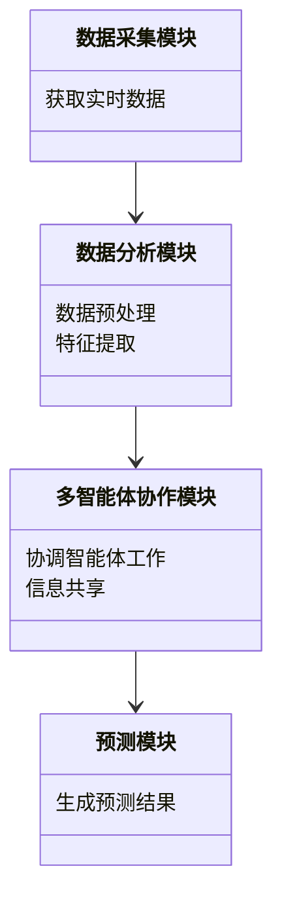
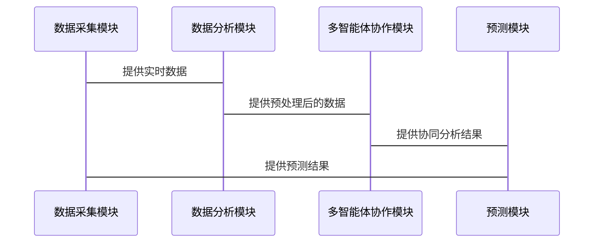

                 


# 第四部分: 系统分析与架构设计方案

# 第4章: 系统分析与架构设计方案

## 4.1 问题场景介绍

在金融市场中，识别市场转折点是一个极具挑战性的任务。市场参与者需要实时监控市场数据，并根据复杂的变化做出快速决策。传统的市场分析方法往往依赖于单智能体系统，难以处理金融市场中复杂、多变的环境。多智能体系统通过多个智能体的协作，能够更好地捕捉市场中的复杂动态，为市场转折点的识别提供更准确的预测。

### 4.1.1 问题背景

金融市场是一个高度动态和不确定的环境，市场参与者需要实时分析大量的数据，包括股票价格、成交量、市场情绪等。传统的市场分析方法，如单一的机器学习模型，往往难以捕捉市场的复杂性，尤其是在市场发生转折点时，单一模型可能会因为数据不足或模型的局限性而导致预测失败。

### 4.1.2 问题描述

市场转折点的识别需要考虑多个因素，包括市场趋势的变化、市场参与者的行为模式、外部事件的影响等。单一智能体系统难以同时处理这些复杂因素，而多智能体系统通过多个智能体的协作，可以分别关注不同的市场因素，并通过协同工作提高预测的准确性。

### 4.1.3 问题解决

通过引入多智能体系统，可以将市场分析任务分解为多个子任务，分别由不同的智能体负责。例如，一个智能体负责分析市场趋势，另一个智能体负责分析市场情绪，多个智能体协同工作，共同识别市场转折点。

### 4.1.4 约束条件

在设计多智能体系统时，需要考虑系统的实时性、准确性和可扩展性。系统的实时性要求智能体能够快速处理市场数据；准确性要求智能体的预测结果能够准确识别市场转折点；可扩展性要求系统能够适应市场的变化，支持新的智能体的加入。

---

## 4.2 系统功能设计

### 4.2.1 系统功能概述

本系统是一个基于多智能体的市场转折点识别系统，主要包括以下几个功能模块：

1. **数据采集模块**：从多个数据源获取实时的市场数据，包括股票价格、成交量、市场情绪等。
2. **数据分析模块**：对市场数据进行预处理和特征提取，为后续的预测提供基础。
3. **多智能体协作模块**：协调多个智能体的工作，实现智能体之间的信息共享和协同决策。
4. **预测模块**：基于多智能体的分析结果，生成市场转折点的预测结果。

### 4.2.2 数据流分析

以下是系统的数据流分析图：

```mermaid
graph TD
    A[数据源] -> B[数据采集模块]
    B -> C[数据分析模块]
    C -> D[多智能体协作模块]
    D -> E[预测模块]
    E -> F[输出结果]
```

### 4.2.3 功能模块详细设计

#### 数据采集模块

数据采集模块负责从多个数据源获取实时的市场数据，包括：

- **股票价格**：包括开盘价、收盘价、最高价、最低价等。
- **成交量**：包括成交额、交易量等。
- **市场情绪**：包括新闻、社交媒体 sentiment 分析等。

#### 数据分析模块

数据分析模块对采集到的市场数据进行预处理和特征提取，包括：

- 数据清洗：去除噪声数据，处理缺失值。
- 特征提取：提取有用的特征，如移动平均线、相对强弱指数（RSI）等。
- 数据转换：将数据转换为适合模型输入的格式。

#### 多智能体协作模块

多智能体协作模块负责协调多个智能体的工作，实现智能体之间的信息共享和协同决策。每个智能体负责不同的市场分析任务，例如：

- 智能体1：负责分析市场趋势。
- 智能体2：负责分析市场情绪。
- 智能体3：负责分析市场参与者的行为模式。

#### 预测模块

预测模块基于多智能体的分析结果，生成市场转折点的预测结果。预测模型可以是基于机器学习的模型，如支持向量机（SVM）、随机森林（Random Forest）等。

---

## 4.3 系统架构设计

### 4.3.1 架构风格选择

本系统采用分层架构（Layered Architecture），将系统划分为数据层、业务逻辑层和应用层。分层架构有助于系统的模块化和可维护性。

### 4.3.2 模块划分与交互关系

以下是系统的模块划分与交互关系图：



### 4.3.3 系统扩展性设计

为了提高系统的可扩展性，系统设计了模块化的接口。每个模块都可以独立运行，并通过标准接口与其他模块进行交互。例如，数据采集模块可以通过 REST API 提供数据，数据分析模块可以通过消息队列接收数据。

---

## 4.4 系统接口设计

### 4.4.1 模块间接口

系统中的模块间接口设计如下：

1. **数据采集模块与数据分析模块接口**：
   - 数据采集模块通过 REST API 提供实时数据。
   - 数据分析模块通过消息队列接收数据。

2. **数据分析模块与多智能体协作模块接口**：
   - 数据分析模块通过数据库存储预处理后的数据。
   - 多智能体协作模块通过数据库查询数据。

3. **多智能体协作模块与预测模块接口**：
   - 多智能体协作模块通过消息队列发送预测结果。
   - 预测模块通过 REST API 提供预测结果。

### 4.4.2 接口设计示例

以下是数据采集模块与数据分析模块的接口设计示例：

```python
# 数据采集模块接口
class DataCollector:
    def get_data(self, source):
        # 返回从指定数据源获取的实时数据
        pass

# 数据分析模块接口
class DataAnalyzer:
    def preprocess_data(self, data):
        # 对数据进行预处理
        pass
```

---

## 4.5 系统交互流程设计

### 4.5.1 交互流程概述

系统的交互流程如下：

1. 数据采集模块从多个数据源获取实时数据。
2. 数据分析模块对数据进行预处理和特征提取。
3. 多智能体协作模块协调多个智能体的工作，实现信息共享和协同决策。
4. 预测模块基于多智能体的分析结果，生成市场转折点的预测结果。
5. 系统输出预测结果。

### 4.5.2 交互流程图

以下是系统的交互流程图：



---

## 4.6 本章小结

在本章中，我们对多智能体系统在市场转折点识别中的系统架构和设计进行了详细分析。通过分层架构的设计，我们明确了系统的各个功能模块及其交互关系。同时，我们设计了模块化的接口，提高了系统的可扩展性和可维护性。通过多智能体协作模块的引入，我们实现了智能体之间的信息共享和协同决策，为市场转折点的识别提供了更准确的预测结果。

