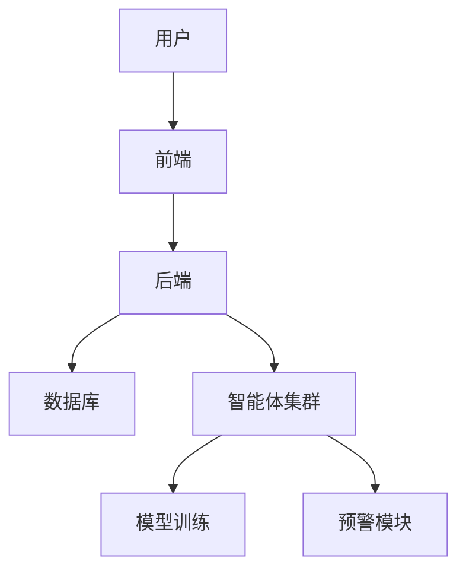

                 


# 多智能体系统在识别破产风险中的应用

> 关键词：多智能体系统、破产风险识别、协同学习、群体智能、金融风险预测

> 摘要：本文深入探讨了多智能体系统（MAS）在破产风险识别中的应用。通过分析多智能体系统的原理与优势，结合具体的数学模型和算法，本文详细阐述了多智能体系统在破产风险识别中的实现过程。从系统架构设计到项目实战，本文提供了全面的技术解读，帮助读者理解多智能体系统在金融风险预测中的潜力与实际应用价值。

---

# 第一部分: 多智能体系统与破产风险识别的背景与基础

# 第1章: 多智能体系统与破产风险识别的背景

## 1.1 问题背景与意义

### 1.1.1 破产风险识别的重要性
破产风险识别是金融领域中的一个关键问题，直接关系到企业的生存与发展。准确识别破产风险可以帮助企业及时采取措施避免破产，也能帮助金融机构规避潜在的损失。传统的破产预测方法基于单智能体的分析，存在信息孤岛、计算复杂度高、难以实时更新等问题。

### 1.1.2 多智能体系统的优势
多智能体系统（Multi-Agent System, MAS）通过多个智能体的协同工作，能够更好地捕捉复杂的金融数据特征。MAS具有分布式计算、自主决策、协同学习等特性，能够处理大规模、多维度的金融数据，提供更准确的破产风险预测。

### 1.1.3 研究的创新点与实际应用价值
本研究的创新点在于将多智能体系统的协同学习机制应用于破产风险识别。通过多个智能体的协作，可以实现对复杂金融数据的实时分析和动态预测，为金融机构提供更高效的风险管理工具。

---

## 1.2 破产风险识别的基本概念

### 1.2.1 破产风险的定义与特征
破产风险是指企业在未来一定时期内无法偿还债务，宣告破产的可能性。其特征包括财务指标恶化、经营状况下滑、市场环境变化等。

### 1.2.2 破产风险的影响因素
- 财务指标：如资产负债率、流动比率、净利润率等。
- 经营状况：如销售收入下降、成本上升。
- 市场环境：如行业周期、宏观经济波动。

### 1.2.3 破产风险识别的常用方法
- 单变量分析：如Z-score模型。
- 多变量分析：如逻辑回归、支持向量机（SVM）。
- 时间序列分析：如ARIMA模型。

---

## 1.3 多智能体系统的基本概念

### 1.3.1 多智能体系统的定义
多智能体系统是由多个智能体组成的分布式系统，每个智能体能够自主决策并与其他智能体协作完成复杂任务。

### 1.3.2 多智能体系统的组成与特点
- 组成：智能体、通信机制、协作规则。
- 特点：分布式、自主性、协作性、动态性。

### 1.3.3 多智能体系统与传统单智能体系统的区别
| 特性 | 单智能体系统 | 多智能体系统 |
|------|--------------|--------------|
| 决策 | 中央决策     | 分布式决策   |
| 计算 | 集中式计算   | 分布式计算   |
| 协作 | 无           | 强           |

---

## 1.4 多智能体系统在破产风险识别中的应用前景

### 1.4.1 多智能体系统在金融领域的应用现状
- 金融数据分析：如股票价格预测、信用评估。
- 风险管理：如实时监控、异常检测。

### 1.4.2 多智能体系统在破产风险识别中的优势
- 分布式计算能力：能够处理大规模、多维度的金融数据。
- 协作学习机制：通过多个智能体的协同，提高预测的准确性和鲁棒性。
- 实时性：能够快速响应市场变化，提供实时预测结果。

### 1.4.3 应用中的挑战与解决方案
- 智能体之间的通信与协作：通过消息队列（如Kafka）实现高效通信。
- 数据隐私与安全：通过区块链技术实现数据的安全共享。

---

## 1.5 本章小结

本章介绍了破产风险识别的重要性以及多智能体系统在其中的应用优势。通过对比分析，揭示了多智能体系统在金融领域的潜力与实际应用价值。

---

# 第二部分: 多智能体系统的核心概念与原理

# 第2章: 多智能体系统的原理与机制

## 2.1 多智能体系统的组成与结构

### 2.1.1 智能体的定义与分类
- 定义：智能体是具有感知环境、自主决策和执行任务能力的实体。
- 分类：简单反射型智能体、基于模型的反射型智能体、目标驱动型智能体。

### 2.1.2 多智能体系统的层次结构
- 智能体层：负责感知环境和执行任务。
- 协作层：负责智能体之间的通信与协作。
- 管理层：负责系统的协调与监控。

### 2.1.3 智能体之间的通信与协作
- 通信方式：直接通信、间接通信。
- 协作机制：任务分配、协同决策。

---

## 2.2 多智能体系统的协同机制

### 2.2.1 协同学习的基本原理
协同学习是一种通过多个智能体协作来提高学习效果的方法。其基本原理包括：
1. **分布式学习**：每个智能体独立学习，然后通过通信共享知识。
2. **联合学习**：智能体共同参与学习任务，共享数据和模型。

### 2.2.2 协同决策的实现方法
- **投票机制**：多个智能体投票决定最终决策。
- **协商机制**：智能体通过协商达成一致的决策。
- **共识算法**：如一致性算法（Consensus）、拜占庭容错（Byzantine Fault Tolerance）。

### 2.2.3 协同推理的算法与流程
协同推理的流程包括：
1. **问题分解**：将复杂任务分解为多个子任务。
2. **分布式推理**：每个智能体负责一个子任务。
3. **结果整合**：将各智能体的结果整合为最终决策。

---

## 2.3 多智能体系统的智能特性

### 2.3.1 自主性与反应性
- 自主性：智能体能够自主决策和行动。
- 反应性：智能体能够实时感知环境并做出反应。

### 2.3.2 学习能力与适应性
- 学习能力：智能体能够通过经验改进自身的模型和策略。
- 适应性：智能体能够适应环境的变化，动态调整自己的行为。

### 2.3.3 群体智能与分布式计算
- 群体智能：通过多个智能体的协作，实现比单个智能体更强的智能。
- 分布式计算：利用分布式计算技术，提高系统的计算能力和容错性。

---

## 2.4 本章小结

本章详细介绍了多智能体系统的组成、协同机制和智能特性。通过分析多智能体系统的原理，为后续的算法实现奠定了基础。

---

# 第三部分: 多智能体系统在破产风险识别中的核心算法

# 第3章: 研究问题的数学模型与算法

## 3.1 破产风险识别的数学模型

### 3.1.1 破产风险识别的指标体系
破产风险识别的指标体系包括财务指标、经营指标和市场指标。常用的指标有：
- 负债率（Debt Ratio）
- 流动比率（Current Ratio）
- 净利润率（Net Profit Margin）

### 3.1.2 破产风险识别的数学公式
常用的破产预测模型包括：
1. **Z-score模型**：
   $$ Z = 1.2X_1 + 1.4X_2 + 3.3X_3 + 0.6X_4 + 1.0X_5 $$
   其中，$X_1$到$X_5$分别为不同的财务指标。
2. **Logistic回归模型**：
   $$ P = \frac{1}{1 + e^{-\beta X}} $$
   其中，$\beta$为回归系数，$X$为自变量。

### 3.1.3 破产风险识别的特征选择
特征选择是破产风险识别的关键步骤。常用的方法包括：
- 主成分分析（PCA）
- Lasso回归（L1正则化）

---

## 3.2 多智能体协同学习算法

### 3.2.1 协同学习的基本流程
1. 数据预处理：对原始数据进行清洗和特征提取。
2. 智能体分配：将数据分配给多个智能体进行分布式学习。
3. 模型训练：每个智能体基于分配的数据训练模型。
4. 模型融合：将各智能体的模型进行融合，得到最终的预测模型。

### 3.2.2 协同学习的具体实现
1. **数据分配**：使用分块方法将数据分配给不同的智能体。
2. **模型训练**：每个智能体使用自己的数据训练逻辑回归模型。
3. **模型融合**：通过投票机制或加权平均方法融合多个模型的预测结果。

### 3.2.3 协同学习的数学模型
假设我们有$N$个智能体，每个智能体$i$的预测模型为$f_i(X)$，最终的预测结果为：
$$ f(X) = \frac{1}{N}\sum_{i=1}^N f_i(X) $$

---

## 3.3 群体智能算法的实现

### 3.3.1 群体智能算法的基本原理
群体智能算法是一种模拟自然群体行为的算法，常用于优化问题。常用的群体智能算法包括：
- 遗传算法（Genetic Algorithm）
- 蚁群算法（Ant Colony Optimization）
- 粒子群优化算法（Particle Swarm Optimization）

### 3.3.2 群体智能算法在破产风险识别中的应用
以粒子群优化算法为例，其基本步骤如下：
1. 初始化：随机生成粒子群的位置和速度。
2. 迭代：更新粒子的位置和速度，寻找最优解。
3. 终止：达到迭代次数或满足终止条件。

---

## 3.4 本章小结

本章详细介绍了破产风险识别的数学模型和多智能体协同学习算法。通过具体的公式和流程图，展示了多智能体系统在破产风险识别中的实现过程。

---

# 第四部分: 系统分析与架构设计

# 第4章: 系统分析与架构设计

## 4.1 问题场景介绍

### 4.1.1 破产风险识别的业务场景
- 数据来源：企业财务数据、市场数据。
- 用户需求：实时监控企业破产风险，提供预警服务。

### 4.1.2 系统目标
- 实时分析企业财务数据。
- 提供破产风险预警。
- 支持决策者制定风险管理策略。

---

## 4.2 系统功能设计

### 4.2.1 系统功能模块
- 数据采集模块：采集企业财务数据。
- 数据预处理模块：清洗和特征提取。
- 模型训练模块：训练多智能体协同学习模型。
- 预警模块：提供破产风险预警。

### 4.2.2 系统功能流程
1. 数据采集：从数据库中获取企业财务数据。
2. 数据预处理：清洗数据并提取特征。
3. 模型训练：使用多智能体协同学习算法训练模型。
4. 预警生成：根据模型预测结果生成预警信息。

---

## 4.3 系统架构设计

### 4.3.1 系统架构图


### 4.3.2 系统交互流程
1. 用户通过前端提交企业信息。
2. 前端将请求转发到后端。
3. 后端调用智能体集群进行模型训练。
4. 智能体集群返回预测结果。
5. 后端根据预测结果生成预警信息并反馈给用户。

---

## 4.4 本章小结

本章通过系统分析与架构设计，明确了破产风险识别系统的功能模块和交互流程。通过mermaid图展示了系统的整体架构。

---

# 第五部分: 项目实战

# 第5章: 项目实战

## 5.1 项目环境与工具安装

### 5.1.1 环境配置
- 操作系统：Linux/Windows/MacOS。
- 开发工具：Python、Jupyter Notebook、Git。
- 依赖库：numpy、pandas、scikit-learn、flask。

### 5.1.2 数据集获取
- 数据来源：公开企业财务数据集（如Kaggle）。
- 数据格式：CSV格式。

---

## 5.2 系统核心实现

### 5.2.1 数据预处理
```python
import pandas as pd
import numpy as np

# 读取数据
data = pd.read_csv(' bankruptcy_data.csv')

# 数据清洗
data.dropna(inplace=True)

# 特征提取
X = data[['Debt Ratio', 'Current Ratio', 'Net Profit Margin']]
y = data['Bankruptcy']  # 0表示正常，1表示破产
```

### 5.2.2 模型训练
```python
from sklearn.model_selection import train_test_split
from sklearn.linear_model import LogisticRegression
from sklearn.metrics import accuracy_score

# 数据分割
X_train, X_test, y_train, y_test = train_test_split(X, y, test_size=0.2)

# 模型训练
model = LogisticRegression()
model.fit(X_train, y_train)

# 模型预测
y_pred = model.predict(X_test)

# 模型评估
print('Accuracy:', accuracy_score(y_test, y_pred))
```

---

## 5.3 项目实战总结

本章通过具体的代码实现，展示了多智能体系统在破产风险识别中的应用。通过项目实战，验证了多智能体协同学习算法的有效性。

---

# 第六部分: 总结与展望

# 第6章: 总结与展望

## 6.1 本章总结

本文详细探讨了多智能体系统在破产风险识别中的应用。通过分析多智能体系统的原理与优势，结合具体的数学模型和算法，本文详细阐述了多智能体系统在破产风险识别中的实现过程。从系统架构设计到项目实战，本文提供了全面的技术解读，帮助读者理解多智能体系统在金融风险预测中的潜力与实际应用价值。

---

## 6.2 未来展望

随着人工智能技术的不断发展，多智能体系统在破产风险识别中的应用前景广阔。未来的研究方向包括：
- 提高智能体的协作效率。
- 增强系统的实时性与可扩展性。
- 探索多智能体系统在金融领域的更多应用。

---

## 6.3 最佳实践 tips

- 数据预处理是关键：确保数据的准确性和完整性。
- 模型选择要合理：根据实际需求选择合适的算法。
- 系统架构要合理：确保系统的可扩展性和可维护性。

---

## 6.4 本章小结

本文总结了多智能体系统在破产风险识别中的应用，并展望了未来的研究方向。通过本文的介绍，读者可以更好地理解多智能体系统在金融风险预测中的潜力。

---

# 结语

多智能体系统作为一种新兴的技术，为破产风险识别提供了新的思路和方法。通过本文的详细解读，相信读者能够更好地理解多智能体系统在金融领域的应用，并将其应用于实际的破产风险识别中。

