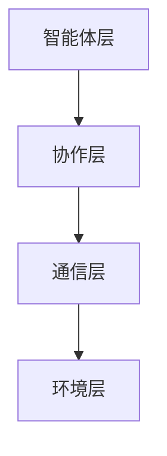
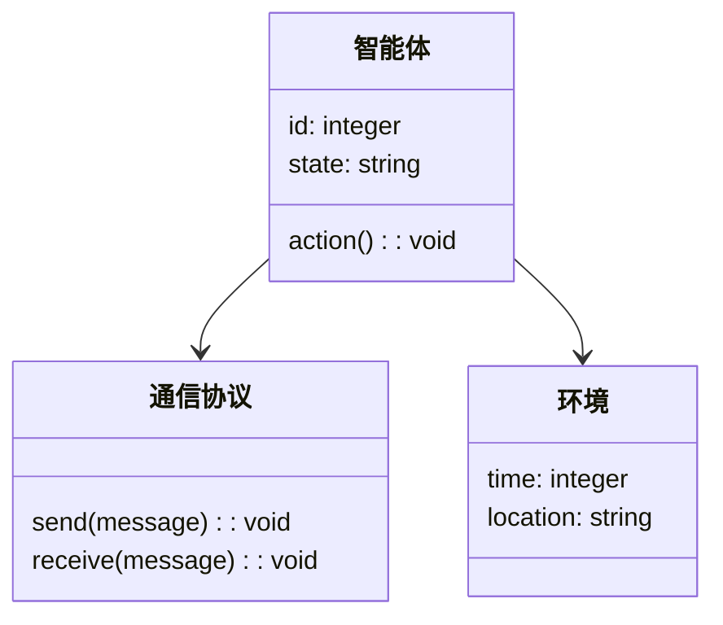
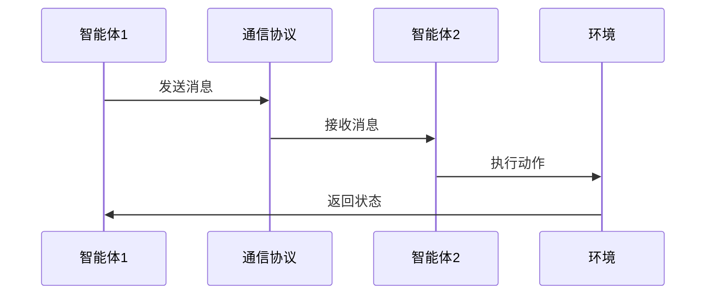

                 


# 多智能体系统在识别行业转型和颠覆性创新中的作用

> **关键词**：多智能体系统、行业转型、颠覆性创新、人工智能、系统架构、协调协作

> **摘要**：多智能体系统（Multi-Agent Systems, MAS）通过智能体之间的协调与协作，为各个行业的数字化转型和创新提供了新的可能性。本文将深入探讨多智能体系统的核心概念、算法原理、系统设计以及实际应用案例，分析其在行业转型和颠覆性创新中的关键作用。

---

## 第1章 多智能体系统概述

### 1.1 多智能体系统的基本概念

#### 1.1.1 多智能体系统的定义

多智能体系统（MAS）是由多个智能体（Agent）组成的分布式系统，这些智能体能够感知环境、自主决策并协作完成特定任务。智能体可以是软件程序、机器人或其他智能设备，它们通过通信和协作实现目标。

#### 1.1.2 多智能体系统的特点

| 特性 | 描述 |
|------|------|
| 分布式 | 智能体独立运行，无中心化控制 |
| 协作性 | 智能体之间通过通信协作完成任务 |
| 自主性 | 每个智能体都有自主决策能力 |
| 反应性 | 能够实时感知环境变化并做出反应 |

#### 1.1.3 多智能体系统与单智能体系统的区别

| 属性 | 单智能体系统 | 多智能体系统 |
|------|-------------|--------------|
| 结构 | 单一中心节点 | 分布式结构 |
| 决策 | 中央决策 | 分布式决策 |
| 通信 | 无 | 智能体之间通信 |

### 1.2 多智能体系统的组成与结构

#### 1.2.1 多智能体系统的组成要素

- **智能体**：具备感知、决策、执行能力的个体。
- **环境**：智能体所处的物理或数字环境。
- **通信协议**：智能体之间交互的规则和格式。
- **任务目标**：系统需要完成的具体目标。

#### 1.2.2 多智能体系统的层次结构



#### 1.2.3 多智能体系统的通信机制

- **消息传递**：智能体通过发送消息进行通信。
- **订阅发布**：基于主题的通信模式。
- **请求响应**：智能体间通过请求和响应进行交互。

---

## 第2章 多智能体系统的理论基础

### 2.1 多智能体系统的协调与协作

#### 2.1.1 协调的定义与作用

协调是指多个智能体在完成任务时，通过同步行动或共享信息以减少冲突。协调的作用包括提高效率、避免冲突和确保目标达成。

#### 2.1.2 协作的定义与作用

协作是智能体之间为了共同目标而共同努力的过程。协作能够提高系统的整体性能，增强系统的适应性和灵活性。

#### 2.1.3 协调与协作的实现方法

- **一致性算法**：确保多个智能体的状态一致。
- **博弈论**：通过策略选择最优行动。
- **分布式计算**：在分布式环境中实现协调和协作。

### 2.2 多智能体系统的通信协议

#### 2.2.1 通信协议的定义

通信协议是智能体之间进行信息交换的规则和格式，确保信息的有效传递和理解。

#### 2.2.2 常见的通信协议类型

- **基于消息的协议**：如HTTP、WebSocket。
- **基于主题的协议**：如AMQP、MQTT。
- **基于服务的协议**：如RESTful API。

#### 2.2.3 通信协议的设计原则

- **简洁性**：协议应简单易用。
- **可靠性**：确保信息准确传递。
- **可扩展性**：支持多种应用场景。

### 2.3 多智能体系统的分布式计算

#### 2.3.1 分布式计算的定义

分布式计算是指在多个计算节点上进行任务分配和处理，充分利用计算资源。

#### 2.3.2 分布式计算的特点

- **资源利用率高**：充分利用多个节点的计算能力。
- **容错性好**：部分节点故障不影响整体系统。
- **扩展性强**：易于扩展计算能力。

#### 2.3.3 分布式计算在多智能体系统中的应用

- **任务分配**：将任务分配给多个智能体。
- **负载均衡**：平衡各个节点的负载。
- **数据同步**：确保各个智能体的数据一致性。

---

## 第3章 多智能体系统的算法原理

### 3.1 多智能体系统的协调算法

#### 3.1.1 基于一致性算法的协调

一致性算法用于确保多个智能体的状态一致，常见的算法包括：

- **Paxos算法**：用于分布式系统中的共识达成。
- **Raft算法**：Paxos的优化版本，用于领导者选举和日志同步。

#### 3.1.2 基于博弈论的协调

博弈论通过分析智能体的策略选择，找到最优解。例如，在囚徒困境问题中，智能体通过博弈论找到最优策略。

#### 3.1.3 基于分布式计算的协调

通过分布式计算，智能体可以在不依赖中心节点的情况下完成任务协调。

### 3.2 多智能体系统的协作算法

#### 3.2.1 基于任务分配的协作

任务分配算法将任务分配给最适合的智能体，例如基于负载均衡的任务分配算法。

#### 3.2.2 基于资源分配的协作

资源分配算法确保资源的合理分配，避免资源浪费和冲突。

#### 3.2.3 基于角色分配的协作

角色分配算法为智能体分配不同的角色，例如领导者和执行者。

### 3.3 多智能体系统的通信算法

#### 3.3.1 基于消息传递的通信

智能体通过发送消息进行通信，消息传递的顺序和方式直接影响系统的性能。

#### 3.3.2 基于协议的通信

遵循特定的通信协议，确保智能体之间的信息交换高效可靠。

#### 3.3.3 基于中间件的通信

通过中间件实现智能体之间的通信，例如使用RabbitMQ进行消息队列管理。

---

## 第4章 多智能体系统的数学模型与公式

### 4.1 多智能体系统的数学模型

#### 4.1.1 基于状态的数学模型

$$ S = \{s_1, s_2, ..., s_n\} $$

其中，$S$ 表示系统状态，$s_i$ 表示第$i$个智能体的状态。

#### 4.1.2 基于行为的数学模型

$$ A = \{a_1, a_2, ..., a_n\} $$

其中，$A$ 表示智能体的行为，$a_i$ 表示第$i$个智能体的行为。

#### 4.1.3 基于任务的数学模型

$$ T = \{t_1, t_2, ..., t_n\} $$

其中，$T$ 表示任务集合，$t_i$ 表示第$i$个任务。

### 4.2 多智能体系统的公式推导

#### 4.2.1 协调算法的公式推导

假设系统中有$n$个智能体，每个智能体的状态为$s_i$，通过一致性算法达到一致状态$s$：

$$ s = \arg\max_{s_i} \sum_{i=1}^n s_i $$

#### 4.2.2 协作算法的公式推导

任务分配问题可以表示为一个优化问题：

$$ \min_{x_i} \sum_{i=1}^n c_i x_i $$

其中，$x_i$ 表示分配给智能体$i$的任务数量，$c_i$ 表示智能体$i$的处理成本。

#### 4.2.3 通信算法的公式推导

消息传递的延迟可以通过以下公式计算：

$$ D = \sum_{i=1}^n t_i $$

其中，$t_i$ 表示智能体$i$发送消息的时间。

---

## 第5章 多智能体系统的系统分析与架构设计

### 5.1 系统分析

#### 5.1.1 问题场景介绍

在物流行业中，多智能体系统可以用于优化货物配送路径，提高效率。

#### 5.1.2 项目介绍

本项目旨在通过多智能体系统实现智能物流管理，包括路径优化、资源分配等功能。

#### 5.1.3 系统功能设计

- **路径优化**：智能体协同计算最优配送路径。
- **资源分配**：智能体根据负载动态分配任务。
- **实时监控**：智能体实时监控配送过程。

### 5.2 系统架构设计

#### 5.2.1 领域模型设计（使用Mermaid类图）



#### 5.2.2 系统架构设计（使用Mermaid架构图）


#### 5.2.3 系统接口设计

- **智能体接口**：提供感知环境、决策和执行的接口。
- **通信接口**：提供消息发送和接收的接口。
- **环境接口**：提供与环境交互的接口。

#### 5.2.4 系统交互设计（使用Mermaid序列图）



---

## 第6章 多智能体系统的项目实战

### 6.1 环境安装与配置

#### 6.1.1 开发环境的选择

推荐使用Python和Django框架进行开发。

#### 6.1.2 开发工具的安装

安装Python、Django、RabbitMQ等工具。

#### 6.1.3 环境配置

配置开发环境，包括安装依赖库、设置开发环境变量等。

### 6.2 系统核心实现源代码

#### 6.2.1 智能体类实现

```python
class Agent:
    def __init__(self, id):
        self.id = id
        self.state = "idle"
    
    def send_message(self, message):
        # 实现消息发送逻辑
        pass
    
    def receive_message(self, message):
        # 实现消息接收逻辑
        pass
```

#### 6.2.2 通信协议实现

```python
class CommunicationProtocol:
    def __init__(self):
        self.agents = []
    
    def send(self, sender, message):
        # 实现消息发送逻辑
        pass
    
    def receive(self, receiver, message):
        # 实现消息接收逻辑
        pass
```

### 6.3 代码应用解读与分析

#### 6.3.1 代码功能说明

- **Agent类**：实现智能体的基本功能，包括发送和接收消息。
- **CommunicationProtocol类**：实现智能体之间的通信协议。

#### 6.3.2 代码实现细节

- **消息传递**：使用队列机制实现异步通信。
- **状态管理**：通过状态变量跟踪智能体的执行状态。

### 6.4 实际案例分析

#### 6.4.1 案例背景

以智能物流管理为例，多个智能体协同完成货物配送任务。

#### 6.4.2 案例分析

智能体通过通信协议实时交换信息，优化配送路径，提高效率。

### 6.5 项目小结

通过项目实战，我们掌握了多智能体系统的实现方法，验证了其在实际应用中的有效性和可行性。

---

## 第7章 最佳实践、小结与注意事项

### 7.1 最佳实践 tips

- **模块化设计**：将系统划分为多个模块，便于维护和扩展。
- **测试与调试**：通过单元测试和集成测试确保系统稳定。
- **安全性设计**：加强系统安全性，防止恶意攻击。

### 7.2 小结

多智能体系统通过智能体之间的协调与协作，为行业转型和创新提供了强大的技术支持。

### 7.3 注意事项

- **系统复杂性**：多智能体系统设计复杂，需要充分考虑各种边界情况。
- **性能优化**：在大规模应用中，需要优化系统的性能和扩展性。
- **安全性问题**：确保系统的通信安全和数据安全。

### 7.4 拓展阅读

- **推荐书籍**：《Multi-Agent Systems: Complexity, Decentralization, and Adaptation》
- **推荐论文**：相关领域的最新研究论文。

---

# 结语

多智能体系统作为一种新兴的技术，正在逐步改变各个行业的运作方式。通过本文的详细分析和实际案例，我们相信多智能体系统将在未来发挥更加重要的作用，推动行业的转型和创新。

--- 

希望这篇文章能为您提供有价值的信息和启发！

