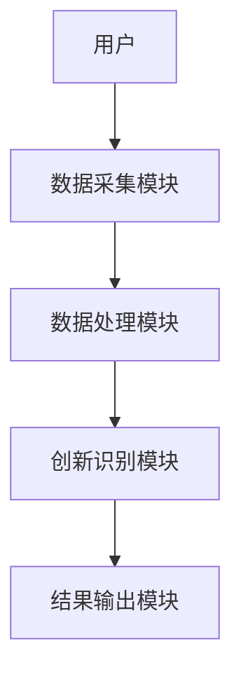

                 


# 多智能体系统在识别行业颠覆性创新中的应用

> 关键词：多智能体系统，颠覆性创新，创新识别，协作学习，分布式计算

> 摘要：本文探讨了多智能体系统在识别行业颠覆性创新中的应用，分析了多智能体系统的定义、核心概念与原理，以及如何通过协作学习和分布式计算等算法实现创新识别。通过案例分析和项目实战，展示了多智能体系统在实际应用中的优势和挑战，并提出了未来的发展方向。

---

## 第1章: 多智能体系统与颠覆性创新概述

### 1.1 多智能体系统的基本概念

#### 1.1.1 多智能体系统的定义

多智能体系统（Multi-Agent System, MAS）是由多个智能体（Agent）组成的分布式系统，每个智能体都是一个能够感知环境、自主决策并采取行动的实体。智能体之间通过通信和协作完成复杂任务。

#### 1.1.2 多智能体系统的特征

- **分布式性**：智能体独立运行，无中心节点。
- **协作性**：智能体之间通过协作完成共同目标。
- **自主性**：每个智能体都能自主决策。
- **反应性**：智能体能实时感知环境并做出反应。

#### 1.1.3 多智能体系统的应用场景

- **分布式计算**：如分布式任务分配。
- **智能协作**：如多智能体游戏。
- **问题求解**：如分布式问题求解。

### 1.2 颠覆性创新的基本概念

#### 1.2.1 颠覆性创新的定义

颠覆性创新是指通过引入新技术或新商业模式，彻底改变行业现状，创造新市场或市场替代品的创新。

#### 1.2.2 颠覆性创新的特征

- **破坏性**：颠覆现有市场。
- **创新性**：引入新技术或新方法。
- **市场性**：创造新市场或替代现有产品。

#### 1.2.3 颠覆性创新的识别方法

- **数据驱动**：通过数据分析识别潜在创新。
- **知识驱动**：结合领域知识进行分析。
- **综合驱动**：结合数据和知识进行识别。

### 1.3 多智能体系统与颠覆性创新的关系

#### 1.3.1 多智能体系统在创新识别中的作用

- **信息收集**：多智能体系统能够广泛收集行业数据。
- **协作分析**：通过协作分析识别潜在创新点。
- **实时反馈**：实时反馈环境变化，快速调整策略。

#### 1.3.2 多智能体系统与颠覆性创新的结合

- **分布式协作**：多智能体系统能够分布式协作，高效识别创新。
- **实时响应**：能够快速响应市场变化，抓住创新机会。
- **学习能力**：通过机器学习提升创新识别的准确性。

#### 1.3.3 多智能体系统在识别颠覆性创新中的优势

- **高效性**：通过分布式计算提高效率。
- **协作性**：通过协作提升识别准确性。
- **适应性**：能够快速适应市场变化。

### 1.4 本章小结

本章介绍了多智能体系统的基本概念、特征和应用场景，探讨了颠覆性创新的定义、特征和识别方法，并分析了多智能体系统在识别颠覆性创新中的作用和优势。

---

## 第2章: 多智能体系统的核心概念与原理

### 2.1 多智能体系统的结构

#### 2.1.1 智能体的定义与特征

- **智能体定义**：智能体是具有感知、决策、行动和学习能力的实体。
- **自主性**：能够自主决策。
- **反应性**：能够实时感知环境并做出反应。
- **社会性**：能够与其它智能体协作。

#### 2.1.2 多智能体系统的层次结构

- **物理层**：智能体的物理实体。
- **行为层**：智能体的行为决策。
- **协作层**：智能体之间的协作机制。
- **认知层**：智能体的认知能力。

#### 2.1.3 多智能体系统的通信机制

- **通信协议**：定义智能体之间的通信规则。
- **信息交换**：智能体之间交换信息。
- **通信网络**：智能体之间的通信网络。

### 2.2 多智能体系统的协作机制

#### 2.2.1 协作的基本概念

- **协作目标**：协作的目的是完成共同任务。
- **协作方式**：通过通信和协作完成任务。
- **协作规则**：定义协作的规则和流程。

#### 2.2.2 协作的实现方法

- **分布式协作**：智能体独立协作完成任务。
- **集中式协作**：通过中心节点协调协作。
- **混合式协作**：结合分布式和集中式协作。

#### 2.2.3 协作中的冲突解决

- **冲突检测**：检测协作中的冲突。
- **冲突解决**：通过协商或仲裁解决冲突。
- **冲突预防**：预防冲突的发生。

### 2.3 多智能体系统的学习机制

#### 2.3.1 机器学习在多智能体系统中的应用

- **监督学习**：通过标注数据进行学习。
- **无监督学习**：通过无标注数据进行学习。
- **强化学习**：通过奖励机制进行学习。

#### 2.3.2 加强学习在多智能体系统中的应用

- **多智能体强化学习**：多个智能体通过强化学习协作完成任务。
- **策略学习**：学习策略以最大化奖励。
- **价值函数**：通过价值函数评估状态的好坏。

#### 2.3.3 联合学习在多智能体系统中的应用

- **联合学习**：多个智能体共同学习，共享知识。
- **分布式学习**：通过分布式计算进行学习。
- **协作学习**：通过协作完成学习任务。

### 2.4 本章小结

本章详细介绍了多智能体系统的结构、协作机制和学习机制，探讨了机器学习、强化学习和协作学习在多智能体系统中的应用。

---

## 第3章: 多智能体系统在创新识别中的算法

### 3.1 基于分布式计算的创新识别算法

#### 3.1.1 分布式计算的基本概念

- **分布式计算**：通过多台计算节点协作完成计算任务。
- **任务分配**：将任务分配给多个节点。
- **节点协作**：节点之间协作完成任务。

#### 3.1.2 分布式计算在创新识别中的应用

- **数据分发**：将数据分发给多个节点进行处理。
- **并行计算**：通过并行计算加速处理。
- **结果汇总**：将各节点的结果汇总得出最终结果。

#### 3.1.3 分布式计算的实现方法

- **任务划分**：将任务划分为子任务。
- **节点通信**：节点之间通过通信进行协作。
- **负载均衡**：确保各节点负载均衡。

### 3.2 基于协同学习的创新识别算法

#### 3.2.1 协同学习的基本概念

- **协同学习**：多个学习者协作完成学习任务。
- **知识共享**：学习者之间共享知识。
- **协作目标**：通过协作提高学习效果。

#### 3.2.2 协同学习在创新识别中的应用

- **特征提取**：通过协作提取创新特征。
- **模型训练**：通过协作训练创新识别模型。
- **结果优化**：通过协作优化识别结果。

#### 3.2.3 协同学习的实现方法

- **知识共享机制**：定义知识共享的规则。
- **协作学习协议**：定义协作学习的协议。
- **学习结果整合**：整合各学习者的成果。

### 3.3 基于进化算法的创新识别算法

#### 3.3.1 进化算法的基本概念

- **遗传算法**：模拟生物进化过程的算法。
- **选择**：选择适应度高的个体。
- **交叉**：通过交叉操作生成新个体。
- **变异**：通过变异操作引入随机变化。

#### 3.3.2 进化算法在创新识别中的应用

- **个体表示**：将创新点表示为个体。
- **适应度评估**：评估个体的适应度。
- **进化过程**：通过选择、交叉和变异操作进化种群。

#### 3.3.3 进化算法的实现方法

- **种群初始化**：初始化种群。
- **适应度评估**：评估每个个体的适应度。
- **选择操作**：选择适应度高的个体。
- **交叉操作**：进行交叉操作生成新个体。
- **变异操作**：进行变异操作引入随机变化。
- **新种群生成**：生成新的种群。

### 3.4 本章小结

本章介绍了多智能体系统中常用的创新识别算法，包括分布式计算、协同学习和进化算法，并详细探讨了它们的实现方法和应用场景。

---

## 第4章: 多智能体系统在创新识别中的系统设计

### 4.1 系统功能设计

#### 4.1.1 领域模型设计

- **领域模型**：定义系统的功能模块和实体关系。
- **功能模块**：包括数据采集、创新识别和结果输出。
- **实体关系**：描述系统中各实体之间的关系。

#### 4.1.2 系统功能模块设计

- **数据采集模块**：负责采集行业数据。
- **创新识别模块**：负责识别颠覆性创新。
- **结果输出模块**：负责输出识别结果。

#### 4.1.3 系统功能流程设计

- **数据采集**：采集行业数据。
- **数据处理**：对数据进行预处理。
- **创新识别**：通过算法识别创新。
- **结果输出**：输出识别结果。

### 4.2 系统架构设计

#### 4.2.1 系统架构图



#### 4.2.2 系统模块设计

- **数据采集模块**：负责采集行业数据。
- **数据处理模块**：负责对数据进行预处理。
- **创新识别模块**：负责通过算法识别创新。
- **结果输出模块**：负责输出识别结果。

#### 4.2.3 系统接口设计

- **数据接口**：定义数据输入和输出的接口。
- **算法接口**：定义创新识别算法的接口。
- **结果接口**：定义结果输出的接口。

### 4.3 本章小结

本章详细介绍了多智能体系统在创新识别中的系统设计，包括功能设计、架构设计和接口设计。

---

## 第5章: 多智能体系统在创新识别中的项目实战

### 5.1 项目介绍

#### 5.1.1 项目背景

- **项目目标**：识别行业中的颠覆性创新。
- **项目范围**：覆盖多个行业。
- **项目需求**：通过多智能体系统实现创新识别。

#### 5.1.2 项目需求分析

- **数据需求**：需要行业数据。
- **算法需求**：需要创新识别算法。
- **系统需求**：需要系统支持创新识别。

### 5.2 项目核心实现

#### 5.2.1 核心代码实现

```python
class Agent:
    def __init__(self, id):
        self.id = id
        self.data = []
    
    def collect_data(self, data):
        self.data.append(data)
    
    def share_data(self):
        return self.data

def distributed_innovation_detection(agents):
    for agent in agents:
        agent.collect_data(data)
    for agent in agents:
        shared_data = agent.share_data()
        # 处理共享数据，识别创新
        pass
```

#### 5.2.2 代码解读与分析

- **Agent类**：定义智能体类，包含数据收集和数据共享的方法。
- **distributed_innovation_detection函数**：实现分布式创新检测，通过多个智能体协作完成。

### 5.3 实际案例分析

#### 5.3.1 案例介绍

- **行业选择**：互联网行业。
- **数据来源**：互联网行业数据。
- **创新识别**：识别互联网行业的颠覆性创新。

#### 5.3.2 案例分析

- **数据采集**：通过多智能体系统采集互联网行业数据。
- **创新识别**：通过算法识别互联网行业的颠覆性创新。
- **结果输出**：输出识别结果。

### 5.4 项目总结

#### 5.4.1 项目成果

- **创新识别**：成功识别互联网行业的颠覆性创新。
- **系统性能**：系统性能达到预期目标。
- **项目经验**：积累了多智能体系统在创新识别中的应用经验。

#### 5.4.2 项目经验总结

- **协作性**：多智能体系统的协作性是成功的关键。
- **算法选择**：选择合适的算法是项目成功的重要因素。
- **数据质量**：数据质量对创新识别的准确性有重要影响。

### 5.5 本章小结

本章通过实际项目展示了多智能体系统在创新识别中的应用，详细介绍了项目的实现过程和实际案例，并总结了项目的经验和成果。

---

## 第6章: 总结与展望

### 6.1 本章总结

- **多智能体系统**：通过多智能体系统实现了创新识别。
- **算法应用**：通过分布式计算、协同学习和进化算法实现了创新识别。
- **系统设计**：通过系统设计确保了创新识别的高效性和准确性。

### 6.2 未来展望

- **算法优化**：进一步优化创新识别算法，提高识别准确率。
- **系统扩展**：扩展系统的应用范围，覆盖更多行业。
- **技术融合**：将多智能体系统与其他技术融合，提升创新识别能力。

### 6.3 本章小结

本章总结了全文的主要内容，并展望了未来的发展方向。

---

## 结语

通过本文的探讨，我们深入分析了多智能体系统在识别行业颠覆性创新中的应用，详细介绍了多智能体系统的定义、核心算法和系统设计，并通过实际案例展示了其在创新识别中的应用。未来，随着技术的发展，多智能体系统在创新识别中的应用将更加广泛和深入。

---

**参考文献**：

- [此处列出相关参考文献]

