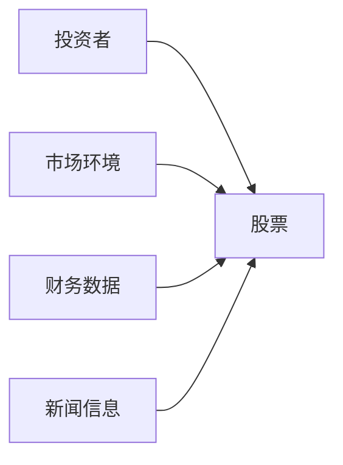
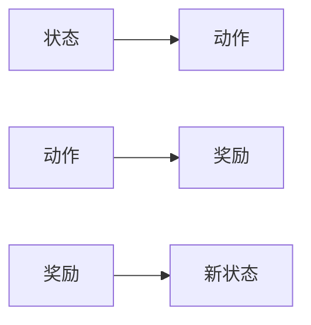
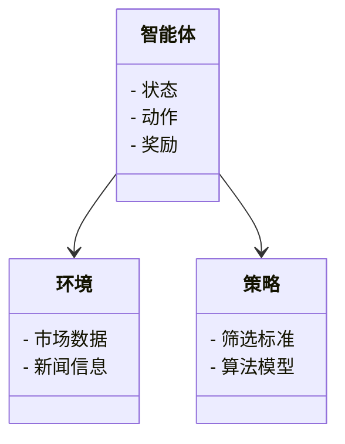
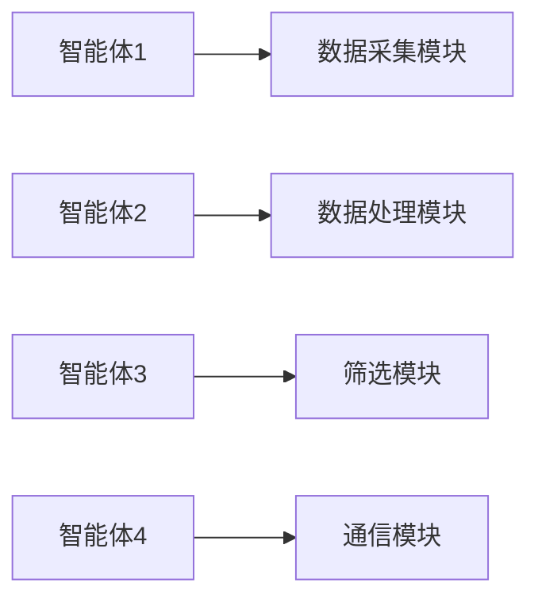

                 


# 第一部分: 多智能体系统与费雪成长股筛选的背景与基础

## 第1章: 多智能体系统与费雪成长股概述

### 1.1 多智能体系统的定义与特点
#### 1.1.1 多智能体系统的定义
多智能体系统（Multi-Agent System，简称MAS）是由多个智能体（Agent）组成的系统，每个智能体都是一个能够感知环境、做出决策并采取行动的实体。智能体之间通过通信和协作，共同完成复杂任务。

#### 1.1.2 多智能体系统的核心特点
- **自主性**：每个智能体都能自主决策。
- **反应性**：智能体能够实时感知环境并做出反应。
- **协作性**：多个智能体协同工作，共同完成任务。
- **分布性**：智能体分布在不同的空间或时间维度上。

#### 1.1.3 多智能体系统与传统单智能体系统的区别
传统单智能体系统由一个中心决策单元完成任务，而多智能体系统通过多个智能体的协作完成任务，具有更高的灵活性和适应性。

### 1.2 费雪成长股的定义与筛选标准
#### 1.2.1 费雪成长股的定义
费雪成长股是指那些收入和利润持续增长的公司股票，通常具有较高的成长性和投资价值。

#### 1.2.2 费雪成长股的筛选标准
- **收入增长**：公司收入持续增长。
- **利润增长**：公司利润持续增长。
- **ROE（净资产收益率）**：ROE较高且持续增长。
- **行业地位**：公司在行业内具有竞争优势。
- **管理团队**：公司管理团队稳定且有较强的能力。

#### 1.2.3 费雪成长股与价值股、周期股的区别
- **价值股**：通常价格低于其内在价值，具有较大的复苏潜力。
- **周期股**：受经济周期影响较大，业绩波动性强。
- **成长股**：业绩持续增长，具有较高的成长潜力。

### 1.3 多智能体系统在金融领域的应用前景
#### 1.3.1 多智能体系统在金融分析中的优势
- **分布式计算**：能够处理海量数据。
- **协同决策**：多个智能体协同工作，提高决策的准确性。
- **实时性**：能够实时感知市场变化并做出反应。

#### 1.3.2 费雪成长股筛选中的痛点与挑战
- **数据复杂性**：金融市场数据复杂且多变。
- **决策不确定性**：市场波动大，决策具有不确定性。
- **信息不完全**：信息获取可能存在不完全性。

#### 1.3.3 多智能体系统在费雪成长股筛选中的创新价值
- **提高筛选效率**：通过多智能体的协同工作，提高数据处理和筛选效率。
- **增强决策准确性**：通过多个智能体的协作，提高筛选结果的准确性。
- **适应市场变化**：能够实时感知市场变化并做出快速反应。

### 1.4 本章小结
本章主要介绍了多智能体系统和费雪成长股的基本概念、特点和筛选标准，并分析了多智能体系统在金融领域的应用前景及其在费雪成长股筛选中的创新价值。

## 第2章: 多智能体系统的核心概念与联系

### 2.1 多智能体系统的组成与结构
#### 2.1.1 实体关系图（ER图）展示


#### 2.1.2 多智能体系统的组成
- **智能体**：负责感知环境、做出决策并采取行动。
- **环境**：智能体所处的外部环境，包括市场数据、新闻信息等。
- **通信机制**：智能体之间的通信方式，如消息传递、共享数据库等。
- **协作机制**：智能体之间的协作规则和协议。

### 2.2 多智能体系统与费雪成长股筛选的关联
#### 2.2.1 多智能体系统在数据处理中的作用
- **数据采集**：智能体从不同来源采集市场数据。
- **数据清洗**：智能体对数据进行预处理，去除噪声数据。
- **数据融合**：智能体将多源数据进行融合，提高数据的准确性和完整性。

#### 2.2.2 费雪成长股筛选中的多智能体协同机制
- **协同过滤**：智能体通过协同过滤算法，筛选出具有相似特征的股票。
- **强化学习**：智能体通过强化学习算法，优化股票筛选策略。
- **图神经网络**：智能体通过图神经网络，挖掘股票之间的关联关系。

#### 2.2.3 多智能体系统对筛选结果的优化作用
- **提高筛选效率**：通过分布式计算，提高数据处理速度。
- **增强筛选准确性**：通过多个智能体的协作，提高筛选结果的准确性。
- **适应市场变化**：通过实时感知市场变化，优化筛选策略。

### 2.3 多智能体系统的核心算法原理
#### 2.3.1 协作过滤算法
协作过滤是一种基于用户相似性推荐物品的算法。在多智能体系统中，协作过滤可以用于股票筛选，通过智能体之间的协作，筛选出具有相似特征的股票。

协作过滤算法的步骤如下：
1. 收集用户（智能体）对股票的评分。
2. 计算用户之间的相似性。
3. 根据相似用户的评分，推荐股票。

#### 2.3.2 强化学习算法
强化学习是一种通过智能体与环境交互，学习最优策略的算法。在多智能体系统中，强化学习可以用于优化股票筛选策略。

强化学习算法的步骤如下：
1. 智能体感知环境状态。
2. 智能体选择动作并执行。
3. 环境给予奖励。
4. 智能体更新策略。

#### 2.3.3 图神经网络算法
图神经网络是一种处理图结构数据的算法。在多智能体系统中，图神经网络可以用于挖掘股票之间的关联关系。

图神经网络算法的步骤如下：
1. 构建股票关联图。
2. 对图进行节点嵌入。
3. 进行分类或回归任务。

### 2.4 本章小结
本章主要介绍了多智能体系统的组成与结构，分析了多智能体系统与费雪成长股筛选的关联，并详细讲解了协作过滤、强化学习和图神经网络等核心算法的原理。

## 第3章: 多智能体系统在费雪成长股筛选中的算法原理

### 3.1 基于强化学习的多智能体协同算法
#### 3.1.1 强化学习的基本原理
强化学习是一种通过智能体与环境交互，学习最优策略的算法。智能体通过感知环境状态、选择动作并执行，从环境中获得奖励，从而优化自己的策略。

#### 3.1.2 多智能体协同中的强化学习模型
在多智能体系统中，强化学习可以用于优化股票筛选策略。每个智能体负责感知不同的市场数据，通过强化学习算法，优化自己的筛选策略，并通过通信机制与其它智能体协同工作。

#### 3.1.3 算法流程图


### 3.2 基于图神经网络的特征提取算法
#### 3.2.1 图神经网络的基本原理
图神经网络是一种处理图结构数据的算法。通过构建股票关联图，可以挖掘股票之间的关联关系，提取有用的特征。

#### 3.2.2 股票关联图的构建
股票关联图可以通过股票之间的相似性构建。相似性可以通过财务数据、市场表现等多种指标计算。

#### 3.2.3 图神经网络的特征提取
通过图神经网络，可以对股票进行节点嵌入，提取每个股票的特征向量。这些特征向量可以用于后续的分类或回归任务。

### 3.3 协作过滤算法在股票筛选中的应用
#### 3.3.1 协作过滤的基本原理
协作过滤是一种基于用户相似性推荐物品的算法。在股票筛选中，可以将智能体视为用户，根据智能体的评分推荐股票。

#### 3.3.2 协作过滤在多智能体系统中的应用
在多智能体系统中，协作过滤可以用于筛选出具有相似特征的股票。通过智能体之间的协作，可以提高筛选结果的准确性。

### 3.4 本章小结
本章主要介绍了多智能体系统在费雪成长股筛选中的算法原理，详细讲解了基于强化学习的多智能体协同算法、基于图神经网络的特征提取算法和协作过滤算法的应用。

## 第4章: 多智能体系统的系统分析与架构设计

### 4.1 系统需求分析
#### 4.1.1 问题场景介绍
在费雪成长股筛选中，需要处理海量的市场数据，包括财务数据、市场表现、新闻信息等。这些数据复杂且多变，需要高效的筛选算法。

#### 4.1.2 项目介绍
本项目旨在通过多智能体系统，实现费雪成长股的高效筛选。系统将由多个智能体协同工作，完成数据采集、处理和筛选任务。

### 4.2 系统功能设计
#### 4.2.1 领域模型设计


#### 4.2.2 系统功能模块
- **数据采集模块**：负责采集市场数据。
- **数据处理模块**：负责对数据进行预处理。
- **筛选模块**：负责根据筛选标准，筛选出符合要求的股票。
- **通信模块**：负责智能体之间的通信和协作。

### 4.3 系统架构设计
#### 4.3.1 系统架构图


#### 4.3.2 系统接口设计
- **数据采集接口**：负责采集市场数据。
- **数据处理接口**：负责对数据进行预处理。
- **筛选接口**：负责根据筛选标准，筛选出符合要求的股票。
- **通信接口**：负责智能体之间的通信和协作。

### 4.4 系统交互设计
#### 4.4.1 系统交互流程图


#### 4.4.2 交互过程
1. 用户输入筛选要求。
2. 智能体感知环境状态。
3. 智能体选择动作并执行。
4. 环境给予奖励。
5. 智能体更新策略。

### 4.5 本章小结
本章主要介绍了多智能体系统的系统分析与架构设计，包括系统需求分析、功能设计、架构设计和交互设计。

## 第5章: 多智能体系统的项目实战

### 5.1 环境安装与配置
#### 5.1.1 环境搭建
- **操作系统**：建议使用Linux或macOS。
- **编程语言**：建议使用Python。
- **开发工具**：建议使用PyCharm或Jupyter Notebook。

#### 5.1.2 第三方库安装
- **NumPy**：用于数值计算。
- **Pandas**：用于数据处理。
- **Scikit-learn**：用于机器学习算法。
- **NetworkX**：用于图神经网络。

### 5.2 系统核心实现源代码
#### 5.2.1 协作过滤算法实现
```python
from sklearn.metrics.pairwise import cosine_similarity

# 数据预处理
data = ...  # 数据集
user_ids = ...  # 用户ID
item_ids = ...  # 股票ID

# 计算相似性矩阵
similarity_matrix = cosine_similarity(data[user_ids])

# 推荐股票
def recommend_stocks(user_id):
    similar_users = ...  # 获取与用户ID相似的用户
    recommended_stocks = ...  # 根据相似用户的评分推荐股票
    return recommended_stocks
```

#### 5.2.2 强化学习算法实现
```python
import numpy as np
import gym

# 定义环境
class StockEnvironment(gym.Env):
    def __init__(self):
        self.state = ...  # 状态空间
        self.action_space = ...  # 动作空间
        self.reward = ...  # 奖励函数

    def step(self, action):
        # 执行动作并返回新的状态、奖励和终止标志
        return new_state, reward, done, info

    def reset(self):
        # 重置环境
        return initial_state

# 定义智能体
class Agent:
    def __init__(self):
        self.policy = ...  # 策略

    def act(self, state):
        # 根据状态选择动作
        return action

# 训练智能体
agent = Agent()
env = StockEnvironment()
for _ in range(episodes):
    state = env.reset()
    while not done:
        action = agent.act(state)
        next_state, reward, done, info = env.step(action)
        agent.update_policy(state, action, reward)
```

#### 5.2.3 图神经网络算法实现
```python
import networkx as nx
from sklearn.manifold import TSNE

# 构建股票关联图
def build_stock_graph(stock_data):
    graph = nx.Graph()
    for i in range(len(stock_data)):
        for j in range(i+1, len(stock_data)):
            # 计算相似性
            similarity = ...  # 相似性计算
            if similarity > threshold:
                graph.add_edge(i, j)
    return graph

# 图嵌入
def graph_embedding(graph):
    embedding = TSNE(n_components=2).fit_transform(graph.nodes())
    return embedding
```

### 5.3 代码应用解读与分析
#### 5.3.1 协作过滤算法解读
协作过滤算法通过计算用户之间的相似性，推荐相似用户的评分高的股票。在多智能体系统中，每个智能体负责不同的用户，通过协作过滤算法，实现股票的推荐。

#### 5.3.2 强化学习算法解读
强化学习算法通过智能体与环境的交互，学习最优策略。在股票筛选中，智能体通过感知市场状态，选择最优的动作，从而优化筛选策略。

#### 5.3.3 图神经网络算法解读
图神经网络算法通过构建股票关联图，挖掘股票之间的关联关系。通过图嵌入，提取股票的特征向量，从而提高筛选结果的准确性。

### 5.4 案例分析与详细讲解
#### 5.4.1 案例分析
假设我们有以下股票数据：
| 股票代码 | 收入增长率 | 净利润增长率 | ROE |
|----------|------------|--------------|-----|
| A        | 10%        | 15%          | 20% |
| B        | 8%         | 12%          | 18% |
| C        | 12%        | 16%          | 22% |

通过多智能体系统，我们可以筛选出收入增长率和净利润增长率均高于行业平均水平的股票，如股票C。

#### 5.4.2 详细讲解
通过协作过滤算法，智能体1和智能体2分别负责收入增长率和净利润增长率的计算。通过强化学习算法，智能体3负责优化筛选策略。通过图神经网络算法，智能体4负责挖掘股票之间的关联关系。最终，系统协同工作，筛选出符合费雪成长股标准的股票。

### 5.5 本章小结
本章主要介绍了多智能体系统的项目实战，包括环境安装与配置、系统核心实现源代码、代码应用解读与分析以及案例分析与详细讲解。

## 第6章: 多智能体系统的总结与展望

### 6.1 总结
本章对多智能体系统在费雪成长股筛选中的应用进行了总结。通过多智能体系统的协作，能够高效、准确地筛选出符合费雪成长股标准的股票。系统通过协作过滤、强化学习和图神经网络等算法，提高了筛选结果的准确性和效率。

### 6.2 展望
尽管多智能体系统在费雪成长股筛选中取得了显著的成果，但仍然存在一些挑战和改进的空间。未来的研究可以进一步优化算法，提高系统的适应性和扩展性。同时，可以探索多智能体系统在其他金融领域的应用，如风险管理、投资组合优化等。

### 6.3 最佳实践 tips
- **数据预处理**：在数据采集和处理阶段，需要进行充分的数据清洗和特征工程。
- **算法优化**：在算法实现过程中，需要不断优化算法参数，提高筛选结果的准确性。
- **系统维护**：在系统运行过程中，需要定期维护和更新，确保系统的稳定性和高效性。

### 6.4 小结
本章主要总结了多智能体系统在费雪成长股筛选中的应用，并展望了未来的研究方向和改进空间。

---

# 《多智能体系统在费雪成长股筛选中的创新应用》

> **关键词**：多智能体系统、费雪成长股、股票筛选、机器学习、协同过滤  
> **摘要**：本文系统地探讨了多智能体系统在费雪成长股筛选中的创新应用。通过分析多智能体系统的核心概念和算法原理，结合实际案例，展示了多智能体系统在金融领域的巨大潜力。本文不仅提供了理论支持，还通过代码实现和系统设计，为读者提供了实践指导。

