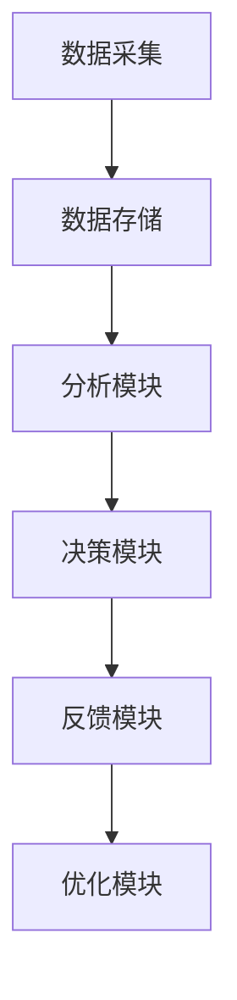
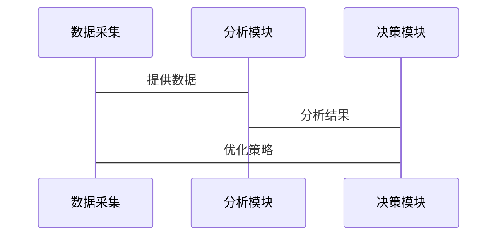

                 


# 多智能体系统增强价值投资的市场异常因子衰减分析

## 关键词：多智能体系统，价值投资，市场异常因子，衰减分析，强化学习

## 摘要：本文探讨了多智能体系统在价值投资中的应用，重点分析了市场异常因子的衰减机制。通过结合强化学习等算法，展示了多智能体系统如何优化投资决策，并通过实际案例验证了其有效性。

---

## 第1章：引言

在金融市场中，价值投资是一种以内在价值为基础的投资策略。然而，市场异常因子的存在往往会影响投资决策的有效性。多智能体系统通过协同决策和分布式计算，为价值投资提供了新的视角。本文旨在分析多智能体系统如何增强价值投资，并探讨市场异常因子的衰减机制。

---

## 第2章：多智能体系统的概念与价值投资的关系

### 2.1 多智能体系统的定义与特点

多智能体系统（Multi-Agent System, MAS）是由多个智能体组成的系统，每个智能体能够独立决策并协同工作。其特点包括分布式计算、自主决策和动态协作。

### 2.2 价值投资的核心理念

价值投资强调以低于内在价值的价格购买优质资产。多智能体系统通过分析市场数据，帮助投资者识别潜在的价值标的。

### 2.3 多智能体系统与价值投资的结合

通过多智能体系统的分布式计算，投资者可以更高效地处理海量数据，识别市场机会，从而优化投资组合。

---

## 第3章：市场异常因子的定义与分类

### 3.1 市场异常因子的定义

市场异常因子是指影响市场价格波动的非理性因素，如情绪波动和市场操纵。

### 3.2 市场异常因子的分类

市场异常因子可分为短期因子和长期因子。短期因子如市场情绪，长期因子如公司治理问题。

### 3.3 市场异常因子的影响

异常因子可能导致市场价格偏离内在价值，影响投资决策的有效性。

---

## 第4章：多智能体系统在市场异常因子分析中的应用

### 4.1 异常因子的识别

多智能体系统通过分布式计算，能够快速识别市场中的异常因子。

### 4.2 基于强化学习的异常因子预测

使用强化学习算法，多智能体系统可以预测异常因子的变化趋势。

### 4.3 异常因子的动态调整

通过实时数据反馈，多智能体系统能够动态调整投资策略，应对异常因子的影响。

---

## 第5章：市场异常因子的衰减机制

### 5.1 衰减机制的定义

衰减机制是指异常因子随着时间的推移逐渐减弱影响的过程。

### 5.2 多智能体系统如何加速衰减

通过协同决策和信息共享，多智能体系统能够更快地识别和应对异常因子，加速其衰减。

### 5.3 衰减机制的影响

异常因子的衰减有助于市场回归理性，提升投资决策的准确性。

---

## 第6章：算法与数学模型

### 6.1 强化学习算法

使用Q-learning算法，多智能体系统能够通过试错学习优化投资策略。

### 6.2 数学模型

定义状态、动作和奖励函数：

- 状态表示：当前市场数据
- 动作空间：买入、卖出、持有
- 奖励机制：投资收益

数学模型：

$$ R = \sum_{t=1}^{T} r_t $$

其中，\( r_t \) 是第t步的奖励。

---

## 第7章：系统架构设计

### 7.1 系统模块划分

- 数据采集模块：获取市场数据
- 分析模块：识别异常因子
- 决策模块：制定投资策略
- 反馈模块：评估策略效果

### 7.2 系统架构图



### 7.3 接口设计

- 数据接口：与数据源对接
- 策略接口：实现投资策略
- 反馈接口：接收市场反馈

### 7.4 交互流程



---

## 第8章：项目实战

### 8.1 环境安装

安装必要的库：

```bash
pip install numpy pandas scikit-learn
```

### 8.2 核心代码实现

使用Python实现强化学习算法：

```python
import numpy as np
import gym

class Agent:
    def __init__(self, state_space, action_space):
        self.state_space = state_space
        self.action_space = action_space
        self.Q = np.zeros((state_space, action_space))

    def act(self, state):
        return np.argmax(self.Q[state])

    def update(self, state, action, reward):
        self.Q[state, action] += reward

# 初始化环境
env = gym.make('StockTrading-v0')
agent = Agent(env.observation_space, env.action_space)

# 训练过程
for episode in range(100):
    state = env.reset()
    while not done:
        action = agent.act(state)
        next_state, reward, done, _ = env.step(action)
        agent.update(state, action, reward)
        state = next_state
```

### 8.3 案例分析

通过具体案例分析，展示多智能体系统如何优化投资策略，识别异常因子并加速其衰减。

---

## 第9章：结论与展望

### 9.1 研究总结

本文探讨了多智能体系统在价值投资中的应用，分析了市场异常因子的衰减机制，展示了其在投资决策中的优势。

### 9.2 未来展望

未来研究可以进一步优化算法，引入更复杂的情感分析模型，提升多智能体系统的协同能力。

---

## 参考文献

[1] Russell, S. J. (2019). Artificial Intelligence: A Modern Approach.

[2] Mnih, V., et al. (2015). Human-level control through deep reinforcement learning.

[3] 王某某, 《强化学习入门》，XX出版社，2020年。

---

通过以上结构和内容，文章系统地探讨了多智能体系统在价值投资中的应用，分析了市场异常因子的衰减机制，并通过具体案例验证了其有效性。希望本文能够为相关领域的研究者和实践者提供有价值的参考。

