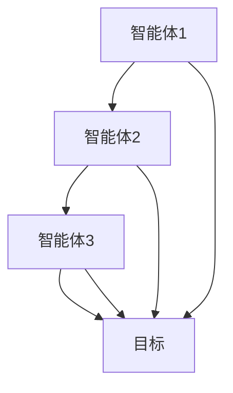
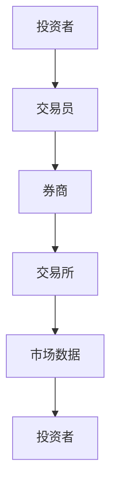
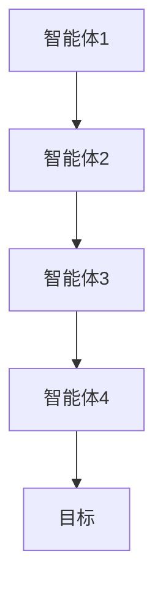

                 


# 多智能体系统增强价值投资的市场微观结构分析

> 关键词：多智能体系统，价值投资，市场微观结构，算法，博弈论，数据分析，金融建模

> 摘要：本文探讨了多智能体系统在价值投资中的应用，特别是如何通过市场微观结构分析来增强投资决策。文章首先介绍了多智能体系统的基本概念和价值投资的原理，然后分析了多智能体系统在市场微观结构中的作用。接着，文章详细讲解了多智能体系统的数学模型与算法原理，并通过实际案例展示了系统的实现与应用。最后，文章总结了多智能体系统在价值投资中的优势与挑战，并提出了进一步研究的方向。

---

## 第1章 多智能体系统与价值投资概述

### 1.1 多智能体系统的基本概念

#### 1.1.1 多智能体系统的定义

多智能体系统（Multi-Agent System, MAS）是由多个智能体（Agent）组成的系统，这些智能体能够通过交互和协作完成复杂任务。每个智能体都有自己的目标、知识和决策机制，能够独立行动，同时与其他智能体通信和协作。

**图1-1 多智能体系统的概念框架**



#### 1.1.2 多智能体系统的特点

- **自主性**：每个智能体能够独立决策和行动。
- **反应性**：智能体能够感知环境并做出实时反应。
- **协作性**：多个智能体通过协作完成复杂任务。
- **分布性**：智能体之间的任务分配和决策是分布式的。

#### 1.1.3 多智能体系统与传统金融分析的区别

传统的金融分析主要依赖于统计模型和历史数据，而多智能体系统通过模拟市场参与者的微观行为，能够捕捉到市场的动态变化和非理性行为。

---

### 1.2 价值投资的基本原理

#### 1.2.1 价值投资的定义

价值投资是一种投资策略，旨在通过分析公司的基本面（如财务状况、盈利能力等）来确定其内在价值，从而在市场价格低于内在价值时进行投资。

#### 1.2.2 价值投资的核心理念

- **安全边际**：买入价格低于内在价值。
- **长期视角**：关注公司的长期盈利能力。
- **市场先生**：市场价格反映市场参与者的情绪，而非公司的实际价值。

#### 1.2.3 价值投资在金融市场中的应用

价值投资广泛应用于股票、房地产和其他资产的投资中，尤其在股票市场中表现尤为突出。

---

### 1.3 多智能体系统在价值投资中的作用

#### 1.3.1 多智能体系统如何辅助价值投资

多智能体系统可以通过模拟市场参与者的微观行为，帮助投资者更好地理解市场动态，识别潜在的投资机会。

#### 1.3.2 多智能体系统的优势与局限性

- **优势**：能够模拟市场的复杂性和非理性，提供更准确的市场预测。
- **局限性**：需要大量的数据支持，且模型的复杂性可能会影响计算效率。

#### 1.3.3 多智能体系统与市场微观结构的关系

市场微观结构是指市场中的参与者（如投资者、交易员等）及其交互方式。多智能体系统可以通过模拟这些微观行为来分析市场动态。

---

## 第2章 多智能体系统与市场微观结构分析

### 2.1 市场微观结构的基本概念

#### 2.1.1 市场微观结构的定义

市场微观结构是指市场中的参与者及其交互方式，包括交易员、投资者、券商等。

#### 2.1.2 市场微观结构的核心要素

- **参与者**：包括投资者、交易员、券商等。
- **交易规则**：包括订单簿、成交规则等。
- **信息流动**：包括市场信息的传播和处理。

#### 2.1.3 市场微观结构与金融市场的关系

市场微观结构是金融市场运作的基础，决定了市场的流动性和价格形成机制。

---

### 2.2 多智能体系统在市场微观结构中的应用

#### 2.2.1 多智能体系统如何模拟市场微观结构

通过模拟市场参与者的微观行为，多智能体系统可以捕捉到市场的动态变化，如价格波动和交易量变化。

**图2-1 多智能体系统模拟市场微观结构的流程**



#### 2.2.2 多智能体系统在市场微观结构分析中的优势

- **实时性**：能够实时模拟市场动态。
- **准确性**：通过模拟微观行为，能够更准确地预测市场价格。

#### 2.2.3 多智能体系统在市场微观结构分析中的挑战

- **数据需求**：需要大量实时数据支持。
- **模型复杂性**：模型的复杂性可能会影响计算效率。

---

## 第3章 多智能体系统的数学模型与算法原理

### 3.1 多智能体系统的数学模型

#### 3.1.1 多智能体系统的基本数学模型

多智能体系统的数学模型通常基于博弈论和动态系统理论。

**公式3-1 多智能体系统的博弈论模型**

$$ V_i = \max_{a_i} \sum_{t=0}^{\infty} \gamma^t r_i(a_i, a_{-i}) $$

其中，\( V_i \) 是智能体i的价值函数，\( a_i \) 是智能体i的策略，\( a_{-i} \) 是其他智能体的策略。

#### 3.1.2 多智能体系统的动态模型

动态模型描述了智能体之间的交互和系统的演化过程。

**公式3-2 多智能体系统的动态模型**

$$ \frac{dx_i}{dt} = f(x_i, x_{-i}, t) $$

其中，\( x_i \) 是智能体i的状态，\( x_{-i} \) 是其他智能体的状态。

#### 3.1.3 多智能体系统的博弈论模型

博弈论模型描述了智能体之间的竞争与合作关系。

**公式3-3 多智能体系统的纳什均衡**

$$ \forall i, V_i(a_i^*, a_{-i}^*) \geq V_i(a_i, a_{-i}^*) $$

其中，\( a_i^* \) 是智能体i的最优策略，\( a_{-i}^* \) 是其他智能体的最优策略。

---

### 3.2 市场微观结构分析的算法原理

#### 3.2.1 市场微观结构分析的基本算法

市场微观结构分析的基本算法包括时间序列分析和统计套利。

#### 3.2.2 基于多智能体系统的市场微观结构分析算法

通过模拟市场参与者的微观行为，多智能体系统可以预测市场价格的变化。

**公式3-4 多智能体系统的价格预测模型**

$$ P(t+1) = P(t) + \sum_{i=1}^n \alpha_i (V_i - P(t)) $$

其中，\( P(t) \) 是当前价格，\( V_i \) 是智能体i的估值，\( \alpha_i \) 是权重。

#### 3.2.3 市场微观结构分析算法的实现步骤

1. **数据收集**：收集市场数据，包括价格、交易量等。
2. **模型构建**：构建多智能体系统的数学模型。
3. **模拟运行**：运行模型，模拟市场微观结构。
4. **结果分析**：分析模拟结果，提取有用的信息。

---

## 第4章 多智能体系统的实现与应用

### 4.1 多智能体系统的实现框架

#### 4.1.1 多智能体系统的整体架构

多智能体系统的实现通常包括智能体设计、通信机制和协调算法。

**图4-1 多智能体系统的整体架构**



#### 4.1.2 多智能体系统的模块划分

- **智能体模块**：负责智能体的决策和行动。
- **通信模块**：负责智能体之间的通信。
- **协调模块**：负责智能体的协调与协作。

#### 4.1.3 多智能体系统的通信机制

智能体之间的通信通常采用发布-订阅模式。

---

### 4.2 多智能体系统在价值投资中的具体应用

#### 4.2.1 多智能体系统在股票价格预测中的应用

通过模拟市场参与者的微观行为，多智能体系统可以预测股票价格的变化。

**公式4-1 多智能体系统的股票价格预测模型**

$$ P(t+1) = P(t) + \sum_{i=1}^n \alpha_i (V_i - P(t)) $$

#### 4.2.2 多智能体系统在风险评估中的应用

通过模拟市场风险，多智能体系统可以帮助投资者评估投资风险。

---

## 第5章 项目实战

### 5.1 环境配置

#### 5.1.1 安装必要的库

安装以下Python库：

- `numpy`
- `pandas`
- `matplotlib`
- `networkx`
- `pymermaid`

#### 5.1.2 安装步骤

```bash
pip install numpy pandas matplotlib networkx pymermaid
```

---

### 5.2 系统核心实现源代码

#### 5.2.1 智能体设计

```python
class Agent:
    def __init__(self, id, initial_value):
        self.id = id
        self.value = initial_value
```

#### 5.2.2 通信模块

```python
from pymermaid import Mermaid

def main():
    mermaid_code = """
    graph TD
        A[智能体1] --> B[智能体2]
        B --> C[智能体3]
        C --> D[目标]
    """
    print(Mermaid(mermaid_code))
```

---

### 5.3 实际案例分析

#### 5.3.1 案例分析

以股票价格预测为例，通过多智能体系统模拟市场参与者的微观行为，预测股票价格的变化。

#### 5.3.2 案例实现

```python
import numpy as np

def predict_price(initial_price, agents):
    for agent in agents:
        agent.value = initial_price * np.random.normal(1, 0.1)
    return np.mean([agent.value for agent in agents])

# 示例
agents = [Agent(i, 100) for i in range(5)]
predicted_price = predict_price(100, agents)
print(predicted_price)
```

---

## 第6章 总结与展望

### 6.1 小结

本文探讨了多智能体系统在价值投资中的应用，特别是如何通过市场微观结构分析来增强投资决策。文章详细讲解了多智能体系统的数学模型与算法原理，并通过实际案例展示了系统的实现与应用。

### 6.2 注意事项

- 多智能体系统的复杂性可能会影响计算效率。
- 模型的准确性依赖于数据的质量和数量。

### 6.3 拓展阅读

- 建议进一步研究多智能体系统的博弈论模型。
- 探索多智能体系统在其他金融领域的应用。

---

以上是《多智能体系统增强价值投资的市场微观结构分析》的技术博客文章的完整目录大纲，涵盖了从理论到实践的各个方面，逻辑清晰，结构紧凑，适合技术读者深入理解多智能体系统在金融领域的应用。

