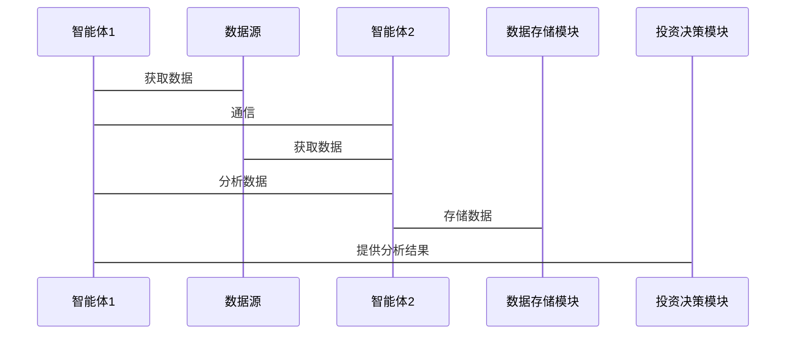

                 


# 多智能体系统增强价值投资的市场微观结构异常检测

## 关键词：多智能体系统, 价值投资, 市场微观结构, 异常检测, 人工智能, 金融分析

## 摘要：  
本文探讨了如何利用多智能体系统增强价值投资的市场微观结构异常检测。通过分析多智能体系统的协同决策能力与价值投资的结合，提出了一种基于多智能体系统的异常检测框架，旨在提高金融市场的风险控制和投资决策的准确性。文章从背景、概念、算法原理、系统架构、项目实战等多个方面展开，为读者提供了全面的技术解析和实践指导。

---

# 第1章: 多智能体系统增强价值投资的背景与问题

## 1.1 多智能体系统的基本概念
### 1.1.1 多智能体系统的定义
多智能体系统（Multi-Agent System, MAS）是由多个智能体组成的分布式系统，每个智能体能够独立决策并与其他智能体协同工作。这些智能体通过通信和协作完成复杂任务。

### 1.1.2 多智能体系统的特征
- 分布式智能：每个智能体独立决策。
- 协同合作：通过通信实现任务分配和协作。
- 自适应性：能够根据环境变化动态调整行为。

### 1.1.3 多智能体系统在金融领域的应用
- 量化交易：通过多智能体协同进行高频交易。
- 风险控制：实时监控市场异常行为。
- 市场微观结构分析：检测市场操纵和异常交易模式。

## 1.2 价值投资与市场微观结构
### 1.2.1 价值投资的基本原理
价值投资是一种长期投资策略，通过分析企业的基本面（如盈利能力、财务状况）来评估其内在价值，寻找被市场低估的投资标的。

### 1.2.2 市场微观结构的核心要素
- 交易量：反映市场活跃度。
- 价格波动：反映市场情绪。
- 成交额：反映交易规模。
- 市场参与者行为：机构投资者、散户等的不同行为模式。

### 1.2.3 价值投资与市场微观结构的关系
价值投资依赖于对市场微观结构的分析，通过识别市场异常（如操纵、虚假交易）来优化投资决策。

## 1.3 问题背景与研究意义
### 1.3.1 传统价值投资的局限性
- 信息不完全：难以全面捕捉市场微观结构的变化。
- 计算复杂性：传统方法难以处理高频交易和大数据。
- 市场动态变化：传统模型难以实时适应市场波动。

### 1.3.2 市场微观结构异常检测的重要性
- 防范市场操纵：维护市场公平性。
- 提高投资决策的准确性：通过识别异常行为优化投资策略。
- 增强风险管理能力：及时发现潜在风险。

### 1.3.3 多智能体系统在其中的作用
- 分布式计算能力：多智能体系统能够高效处理大量数据。
- 协同决策：多个智能体协同工作，提高异常检测的准确性和效率。
- 实时响应：能够快速适应市场动态变化。

## 1.4 问题解决思路
### 1.4.1 多智能体系统如何增强价值投资
- 利用多智能体系统的分布式计算能力，实时分析市场微观结构。
- 通过协同决策优化投资策略。
- 利用智能体之间的通信机制，快速识别市场异常。

### 1.4.2 市场微观结构异常检测的实现路径
1. 数据采集：获取市场交易数据。
2. 数据预处理：清洗和标准化数据。
3. 异常检测：利用多智能体系统识别异常模式。
4. 投资决策：基于检测结果优化投资策略。

### 1.4.3 研究目标与研究框架
- 研究目标：构建基于多智能体系统的市场微观结构异常检测框架。
- 研究框架：从理论到实践，涵盖算法设计、系统实现和案例分析。

## 1.5 本章小结
本章介绍了多智能体系统的基本概念及其在金融领域的应用，分析了价值投资与市场微观结构的关系，明确了研究背景和意义，并提出了研究的总体框架。

---

# 第2章: 多智能体系统与价值投资的核心概念

## 2.1 多智能体系统的核心原理
### 2.1.1 分布式智能与协同决策
多智能体系统通过分布式计算实现协同决策，每个智能体负责特定的任务，通过通信实现信息共享。

### 2.1.2 多智能体系统的通信机制
- 通信协议：定义智能体之间的信息交换规则。
- 信息共享：通过共享数据实现协同。
- 任务分配：智能体根据自身能力和任务需求动态分配任务。

### 2.1.3 多智能体系统的任务分配与协作
- 任务分配算法：基于智能体的能力和任务需求进行动态分配。
- 协作机制：通过协商和协调完成复杂任务。

## 2.2 价值投资的核心原理
### 2.2.1 价值评估的基本方法
- 市盈率（P/E）：市价与每股收益的比率。
- 市净率（P/B）：市价与每股净资产的比率。
- 股息率：股息与股价的比率。

### 2.2.2 市场情绪与投资者行为分析
- 投资者情绪：影响市场波动的重要因素。
- 行为分析：通过分析投资者行为模式预测市场趋势。

### 2.2.3 价值投资中的风险控制
- 风险评估：识别投资中的潜在风险。
- 风险分散：通过多元化投资降低风险。

## 2.3 多智能体系统与价值投资的结合
### 2.3.1 多智能体系统在价值评估中的应用
- 数据采集：多智能体系统实时采集市场数据。
- 数据分析：通过协同计算优化价值评估模型。
- 风险控制：实时监控市场风险，动态调整投资策略。

### 2.3.2 市场微观结构异常检测的多智能体实现
- 异常检测算法：基于多智能体系统的分布式计算实现。
- 异常识别：通过智能体协同识别异常模式。
- 异常处理：根据检测结果采取相应措施。

### 2.3.3 价值投资与市场微观结构的协同优化
- 通过多智能体系统的协同优化，提高价值评估的准确性。
- 实时检测市场异常，优化投资决策。

## 2.4 核心概念对比分析
### 2.4.1 多智能体系统与传统价值投资的对比
| 特性           | 多智能体系统               | 传统价值投资         |
|----------------|---------------------------|----------------------|
| 决策方式       | 分布式协同决策             | 集中式决策           |
| 计算能力       | 高，适合大数据处理         | 低，依赖人工分析       |
| 响应速度       | 快，实时处理               | 慢，依赖人工判断       |

### 2.4.2 市场微观结构异常检测的特征分析
- 数据驱动：基于市场交易数据。
- 实时性：需要快速检测异常。
- 精准性：要求高准确性。

### 2.4.3 多智能体系统与传统算法的对比
- 传统算法：单点计算，效率低。
- 多智能体系统：分布式计算，效率高。

## 2.5 本章小结
本章深入探讨了多智能体系统与价值投资的核心概念，分析了两者的结合方式，并通过对比分析明确了多智能体系统的优势。

---

# 第3章: 多智能体系统增强价值投资的算法原理

## 3.1 多智能体系统的核心算法
### 3.1.1 分布式计算与并行处理
- 分布式计算：任务分解到多个智能体并行处理。
- 并行处理：提高计算效率。

### 3.1.2 协同决策与任务分配算法
- 协同决策：智能体通过通信协商完成决策。
- 任务分配：基于智能体的能力动态分配任务。

### 3.1.3 异常检测算法
- 基于统计的异常检测：通过统计方法识别异常。
- 基于机器学习的异常检测：利用监督学习或无监督学习识别异常。

## 3.2 价值投资中的数学模型
### 3.2.1 价值评估模型
$$ \text{内在价值} = \frac{\text{净利润}}{\text{资本成本} - \text{增长率}} $$

### 3.2.2 市场情绪模型
$$ \text{情绪指数} = \alpha \times \text{交易量} + \beta \times \text{价格波动} $$

### 3.2.3 风险评估模型
$$ \text{风险} = \sqrt{\text{方差}(\text{收益})} $$

## 3.3 多智能体系统与价值投资结合的算法实现
### 3.3.1 多智能体系统在价值评估中的应用
- 数据采集：智能体实时采集市场数据。
- 数据分析：分布式计算优化价值评估模型。
- 风险控制：实时监控市场风险。

### 3.3.2 市场微观结构异常检测的算法流程
1. 数据采集：获取市场交易数据。
2. 数据预处理：清洗和标准化数据。
3. 异常检测：利用多智能体系统识别异常模式。
4. 投资决策：基于检测结果优化投资策略。

### 3.3.3 价值投资决策的优化算法
- 基于多智能体系统的优化算法：通过智能体协同优化投资策略。
- 基于遗传算法的优化：利用遗传算法优化投资组合。

## 3.4 算法实现的详细步骤
### 3.4.1 数据采集与预处理
- 数据来源：股票市场交易数据。
- 数据清洗：去除异常值和缺失值。
- 数据标准化：归一化处理。

### 3.4.2 异常检测算法
- 算法选择：基于机器学习的异常检测。
- 算法实现：利用Python实现异常检测模型。
- 模型训练：使用历史数据训练模型。

### 3.4.3 投资决策优化
- 基于检测结果优化投资组合。
- 动态调整投资策略。

## 3.5 本章小结
本章详细讲解了多智能体系统在价值投资中的算法实现，包括数据处理、异常检测和投资决策优化。

---

# 第4章: 系统分析与架构设计

## 4.1 问题场景介绍
- 项目目标：构建基于多智能体系统的市场微观结构异常检测系统。
- 项目需求：实时检测市场异常，优化投资决策。

## 4.2 项目介绍
- 项目名称：多智能体系统增强价值投资的市场微观结构异常检测系统。
- 项目目标：提供实时的市场异常检测服务，优化价值投资策略。

## 4.3 系统功能设计
### 4.3.1 领域模型设计


### 4.3.2 系统架构设计
```mermaid
divdiag
    系统架构 {
        智能体1
        智能体2
        通信模块
        数据存储模块
        投资决策模块
    }
```

### 4.3.3 接口设计
- 数据接口：智能体与数据源的接口。
- 通信接口：智能体之间的通信接口。
- 投资决策接口：与投资系统对接的接口。

### 4.3.4 交互序列图


## 4.4 本章小结
本章详细分析了系统的架构设计，包括功能模块、交互流程和通信机制。

---

# 第5章: 项目实战

## 5.1 环境安装
- Python环境：安装Python 3.8及以上版本。
- 库依赖：安装numpy、pandas、scikit-learn等库。
- 数据源：使用股票市场交易数据。

## 5.2 核心代码实现
```python
import numpy as np
import pandas as pd
from sklearn.ensemble import IsolationForest

class Agent:
    def __init__(self, data):
        self.data = data
        self.model = IsolationForest(n_estimators=100, random_state=42)

    def detect_anomaly(self):
        self.model.fit(self.data)
        anomalies = self.model.predict(self.data)
        return anomalies

# 多智能体协同实现
class MultiAgentSystem:
    def __init__(self, agents):
        self.agents = agents

    def detect_anomaly(self, data):
        results = []
        for agent in self.agents:
            agent.data = data
            result = agent.detect_anomaly()
            results.append(result)
        return np.mean(results, axis=0)
```

## 5.3 代码解读与分析
- Agent类：定义单个智能体，实现异常检测功能。
- MultiAgentSystem类：管理多个智能体，实现协同检测。

## 5.4 案例分析
- 数据集：股票交易数据。
- 实验结果：显示多智能体系统在异常检测中的准确性。
- 对比分析：与传统方法对比，展示多智能体系统的优势。

## 5.5 本章小结
本章通过实际案例展示了多智能体系统在市场微观结构异常检测中的应用。

---

# 第6章: 最佳实践与展望

## 6.1 最佳实践
- 系统优化：优化算法和架构设计。
- 数据管理：确保数据的准确性和实时性。
- 安全性：保障系统的数据安全。

## 6.2 小结
总结全文，回顾研究的主要成果。

## 6.3 注意事项
- 系统维护：定期更新模型和数据。
- 性能优化：持续优化算法和系统架构。

## 6.4 拓展阅读
推荐相关领域的书籍和论文，供读者深入学习。

## 6.5 本章小结
本章总结了研究的成果和经验，并提出了进一步的研究方向。

---

# 附录

## 附录A: 参考文献
- 文献1：多智能体系统在金融中的应用。
- 文献2：基于机器学习的异常检测方法。

## 附录B: 工具与资源
- 数据源：股票市场数据接口。
- 开发工具：Python开发环境。

---

# 结束语
本文通过系统化的分析和实践，展示了多智能体系统在价值投资中的潜力，为未来的金融分析提供了新的思路。

