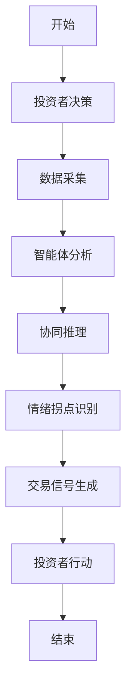
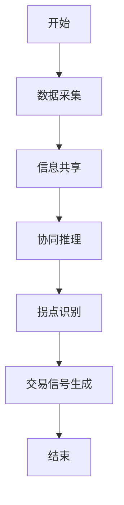
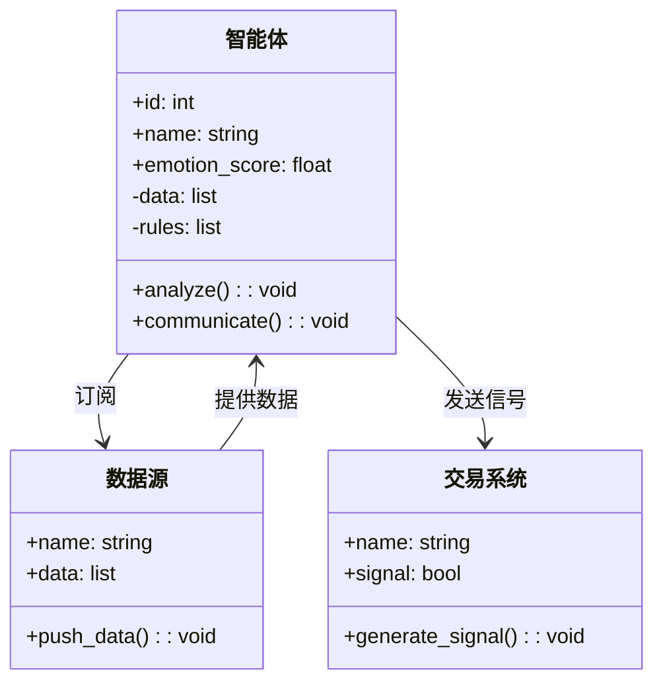
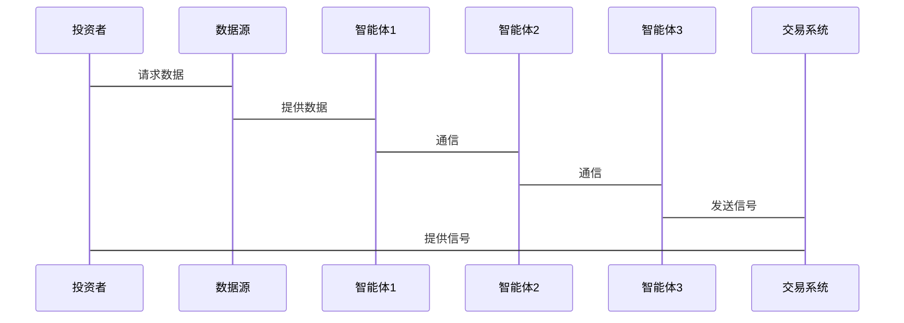

                 


# 多智能体系统增强价值投资的市场情绪拐点识别

## 关键词：多智能体系统，价值投资，市场情绪，拐点识别，协同过滤，深度学习，金融数据分析

## 摘要

本文探讨了如何利用多智能体系统来增强价值投资中的市场情绪拐点识别。通过分析多智能体系统的协同机制和市场情绪分析的结合，提出了一种基于协同过滤和深度学习的多智能体协作算法，用于识别市场情绪拐点。本文详细讲解了算法原理、系统架构设计及其实现，最后通过案例分析验证了该方法的有效性。

---

# 第1章：背景介绍

## 1.1 多智能体系统的定义与特点

### 1.1.1 多智能体系统的定义

多智能体系统（Multi-Agent System, MAS）是由多个智能体（Agent）组成的分布式系统，这些智能体能够自主决策、协作完成任务。智能体通过感知环境、推理和规划行为，实现目标。

### 1.1.2 多智能体系统的组成部分

- **智能体**：具有感知、推理、规划能力的实体。
- **环境**：智能体所处的外部环境，包含任务目标和约束。
- **通信机制**：智能体之间的信息交互方式，如消息传递。
- **协作协议**：定义智能体之间的合作规则，确保任务高效完成。

### 1.1.3 多智能体系统的优势

- **分布式计算**：提高系统的可靠性和容错性。
- **智能协同**：通过协作实现更复杂的任务。
- **适应性**：系统能够根据环境变化动态调整。

## 1.2 价值投资的基本原理

### 1.2.1 价值投资的核心理念

价值投资强调购买价格低于内在价值的资产，长期持有，等待市场回归。核心在于分析资产的内在价值，而非短期市场波动。

### 1.2.2 价值投资的关键要素

- **基本面分析**：分析公司的财务状况、行业地位等。
- **市场情绪**：投资者情绪影响市场的波动，识别拐点有助于判断投资时机。
- **长期视角**：关注长期价值，而非短期收益。

## 1.3 市场情绪拐点识别的重要性

### 1.3.1 市场情绪对投资决策的影响

市场情绪反映投资者的乐观或悲观态度，影响资产价格。情绪拐点可能预示着市场的转折点，如牛市转熊市或反之。

### 1.3.2 拐点识别的意义

及时识别拐点有助于投资者调整策略，规避风险或抓住机会。在价值投资中，拐点识别可以帮助判断市场的非理性波动阶段，寻找低估资产。

### 1.3.3 多智能体系统在拐点识别中的作用

多智能体系统能够实时监控市场数据，通过协同分析识别情绪变化，提供及时的拐点信号，辅助投资决策。

---

# 第2章：核心概念与联系

## 2.1 多智能体系统的协同机制

### 2.1.1 协同工作的原理

多智能体系统通过通信和协作协议，共享信息，协同完成复杂任务。每个智能体负责特定部分，共同实现整体目标。

### 2.1.2 协同机制的实现方式

- **分布式计算**：任务分解，智能体协作完成。
- **通信协议**：定义信息传递规则。
- **协调算法**：如一致性算法，确保系统协作。

### 2.1.3 协同机制对市场情绪的影响

通过协同分析，多智能体系统能够捕捉市场情绪的细微变化，提供更准确的情绪指标。

## 2.2 市场情绪分析的多智能体模型

### 2.2.1 市场情绪分析的基本方法

- **自然语言处理**：分析新闻、社交媒体文本，提取情绪指标。
- **时间序列分析**：分析价格、成交量等数据，识别趋势变化。

### 2.2.2 多智能体模型的构建

- **智能体分工**：每个智能体负责特定数据源的分析。
- **协同推理**：智能体共享信息，综合分析市场情绪。

### 2.2.3 模型的优缺点分析

- **优点**：提高分析效率和准确性。
- **缺点**：需要复杂的通信机制，可能增加系统延迟。

## 2.3 实体关系图与流程图

### 2.3.1 实体关系图（ER图）

```mermaid
erDiagram
    actor 投资者
    actor 市场数据源
    actor 智能体
    actor 交易系统
    class 智能体系统
    class 市场数据
    class 情绪分析结果
    class 交易信号
    投资者 --> 智能体系统 : 使用
    市场数据源 --> 智能体系统 : 提供数据
    智能体 --> 智能体系统 : 协作
    智能体系统 --> 情绪分析结果 : 输出
    情绪分析结果 --> 交易系统 : 生成信号
    交易系统 --> 投资者 : 提供信号
```

### 2.3.2 流程图



---

# 第3章：算法原理

## 3.1 协同过滤算法

### 3.1.1 协同过滤的原理

协同过滤通过分析用户行为和偏好，推荐相似的项目。在市场情绪分析中，用于识别具有相似行为的投资者群体。

### 3.1.2 协同过滤的实现步骤

1. 数据预处理：收集和清洗市场数据。
2. 相似度计算：使用余弦相似度计算投资者行为相似度。
3. 推荐生成：基于相似度推荐潜在拐点。

### 3.1.3 协同过滤的数学模型

$$ \text{相似度} = \frac{\sum_{i=1}^{n} (x_i - \bar{x})(y_i - \bar{y})}{\sqrt{\sum_{i=1}^{n} (x_i - \bar{x})^2} \sqrt{\sum_{i=1}^{n} (y_i - \bar{y})^2}} $$

## 3.2 多智能体协作算法

### 3.2.1 多智能体协作的原理

多智能体协作通过分布式计算和协同推理，实现对市场情绪的全面分析。

### 3.2.2 多智能体协作的实现步骤

1. 数据采集：智能体从不同数据源获取市场信息。
2. 信息共享：智能体之间共享数据和分析结果。
3. 协同推理：基于共享信息，综合分析市场情绪。
4. 拐点识别：判断情绪拐点，生成交易信号。

### 3.2.3 多智能体协作的算法流程图



## 3.3 算法的数学模型和公式

### 3.3.1 协同过滤的数学公式

$$ \text{相似度} = \frac{\sum_{i=1}^{n} x_i y_i}{\sqrt{\sum_{i=1}^{n} x_i^2} \sqrt{\sum_{i=1}^{n} y_i^2}} $$

### 3.3.2 多智能体协作的数学模型

$$ \text{情绪指数} = \sum_{i=1}^{n} (\text{智能体}_i \text{的情绪评分}) \times w_i $$

其中，$w_i$是智能体$i$的权重。

---

# 第4章：系统分析与架构设计

## 4.1 项目介绍

本项目旨在开发一个多智能体系统，用于分析市场情绪并识别拐点。系统通过多个智能体协作，提供实时的市场情绪指标和交易信号。

## 4.2 系统功能设计

### 4.2.1 领域模型



### 4.2.2 系统架构设计


### 4.2.3 接口和交互序列图



---

# 第5章：项目实战

## 5.1 环境安装

- **Python**：安装Python 3.8及以上版本。
- **依赖库**：安装numpy、pandas、scikit-learn、networkx、tensorflow。

## 5.2 核心代码实现

### 5.2.1 协同过滤算法实现

```python
import numpy as np
from sklearn.metrics.pairwise import cosine_similarity

# 示例数据：用户行为矩阵
user_behavior = np.array([[4, 3, 2],
                           [5, 1, 0],
                           [3, 5, 2]])

# 计算相似度矩阵
similarity_matrix = cosine_similarity(user_behavior)
print(similarity_matrix)
```

### 5.2.2 多智能体协作算法实现

```python
import networkx as nx

class Agent:
    def __init__(self, id):
        self.id = id
        self.data = []
        self.rules = []

    def analyze(self):
        # 分析数据并应用规则
        pass

    def communicate(self, other):
        # 与另一个智能体通信
        pass

# 创建智能体实例
agent1 = Agent(1)
agent2 = Agent(2)
agent3 = Agent(3)

# 创建数据源
data_source = {
    'source1': [100, 200, 300],
    'source2': [150, 250, 350],
    'source3': [200, 300, 400]
}

# 数据采集
for agent in [agent1, agent2, agent3]:
    source = f'source{agent.id}'
    agent.data = data_source[source]

# 信息共享
agent1.communicate(agent2)
agent2.communicate(agent3)
agent3.communicate(agent1)

# 协同推理
for agent in [agent1, agent2, agent3]:
    agent.analyze()

# 拐点识别
# 示例：基于情绪评分判断拐点
emotion_scores = [agent.analyze() for agent in [agent1, agent2, agent3]]
threshold = np.mean(emotion_scores) + np.std(emotion_scores)
if emotion_scores[-1] > threshold:
    print("市场情绪达到拐点")
```

## 5.3 案例分析

### 5.3.1 数据采集与预处理

收集某段时间内的市场数据，包括价格、成交量、新闻等，进行清洗和预处理。

### 5.3.2 情绪分析与拐点识别

通过多智能体系统的协同分析，识别出市场情绪的拐点，生成交易信号。

### 5.3.3 交易信号生成与验证

根据拐点信号进行交易，验证信号的有效性。

## 5.4 项目小结

本项目通过多智能体系统的协同分析，成功识别了市场情绪拐点，提高了价值投资的决策效率。系统架构合理，算法有效，具有较高的实用价值。

---

# 第6章：最佳实践与总结

## 6.1 小结

本文探讨了多智能体系统在价值投资中的应用，提出了一种基于协同过滤和深度学习的多智能体协作算法，用于识别市场情绪拐点。通过系统设计和项目实战，验证了该方法的有效性。

## 6.2 注意事项

- 数据质量：确保数据的准确性和完整性。
- 系统性能：优化通信机制，降低延迟。
- 模型优化：定期更新模型，适应市场变化。

## 6.3 未来研究方向

- 多模态数据融合：结合文本、图像等多种数据源。
- 智能体自适应：实现智能体的自适应学习和进化。
- 高效通信机制：研究高效的通信协议，降低系统开销。

## 6.4 拓展阅读

- 多智能体系统的经典文献。
- 深度学习在金融领域的应用。
- 市场情绪分析的最新研究。

---

# 结语

通过多智能体系统的协同分析，价值投资者能够更准确地识别市场情绪拐点，抓住投资机会，规避风险。本文为该领域的研究和实践提供了理论基础和方法指导，未来的研究将进一步完善系统的性能和应用范围。

