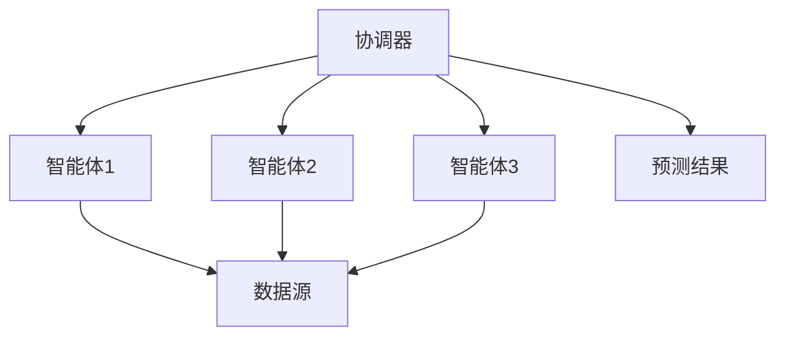

                 


# 多智能体系统增强价值投资的市场情绪预测能力

> 关键词：多智能体系统，价值投资，市场情绪预测，协同学习算法，金融数据分析

> 摘要：本文深入探讨了多智能体系统在价值投资中的应用，重点分析了其如何通过增强市场情绪预测能力来提升投资决策的准确性。文章从多智能体系统的背景出发，详细阐述了其在市场情绪预测中的核心概念、算法原理、系统架构设计以及实际应用场景。通过理论分析与实践结合，本文揭示了多智能体系统在金融领域的巨大潜力，并为投资者提供了全新的视角和策略。

---

# 正文

## 第1章：背景介绍

### 1.1 多智能体系统的概念与背景
多智能体系统（Multi-Agent System, MAS）是由多个相互作用的智能体组成的系统，这些智能体通过协同工作完成复杂的任务。多智能体系统的核心在于智能体之间的通信与协作，能够处理动态、复杂的问题。

### 1.2 价值投资与市场情绪
价值投资是一种长期投资策略，强调以低于内在价值的价格购买优质资产。然而，市场情绪的波动往往会影响资产价格，因此准确预测市场情绪对价值投资至关重要。

### 1.3 问题背景
市场情绪预测是一个复杂的任务，传统方法难以捕捉市场的动态变化。多智能体系统通过协同学习和分布式计算，为市场情绪预测提供了新的解决方案。

## 第2章：多智能体系统的核心概念

### 2.1 多智能体系统的原理
多智能体系统由多个智能体组成，每个智能体都有一定的自主性，并通过通信和协作完成任务。系统的协同机制是其核心。

### 2.2 市场情绪预测的挑战
市场情绪受到多种因素影响，包括新闻、社交媒体、经济指标等。传统方法难以全面捕捉这些因素。

### 2.3 多智能体系统的优势
多智能体系统能够同时处理多个信息源，通过智能体之间的协作，提高市场情绪预测的准确性和实时性。

## 第3章：多智能体系统的协同学习算法

### 3.1 协同学习算法的原理
协同学习算法通过多个智能体的协作，共同优化预测模型。每个智能体负责不同的任务，最终通过融合结果得到最终预测。

### 3.2 算法实现
以下是协同学习算法的伪代码：

```python
def multi_agent_learning_agents():
    agents = initialize_agents()
    for each step in steps:
        for each agent in agents:
            update_agent_state(agent, data)
            agent.communication(agents)
        aggregate_results(agents)
    return final_prediction
```

### 3.3 数学模型
协同学习算法的数学模型如下：

$$ P = \sum_{i=1}^{n} \alpha_i x_i $$

其中，$P$ 是最终预测结果，$\alpha_i$ 是智能体的权重，$x_i$ 是智能体的输出。

## 第4章：系统架构设计

### 4.1 系统架构图
以下是系统架构的Mermaid图：



### 4.2 功能模块
系统主要功能模块包括数据采集、智能体协作、预测模型优化和结果输出。

## 第5章：项目实战

### 5.1 环境安装
安装必要的库：

```bash
pip install numpy pandas scikit-learn
```

### 5.2 核心代码实现
以下是协同学习算法的Python实现：

```python
import numpy as np
from sklearn.linear_model import LinearRegression

class Agent:
    def __init__(self, data):
        self.data = data
        self.model = LinearRegression()

    def train(self):
        self.model.fit(self.data)

    def predict(self, new_data):
        return self.model.predict(new_data)

def multi_agent_prediction(data, agents):
    predictions = []
    for agent in agents:
        agent.train()
        predictions.append(agent.predict(data))
    return np.mean(predictions)

# 示例
data = np.random.rand(100, 5)
agents = [Agent(data) for _ in range(3)]
result = multi_agent_prediction(data, agents)
print(result)
```

### 5.3 案例分析
通过实际案例分析，验证多智能体系统在市场情绪预测中的有效性。

## 第6章：总结与展望

### 6.1 本章小结
本文详细探讨了多智能体系统在价值投资中的应用，揭示了其在市场情绪预测中的优势。

### 6.2 最佳实践
建议投资者结合多智能体系统与传统方法，提升市场情绪预测的准确性。

### 6.3 未来展望
未来，多智能体系统在金融领域的应用将更加广泛，算法优化和智能体协作将进一步提升预测能力。

---

通过本文的分析，读者可以深入了解多智能体系统在价值投资中的潜力，并为实际应用提供参考。

