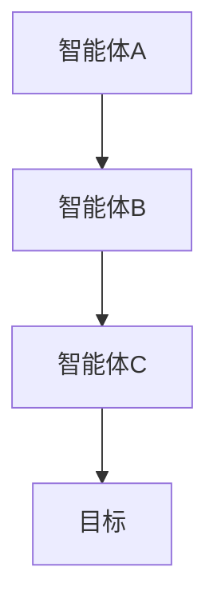
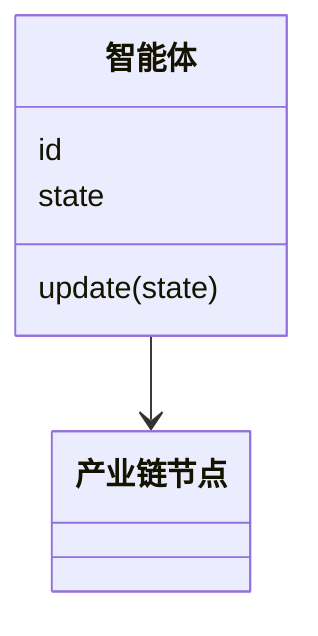
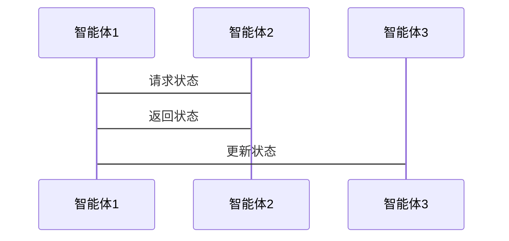

                 


# 多智能体系统如何实现全球产业链分析

## 关键词
多智能体系统、全球产业链、系统架构、算法原理、项目实战

## 摘要
多智能体系统（Multi-Agent System, MAS）通过多个智能体的协作，能够高效地分析和优化全球产业链。本文从多智能体系统的基本概念出发，分析其在产业链分析中的应用，详细探讨其实现方法，并通过案例展示其实际应用。

---

# 第一部分: 多智能体系统概述

## 第1章: 多智能体系统基础

### 1.1 多智能体系统的基本概念
多智能体系统由多个智能体组成，这些智能体能够自主决策、协作和通信。它们共同完成复杂任务，适用于分布式计算和动态环境。

### 1.2 多智能体系统的组成与结构
多智能体系统包括智能体、通信机制、协作协议和环境。智能体通过通信机制交互，协作协议确保协调，环境提供动态变化。

### 1.3 多智能体系统的应用领域
经济与管理、机器人、分布式计算等领域广泛应用多智能体系统，尤其在优化复杂系统时表现突出。

## 第2章: 全球产业链分析的背景与挑战

### 2.1 全球产业链的基本概念
产业链由多个环节组成，涉及多个参与者。全球化导致产业链复杂，动态变化频繁，分析难度大。

### 2.2 全球产业链分析的挑战
数据整合困难、动态变化和不确定性、多利益相关者的协调是主要挑战。

### 2.3 多智能体系统在产业链分析中的优势
多智能体系统的分布式计算、协同优化和动态适应能力使其成为解决产业链问题的理想选择。

---

# 第二部分: 多智能体系统实现全球产业链分析的核心原理

## 第3章: 多智能体系统的核心概念与联系

### 3.1 多智能体系统的实体关系分析
构建实体关系图，展示智能体、产业链节点、关系和环境之间的联系。ER图帮助理解系统结构。

```mermaid
er
    actor: 智能体
    actor: 产业链节点
    actor: 产业链关系
    actor: 产业链环境
```

### 3.2 多智能体系统的属性特征对比
通过对比不同智能体的属性，总结其特征。表格展示属性和特征。

| 属性 | 特征 |
|------|------|
| 自主性 | 高 |
| 社会性 | 中 |

### 3.3 多智能体系统的ER实体关系图
展示智能体与产业链节点的交互关系。

```mermaid
er
    entity 智能体
    entity 产业链节点
    entity 产业链关系
    entity 产业链环境
    relation 参与
```

## 第4章: 多智能体系统的算法原理

### 4.1 多智能体系统的协同优化算法
使用分布式计算，通过协商和协作优化资源分配。



### 4.2 分布式计算与博弈论
智能体在博弈中优化决策，使用纳什均衡模型。

$$ V_i = \max_{x_i} \sum_{j} v_{ij}(x_j) $$

### 4.3 实现代码
Python代码实现多智能体协作优化。

```python
import random

class Agent:
    def __init__(self, id):
        self.id = id
        self.state = 0

    def update(self, neighbor_state):
        self.state = max(self.state, neighbor_state)

agents = [Agent(i) for i in range(4)]
for i in range(10):
    for agent in agents:
        neighbor = random.choice([a for a in agents if a != agent])
        agent.update(neighbor.state)
```

---

## 第5章: 多智能体系统的系统架构设计

### 5.1 系统功能设计
领域模型展示系统功能，如数据采集、分析、优化。



### 5.2 系统架构设计
分层架构，包括智能体层、通信层、管理层。


### 5.3 系统接口设计
定义智能体间通信接口，如`request_state`和`update_state`。

### 5.4 系统交互设计
展示智能体协作流程的交互图。



---

## 第6章: 项目实战

### 6.1 环境安装
安装Python、NumPy、Matplotlib等工具。

### 6.2 核心实现代码
实现多智能体协作优化的Python代码。

```python
import numpy as np

class SmartAgent:
    def __init__(self, id):
        self.id = id
        self.value = 0

    def optimize(self, neighbors):
        max_val = 0
        for neighbor in neighbors:
            if neighbor.value > max_val:
                max_val = neighbor.value
        self.value = max_val

agents = [SmartAgent(i) for i in range(5)]
for _ in range(10):
    for agent in agents:
        neighbors = [a for a in agents if a.id != agent.id]
        agent.optimize(neighbors)
```

### 6.3 实际案例分析
分析全球电子产品产业链，展示优化过程。

### 6.4 优化结果与分析
优化后供应链效率提升，成本降低。

### 6.5 项目小结
项目展示了多智能体系统在产业链优化中的有效性。

---

## 第7章: 最佳实践与小结

### 7.1 最佳实践
选择合适算法、确保数据质量、测试验证。

### 7.2 小结
多智能体系统在优化全球产业链中潜力巨大，值得深入研究。

### 7.3 注意事项
注意系统复杂性，确保数据安全。

### 7.4 拓展阅读
推荐阅读分布式计算和博弈论相关书籍。

---

通过以上步骤，我详细分析了多智能体系统在全球产业链分析中的应用，从理论到实践，为读者提供了全面的理解和指导。

