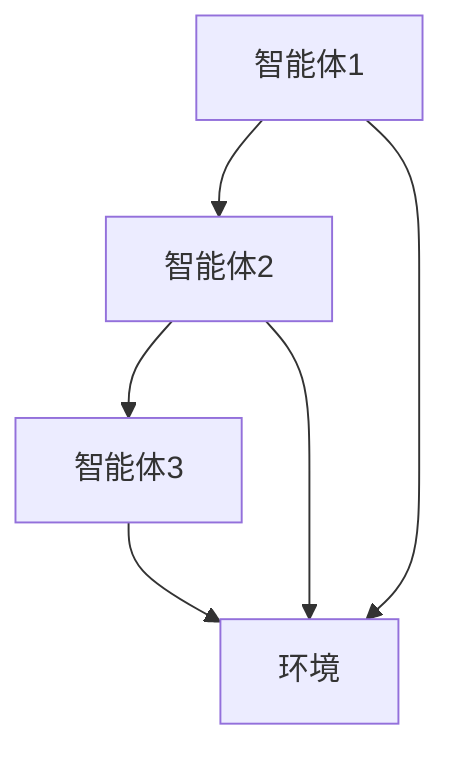

                 


# 多智能体系统如何实现动态风险平衡

> 关键词：多智能体系统，动态风险平衡，博弈论，系统架构，风险评估

> 摘要：本文深入探讨了多智能体系统中动态风险平衡的实现方法，从背景介绍到核心概念，从算法原理到系统架构，再到项目实战和最佳实践，全面解析如何在多智能体环境中实现动态风险平衡，确保系统的高效稳定运行。

---

## 第一部分: 多智能体系统与动态风险平衡背景介绍

### 第1章: 多智能体系统概述

#### 1.1 多智能体系统的定义与特点
多智能体系统（Multi-Agent System, MAS）是由多个智能体组成的分布式系统，这些智能体能够自主决策、协作或竞争以完成特定目标。其特点包括：

- **自主性**：每个智能体都具有一定的自主决策能力。
- **反应性**：智能体能够感知环境并实时响应。
- **协作性**：智能体之间可以通过通信和协作完成复杂任务。
- **分布性**：系统中的智能体分布在网络中，没有集中控制点。

#### 1.2 动态风险平衡的定义与特点
动态风险平衡是指在动态变化的环境中，智能体之间通过调整策略和行为，使得整体系统的风险水平处于最优状态。其特点包括：

- **动态性**：环境和智能体的行为不断变化，需要实时调整。
- **平衡性**：在不同智能体之间分配风险，使其达到某种最优状态。
- **适应性**：系统能够根据环境变化自动调整风险平衡策略。

#### 1.3 多智能体系统中动态风险平衡的重要性
动态风险平衡在多智能体系统中至关重要，因为它能够：

- **避免系统崩溃**：通过合理分配风险，防止单一智能体过载导致系统崩溃。
- **提高系统效率**：通过平衡风险，确保每个智能体都在其能力范围内工作，提高整体效率。
- **增强系统鲁棒性**：通过动态调整，系统能够更好地应对不确定性。

### 第2章: 多智能体系统中的风险平衡问题

#### 2.1 多智能体系统中的风险来源
在多智能体系统中，风险主要来源于以下几个方面：

- **竞争性智能体**：多个智能体为了资源或目标而竞争，可能导致资源分配不均或冲突。
- **协作性智能体**：协作过程中可能因为信任问题或信息不对称导致风险。
- **环境不确定性**：外部环境的变化可能对系统造成不可预测的影响。

#### 2.2 动态风险平衡的挑战
实现动态风险平衡面临以下挑战：

- **动态环境下的风险评估难度**：环境的变化使得风险评估需要实时更新，增加了复杂性。
- **多智能体之间的利益冲突**：不同智能体可能有不同的目标，如何平衡各方利益是一个难题。
- **系统复杂性对风险平衡的影响**：系统的复杂性越高，风险平衡的难度也越大。

#### 2.3 动态风险平衡的目标与边界
动态风险平衡的目标是在动态环境中找到一个最优的风险分配策略，使得系统整体的风险水平最低。其边界包括：

- **目标范围**：系统必须在特定的目标范围内进行风险平衡。
- **资源限制**：系统的资源（如计算能力、通信带宽）有限，需要在资源限制内进行平衡。
- **时间约束**：风险平衡需要在一定时间内完成，以应对动态变化的环境。

---

## 第二部分: 多智能体系统中的动态风险平衡核心概念与联系

### 第3章: 动态风险平衡的核心原理

#### 3.1 动态风险平衡的理论基础
动态风险平衡的理论基础主要包括博弈论和动态系统理论。

- **博弈论**：博弈论中的纳什均衡是一个重要的理论工具，用于分析多个智能体之间的策略互动。
- **动态系统理论**：动态系统理论提供了分析复杂系统变化的方法，帮助理解风险在系统中的传播和影响。

#### 3.2 动态风险平衡的实现机制
动态风险平衡的实现机制包括以下几个步骤：

1. **风险感知与预测**：智能体感知环境中的风险，并预测未来可能的风险变化。
2. **风险评估与量化**：对感知到的风险进行评估，并量化其对系统的影响。
3. **风险分配与协调**：根据评估结果，智能体之间进行协调，分配风险到不同的智能体，以达到平衡。

#### 3.3 动态风险平衡的属性特征对比
以下表格对比了动态风险平衡与静态风险平衡的属性特征：

| 属性       | 动态风险平衡                | 静态风险平衡                |
|------------|-----------------------------|-----------------------------|
| 环境变化    | 动态变化，需要实时调整       | 静态环境，风险固定           |
| 风险评估    | 需要实时评估，动态调整       | 一次性评估，不需调整         |
| 风险分配    | 动态分配，根据环境变化调整   | 静态分配，分配策略固定       |

### 第4章: 多智能体系统中的实体关系与架构

#### 4.1 实体关系分析
多智能体系统中的实体关系可以用以下Mermaid图表示：



#### 4.2 系统架构设计
多智能体系统的架构可以用以下Mermaid图表示：

```mermaid
rectangle 多智能体系统
    rectangle 智能体1
        function 自主决策
    rectangle 智能体2
        function 协作通信
    rectangle 环境
        function 外部影响
    智能体1 --> 智能体2
    智能体1 --> 环境
    智能体2 --> 环境
```

---

## 第三部分: 多智能体系统中的动态风险平衡算法原理

### 第5章: 动态风险平衡的算法实现

#### 5.1 纳什均衡算法
纳什均衡是一种常见的博弈论算法，用于分析多个智能体之间的策略互动。以下是一个纳什均衡算法的Python实现示例：

```python
def nash_equilibrium(players, strategies):
    # 简单的纳什均衡实现
    # players: 智能体数量
    # strategies: 每个智能体的策略集合
    for player in range(players):
        for strategy in strategies[player]:
            is_nash = True
            for other_player in range(players):
                if other_player != player:
                    for other_strategy in strategies[other_player]:
                        if payoff(player, strategy, other_player, other_strategy) > payoff(player, strategy, other_player, strategy):
                            is_nash = False
                            break
                if not is_nash:
                    break
            if is_nash:
                return (player, strategy)
    return None
```

#### 5.2 极大极小算法
极大极小算法用于在不确定环境中进行决策。以下是一个极大极小算法的Python实现示例：

```python
def minimax(node, is_max_turn, score_limit):
    if node.is_leaf():
        return node.value()
    if is_max_turn:
        best = -float('inf')
        for child in node.get_children():
            current = minimax(child, False, score_limit)
            best = max(best, current)
            if best >= score_limit:
                return best
        return best
    else:
        best = float('inf')
        for child in node.get_children():
            current = minimax(child, True, score_limit)
            best = min(best, current)
            if best <= score_limit:
                return best
        return best
```

---

## 第四部分: 系统分析与架构设计方案

### 第6章: 系统分析与设计

#### 6.1 问题场景介绍
在多智能体系统中，智能体需要实时感知环境并调整策略以实现动态风险平衡。例如，在一个分布式任务分配系统中，多个智能体需要协作完成任务，同时需要动态调整任务分配以应对环境变化。

#### 6.2 系统功能设计
系统的功能需求包括：

- **风险感知**：智能体能够感知环境中的风险。
- **风险评估**：对感知到的风险进行评估和量化。
- **风险分配**：根据评估结果，动态分配风险到不同的智能体。
- **策略调整**：智能体根据风险分配结果调整策略。

#### 6.3 系统架构设计
系统的架构设计可以用以下Mermaid图表示：

```mermaid
rectangle 多智能体系统
    rectangle 智能体1
        function 自主决策
    rectangle 智能体2
        function 协作通信
    rectangle 环境
        function 外部影响
    智能体1 --> 智能体2
    智能体1 --> 环境
    智能体2 --> 环境
```

---

## 第五部分: 项目实战

### 第7章: 项目实战

#### 7.1 环境安装
需要安装以下工具和库：

- **Python**：用于编程
- **Mermaid**：用于绘制图表
- **MathJax**：用于显示数学公式

#### 7.2 核心代码实现
以下是一个实现动态风险平衡的Python代码示例：

```python
def dynamic_risk_balance(players, risks):
    # 简单的动态风险平衡实现
    # players: 智能体数量
    # risks: 每个智能体的风险值
    total_risk = sum(risks)
    balanced_risks = [total_risk / players for _ in range(players)]
    return balanced_risks
```

#### 7.3 案例分析
以一个简单的任务分配系统为例，假设有两个智能体，各自的风险值为0.6和0.4。通过动态风险平衡算法，可以将风险分配为0.5和0.5，实现平衡。

---

## 第六部分: 最佳实践与总结

### 第8章: 最佳实践

#### 8.1 小结
动态风险平衡是多智能体系统中的关键问题，通过合理的算法和架构设计，可以在动态环境中实现风险的动态分配和平衡。

#### 8.2 注意事项
- **实时性**：动态风险平衡需要实时进行，否则可能导致系统崩溃。
- **系统复杂性**：系统的复杂性越高，风险平衡的难度也越大。
- **资源限制**：系统的资源有限，需要在资源限制内进行平衡。

#### 8.3 拓展阅读
- 推荐阅读相关领域的书籍和论文，深入理解博弈论和动态系统理论。
- 关注最新的研究成果，了解动态风险平衡的最新进展。

---

## 总结

本文详细介绍了多智能体系统中动态风险平衡的实现方法，从背景介绍到核心概念，从算法原理到系统架构，再到项目实战和最佳实践，全面解析了如何在多智能体环境中实现动态风险平衡。通过本文的分析和讲解，读者可以更好地理解动态风险平衡的重要性，并能够将其应用到实际项目中。

