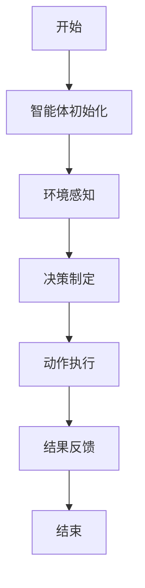
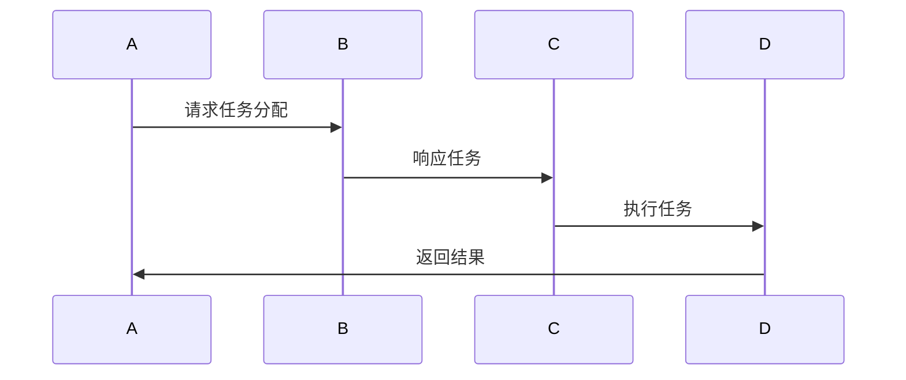

                 


# 多智能体系统如何实现智能化公司比较分析

## 关键词：
多智能体系统, 智能化公司, 系统架构, 算法原理, 实际应用, 比较分析

## 摘要：
多智能体系统（Multi-Agent System, 简称MAS）是一种由多个智能体（Agent）组成的系统，这些智能体能够通过协作和竞争完成复杂的任务。本文将详细探讨多智能体系统在公司智能化中的应用，分析其核心概念、算法原理、系统架构，并通过实际案例进行比较分析，以帮助企业更好地实现智能化转型。

---

## 第一部分: 多智能体系统概述

### 第1章: 多智能体系统的基本概念

#### 1.1 多智能体系统的定义与特点
多智能体系统是由多个具有自主性、反应性和协作性的智能体组成的系统。与传统的单智能体系统相比，多智能体系统具有以下特点：
- **自主性**：智能体能够自主决策，无需外部干预。
- **反应性**：智能体能够感知环境并实时做出反应。
- **协作性**：多个智能体能够通过通信和协作完成复杂任务。
- **分布式性**：智能体分布在网络中，通过分布式计算实现目标。

#### 1.2 多智能体系统的组成与结构
多智能体系统的组成包括智能体、环境和通信机制。智能体之间通过通信机制进行信息交换，共同完成任务。系统的层次结构通常分为：
1. **物理层**：智能体与物理环境的交互。
2. **逻辑层**：智能体的逻辑推理和决策。
3. **通信层**：智能体之间的信息交换。

#### 1.3 多智能体系统的应用领域
多智能体系统广泛应用于企业、交通、分布式计算等领域。在企业中，多智能体系统可以帮助实现任务分配、资源优化和决策支持。

### 第2章: 多智能体系统的核心概念与联系

#### 2.1 多智能体系统的实体关系图
多智能体系统的实体关系可以通过以下Mermaid图表示：


#### 2.2 多智能体系统的属性特征对比表格
| 特性       | 单智能体系统 | 多智能体系统 |
|------------|-------------|-------------|
| 智能体数量 | 1           | 多           |
| 通信机制   | 无           | 有           |
| 协作方式   | 无           | 协作与竞争   |

#### 2.3 多智能体系统的ER实体关系图
```mermaid
entity 联系
entity 智能体
entity 环境
```

---

## 第二部分: 多智能体系统的算法原理

### 第3章: 多智能体系统的算法原理

#### 3.1 多智能体系统的算法流程
多智能体系统的算法流程可以通过以下Mermaid图表示：


#### 3.2 多智能体系统的数学模型
多智能体系统的决策过程可以用以下数学模型表示：
$$ V = \argmax_{a} Q(s, a) $$
其中，\( Q(s, a) \) 是智能体在状态 \( s \) 下执行动作 \( a \) 的期望奖励值。

以下是一个简单的决策算法示例：
```python
def decide_action(state):
    max_value = max(Q(state, action) for action in possible_actions)
    best_actions = [action for action in possible_actions if Q(state, action) == max_value]
    return random.choice(best_actions)
```

---

## 第三部分: 多智能体系统的系统架构设计

### 第4章: 多智能体系统的系统分析

#### 4.1 问题场景介绍
在企业中，多智能体系统可以用于任务分配和资源优化。例如，智能体可以根据任务需求动态分配资源。

#### 4.2 系统功能设计
系统功能设计包括任务分配、资源管理、智能体协作和结果反馈。

#### 4.3 系统架构设计
系统架构设计可以通过以下Mermaid图表示：


#### 4.4 系统接口设计
系统接口设计包括智能体之间的通信接口和与环境的交互接口。

#### 4.5 系统交互流程
系统交互流程可以通过以下Mermaid图表示：


---

## 第四部分: 多智能体系统的项目实战

### 第5章: 多智能体系统的项目实战

#### 5.1 环境安装
首先安装必要的库：
```bash
pip install numpy matplotlib
```

#### 5.2 系统核心实现源代码
以下是多智能体系统的核心代码示例：
```python
class Agent:
    def __init__(self, id):
        self.id = id
        self.state = None

    def perceive(self, environment):
        self.state = environment感知(self.id)

    def decide(self):
        return self决策(self.state)
```

#### 5.3 代码应用解读与分析
代码解读：
- 每个智能体都有一个ID和状态。
- 智能体通过`perceive`方法感知环境。
- 智能体通过`decide`方法做出决策。

#### 5.4 实际案例分析
以下是一个简单的任务分配案例分析：


#### 5.5 项目小结
通过项目实战，我们可以看到多智能体系统的实际应用价值和实现过程。

---

## 第五部分: 多智能体系统的最佳实践

### 第6章: 多智能体系统的最佳实践

#### 6.1 小结
多智能体系统是一种强大的工具，可以帮助企业实现智能化转型。

#### 6.2 注意事项
在实际应用中，需要注意智能体之间的通信和协作问题。

#### 6.3 拓展阅读
推荐阅读《Multi-Agent Systems》一书，以深入理解多智能体系统的原理和应用。

---

通过以上内容，我们系统地介绍了多智能体系统的核心概念、算法原理、系统架构和实际应用，帮助企业更好地实现智能化转型。希望本文能为读者提供有价值的参考和启发。

