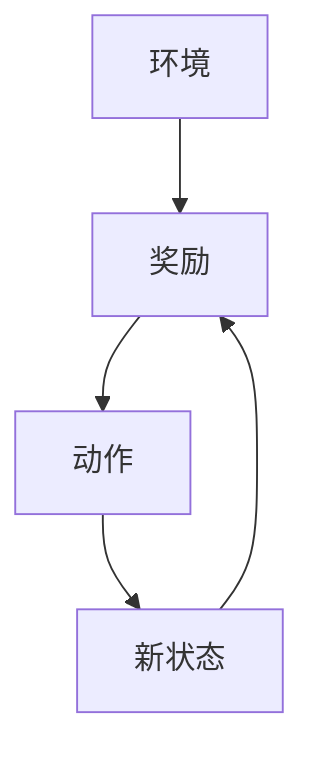
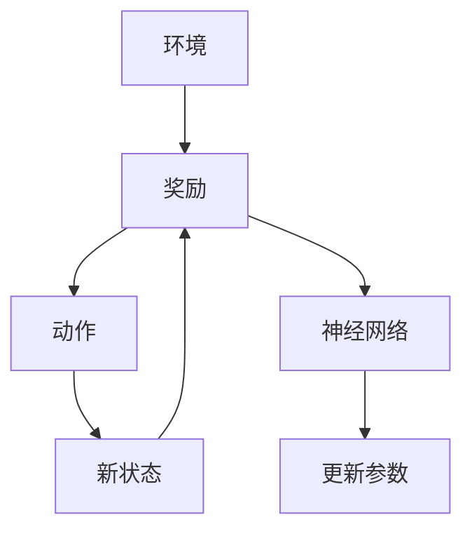

                 

# 多智能体系统如何改进传统价值投资模型

> 关键词：多智能体系统，价值投资模型，金融建模，机器学习，投资决策

> 摘要：本文探讨了多智能体系统（MAS）在金融领域的应用，特别是其如何改进传统价值投资模型。通过详细分析多智能体系统的算法原理、系统架构设计和实际案例，本文揭示了MAS在股票估值、投资决策和风险控制等方面的优势。文章还提供了具体的Python代码示例和数学模型，帮助读者理解如何在实际项目中应用这些技术。

---

# 第一部分: 多智能体系统与价值投资模型概述

## 第1章: 多智能体系统与价值投资模型概述

### 1.1 多智能体系统的基本概念

#### 1.1.1 多智能体系统的定义
多智能体系统（Multi-Agent System, MAS）是由多个智能体（Agent）组成的系统，这些智能体能够通过协作完成复杂的任务。每个智能体都有自己的目标、知识和行为规则。

#### 1.1.2 多智能体系统的特征
- **自主性**：智能体能够自主决策。
- **反应性**：能够感知环境并实时响应。
- **协作性**：多个智能体之间可以协作完成任务。
- **分布式性**：智能体分布在不同的位置，通过通信完成任务。

#### 1.1.3 多智能体系统在金融中的应用潜力
在金融领域，MAS可以模拟市场参与者的行为，帮助投资者做出更明智的决策。例如，可以模拟多个投资者的行为，分析市场趋势。

### 1.2 价值投资模型的基本原理

#### 1.2.1 价值投资的核心理念
价值投资的核心理念是寻找被市场低估的股票，通过长期持有实现收益。传统价值投资模型依赖于财务数据和市场分析。

#### 1.2.2 传统价值投资模型的优缺点
- **优点**：能够发现被低估的股票，长期收益稳定。
- **缺点**：依赖历史数据，难以适应市场波动。

#### 1.2.3 价值投资模型的数学基础
价值投资模型通常基于市盈率（P/E）、市净率（P/B）等指标。例如，计算股票的内在价值公式如下：

$$
\text{内在价值} = \frac{\text{未来现金流}}{\text{折现率}}
$$

### 1.3 本章小结
本章介绍了多智能体系统和价值投资模型的基本概念，并分析了MAS在金融领域的潜力。接下来的章节将深入探讨MAS的算法原理及其在价值投资中的应用。

---

## 第2章: 多智能体系统的核心概念

### 2.1 多智能体系统的组成与功能

#### 2.1.1 智能体的定义与特征
智能体是一个能够感知环境、自主决策并采取行动的实体。在金融领域，智能体可以模拟投资者的行为。

#### 2.1.2 多智能体系统的体系结构
多智能体系统的体系结构包括通信层、协作层和决策层。通信层负责智能体之间的信息交换，协作层负责任务分配，决策层负责制定决策策略。

#### 2.1.3 智能体之间的通信与协作
智能体之间通过消息传递进行通信。例如，一个智能体发现市场趋势变化，可以通知其他智能体调整投资策略。

### 2.2 多智能体系统的算法原理

#### 2.2.1 基于Q-learning的多智能体协作
Q-learning是一种强化学习算法，用于智能体在环境中学习最优策略。在金融领域，可以用于模拟投资者的决策过程。

使用Mermaid流程图表示Q-learning算法：

#### 2.2.2 基于DQN的多智能体决策
DQN（Deep Q-Network）是一种深度强化学习算法，适用于复杂的金融环境。使用DQN可以模拟多个投资者的决策过程。

使用Mermaid流程图表示DQN算法：

#### 2.2.3 其他多智能体算法简介
除了Q-learning和DQN，还有其他算法如PSO（粒子群优化）和A*算法，可以用于不同的金融场景。

### 2.3 多智能体系统在金融中的应用

#### 2.3.1 金融市场的多智能体建模
通过多智能体系统，可以模拟股票市场的波动，帮助投资者预测市场趋势。

#### 2.3.2 多智能体系统在投资决策中的应用
智能体可以实时分析市场数据，提供投资建议。例如，智能体可以监控市场波动，及时调整投资组合。

#### 2.3.3 多智能体系统的优势与挑战
- **优势**：能够模拟复杂市场环境，提供实时决策支持。
- **挑战**：需要处理大量的市场数据，算法复杂度高。

---

## 第3章: 价值投资模型的核心概念

### 3.1 价值投资模型的数学基础

#### 3.1.1 股票估值的核心公式
股票估值公式：

$$
\text{内在价值} = \sum_{t=1}^{n} \frac{\text{现金流}_t}{(1 + r)^t}
$$

其中，$r$ 是折现率，$\text{现金流}_t$ 是第$t$年的现金流。

#### 3.1.2 市盈率与市净率的计算
市盈率（P/E）= 股价 / 每股收益  
市净率（P/B）= 股价 / 每股净资产

#### 3.1.3 股票内在价值的评估方法
通过分析公司的财务数据，评估其内在价值，确定是否低估。

### 3.2 传统价值投资模型的局限性

#### 3.2.1 数据依赖性问题
传统价值投资模型依赖历史数据，难以适应市场变化。

#### 3.2.2 市场波动性的影响
市场波动可能导致传统模型失效，无法及时调整投资策略。

#### 3.2.3 人为因素的干扰
投资者情绪和市场参与者的行为可能影响模型的准确性。

### 3.3 价值投资模型的改进方向

#### 3.3.1 引入多智能体系统的优势
多智能体系统可以实时分析市场数据，提供动态的投资建议。

#### 3.3.2 数据驱动与模型驱动的结合
结合大数据分析和传统模型，提高预测准确性。

#### 3.3.3 实时数据分析的重要性
通过实时数据分析，智能体可以快速响应市场变化，优化投资策略。

---

## 第4章: 多智能体系统与价值投资模型的结合

### 4.1 多智能体系统的算法原理

#### 4.1.1 基于Q-learning的多智能体协作
使用Q-learning算法，智能体可以学习最优投资策略。

#### 4.1.2 基于DQN的多智能体决策
DQN算法可以模拟投资者的决策过程，优化投资组合。

#### 4.1.3 其他多智能体算法简介
包括PSO和A*算法，适用于不同的金融场景。

### 4.2 多智能体系统在金融中的应用

#### 4.2.1 金融市场的多智能体建模
通过多智能体系统，可以模拟股票市场的波动，帮助投资者预测市场趋势。

#### 4.2.2 多智能体系统在投资决策中的应用
智能体可以实时分析市场数据，提供投资建议。

#### 4.2.3 多智能体系统的优势与挑战
优势包括能够模拟复杂市场环境，提供实时决策支持；挑战包括处理大量数据和算法复杂度。

### 4.3 价值投资模型的改进方向

#### 4.3.1 引入多智能体系统的优势
多智能体系统可以实时分析市场数据，提供动态的投资建议。

#### 4.3.2 数据驱动与模型驱动的结合
结合大数据分析和传统模型，提高预测准确性。

#### 4.3.3 实时数据分析的重要性
通过实时数据分析，智能体可以快速响应市场变化，优化投资策略。

---

## 第5章: 多智能体系统与价值投资模型的结合

### 5.1 多智能体系统的算法实现

#### 5.1.1 Q-learning算法的实现
使用Python编写Q-learning算法，模拟投资者的决策过程。

#### 5.1.2 DQN算法的实现
使用深度神经网络实现DQN算法，优化投资组合。

### 5.2 价值投资模型的改进

#### 5.2.1 实时数据分析的实现
通过实时数据分析，智能体可以快速调整投资策略。

#### 5.2.2 多智能体协作的实现
多个智能体协作，模拟市场参与者的行为，优化投资决策。

### 5.3 项目实战

#### 5.3.1 环境安装
安装必要的Python库，如TensorFlow和Keras。

#### 5.3.2 系统核心实现
编写Python代码实现多智能体系统的算法。

#### 5.3.3 代码解读与分析
详细解读代码，分析其工作原理。

#### 5.3.4 实际案例分析
通过具体案例分析，展示多智能体系统如何改进传统价值投资模型。

---

## 第6章: 最佳实践与注意事项

### 6.1 小结
本章总结了多智能体系统在改进传统价值投资模型中的应用，强调了实时数据分析和多智能体协作的重要性。

### 6.2 注意事项
- 数据来源要可靠，避免错误分析。
- 算法选择要根据具体场景，避免盲目使用。

### 6.3 拓展阅读
建议读者进一步阅读相关书籍和论文，深入理解多智能体系统和价值投资模型的结合。

---

## 第7章: 结论与展望

### 7.1 结论
多智能体系统在改进传统价值投资模型中具有巨大潜力，能够实时分析市场数据，提供动态的投资建议。

### 7.2 展望
未来，随着人工智能技术的发展，多智能体系统将在金融领域发挥更大的作用，帮助投资者做出更明智的决策。

---

以上是《多智能体系统如何改进传统价值投资模型》的完整目录大纲和内容概述，涵盖了从基础概念到实际应用的各个方面。

