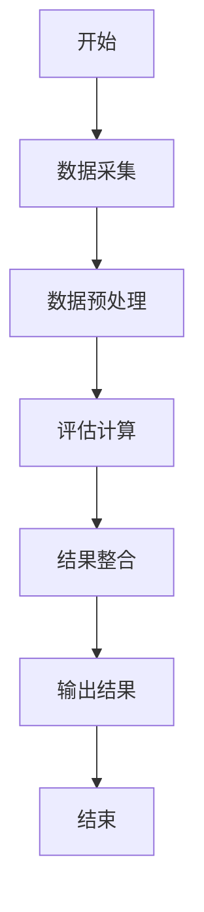
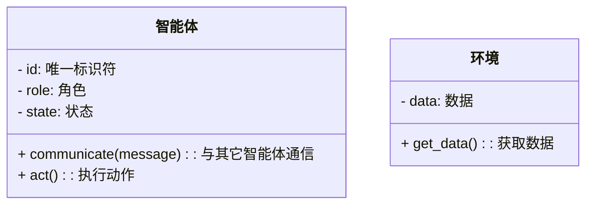
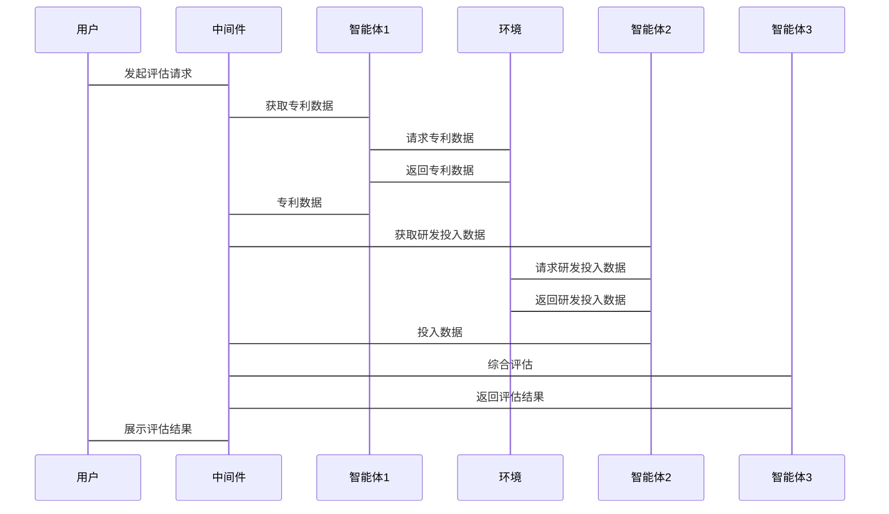

                 


# 多智能体系统如何评估公司创新能力

> 关键词：多智能体系统，创新能力评估，协同效应，ER实体关系图，数学模型

> 摘要：本文探讨了多智能体系统（MAS）在公司创新能力评估中的应用。通过分析MAS的核心概念、算法原理和系统架构，结合实际案例，展示了如何利用MAS提升创新能力的评估效率和准确性。

---

## 第一部分: 多智能体系统与公司创新能力评估背景

### 第1章: 多智能体系统与公司创新能力评估概述

#### 1.1 多智能体系统的基本概念
##### 1.1.1 多智能体系统的定义
多智能体系统（Multi-Agent System，MAS）是由多个智能体（Agent）组成的系统，这些智能体能够自主决策、协作和通信，以完成共同的目标。与单智能体系统不同，MAS强调智能体之间的协作和分布式问题解决能力。

##### 1.1.2 多智能体系统的特征
- **分布式性**：智能体分布在不同的位置，独立决策。
- **协作性**：智能体之间通过通信和协作完成任务。
- **反应性**：智能体能够感知环境并实时响应。
- **动态性**：系统环境和智能体状态不断变化。

##### 1.1.3 多智能体系统与传统单智能体系统的区别
| 特性         | 单智能体系统       | 多智能体系统       |
|--------------|-------------------|-------------------|
| 决策中心化   | 是               | 否               |
| 协作性       | 低               | 高               |
| 系统复杂性   | 低               | 高               |
| 应用场景     | 单任务           | 多任务协作       |

#### 1.2 公司创新能力的评估方法
##### 1.2.1 创新能力的定义
创新能力是指公司在技术、产品、市场等方面提出新想法并成功实施的能力。它是企业竞争力的重要指标。

##### 1.2.2 常见的创新能力评估指标
- 技术创新：专利数量、研发投入占比。
- 产品创新：新产品发布频率、市场占有率。
- 市场创新：进入新市场的能力、品牌影响力。
- 组织创新：组织结构优化、员工创造力。

##### 1.2.3 现有评估方法的优缺点
| 方法         | 优点                     | 缺点                     |
|--------------|-------------------------|-------------------------|
| 专家评估法   | 主观性强，灵活           | 易受专家主观影响         |
| 数据分析法   | 客观性强，基于事实       | 需大量数据支持           |
| 综合评估法   | 结合定性定量分析         | 实施复杂，耗时           |

#### 1.3 多智能体系统在创新能力评估中的应用背景
##### 1.3.1 多智能体系统的优势
- **分布式协作**：智能体分别负责不同的评估维度，如技术、产品、市场。
- **动态适应性**：能够实时更新评估结果，适应市场变化。
- **高效性**：多个智能体同时处理信息，提高评估效率。

##### 1.3.2 创新能力评估的需求
- 需要多维度、实时的评估。
- 需要动态调整评估策略。
- 需要智能化的协作机制。

##### 1.3.3 多智能体系统与创新能力评估的结合点
- 多智能体系统能够分解复杂任务，分别评估不同维度的创新能力。
- 智能体之间的协作能够综合多维度信息，得出全面的评估结果。

### 第2章: 多智能体系统的核心概念与联系

#### 2.1 多智能体系统的核心概念
##### 2.1.1 智能体的定义与特征
智能体（Agent）是一个能够感知环境、自主决策并采取行动的实体。其特征包括：
- **自主性**：无需外部干预。
- **反应性**：能感知环境变化。
- **协作性**：能与其他智能体协作。

##### 2.1.2 多智能体系统的组成要素
- **智能体**：独立决策的主体。
- **通信机制**：智能体之间的信息交换。
- **协作协议**：智能体协作的规则和策略。
- **环境**：智能体所处的外部环境。

##### 2.1.3 多智能体系统与传统单智能体系统的区别
| 特性         | 单智能体系统       | 多智能体系统       |
|--------------|-------------------|-------------------|
| 决策中心化   | 是               | 否               |
| 协作性       | 低               | 高               |
| 系统复杂性   | 低               | 高               |

#### 2.2 多智能体系统与创新能力评估的关系
##### 2.2.1 多智能体系统如何支持创新能力评估
- **分布式评估**：多个智能体分别评估不同维度。
- **实时协作**：智能体实时交换信息，动态调整评估策略。
- **综合分析**：结合多维度信息，得出全面评估结果。

##### 2.2.2 多智能体系统在创新能力评估中的角色
- **数据采集智能体**：收集公司创新相关的数据。
- **评估智能体**：分析数据，评估创新能力。
- **协作协调智能体**：协调其他智能体的工作，确保评估结果准确。

##### 2.2.3 多智能体系统与创新能力评估的协同效应
- 多智能体系统的协作能力能够显著提高评估的全面性和准确性。
- 通过实时信息交换，评估结果能够快速响应市场变化。

#### 2.3 多智能体系统的ER实体关系图
```mermaid
er
actor(用户) --> 多智能体系统
actor(智能体) --> 多智能体系统
多智能体系统 --> 创新能力评估结果
```

### 第3章: 多智能体系统如何评估公司创新能力的算法原理

#### 3.1 基于多智能体的创新能力评估模型
##### 3.1.1 模型的输入与输出
- **输入**：公司创新相关的数据，如专利数量、研发投入、市场表现。
- **输出**：公司创新能力的评估结果，如创新能力指数。

##### 3.1.2 模型的算法流程
1. 数据采集智能体收集公司创新相关数据。
2. 数据预处理智能体清洗数据，去除异常值。
3. 评估智能体基于清洗后的数据，使用协同效应模型评估创新能力。
4. 协调智能体整合各智能体的评估结果，输出最终的创新能力指数。

##### 3.1.3 模型的数学公式
$$创新能力指数 = \sum_{i=1}^{n} w_i \cdot f_i$$
其中，$w_i$是第i个评估维度的权重，$f_i$是第i个评估维度的评估值。

#### 3.2 多智能体协作算法
##### 3.2.1 分布式协作算法
1. 每个智能体负责一个评估维度。
2. 智能体之间通过通信机制交换数据。
3. 协调智能体整合各智能体的结果，得出最终评估结果。

##### 3.2.2 协作机制的选择
- **基于规则的协作机制**：智能体根据预设规则协作。
- **基于市场的协作机制**：智能体通过市场机制决定协作方式。

##### 3.2.3 协作效果的评估
通过评估各智能体的贡献度来评估协作效果，贡献度高的智能体权重更大。

#### 3.3 算法流程图


### 第4章: 系统分析与架构设计

#### 4.1 系统功能设计
##### 4.1.1 功能模块
- 数据采集模块：采集公司创新数据。
- 数据处理模块：清洗和预处理数据。
- 评估计算模块：基于协同效应模型计算创新能力指数。
- 结果展示模块：展示评估结果。

##### 4.1.2 领域模型


#### 4.2 系统架构设计
##### 4.2.1 架构图


##### 4.2.2 接口设计
- 智能体间通信接口：定义通信协议和数据格式。
- 环境数据接口：定义数据获取和更新接口。

##### 4.2.3 交互流程


### 第5章: 项目实战

#### 5.1 环境配置
- 操作系统：Linux或Windows。
- 开发工具：Python、Mermaid、Git。
- 依赖库：numpy、pandas、matplotlib。

#### 5.2 核心代码实现
##### 5.2.1 数据采集智能体
```python
class DataCollector:
    def __init__(self):
        self.id = "Collector"
        self.data = {}
    
    def collect_data(self, company):
        # 模拟数据采集
        self.data[company] = {
            'patents': 10,
            'investment': 5,
            'market_share': 0.2
        }
        return self.data[company]
```

##### 5.2.2 评估智能体
```python
class Assessor:
    def __init__(self):
        self.id = "Assessor"
        self.weights = {'patents': 0.4, 'investment': 0.3, 'market_share': 0.3}
    
    def assess(self, data):
        return sum(self.weights[key] * data[key] for key in data)
```

##### 5.2.3 协调智能体
```python
class Coordinator:
    def __init__(self):
        self.id = "Coordinator"
        self.collectors = [DataCollector()]
        self.assemblers = [Assessor()]
    
    def coordinate(self, company):
        data = self.collectors[0].collect_data(company)
        result = self.assemblers[0].assess(data)
        return result
```

#### 5.3 功能解读与分析
- 数据采集智能体负责收集公司创新数据。
- 评估智能体基于协同效应模型计算创新能力指数。
- 协调智能体整合各智能体的结果，输出最终评估结果。

#### 5.4 实际案例分析
以某科技公司为例，评估其创新能力指数。
1. 数据采集智能体收集该公司的专利数量、研发投入和市场占有率。
2. 评估智能体基于协同效应模型计算创新能力指数，权重分别为0.4、0.3、0.3。
3. 协调智能体整合结果，输出最终的创新能力指数。

### 第6章: 最佳实践与注意事项

#### 6.1 最佳实践
- **数据质量**：确保数据准确性和完整性。
- **协作机制**：选择合适的协作机制以提高评估效率。
- **动态调整**：根据市场变化动态调整评估策略。

#### 6.2 小结
多智能体系统通过分布式协作和实时信息交换，能够高效、准确地评估公司的创新能力。其优势在于能够处理复杂任务，并结合多维度信息得出全面的评估结果。

#### 6.3 注意事项
- 避免过度依赖单一智能体的决策。
- 定期更新协作机制以适应变化。
- 确保数据安全和隐私保护。

#### 6.4 拓展阅读
- 多智能体系统的分布式计算。
- 协作机制的研究与应用。
- 多智能体系统在其他领域的应用。

---

通过本文的详细讲解，读者可以系统地了解多智能体系统在公司创新能力评估中的应用，并能够基于MAS构建高效的创新能力评估系统。希望本文的内容能够为相关领域的研究和实践提供有价值的参考。

