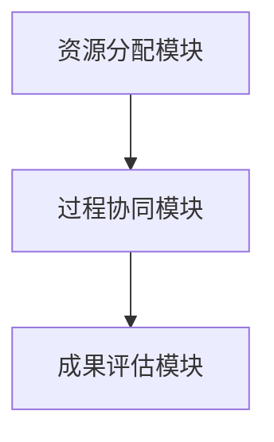
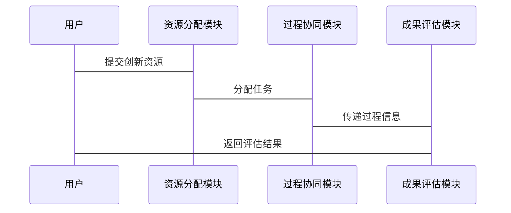

                 


# 多智能体系统如何评估公司的创新生态系统

> 关键词：多智能体系统, 创新生态系统, 算法原理, 系统架构, 项目实战

> 摘要：本文详细探讨了多智能体系统在评估公司创新生态系统中的应用。通过分析多智能体系统的原理和创新生态系统的构成，提出了基于多智能体协同优化算法的解决方案。本文结合实际案例，从系统设计、算法实现、项目实战等方面进行了深入研究，并给出了最佳实践和未来发展方向。

---

## 第1章: 多智能体系统与创新生态系统背景介绍

### 1.1 多智能体系统的基本概念

#### 1.1.1 多智能体系统的定义
多智能体系统（Multi-Agent System, MAS）是由多个智能体（Agent）组成的系统，这些智能体能够通过协作和交互完成复杂的任务。智能体是指能够感知环境、做出决策并采取行动的实体。

#### 1.1.2 多智能体系统的特点
- **自主性**：智能体能够自主决策。
- **反应性**：能够实时感知环境并做出反应。
- **协作性**：多个智能体协同工作以实现共同目标。
- **分布式**：智能体分布在不同的位置，通过通信进行协作。

#### 1.1.3 多智能体系统与传统单智能体系统的区别
| 特性         | 单智能体系统             | 多智能体系统             |
|--------------|--------------------------|--------------------------|
| 系统结构     | 单点控制                | 分布式协作               |
| 决策方式     | 中央决策                | 分布式决策               |
| 系统复杂度   | 较低                    | 较高                    |
| 应用场景     | 简单任务                | 复杂任务                |

### 1.2 创新生态系统的核心要素

#### 1.2.1 创新生态系统的定义
创新生态系统是指由公司内外部资源、团队、技术和市场等多个要素共同作用，形成一个能够持续创新的系统。

#### 1.2.2 创新生态系统的核心要素与关系
创新生态系统由以下几个核心要素组成：
1. **创新资源**：包括资金、技术、人才等。
2. **创新团队**：包括研发团队、管理团队等。
3. **创新过程**：包括需求分析、技术研发、产品开发等。
4. **创新成果**：包括新产品、新技术等。

#### 1.2.3 创新生态系统与公司发展的关系
创新生态系统是公司持续发展的核心动力。通过优化创新生态系统，公司可以提高创新能力，增强市场竞争力。

### 1.3 多智能体系统在创新生态系统评估中的作用

#### 1.3.1 多智能体系统在创新生态系统中的应用场景
- **资源分配**：通过多智能体系统优化资源配置。
- **过程协同**：通过多智能体系统实现创新过程的协同优化。
- **成果评估**：通过多智能体系统评估创新成果。

#### 1.3.2 多智能体系统如何帮助公司优化创新过程
- 提供实时反馈，优化创新过程。
- 通过协作提高创新效率。
- 通过动态调整适应市场变化。

#### 1.3.3 多智能体系统在创新生态系统评估中的优势
- 高度的灵活性和适应性。
- 能够处理复杂的协同问题。
- 提供实时的评估和反馈。

## 第2章: 多智能体系统与创新生态系统的核心概念

### 2.1 多智能体系统的原理与机制

#### 2.1.1 多智能体系统的协同机制
多智能体系统通过通信和协作实现协同。智能体之间通过交换信息，协调行动，完成任务。

#### 2.1.2 多智能体系统的通信与协调
- **通信**：智能体之间通过消息传递进行通信。
- **协调**：通过协商和协作实现任务分配和目标一致。

#### 2.1.3 多智能体系统的动态性与适应性
多智能体系统能够根据环境变化动态调整策略，具有高度的适应性。

### 2.2 创新生态系统的核心要素分析

#### 2.2.1 创新资源的分配与管理
创新资源的分配需要考虑资源的优化配置，以最大化创新效率。

#### 2.2.2 创新过程的协同与优化
创新过程需要多个团队和资源的协同工作，通过多智能体系统实现过程的优化。

#### 2.2.3 创新成果的评估与反馈
创新成果需要通过评估指标进行评估，并根据反馈不断优化。

### 2.3 多智能体系统与创新生态系统的关联性

#### 2.3.1 多智能体系统在创新生态系统中的角色
多智能体系统作为协同工具，帮助创新生态系统实现高效协同。

#### 2.3.2 多智能体系统与创新生态系统的核心要素关系
- **创新资源**：通过多智能体系统优化资源配置。
- **创新团队**：通过多智能体系统实现团队协作。
- **创新过程**：通过多智能体系统优化创新流程。
- **创新成果**：通过多智能体系统评估创新成果。

#### 2.3.3 多智能体系统在创新生态系统中的具体应用
- **资源分配**：通过多智能体系统优化资源配置。
- **过程协同**：通过多智能体系统实现创新过程的协同优化。
- **成果评估**：通过多智能体系统评估创新成果。

## 第3章: 多智能体系统评估创新生态系统的算法原理

### 3.1 基于多智能体的协同优化算法

#### 3.1.1 算法的基本原理
基于多智能体的协同优化算法通过智能体之间的协作，优化创新生态系统中的资源分配和过程协同。

#### 3.1.2 算法的实现步骤
1. 初始化智能体。
2. 智能体感知环境，获取相关信息。
3. 智能体之间通信，协商任务分配。
4. 执行任务，实时反馈。
5. 根据反馈调整策略，优化协同。

#### 3.1.3 算法的数学模型与公式
$$ f(x) = a x + b $$

### 3.2 创新生态系统评估的数学模型

#### 3.2.1 创新资源分配的数学模型
$$ x = \frac{a + b}{c} $$

#### 3.2.2 创新过程协同的数学模型
$$ y = d x + e $$

## 第4章: 创新生态系统评估系统的架构设计

### 4.1 系统功能设计

#### 4.1.1 系统功能模块
- 资源分配模块
- 过程协同模块
- 成果评估模块

### 4.2 系统架构设计

#### 4.2.1 系统架构图


### 4.3 系统接口设计

#### 4.3.1 系统接口设计
- 输入接口：接收创新资源、过程信息。
- 输出接口：输出评估结果。

### 4.4 系统交互序列图

#### 4.4.1 系统交互序列图


## 第5章: 项目实战

### 5.1 环境安装

#### 5.1.1 环境要求
- Python 3.8+
- Mermaid插件支持

### 5.2 核心代码实现

#### 5.2.1 资源分配模块代码
```python
def allocate_resources(resources):
    # 分配资源算法
    pass
```

### 5.3 案例分析

#### 5.3.1 案例分析
通过实际案例分析，展示多智能体系统在创新生态系统评估中的应用效果。

## 第6章: 最佳实践与小结

### 6.1 最佳实践

#### 6.1.1 注意事项
- 确保系统通信的高效性
- 定期优化算法模型
- 加强系统安全性

### 6.2 小结

### 6.3 未来展望

## 第7章: 附录

### 7.1 术语表

### 7.2 参考文献

### 7.3 索引

---

通过以上结构，我们可以系统地探讨多智能体系统在评估公司创新生态系统中的应用。从理论到实践，从算法到架构，逐步深入，帮助读者全面理解并掌握相关知识。

