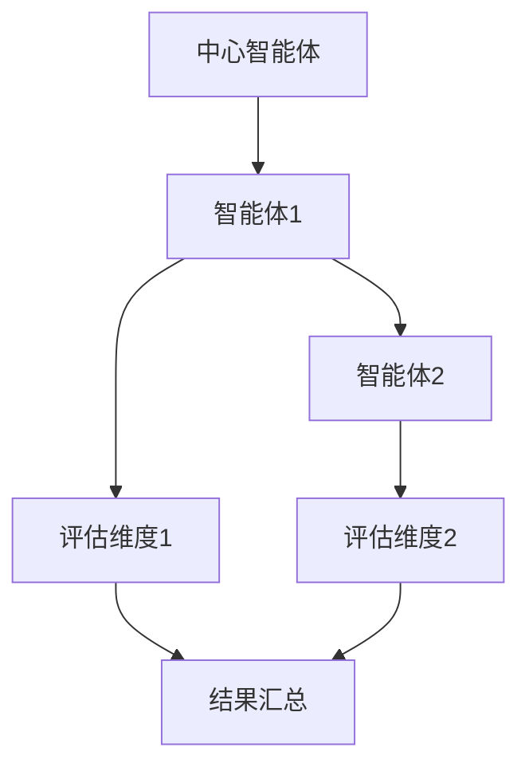
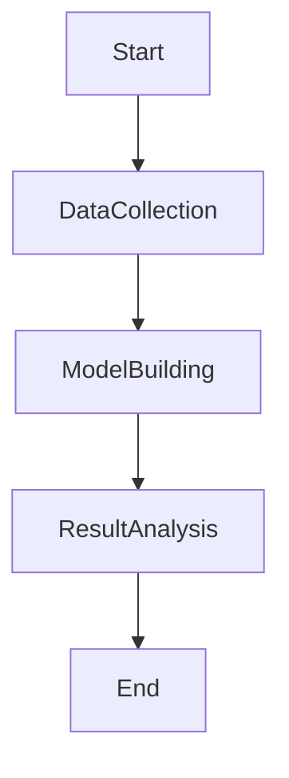
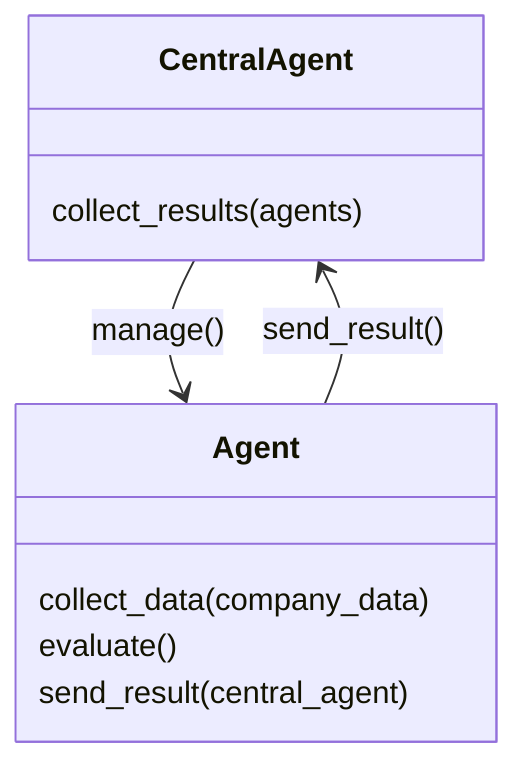
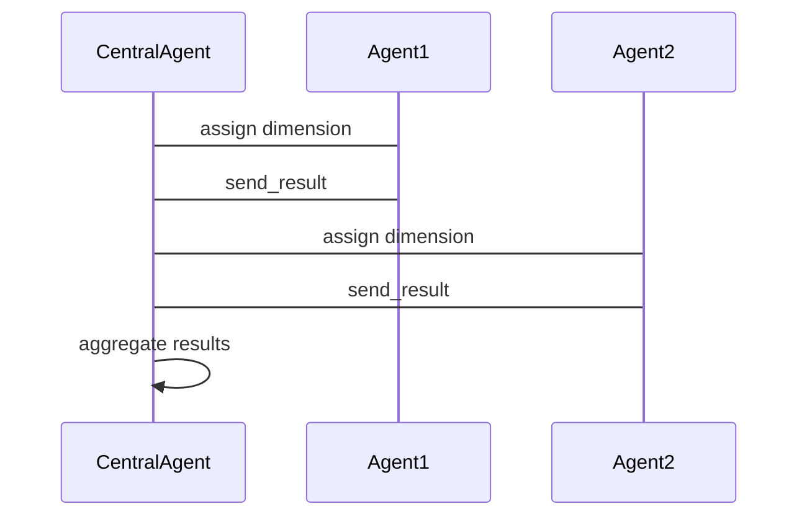

                 


# 多智能体系统如何评估公司的可持续发展能力

## 关键词
多智能体系统, 可持续发展能力, 企业评估, 分布式计算, 协作评估

## 摘要
随着全球对企业可持续发展能力的关注不断增加，传统的评估方法已难以满足复杂多变的市场需求。多智能体系统（MAS）通过其分布式计算、协作与竞争机制，为企业的可持续发展能力评估提供了全新的解决方案。本文将深入探讨多智能体系统在这一领域的应用，从理论到实践，详细阐述其优势、算法实现及实际案例。

---

# 引言

## 问题背景
在全球化的背景下，企业的可持续发展能力不仅是企业自身发展的关键，也是投资者、消费者和监管机构关注的重点。传统的评估方法通常依赖于中心化的方式，存在效率低、数据孤岛和难以动态调整等问题。随着人工智能和分布式计算技术的发展，多智能体系统作为一种新兴的技术手段，为企业的可持续发展能力评估提供了新的思路。

## 问题描述
企业的可持续发展能力涉及环境、社会和治理等多个维度，传统的评估方法往往难以同时兼顾这些维度的复杂性和动态性。如何构建一个高效、动态且全面的企业可持续发展能力评估系统，是当前技术领域的重要挑战。

## 问题解决
多智能体系统通过分布式计算和协作机制，能够同时处理多个评估维度，并实现动态调整。本文将从多智能体系统的理论基础出发，详细探讨其在企业可持续发展能力评估中的应用。

---

# 核心概念

## 多智能体系统的定义与结构

### 多智能体系统的定义
多智能体系统是由多个智能体组成的分布式系统，这些智能体能够通过协作与竞争完成特定任务。每个智能体都有一定的自主性，能够感知环境、做出决策并与其他智能体交互。

### 多智能体系统的结构
多智能体系统通常包括以下部分：
1. **智能体**：具有感知、决策和执行能力的独立实体。
2. **通信机制**：智能体之间交换信息的通道。
3. **协作协议**：智能体之间协同工作的规则。
4. **环境**：智能体所处的外部世界，可能包括物理环境和任务环境。

### 多智能体系统的优势
- **分布式计算**：能够处理大规模数据和复杂任务。
- **协作与竞争**：通过智能体之间的协作和竞争，提高系统的整体性能。
- **动态适应性**：能够根据环境变化动态调整系统行为。

---

## 可持续发展能力评估的基本框架

### 可持续发展能力的定义
企业的可持续发展能力是指企业在满足当前需求的同时，不损害未来世代满足其需求的能力。这包括环境、社会和治理等多个维度。

### 多智能体系统在可持续发展评估中的角色
多智能体系统能够通过分布式计算和协作机制，从多个维度对企业进行评估，并实时调整评估结果。

---

# 算法原理

## 分布式评估算法

### 算法介绍
分布式评估算法是一种基于多智能体系统的评估方法，通过多个智能体分别评估企业的不同维度，最终汇总结果。

### 算法步骤
1. **初始化**：每个智能体负责一个评估维度。
2. **数据采集**：智能体从企业获取相关信息。
3. **评估计算**：智能体根据获取的数据进行评估计算。
4. **结果汇总**：所有智能体的结果汇总，得到最终的评估结果。

### 算法实现
```python
class Agent:
    def __init__(self, dimension):
        self.dimension = dimension  # 评估维度
        self.data = {}  # 存储数据

    def collect_data(self, company_data):
        # 获取企业数据
        self.data = company_data

    def evaluate(self):
        # 根据数据进行评估
        pass

    def send_result(self, central_agent):
        # 将结果发送给中心智能体
        central_agent.results[self.dimension] = self.data

class CentralAgent:
    def __init__(self):
        self.results = {}  # 存储各维度的评估结果

    def collect_results(self, agents):
        for agent in agents:
            agent.send_result(self)
```

### 算法流程图


---

## 算法的数学模型

### 评估模型
企业的可持续发展能力评估结果可以通过以下公式计算：

$$
\text{总评估结果} = \sum_{i=1}^{n} w_i \cdot s_i
$$

其中，\( w_i \) 是第 \( i \) 个维度的权重，\( s_i \) 是第 \( i \) 个维度的评估得分。

### 权重分配
权重分配可以通过博弈论中的纳什均衡模型来确定：

$$
w_i = \frac{1}{n} \sum_{j=1}^{n} p_{ij}
$$

其中，\( p_{ij} \) 是第 \( j \) 个智能体对第 \( i \) 个维度的评估概率。

---

# 系统架构设计

## 问题场景

### 问题描述
企业需要对其环境、社会和治理三个维度进行可持续发展能力评估，但由于数据分散、评估维度复杂，传统的集中式评估方法效率低下。

### 系统目标
构建一个基于多智能体系统的分布式评估平台，实现对企业可持续发展能力的实时、动态评估。

## 系统功能设计

### 功能模块
1. **数据采集模块**：负责从企业获取相关数据。
2. **评估模型构建模块**：根据数据构建评估模型。
3. **结果分析模块**：对评估结果进行分析并生成报告。

### 功能流程图


## 系统架构设计

### 系统架构图


## 系统接口设计

### 接口描述
1. **数据采集接口**：智能体通过该接口获取企业数据。
2. **评估结果接口**：智能体通过该接口向中心智能体发送评估结果。

## 系统交互流程图



---

# 项目实战

## 环境安装

### 安装步骤
1. 安装Python和相关库：
   ```bash
   pip install python-multiprocessing
   pip install numpy
   ```

2. 安装Mermaid和相关工具：
   ```bash
   npm install -g mermaid-js
   ```

## 核心代码实现

### 代码实现

```python
from multiprocessing import Process

class Agent(Process):
    def __init__(self, dimension, company_data):
        super().__init__()
        self.dimension = dimension
        self.company_data = company_data
        self.result = 0

    def run(self):
        self.evaluate()
        self.send_result()

    def evaluate(self):
        # 简单的评估逻辑
        if self.company_data[self.dimension] >= 0.8:
            self.result = 1
        else:
            self.result = 0

    def send_result(self):
        # 假设中心智能体在主进程中
        print(f"Agent {self.dimension} result: {self.result}")

class CentralAgent:
    def __init__(self):
        self.results = {}

    def collect_results(self, agents):
        for agent in agents:
            agent.start()
            agent.join()
            self.results[agent.dimension] = agent.result

if __name__ == "__main__":
    company_data = {
        '环境': 0.85,
        '社会': 0.75,
        '治理': 0.9
    }
    dimensions = ['环境', '社会', '治理']
    agents = []
    for dim in dimensions:
        agent = Agent(dim, company_data)
        agents.append(agent)
    central = CentralAgent()
    central.collect_results(agents)
    print("最终评估结果:", central.results)
```

### 代码解读
1. **Agent类**：继承自Process，表示一个多智能体，负责评估一个维度的数据。
2. **CentralAgent类**：负责协调多个智能体，收集并汇总评估结果。
3. **主程序**：初始化企业数据，创建多个智能体，启动评估过程，并输出最终结果。

## 案例分析

### 实际案例
假设某企业需要评估其环境、社会和治理三个维度的可持续发展能力，使用上述代码进行评估。

1. **环境维度**：评估得分为0.85，高于阈值，结果为1。
2. **社会维度**：评估得分为0.75，低于阈值，结果为0。
3. **治理维度**：评估得分为0.9，高于阈值，结果为1。

最终评估结果为：环境=1，社会=0，治理=1。

---

# 总结与展望

## 最佳实践 tips
- 在实际应用中，可以根据具体需求调整评估维度和权重。
- 多智能体系统的评估结果需要结合实际业务场景进行解释和优化。

## 小结
本文详细探讨了多智能体系统在企业可持续发展能力评估中的应用，从理论到实践，展示了如何通过分布式计算和协作机制实现高效、动态的评估。

## 注意事项
- 多智能体系统的复杂性可能增加系统的维护成本。
- 数据隐私和安全问题需要特别注意。

## 拓展阅读
1. 多智能体系统的协同学习与优化。
2. 可持续发展评估的动态模型构建。

--- 

希望这篇文章能够为您提供关于多智能体系统在企业可持续发展能力评估中的深入见解，并为实际应用提供有价值的参考。

