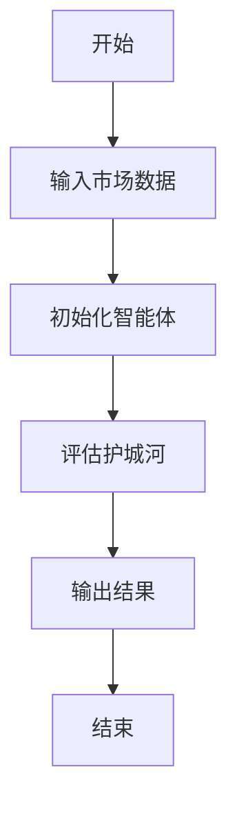
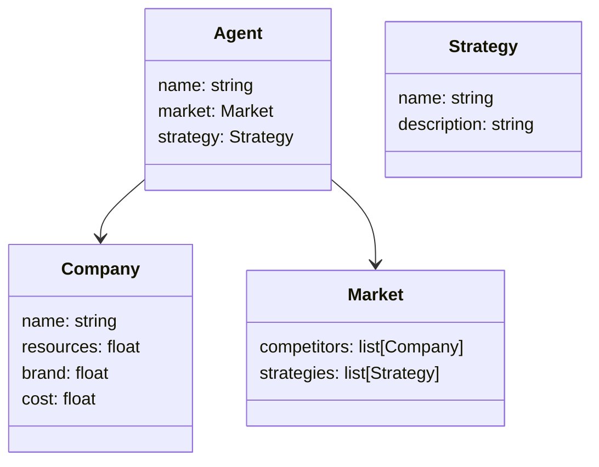
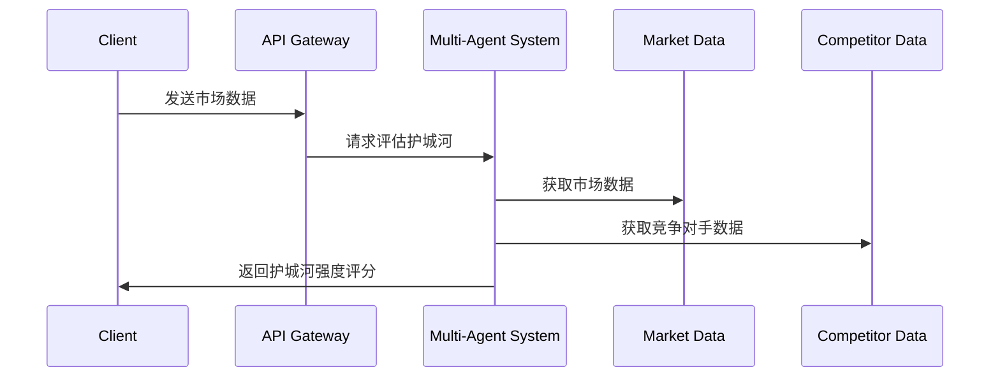

                 


# 多智能体系统如何评估公司的护城河

> 关键词：多智能体系统，公司护城河，竞争分析，战略规划，风险管理，商业分析

> 摘要：本文深入探讨了多智能体系统在评估公司护城河中的应用，从背景介绍、核心概念与联系，到算法原理、系统分析与架构设计，再到项目实战，系统性地分析了多智能体系统如何助力企业识别、评估和强化其市场竞争力。通过详细的理论分析与实际案例，本文为商业分析师、企业战略管理者和人工智能技术从业者提供了有价值的参考。

---

## 第一部分: 多智能体系统与公司护城河的背景介绍

### 第1章: 多智能体系统概述

#### 1.1 多智能体系统的基本概念

##### 1.1.1 多智能体系统的定义
多智能体系统（Multi-Agent System，MAS）是由多个智能体（Agent）组成的分布式系统，这些智能体能够通过协作和竞争共同完成复杂任务。每个智能体都是一个独立的实体，具有感知环境、自主决策和行动的能力。

##### 1.1.2 多智能体系统的特征
- **分布式性**：系统中的多个智能体分布在不同的位置，协同工作。
- **自主性**：每个智能体能够自主决策，无需外部干预。
- **反应性**：智能体能够根据环境变化动态调整行为。
- **协作性**：智能体之间通过通信和协调完成共同目标。
- **社会性**：智能体之间存在复杂的交互关系，包括协作与竞争。

##### 1.1.3 多智能体系统的应用场景
- **分布式计算**：如分布式任务分配、负载均衡。
- **智能交通系统**：如自动驾驶、交通流量优化。
- **电子商务**：如在线推荐系统、自动化交易。
- **金融市场**：如算法交易、风险评估。

#### 1.2 公司护城河的概念

##### 1.2.1 护城河的定义
护城河是指公司在市场上拥有的竞争优势，能够抵御竞争对手的侵蚀。护城河的核心在于公司的独特资源、品牌影响力、成本优势、技术壁垒等。

##### 1.2.2 护城河的核心要素
- **资源壁垒**：公司拥有独特的资源，如专利、原材料供应。
- **品牌壁垒**：强大的品牌影响力和客户忠诚度。
- **成本壁垒**：通过规模效应或技术创新降低成本。
- **技术壁垒**：技术专利、专有技术。
- **网络效应**：用户数量越多，平台价值越高。

##### 1.2.3 护城河的分类与层次
护城河可以分为以下层次：
- **战术层**：短期竞争优势，如产品创新。
- **战略层**：长期竞争优势，如品牌影响力。
- **核心层**：企业的核心竞争力，如技术壁垒。

### 第2章: 多智能体系统与公司护城河的关系

#### 2.1 多智能体系统在商业分析中的作用

##### 2.1.1 多智能体系统在竞争分析中的应用
多智能体系统可以模拟市场中的竞争行为，帮助公司预测竞争对手的策略。

##### 2.1.2 多智能体系统在战略规划中的应用
通过模拟不同战略的实施效果，帮助公司制定最优战略。

##### 2.1.3 多智能体系统在风险管理中的应用
通过实时监控市场动态，识别潜在风险，并制定应对策略。

#### 2.2 多智能体系统如何评估公司护城河

##### 2.2.1 多智能体系统评估护城河的逻辑
多智能体系统通过模拟市场环境，分析公司在不同竞争条件下的表现，从而评估其护城河的强弱。

##### 2.2.2 多智能体系统评估护城河的优势
- **动态性**：能够实时反映市场变化。
- **全面性**：可以综合考虑多个因素。
- **灵活性**：可以根据不同行业特点进行定制化分析。

##### 2.2.3 多智能体系统评估护城河的挑战
- **数据获取**：需要大量市场数据支持。
- **模型复杂性**：需要复杂的算法和模型设计。
- **计算资源**：需要强大的计算能力支持。

---

## 第二部分: 多智能体系统评估公司护城河的核心概念与联系

### 第3章: 多智能体系统的核心概念与原理

#### 3.1 多智能体系统的实体关系图

##### 3.1.1 实体关系图的定义
实体关系图（ER图）用于描述系统中各个实体之间的关系。

##### 3.1.2 多智能体系统的实体关系图（Mermaid图示）
```mermaid
erDiagram
    company) {
        company --> has_many: market
        market --> has_many: competitor
        competitor --> has_many: strategy
        company --> has_many: resource
        company --> has_many: brand
        company --> has_many: cost
    }
```

#### 3.2 多智能体系统的算法原理

##### 3.2.1 多智能体系统评估护城河的算法流程（Mermaid图示）


##### 3.2.2 多智能体系统评估护城河的数学模型
$$
\text{护城河强度} = \sum_{i=1}^{n} w_i \cdot f_i
$$
其中，\(w_i\) 是第i个因素的权重，\(f_i\) 是第i个因素的评估值。

### 第4章: 多智能体系统与护城河评估的核心联系

#### 4.1 多智能体系统在护城河评估中的应用

##### 4.1.1 多智能体系统在护城河识别中的作用
通过模拟市场环境，识别公司拥有的关键资源和竞争优势。

##### 4.1.2 多智能体系统在护城河强度评估中的作用
通过模拟不同竞争场景，评估护城河的强度和可持续性。

##### 4.1.3 多智能体系统在护城河动态变化中的作用
通过实时监控市场变化，动态调整护城河评估策略。

#### 4.2 多智能体系统与护城河评估的对比分析

##### 4.2.1 多智能体系统与传统护城河评估方法的对比
- **传统方法**：基于静态分析，结果单一。
- **多智能体系统**：基于动态模拟，结果多样。

##### 4.2.2 多智能体系统在护城河评估中的优势
- **动态性**：能够模拟市场变化。
- **全面性**：可以综合考虑多个因素。

##### 4.2.3 多智能体系统在护城河评估中的局限性
- **数据依赖**：需要大量市场数据。
- **计算复杂**：需要复杂的算法设计。

---

## 第三部分: 多智能体系统评估公司护城河的算法原理

### 第5章: 多智能体系统评估护城河的算法原理

#### 5.1 多智能体系统评估护城河的数学模型

##### 5.1.1 护城河强度评估公式
$$
\text{护城河强度} = \sum_{i=1}^{n} w_i \cdot f_i
$$
其中，\(w_i\) 是第i个因素的权重，\(f_i\) 是第i个因素的评估值。

##### 5.1.2 权重分配方法
- **层次分析法（AHP）**：通过专家打分确定权重。
- **熵值法**：通过数据标准化确定权重。

#### 5.2 多智能体系统评估护城河的实现步骤

##### 5.2.1 数据预处理
- **数据清洗**：去除无效数据。
- **数据标准化**：统一数据尺度。

##### 5.2.2 算法实现
- **初始化智能体**：定义智能体的属性和行为。
- **模拟市场环境**：设置市场参数和竞争规则。
- **评估护城河**：计算护城河强度并输出结果。

#### 5.3 多智能体系统评估护城河的代码实现

##### 5.3.1 环境安装
- **Python**：安装Python 3.8及以上版本。
- **库依赖**：安装`numpy`、`pandas`、`scikit-learn`。

##### 5.3.2 核心代码实现
```python
import numpy as np
import pandas as pd
from sklearn.metrics import pairwise_distances

def calculate_holding_moat(company_data):
    # 加载市场数据
    market_data = pd.read_csv('market.csv')
    
    # 初始化智能体
    agents = []
    for company in company_data['name']:
        agent = {
            'name': company,
            'resources': company_data[company_data['name'] == company]['resources'].values[0],
            'brand': company_data[company_data['name'] == company]['brand'].values[0],
            'cost': company_data[company_data['name'] == company]['cost'].values[0]
        }
        agents.append(agent)
    
    # 评估护城河
    moat_scores = []
    for agent in agents:
        resources_weight = 0.4
        brand_weight = 0.3
        cost_weight = 0.3
        
        moat = resources_weight * agent['resources'] + brand_weight * agent['brand'] + cost_weight * agent['cost']
        moat_scores.append(moat)
    
    return moat_scores

# 示例数据
company_data = pd.DataFrame({
    'name': ['Company A', 'Company B', 'Company C'],
    'resources': [0.8, 0.6, 0.7],
    'brand': [0.9, 0.5, 0.8],
    'cost': [0.7, 0.8, 0.6]
})

# 计算护城河强度
moat_scores = calculate_holding_moat(company_data)
print(moat_scores)
```

---

## 第四部分: 多智能体系统评估公司护城河的系统分析与架构设计

### 第6章: 多智能体系统与护城河评估的系统分析

#### 6.1 问题场景介绍
我们以某互联网公司为例，分析其护城河。假设该公司在市场中面临多个竞争对手，我们需要评估其技术壁垒、品牌影响力和成本优势。

#### 6.2 系统功能设计

##### 6.2.1 领域模型设计（Mermaid类图）


#### 6.3 系统架构设计

##### 6.3.1 系统架构设计（Mermaid架构图）


#### 6.4 系统接口设计

##### 6.4.1 接口描述
- **输入接口**：市场数据、竞争对手数据。
- **输出接口**：护城河强度评分。

##### 6.4.2 接口交互设计（Mermaid序列图）


---

## 第五部分: 多智能体系统评估公司护城河的项目实战

### 第7章: 项目实战

#### 7.1 环境安装
- **Python**：安装Python 3.8及以上版本。
- **库依赖**：安装`numpy`、`pandas`、`scikit-learn`。

#### 7.2 核心实现

##### 7.2.1 环境安装与代码实现
```python
import numpy as np
import pandas as pd
from sklearn.metrics import pairwise_distances

def calculate_holding_m

