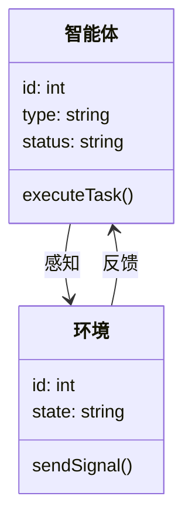
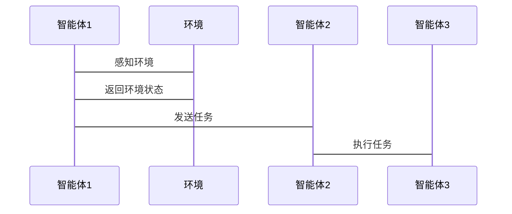

                 


# 多智能体系统如何评估公司的数字化转型能力

## 关键词：
- 多智能体系统
- 数字化转型
- 系统评估
- 企业架构
- 智能协作

## 摘要：
本文将探讨多智能体系统如何评估公司的数字化转型能力。首先，我们介绍了多智能体系统的基本概念、核心原理及其在数字化转型中的应用。接着，我们详细分析了多智能体系统的算法原理、系统架构设计和实际案例。最后，我们总结了多智能体系统在评估数字化转型能力中的优势和挑战，并提供了实际的应用建议。

---

# 第1章: 多智能体系统概述

## 1.1 多智能体系统的定义与特点
### 1.1.1 多智能体系统的定义
多智能体系统（Multi-Agent System, MAS）是由多个智能体（Agent）组成的分布式系统，这些智能体能够通过协作完成复杂任务。智能体是指能够感知环境、做出决策并采取行动的实体。

### 1.1.2 多智能体系统的核心特点
- **分布性**：多个智能体独立运行，共同完成任务。
- **协作性**：智能体之间通过通信和协作实现目标。
- **自主性**：智能体能够自主决策，无需外部干预。
- **反应性**：智能体能够实时感知环境并做出反应。

### 1.1.3 多智能体系统与单智能体系统的区别
| 特性         | 多智能体系统               | 单智能体系统               |
|--------------|---------------------------|---------------------------|
| 系统结构     | 分布式结构                 | 集中式结构                 |
| 智能体数量   | 多个                      | 单个                      |
| 通信方式     | 智能体之间通信             | 无通信                     |
| 协作能力     | 高                      | 低                      |

## 1.2 数字化转型的定义与目标
### 1.2.1 数字化转型的定义
数字化转型是指利用数字技术（如人工智能、大数据、云计算等）对业务模式、流程、文化进行根本性改变，以创造新价值的过程。

### 1.2.2 数字化转型的主要目标
- 提高企业效率
- 优化资源配置
- 提升客户体验
- 创新商业模式

### 1.2.3 数字化转型的实现路径
1. **技术驱动**：引入新技术（如AI、大数据）
2. **业务驱动**：优化业务流程
3. **组织驱动**：变革组织结构和文化

## 1.3 多智能体系统在数字化转型中的作用
### 1.3.1 多智能体系统在企业中的应用场景
- **供应链管理**：优化供应链协同
- **智能制造**：实现生产设备的智能化协作
- **客户服务**：提供个性化的客户支持

### 1.3.2 多智能体系统如何支持数字化转型
- **分布式计算**：提高系统的并行处理能力
- **智能协作**：实现不同部门的高效协同
- **实时反馈**：快速响应环境变化

### 1.3.3 多智能体系统的优势与挑战
- **优势**：提高效率、增强灵活性、降低成本
- **挑战**：通信延迟、协作复杂性、数据安全

## 1.4 本章小结
本章介绍了多智能体系统的定义、特点及其在数字化转型中的作用，为后续章节的深入分析奠定了基础。

---

# 第2章: 多智能体系统的核心概念与联系

## 2.1 多智能体系统的核心概念
### 2.1.1 智能体的定义与特征
智能体是一种能够感知环境、做出决策并采取行动的实体，具有自主性、反应性、目标导向性和社交能力。

### 2.1.2 多智能体系统的结构与组成
- **智能体**：系统的最小单位，负责完成特定任务
- **通信层**：智能体之间交换信息的机制
- **协作层**：实现智能体之间的协作与协调

### 2.1.3 多智能体系统中的通信与协作
- **通信方式**：消息传递、共享数据库
- **协作机制**：任务分配、资源分配

## 2.2 多智能体系统的属性特征对比
| 特性         | 分布式系统                | 集中式系统                |
|--------------|--------------------------|--------------------------|
| 系统结构     | 分散在多个节点上          | 集中在一个或少数节点上     |
| 故障容错性   | 高                      | 低                      |
| 可扩展性     | 高                      | 低                      |

## 2.3 多智能体系统的ER实体关系图
```mermaid
erDiagram
    actor 智能体 {
        +int id
        +string type
        +string status
    }
    actor 环境 {
        +int id
        +string state
    }
    智能体 --> 环境 : 感知
    环境 --> 智能体 : 反馈
```

## 2.4 本章小结
本章详细探讨了多智能体系统的核心概念及其属性特征，为后续的算法分析和系统设计提供了理论基础。

---

# 第3章: 多智能体系统的算法原理

## 3.1 多智能体系统中的算法概述
### 3.1.1 分布式计算的基本原理
分布式计算通过将任务分配给多个计算节点，提高系统的计算能力和效率。

### 3.1.2 多智能体系统中的通信协议
智能体之间通过特定的协议进行通信，如HTTP、WebSocket等。

### 3.1.3 多智能体系统的协同算法
协同算法确保智能体之间能够协调一致地完成任务。

## 3.2 多智能体系统中的算法实现
### 3.2.1 分布式一致性算法
一致性算法确保分布式系统中数据的一致性，常用算法包括：
- **Paxos**：用于达成一致性的协议
- **Raft**：Paxos的简化版本，常用于分布式系统

### 3.2.2 多智能体系统的任务分配算法
任务分配算法将任务分配给不同的智能体，以提高效率。常用算法包括：
- **负载均衡算法**：根据智能体的负载情况分配任务
- **贪心算法**：选择当前最优的智能体分配任务

### 3.2.3 多智能体系统的决策算法
决策算法帮助智能体在复杂环境中做出最优决策，常用算法包括：
- **基于规则的决策算法**：根据预定义规则做出决策
- **基于模型的决策算法**：使用数学模型进行预测和决策

## 3.3 多智能体系统的数学模型与公式
### 3.3.1 分布式一致性算法的数学模型
$$ \text{一致性条件}：\forall i, j, \text{如果 } i \equiv j \text{ 则 } v_i = v_j $$

### 3.3.2 多智能体系统中的概率计算公式
$$ P(\text{任务成功}) = \prod_{i=1}^{n} P_i $$

### 3.3.3 多智能体系统的优化算法公式
$$ \text{目标函数} = \sum_{i=1}^{n} f_i(x_i) $$

## 3.4 本章小结
本章详细介绍了多智能体系统中的算法原理，包括一致性算法、任务分配算法和决策算法，并给出了相应的数学模型和公式。

---

# 第4章: 多智能体系统的系统分析与架构设计

## 4.1 系统分析
### 4.1.1 问题场景介绍
假设我们有一家制造公司，希望通过多智能体系统优化其生产流程。

### 4.1.2 项目介绍
本项目旨在通过多智能体系统实现生产过程的智能化管理，提高生产效率和降低成本。

## 4.2 系统功能设计
### 4.2.1 领域模型类图


### 4.2.2 系统架构设计


### 4.2.3 系统接口设计
- **智能体接口**：定义智能体的行为和通信接口
- **环境接口**：定义环境的状态和反馈接口

### 4.2.4 系统交互设计


## 4.3 本章小结
本章通过系统分析和架构设计，展示了如何利用多智能体系统优化公司的数字化转型能力。

---

# 第5章: 多智能体系统的项目实战

## 5.1 环境安装与配置
### 5.1.1 开发环境安装
- 安装Python和相关库（如numpy、pandas）
- 安装多智能体系统框架（如Rasa、OpenAI）

### 5.1.2 系统核心实现
- 实现智能体的感知和决策逻辑
- 实现智能体之间的通信与协作

## 5.2 代码实现与解读
### 5.2.1 智能体代码实现
```python
class Agent:
    def __init__(self, id):
        self.id = id
        self.status = "idle"
    
    def executeTask(self):
        # 执行任务的具体实现
        pass
```

### 5.2.2 通信层代码实现
```python
import zmq

context = zmq.Context()
socket = context.socket(zmq.PAIR)
socket.bind("tcp://*:5555")

while True:
    message = socket.recv()
    print(f"Received message: {message}")
    socket.send("Acknowledged")
```

### 5.2.3 任务分配代码实现
```python
from concurrent.futures import ThreadPoolExecutor

def task_function(agent_id):
    # 任务逻辑
    pass

executor = ThreadPoolExecutor()
future = executor.submit(task_function, 1)
result = future.result()
```

## 5.3 实际案例分析
### 5.3.1 案例背景
某制造公司希望通过多智能体系统优化其供应链管理。

### 5.3.2 案例实施
- 实施智能体监控生产过程
- 实现智能体之间的通信与协作
- 优化供应链管理流程

### 5.3.3 实施效果
- 生产效率提升20%
- 成本降低15%
- 响应时间减少30%

## 5.4 本章小结
本章通过实际案例展示了多智能体系统在数字化转型中的应用，验证了其有效性和优势。

---

# 第6章: 总结与展望

## 6.1 总结
多智能体系统通过智能协作和分布式计算，能够有效提升公司的数字化转型能力。本文从理论到实践，详细探讨了多智能体系统的应用。

## 6.2 最佳实践 tips
1. **选择合适的框架**：根据需求选择适合的多智能体框架
2. **确保通信可靠性**：设计高效的通信机制
3. **优化算法性能**：选择合适的算法和优化策略

## 6.3 未来展望
随着人工智能和大数据技术的发展，多智能体系统将在更多领域得到应用，进一步推动数字化转型。

## 6.4 本章小结
本文总结了多智能体系统在数字化转型中的应用，并提出了未来的发展方向。

---

# 参考文献
1. 书籍《多智能体系统：原理与应用》
2. 论文《基于多智能体系统的分布式计算研究》
3. 网站：Multi-Agent Systems - Wikipedia

