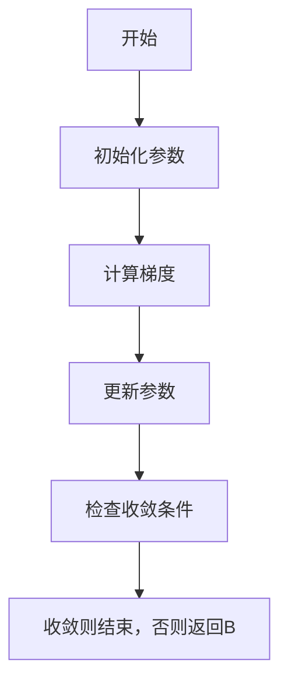
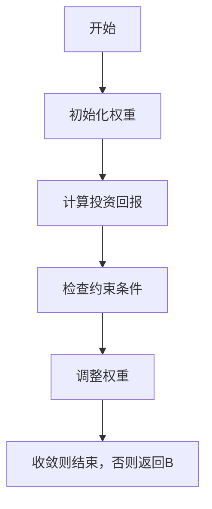
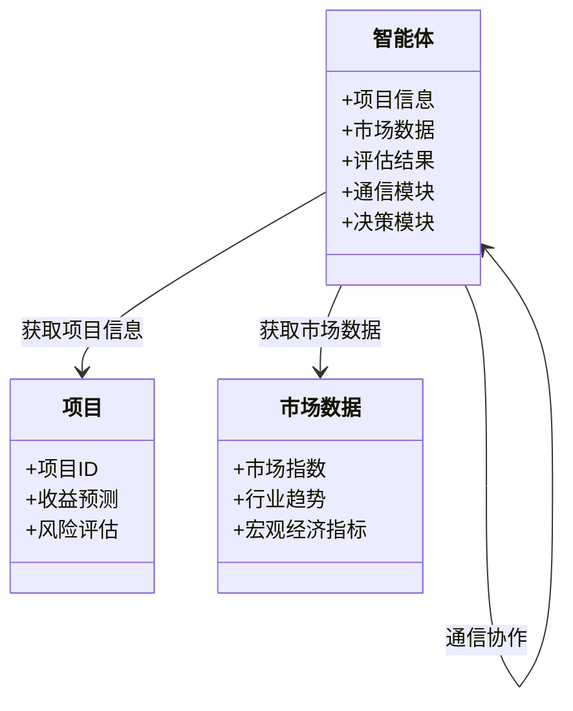
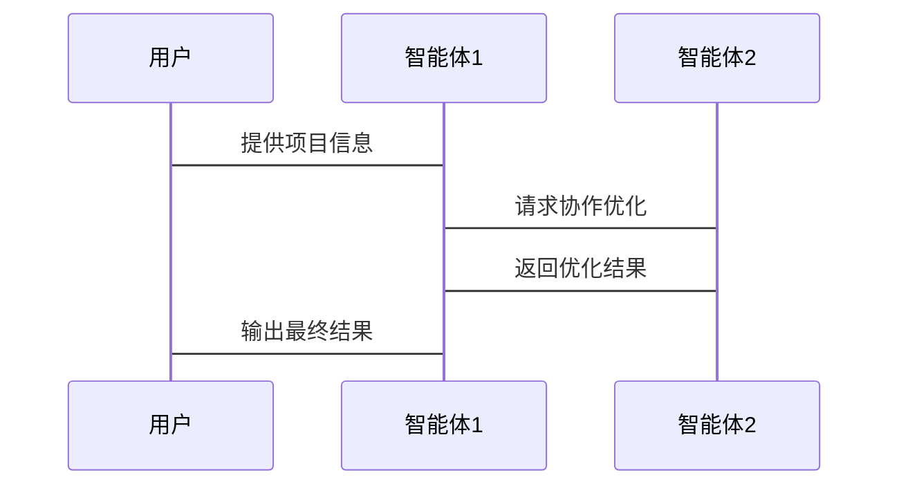

                 


# 多智能体系统如何评估公司的资本配置能力

## 关键词：多智能体系统、资本配置、分布式计算、博弈论、优化算法

## 摘要：本文探讨了多智能体系统如何评估公司的资本配置能力，通过分析多智能体系统的核心概念、算法原理、系统架构，以及实际案例，展示了如何利用多智能体技术优化资本分配策略，提升企业资本配置效率。

---

# 第1章: 多智能体系统与资本配置的背景介绍

## 1.1 多智能体系统的基本概念

### 1.1.1 多智能体系统的定义
多智能体系统（Multi-Agent System，MAS）是由多个智能体（Agent）组成的分布式系统，每个智能体都是具有独立性、自主性和协作性的实体，能够感知环境、自主决策并与其他智能体或环境交互。

### 1.1.2 多智能体系统的特征
- **分布式性**：智能体分布在不同的位置，独立运行。
- **自主性**：每个智能体具有自主决策的能力。
- **协作性**：智能体之间可以通过通信和协作完成共同目标。
- **反应性**：智能体能够根据环境变化动态调整行为。

### 1.1.3 多智能体系统与单智能体系统的区别
| 特性 | 单智能体系统 | 多智能体系统 |
|------|--------------|--------------|
| 结构  | 单一中心     | 分布式结构   |
| 决策  | 集中的决策   | 分散的决策   |
| 协作  | 无协作       | 高度协作     |
| 效率  | 高           | 取决于协作效率 |

## 1.2 资本配置的基本概念

### 1.2.1 资本配置的定义
资本配置是指将资金分配到不同的资产或项目中，以实现风险最小化和收益最大化的过程。

### 1.2.2 资本配置的目标
- **收益最大化**：通过合理分配资金，获得最大投资回报。
- **风险最小化**：降低投资组合的系统性风险和非系统性风险。
- **资源优化**：充分利用资金资源，避免浪费。

### 1.2.3 资本配置的常见方法
- **资产组合理论**：通过分散投资降低风险。
- **资本资产定价模型（CAPM）**：评估资产的预期收益。
- **投资组合理论**：通过优化算法选择最优投资组合。

## 1.3 多智能体系统与资本配置的联系

### 1.3.1 多智能体系统在资本配置中的优势
- **分布式决策**：多个智能体可以分别评估不同的投资项目，提高决策效率。
- **协作优化**：智能体之间可以协作，优化整体资本分配。
- **动态调整**：根据市场变化，智能体可以实时调整资本分配策略。

### 1.3.2 资本配置对多智能体系统的挑战
- **信息不对称**：不同智能体可能掌握不同的信息，影响决策的准确性。
- **协调问题**：多个智能体之间需要高效协作，避免冲突。
- **计算复杂性**：多智能体系统可能面临复杂的计算问题，需要高效的算法支持。

### 1.3.3 多智能体系统与资本配置的结合场景
- **投资组合优化**：多个智能体分别评估不同资产，协作优化投资组合。
- **风险分散**：智能体之间协作，将资金分配到不同的风险类别，降低整体风险。
- **实时调整**：根据市场动态，智能体实时调整资本分配策略。

## 1.4 本章小结
本章介绍了多智能体系统的基本概念、资本配置的核心目标以及两者之间的联系。多智能体系统在资本配置中具有分布式决策和协作优化的优势，但也面临信息不对称和协调问题的挑战。

---

# 第2章: 多智能体系统与资本配置的核心概念与联系

## 2.1 多智能体系统的原理

### 2.1.1 分布式计算与协调
多智能体系统通过分布式计算实现任务分配和协调，每个智能体负责一部分计算任务，通过通信协议交换信息。

### 2.1.2 智能体的决策机制
智能体基于感知的信息和预设的决策规则，自主做出决策。决策规则可以是基于规则的决策，也可以是基于机器学习的预测模型。

### 2.1.3 智能体之间的通信与协作
智能体之间通过通信模块交换信息，协作完成共同目标。通信可以是同步的，也可以是异步的，协作可以通过协商机制实现。

### 2.1.4 多智能体系统的通信协议
- **同步通信**：所有智能体同时进行通信和决策。
- **异步通信**：智能体可以随时发送信息，其他智能体根据收到的信息调整决策。

## 2.2 资本配置的数学模型

### 2.2.1 资本分配的优化目标
目标函数：最大化投资回报率，最小化投资风险。
$$ \max \sum_{i=1}^{n} r_i w_i $$
约束条件：权重之和为1，风险在可接受范围内。
$$ \sum_{i=1}^{n} w_i = 1 $$
$$ \text{风险} \leq \text{风险阈值} $$

### 2.2.2 资本配置的约束条件
- **权重约束**：各资产的权重在0到1之间，且总和为1。
- **风险约束**：投资组合的风险不能超过设定的阈值。
- **流动性约束**：资金必须满足流动性的要求。

### 2.2.3 资本配置的数学表达式
投资组合的收益可以用以下公式表示：
$$ r_p = \sum_{i=1}^{n} w_i r_i $$
其中，\( w_i \) 是资产i的权重，\( r_i \) 是资产i的预期收益率。

投资组合的风险可以用方差表示：
$$ \sigma_p^2 = \sum_{i=1}^{n} \sum_{j=1}^{n} w_i w_j \sigma_{ij} $$

## 2.3 多智能体系统与资本配置的实体关系图

### 2.3.1 ER图展示
```mermaid
erDiagram
    actor 投资者 {
        string 资金
        string 风险偏好
    }
    actor 项目方 {
        string 项目需求
        string 投资回报
    }
    entity 资本配置方案 {
        string 资金分配
        string 风险评估
    }
    投资者 --> 资本配置方案 : 提供资金
    项目方 --> 资本配置方案 : 提供项目需求
```

## 2.4 本章小结
本章详细讲解了多智能体系统的原理和资本配置的数学模型，并通过ER图展示了多智能体系统与资本配置之间的实体关系。多智能体系统通过分布式计算和协作优化，能够有效提升资本配置的效率和准确性。

---

# 第3章: 多智能体系统评估资本配置能力的算法原理

## 3.1 分布式优化算法

### 3.1.1 分布式优化的基本原理
分布式优化算法是一种在分布式系统中优化目标函数的方法，适用于多智能体系统中多个智能体协作优化的情况。

### 3.1.2 分布式优化的数学模型
目标函数：$$ f(x) = \sum_{i=1}^{n} f_i(x_i) $$
约束条件：$$ g(x) \leq 0 $$

### 3.1.3 分布式优化的实现步骤


### 3.1.4 分布式优化的具体实现
```python
def distributed_optimization():
    # 初始化参数
    x = [random.uniform(0, 1) for _ in range(n)]
    while not converged:
        # 计算梯度
        gradients = [compute_gradient(x_i) for x_i in x]
        # 更新参数
        x = [x_i - learning_rate * gradients[i] for i, x_i in enumerate(x)]
        # 检查收敛条件
        if check_convergence(x):
            break
    return x
```

## 3.2 博弈论中的纳什均衡

### 3.2.1 纳什均衡的定义
纳什均衡是指在一个博弈中，所有参与方都采取最优策略，没有任何一方有动机单方面改变策略的均衡状态。

### 3.2.2 纳什均衡的数学表达
$$ \text{对于所有参与方} i, \text{策略} s_i \text{是最佳反应} $$

### 3.2.3 纳什均衡在资本配置中的应用
在资本配置中，纳什均衡可以用来描述多个投资者在市场中的均衡状态，每个投资者都选择最优的投资组合，使得没有人有动机单方面改变策略。

## 3.3 最优资本配置算法

### 3.3.1 最优资本配置的数学模型
$$ \max \sum_{i=1}^{n} r_i w_i $$
$$ \text{subject to} \sum_{i=1}^{n} w_i = 1 $$

### 3.3.2 最优资本配置的实现步骤


### 3.3.3 最优资本配置的具体实现
```python
def optimal_capital_allocation():
    # 初始化权重
    w = [random.uniform(0, 1) for _ in range(n)]
    while not converged:
        # 计算投资回报
        returns = [compute_return(w_i) for w_i in w]
        # 检查约束条件
        if sum(w) != 1:
            w = normalize_weights(w)
        # 调整权重
        w = update_weights(w, returns)
    return w
```

## 3.4 本章小结
本章详细讲解了分布式优化算法和博弈论中的纳什均衡，以及最优资本配置算法的实现步骤。通过这些算法，可以有效评估和优化公司的资本配置能力。

---

# 第4章: 多智能体系统评估资本配置能力的系统分析与架构设计

## 4.1 问题场景介绍

### 4.1.1 问题背景
公司在进行资本配置时，需要考虑多个投资项目的风险和收益，如何利用多智能体系统优化资本配置是一个关键问题。

### 4.1.2 问题描述
公司有多个投资项目，每个项目都有不同的风险和收益，如何将有限的资金分配到这些项目中，以实现收益最大化和风险最小化。

### 4.1.3 问题解决
利用多智能体系统，将每个投资项目分配给一个智能体，智能体基于市场数据和历史信息，评估项目的收益和风险，协作优化资本分配。

## 4.2 系统功能设计

### 4.2.1 系统功能概述
- **数据采集**：采集市场数据和项目信息。
- **智能体评估**：智能体评估项目的收益和风险。
- **协作优化**：智能体协作优化资本分配。
- **结果输出**：输出最优资本配置方案。

### 4.2.2 系统功能的领域模型图


## 4.3 系统架构设计

### 4.3.1 系统架构概述
- **智能体层**：多个智能体分别负责不同项目的评估和决策。
- **通信层**：智能体之间通过通信模块交换信息。
- **决策层**：协作优化资本分配。

### 4.3.2 系统架构的mermaid图


## 4.4 系统接口设计

### 4.4.1 系统接口概述
- **智能体接口**：提供评估和决策功能。
- **通信接口**：提供智能体之间的通信功能。
- **用户接口**：提供用户输入和输出功能。

### 4.4.2 系统接口的交互流程图


## 4.5 本章小结
本章详细分析了多智能体系统评估资本配置能力的系统架构和接口设计，展示了如何通过系统架构设计实现智能体之间的协作优化。

---

# 第5章: 多智能体系统评估资本配置能力的项目实战

## 5.1 项目背景

### 5.1.1 项目目标
利用多智能体系统优化公司的资本配置能力，实现收益最大化和风险最小化。

### 5.1.2 项目需求
- **数据采集**：获取市场数据和项目信息。
- **智能体评估**：评估每个项目的收益和风险。
- **协作优化**：智能体协作优化资本分配。
- **结果输出**：输出最优资本配置方案。

## 5.2 项目实施步骤

### 5.2.1 环境安装
- **安装Python**：确保Python 3.8以上版本。
- **安装依赖库**：安装numpy、pandas、scipy等库。
- **安装通信库**：安装socket或其他通信库。

### 5.2.2 系统核心实现

#### 5.2.2.1 智能体类的实现
```python
class Agent:
    def __init__(self, project_id):
        self.project_id = project_id
        self.market_data = None
        self.assessment = None
```

#### 5.2.2.2 通信模块的实现
```python
import socket

class Communicator:
    def __init__(self, host, port):
        self.host = host
        self.port = port
        self.sock = socket.socket(socket.AF_INET, socket.SOCK_STREAM)
        self.sock.connect((self.host, self.port))

    def send_message(self, message):
        self.sock.sendall(message.encode())

    def receive_message(self):
        data = self.sock.recv(1024)
        return data.decode()
```

#### 5.2.2.3 协作优化算法的实现
```python
def collaborative_optimization(agents):
    for agent in agents:
        agent.assessment = compute_assessment(agent.market_data)
        send_assessment_to_all_agents(agent.assessment)
    return [agent.assessment for agent in agents]
```

### 5.2.3 代码实现与解读

#### 5.2.3.1 智能体评估函数
```python
def compute_assessment(market_data):
    # 计算收益
    returns = compute_returns(market_data)
    # 计算风险
    risks = compute_risks(market_data)
    return {'returns': returns, 'risks': risks}
```

#### 5.2.3.2 智能体协作优化函数
```python
def collaborative_optimization(agents):
    assessments = [agent.assessment for agent in agents]
    # 计算最优资本配置
    optimal_weights = compute_optimal_weights(assessments)
    return optimal_weights
```

## 5.3 项目小结
本章通过具体的项目实战，展示了多智能体系统在资本配置中的应用，详细讲解了环境安装、系统实现和代码解读，帮助读者更好地理解和应用多智能体系统。

---

# 第6章: 总结与展望

## 6.1 本章总结
本文详细探讨了多智能体系统如何评估公司的资本配置能力，通过分析多智能体系统的原理、算法、系统架构和项目实战，展示了多智能体系统在资本配置中的优势和应用。

## 6.2 未来展望
随着人工智能和分布式计算技术的不断发展，多智能体系统在资本配置中的应用将更加广泛和深入。未来的研究方向可以包括：
- 更高效的分布式优化算法。
- 更智能的智能体协作机制。
- 更精确的市场预测模型。

## 6.3 最佳实践 Tips
- 在实际应用中，建议结合具体业务需求选择合适的多智能体系统架构。
- 注意数据隐私和安全问题，确保智能体之间的通信安全。
- 定期更新和优化算法模型，以适应市场变化。

## 6.4 本章小结
本文总结了多智能体系统在资本配置中的应用，并展望了未来的研究方向和最佳实践。

---

# 结语

通过本文的探讨，读者可以深入了解多智能体系统如何评估公司的资本配置能力。从理论到实践，从算法到系统架构，多智能体系统在资本配置中的应用前景广阔，值得进一步研究和探索。

