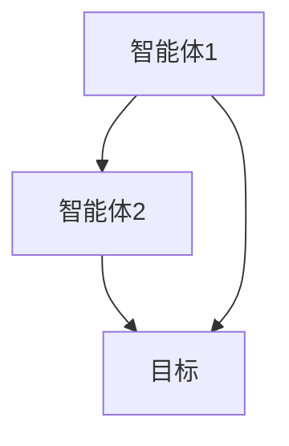
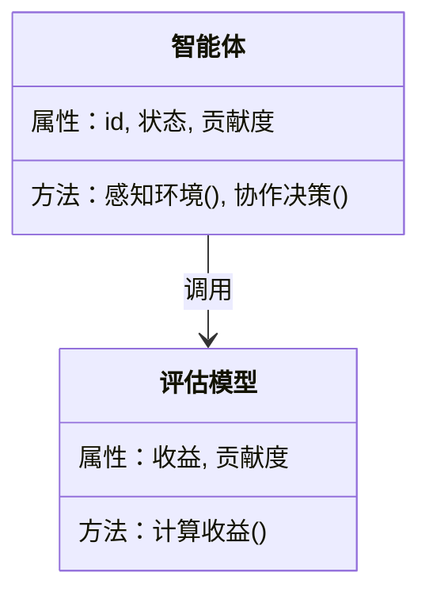
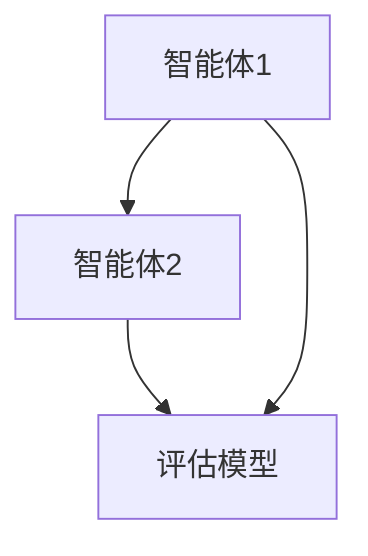
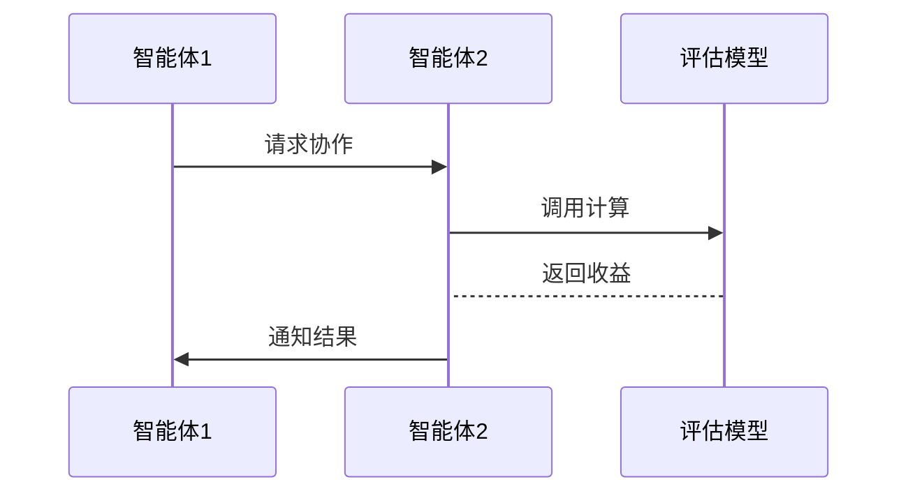

                 


---

# 多智能体系统如何评估公司的长期增长潜力

## 关键词：多智能体系统、公司增长潜力、分布式计算、协作机制、数学模型、系统架构、项目实战

## 摘要：  
多智能体系统是一种通过多个智能体协作完成复杂任务的分布式系统，其在公司增长潜力评估中的应用具有重要意义。本文通过分析多智能体系统的原理、算法、数学模型和系统架构，探讨其在公司增长潜力评估中的优势和实现方法。结合实际案例，本文详细介绍了如何利用多智能体系统构建评估模型，并提供了一份完整的项目实战指南。

---

## 第一部分: 多智能体系统概述

### 第1章: 多智能体系统概述

#### 1.1 多智能体系统的基本概念  
多智能体系统（Multi-Agent System, MAS）是由多个智能体（Agent）组成的分布式系统，这些智能体能够通过协作完成复杂的任务。与单智能体系统相比，多智能体系统具有更高的灵活性和可扩展性。

#### 1.2 多智能体系统的分类  
多智能体系统可以分为以下几类：  
1. **分布式多智能体系统**：智能体分布在不同的节点上，通过通信完成任务。  
2. **集中式多智能体系统**：所有智能体通过一个中央节点进行协调。  
3. **混合式多智能体系统**：结合分布式和集中式的特点。  

#### 1.3 多智能体系统的应用领域  
多智能体系统广泛应用于多个领域，包括：  
- 经济学：模拟市场行为。  
- 计算机科学：分布式计算、人工智能。  
- 工程学：自动化控制。  

#### 1.4 多智能体系统的优缺点  
- **优点**：协作性、灵活性、可扩展性。  
- **缺点**：复杂性、协调成本、通信延迟。  

#### 1.5 多智能体系统的研究现状  
当前研究热点包括：分布式计算、协作机制、自适应算法。实际应用案例包括：经济模拟、自动驾驶、智能城市。

---

## 第二部分: 多智能体系统的核心概念与联系

### 第2章: 多智能体系统的核心概念与联系

#### 2.1 多智能体系统的原理  
智能体的定义：智能体是一个能够感知环境并采取行动以实现目标的实体。  
智能体的属性：理性、反应性、主动性。  
多智能体系统的工作流程：感知环境、协作决策、执行任务。

#### 2.2 多智能体系统的实体关系图  
使用 Mermaid 绘制实体关系图：  


#### 2.3 多智能体系统的属性特征对比  
以下是多智能体系统中不同概念的属性特征对比表：  

| 概念         | 独立性 | 协作性 | 智能性 |
|--------------|--------|--------|--------|
| 单智能体系统   | 高     | 低     | 高     |
| 分布式系统     | 高     | 中     | 中     |
| 集中式系统     | 低     | 高     | 低     |

#### 2.4 多智能体系统的协作机制  
协作协议：智能体之间的通信协议。  
协作策略：任务分配、资源分配。  
协作模型：基于角色的协作模型、基于规则的协作模型。

---

## 第三部分: 多智能体系统的算法原理

### 第3章: 多智能体系统的算法原理

#### 3.1 多智能体系统中的分布式计算  
分布式计算的基本原理：任务分解、分布式执行、结果汇总。  
实现方式：并行计算、分布式文件系统。  
优缺点：优点是可扩展性高，缺点是复杂性高。

#### 3.2 多智能体系统的协调算法  
协调算法的核心是任务分配和资源分配。  
- **任务分配算法**：基于负载均衡的算法。  
- **资源分配算法**：基于最大收益的算法。  

#### 3.3 多智能体系统的协作算法  
协作算法包括以下步骤：  
1. 智能体感知环境。  
2. 智能体之间通信。  
3. 协作决策。  
4. 执行任务。  

#### 3.4 多智能体系统的数学模型  
构建一个简单的协作模型：  
$$ \text{收益} = \sum_{i=1}^{n} \text{智能体}_i \times \text{贡献度} $$  

---

## 第四部分: 多智能体系统的数学模型与公式

### 第4章: 多智能体系统的数学模型与公式

#### 4.1 多智能体系统的评估模型  
评估模型的核心是多智能体的协作效果。  
$$ \text{总收益} = \sum_{i=1}^{n} \text{智能体}_i \times \text{贡献度}_i $$  

#### 4.2 多智能体系统的优化公式  
优化目标：最大化总收益。  
$$ \max \sum_{i=1}^{n} \text{智能体}_i \times \text{贡献度}_i $$  

#### 4.3 多智能体系统的实例分析  
以公司增长潜力评估为例，假设公司有两个智能体：  
- 智能体1的贡献度为0.6，收益为100。  
- 智能体2的贡献度为0.4，收益为80。  
总收益为：  
$$ 100 \times 0.6 + 80 \times 0.4 = 60 + 32 = 92 $$  

---

## 第五部分: 多智能体系统的系统分析与架构设计

### 第5章: 多智能体系统的系统分析与架构设计

#### 5.1 多智能体系统的场景介绍  
公司增长潜力评估的场景包括：市场分析、资源分配、风险评估。  

#### 5.2 多智能体系统的项目介绍  
项目目标：构建一个基于多智能体系统的公司增长潜力评估模型。  

#### 5.3 多智能体系统的功能设计  
使用 Mermaid 绘制领域模型：  


#### 5.4 多智能体系统的架构设计  
使用 Mermaid 绘制系统架构图：  


#### 5.5 多智能体系统的接口设计  
接口设计包括：智能体之间的通信接口、评估模型的调用接口。  

#### 5.6 多智能体系统的交互设计  
使用 Mermaid 绘制交互图：  


---

## 第六部分: 多智能体系统的项目实战

### 第6章: 多智能体系统的项目实战

#### 6.1 多智能体系统的环境安装  
安装 Python 和相关库（如 numpy、pandas）。  

#### 6.2 多智能体系统的核心实现  
以下是核心代码示例：  
```python
class Agent:
    def __init__(self, id):
        self.id = id
        self.contribution = 0
        self.status = "idle"

    def perceive_environment(self):
        # 智能体感知环境的方法
        pass

    def collaborate(self, other_agents):
        # 智能体协作的方法
        pass
```

#### 6.3 多智能体系统的代码应用  
解释代码的功能：  
- `perceive_environment` 方法用于智能体感知环境。  
- `collaborate` 方法用于智能体之间的协作。  

#### 6.4 多智能体系统的案例分析  
以公司增长潜力评估为例，详细分析代码实现和结果。

#### 6.5 多智能体系统的项目小结  
总结项目成果，提出改进建议。

---

## 第七部分: 最佳实践与总结

### 第7章: 最佳实践与总结

#### 7.1 多智能体系统的最佳实践  
- 合理设计协作机制。  
- 优化通信协议。  
- 定期维护系统。  

#### 7.2 多智能体系统的注意事项  
- 注意系统复杂性。  
- 确保数据安全。  
- 选择合适的工具。  

#### 7.3 多智能体系统的拓展阅读  
推荐相关书籍和论文，如《分布式计算》、《多智能体系统》。

#### 7.4 多智能体系统的总结  
多智能体系统在公司增长潜力评估中的应用具有重要意义，能够提高评估的准确性和效率。

---

# 结语  
通过本文的详细讲解，读者可以深入了解多智能体系统在公司增长潜力评估中的应用，掌握其核心概念、算法原理和系统架构设计。希望本文能够为相关领域的研究和实践提供有价值的参考。

---

