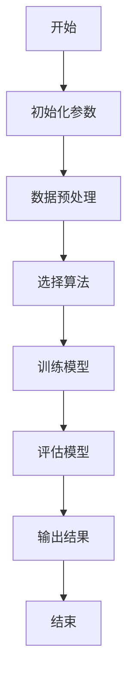

                 


# 多智能体系统如何评估公司的长期盈利能力

> 关键词：多智能体系统、长期盈利能力、人工智能、系统架构、算法原理

> 摘要：本篇文章将深入探讨多智能体系统在公司长期盈利能力评估中的应用，从背景、核心概念到算法实现，再到系统设计和项目实战，结合丰富的图表和代码示例，详细解析多智能体系统如何优化公司决策，提升长期盈利能力。

---

## 目录大纲

### 第1章: 多智能体系统与长期盈利能力评估背景

1.1 多智能体系统的定义与核心特征  
   - 1.1.1 多智能体系统的定义  
   - 1.1.2 多智能体系统的特征  
   - 1.1.3 多智能体系统与单智能体系统的区别  

1.2 长期盈利能力的定义与评估方法  
   - 1.2.1 长期盈利能力的定义  
   - 1.2.2 长期盈利能力的评估指标  
   - 1.2.3 长期盈利能力与短期盈利能力的关系  

1.3 多智能体系统在公司盈利能力评估中的应用前景  
   - 1.3.1 多智能体系统在企业决策中的优势  
   - 1.3.2 多智能体系统在长期盈利能力评估中的潜在价值  
   - 1.3.3 多智能体系统应用的挑战与机遇  

1.4 本章小结  

---

### 第2章: 多智能体系统的核心概念与联系

2.1 多智能体系统的核心原理  
   - 2.1.1 多智能体系统的组成要素  
   - 2.1.2 多智能体系统的协作机制  
   - 2.1.3 多智能体系统的通信协议  

2.2 多智能体系统与长期盈利能力的关系  
   - 2.2.1 多智能体系统如何影响公司决策  
   - 2.2.2 多智能体系统如何优化资源配置  
   - 2.2.3 多智能体系统如何预测市场趋势  

2.3 多智能体系统的ER实体关系图  
```mermaid
erDiagram
    company {
        id
        name
        industry
        revenue
        profit
    }
    market {
        id
        name
        trend
        competition
    }
    decision {
        id
        type
        outcome
        timestamp
    }
    company --> decision : 提交决策
    market --> decision : 影响决策
```

2.4 本章小结  

---

### 第3章: 多智能体系统的算法原理与数学模型

3.1 多智能体系统的算法原理  
   - 3.1.1 分布式计算的基本原理  
   - 3.1.2 多智能体系统的通信与协调算法  
   - 3.1.3 多智能体系统的决策算法  

3.2 长期盈利能力评估的数学模型  
   - 3.2.1 收益预测模型  
   - 3.2.2 风险评估模型  
   - 3.2.3 综合评估模型  

3.3 算法实现流程图  


3.4 本章小结  

---

### 第4章: 系统分析与架构设计方案

4.1 项目场景介绍  
   - 4.1.1 项目背景  
   - 4.1.2 项目目标  
   - 4.1.3 项目范围  

4.2 系统功能设计  
   - 4.2.1 领域模型设计  
   - 4.2.2 功能模块划分  
   - 4.2.3 功能流程图  

4.3 系统架构设计  
   - 4.3.1 系统架构图  
   - 4.3.2 数据流设计  
   - 4.3.3 接口设计  

4.4 系统交互设计  
   - 4.4.1 用户交互流程图  
   - 4.4.2 系统与外部系统的交互  

4.5 本章小结  

---

### 第5章: 项目实战

5.1 环境安装与配置  
   - 5.1.1 安装Python环境  
   - 5.1.2 安装必要的库  
   - 5.1.3 配置开发环境  

5.2 系统核心代码实现  
   - 5.2.1 数据处理代码  
   - 5.2.2 算法实现代码  
   - 5.2.3 系统接口代码  

5.3 代码解读与分析  
   - 5.3.1 代码功能分析  
   - 5.3.2 代码运行结果  
   - 5.3.3 代码优化建议  

5.4 实际案例分析  
   - 5.4.1 案例背景  
   - 5.4.2 案例分析过程  
   - 5.4.3 案例结果与总结  

5.5 本章小结  

---

### 第6章: 最佳实践与总结

6.1 本章小结  
   - 6.1.1 知识回顾  
   - 6.1.2 核心要点总结  

6.2 多智能体系统应用的注意事项  
   - 6.2.1 系统设计中的常见问题  
   - 6.2.2 应用中的潜在风险  
   - 6.2.3 解决方案与优化建议  

6.3 拓展阅读与学习资源  
   - 6.3.1 推荐书籍与论文  
   - 6.3.2 在线课程与培训  
   - 6.3.3 开源项目与社区  

---

### 参考文献

---

这个目录大纲确保了文章内容的全面性和逻辑性，涵盖了从理论到实践的各个方面，适合技术专家和业务决策者阅读。每一章都详细展开，结合图表和代码示例，帮助读者深入理解多智能体系统在公司长期盈利能力评估中的应用。

