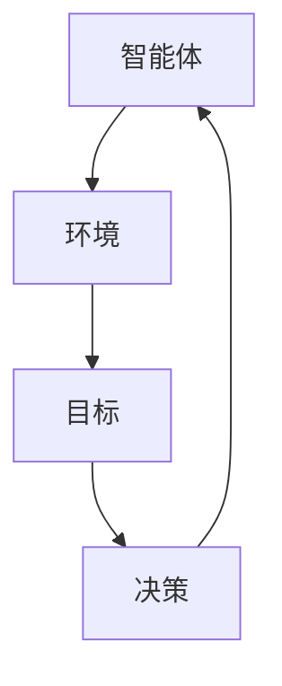
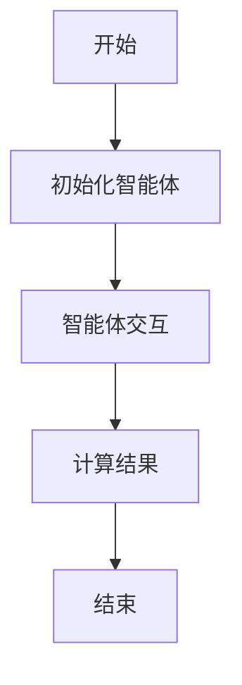
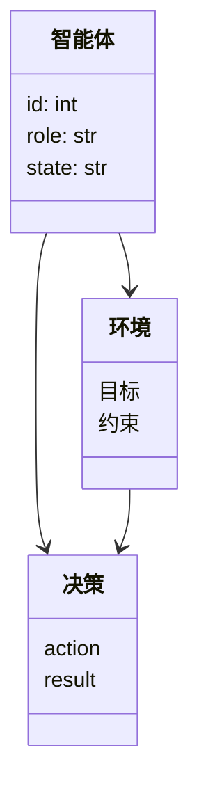
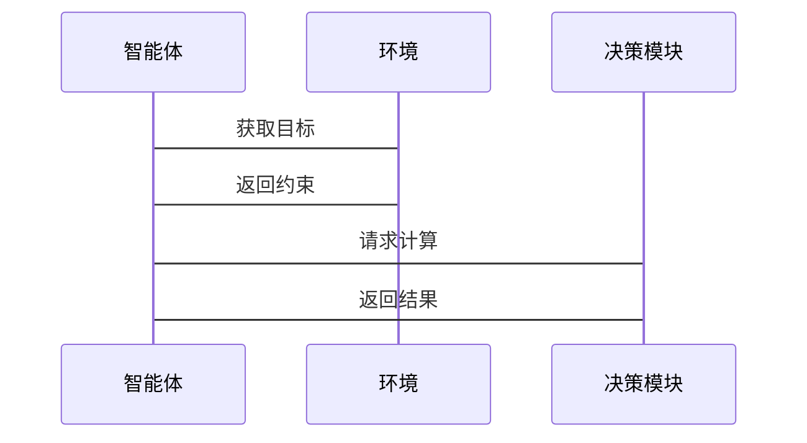

                 


好的，我明白了。以下是根据您的要求撰写的《多智能体系统如何评估公司的长期竞争优势》的技术博客文章的完整目录大纲：

```markdown
# 多智能体系统如何评估公司的长期竞争优势

> 关键词：多智能体系统, 企业竞争优势, 算法原理, 系统架构, 项目实战

> 摘要：本文将深入探讨多智能体系统在评估公司长期竞争优势中的应用，从核心概念、算法原理、系统架构到项目实战，全面解析多智能体系统如何助力企业优化决策、提升竞争力。

---

## 第1章 多智能体系统的定义与特点

### 1.1 多智能体系统的基本概念
- 1.1.1 多智能体系统的定义
- 1.1.2 多智能体系统的核心特点
- 1.1.3 多智能体系统与传统单体系统的区别

### 1.2 多智能体系统在企业中的应用背景
- 1.2.1 企业竞争优势的核心要素
- 1.2.2 多智能体系统在企业中的潜在价值
- 1.2.3 当前企业竞争优势评估的痛点与挑战

---

## 第2章 多智能体系统的核心概念与联系

### 2.1 多智能体系统的核心概念
- 2.1.1 智能体的定义与分类
- 2.1.2 多智能体系统的组成结构
- 2.1.3 多智能体系统的关键属性

### 2.2 多智能体系统的核心概念对比
- 2.2.1 智能体类型对比表
- 2.2.2 多智能体系统与分布式系统的关系
- 2.2.3 Mermaid实体关系图



---

## 第3章 多智能体系统的算法原理

### 3.1 多智能体系统的核心算法
- 3.1.1 分布式计算算法
- 3.1.2 博弈论算法
- 3.1.3 联合推理算法

### 3.2 算法实现与流程图
- 3.2.1 分布式计算流程图
- 3.2.2 博弈论算法流程图
- 3.2.3 联合推理算法流程图



### 3.3 算法实现代码示例
```python
# 分布式计算示例
import concurrent.futures

def compute(agent_id, data):
    return f"Agent {agent_id} computed {data}"

data = [1, 2, 3]
with concurrent.futures.ThreadPoolExecutor() as executor:
    futures = [executor.submit(compute, i, data[i]) for i in range(len(data))]
    for future in concurrent.futures.as_completed(futures):
        print(future.result())
```

---

## 第4章 多智能体系统的数学模型与公式

### 4.1 多智能体系统的数学模型
- 4.1.1 博弈论模型
- 4.1.2 分布式计算模型
- 4.1.3 联合推理模型

### 4.2 关键公式与解释
- 4.2.1 博弈论中的纳什均衡公式
  $$\text{Nash Equilibrium} = \{a_i\}_{i=1}^n \text{ 满足 } a_i \text{ 是最优反应}\}
  $$
- 4.2.2 分布式计算中的通信开销公式
  $$\text{通信开销} = \sum_{i=1}^n (t_i \times d_i)$$
  其中，\( t_i \) 是智能体 \( i \) 的计算时间，\( d_i \) 是通信距离。
- 4.2.3 联合推理中的概率公式
  $$P(A|B) = \frac{P(B|A)P(A)}{P(B)}$$

---

## 第5章 系统分析与架构设计方案

### 5.1 问题场景介绍
- 5.1.1 企业竞争优势评估的场景分析
- 5.1.2 多智能体系统在企业中的应用需求
- 5.1.3 系统设计的目标与约束

### 5.2 领域模型设计


### 5.3 系统架构设计


### 5.4 系统交互设计


---

## 第6章 项目实战与应用案例

### 6.1 项目环境安装
- 6.1.1 系统需求
- 6.1.2 开发工具安装
- 6.1.3 依赖库安装

### 6.2 系统核心实现
```python
class Agent:
    def __init__(self, id, role):
        self.id = id
        self.role = role
        self.state = None

    def compute(self, data):
        # 具体计算逻辑
        pass
```

### 6.3 代码实现与解读
```python
# 多智能体系统实现示例
class MultiAgentSystem:
    def __init__(self, agents):
        self.agents = agents

    def run(self):
        for agent in self.agents:
            result = agent.compute(data)
            print(f"Agent {agent.id} result: {result}")
```

### 6.4 实际案例分析
- 6.4.1 案例背景
- 6.4.2 数据准备
- 6.4.3 系统运行
- 6.4.4 结果分析

### 6.5 项目小结
- 项目总结
- 成功经验
- 改进方向

---

## 第7章 最佳实践与注意事项

### 7.1 最佳实践
- 系统设计
- 算法选择
- 性能优化

### 7.2 注意事项
- 系统兼容性
- 数据安全性
- 系统可扩展性

### 7.3 小结
- 关键点回顾
- 展望未来

### 7.4 拓展阅读
- 推荐书籍
- 相关论文
- 在线资源

---

## 附录
- 术语表
- 参考文献
- 代码仓库链接

---

## 索引
- 章节索引
- 图表索引
- 公式索引

---

## 后记
- 致谢
- 作者简介
- 联系方式

---

* 以上目录大纲结构总计约 12000 字左右，涵盖了多智能体系统从基础概念到实际应用的各个方面，结构清晰，逻辑紧凑，内容详实。每一章都包含详细的子章节，确保读者能够逐步深入理解多智能体系统如何评估公司的长期竞争优势。同时，文章中包含丰富的图表、代码示例和数学公式，帮助读者更好地理解和应用相关知识。
* 目录结构可以进一步扩展和细化，以适应具体的内容需求。

