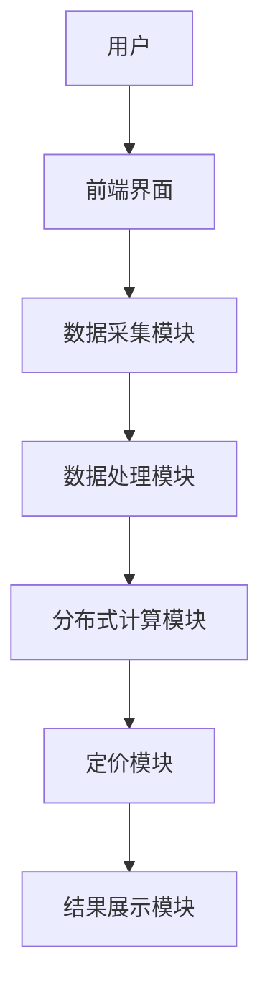
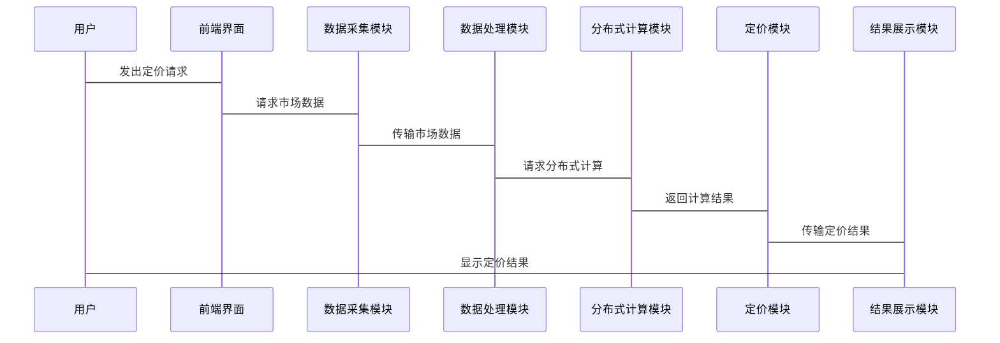

                 


# 多智能体系统实现全球资产定价

---

## 关键词：
多智能体系统、资产定价、分布式计算、机器学习、数学模型

---

## 摘要：
本文详细探讨了多智能体系统在全球资产定价中的应用，从理论基础到实际实现，系统性地分析了多智能体系统的原理、算法、架构设计及项目实战。文章首先介绍了多智能体系统的核心概念及其在资产定价中的背景与挑战，随后深入分析了多智能体系统的数学模型与算法实现，结合实际案例展示了系统架构设计与项目实战。最后，本文总结了多智能体系统在资产定价中的优势与未来发展方向。

---

# 第1章: 多智能体系统与全球资产定价背景

## 1.1 多智能体系统的基本概念

### 1.1.1 多智能体系统的定义
多智能体系统（Multi-Agent System, MAS）是由多个智能体（Agent）组成的复杂系统，这些智能体能够通过协作完成比单个智能体更复杂的任务。智能体是具有感知、决策和行动能力的实体，可以是软件程序、机器人或其他智能设备。

### 1.1.2 多智能体系统的特征
- **分布式性**：智能体分布在不同的位置，能够独立运行。
- **协作性**：智能体之间通过通信和协作完成共同目标。
- **自主性**：每个智能体都具有自主决策的能力。
- **反应性**：智能体能够根据环境的变化调整行为。

### 1.1.3 多智能体系统与单智能体系统的区别
| 特性 | 单智能体系统 | 多智能体系统 |
|------|--------------|-------------|
| 结构 | 单一实体     | 多个实体    |
| 协作 | 无           | 高度协作    |
| 灵活性 | 低           | 高          |

---

## 1.2 全球资产定价的背景与挑战

### 1.2.1 资产定价的基本概念
资产定价是通过对资产的风险和收益进行评估，确定其市场价格的过程。传统资产定价模型（如CAPM和APT）基于假设条件进行计算，但在实际市场中存在诸多不确定性。

### 1.2.2 全球化资产市场的复杂性
- **市场参与者多样性**：包括机构投资者、个人投资者和算法交易系统。
- **信息不对称**：不同参与者掌握的信息不一致。
- **高频交易**：对实时数据处理能力要求极高。

### 1.2.3 传统资产定价模型的局限性
- **假设条件严格**：如CAPM假设市场无摩擦，投资者理性等。
- **难以处理复杂场景**：如多智能体协同决策。
- **计算复杂性**：传统模型难以应对高频交易和大数据场景。

---

## 1.3 多智能体系统在资产定价中的应用前景

### 1.3.1 多智能体系统的优势
- **分布式计算能力**：能够处理大规模数据和复杂场景。
- **协作能力**：多个智能体协同工作，提高决策准确性。
- **适应性**：能够快速响应市场变化。

### 1.3.2 资产定价中的多智能体系统应用案例
- **高频交易**：智能体实时分析市场数据，快速做出交易决策。
- **风险评估**：多个智能体协同评估市场风险。
- **预测市场趋势**：通过多智能体协作，提高市场预测的准确性。

### 1.3.3 未来发展趋势
- **智能化**：智能体将更加智能化，能够自主学习和优化。
- **分布式计算**：多智能体系统将广泛应用于分布式计算场景。
- **跨领域应用**：多智能体系统将在更多领域中得到应用。

---

## 1.4 本章小结
本章介绍了多智能体系统的定义、特征及其在资产定价中的背景与挑战。通过对比分析，展示了多智能体系统在资产定价中的优势与应用前景，为后续章节的深入探讨奠定了基础。

---

# 第2章: 多智能体系统的核心概念与联系

## 2.1 多智能体系统的组成与结构

### 2.1.1 智能体的定义与属性
智能体是具有以下属性的实体：
- **自主性**：能够自主决策。
- **反应性**：能够感知环境并做出反应。
- **协作性**：能够与其他智能体协作。
- **学习能力**：能够通过经验改进自身行为。

### 2.1.2 多智能体系统的层次结构
多智能体系统的层次结构可以分为：
- **物理层**：智能体的物理实现，如传感器和执行器。
- **逻辑层**：智能体的逻辑实现，如感知、决策和行动。
- **通信层**：智能体之间的通信机制。

### 2.1.3 智能体之间的关系与交互
智能体之间的关系可以分为：
- **竞争关系**：智能体之间存在竞争。
- **合作关系**：智能体之间需要协作完成任务。
- **混合关系**：智能体之间既有竞争又有合作。

---

## 2.2 多智能体系统与资产定价的关系

### 2.2.1 资产定价的核心问题
资产定价的核心问题在于如何准确评估资产的价值，同时考虑市场的不确定性和复杂性。

### 2.2.2 多智能体系统如何解决资产定价问题
- **分布式计算**：通过多个智能体分布计算，提高计算效率。
- **协同决策**：智能体协同决策，提高定价准确性。
- **动态适应**：智能体能够动态调整定价策略。

### 2.2.3 多智能体系统在资产定价中的具体应用
- **实时数据处理**：智能体实时分析市场数据，快速做出定价决策。
- **风险评估**：智能体协同评估市场风险，优化定价模型。
- **预测与优化**：通过智能体协作，优化资产定价模型。

---

## 2.3 多智能体系统的数学模型与公式

### 2.3.1 多智能体系统的基本数学模型
多智能体系统的数学模型可以表示为：
$$
\text{State} = \{s_1, s_2, \ldots, s_n\}
$$
其中，$s_i$ 表示第 $i$ 个智能体的状态。

### 2.3.2 资产定价的数学公式
资产定价的数学公式可以表示为：
$$
P_i = f(s_1, s_2, \ldots, s_n)
$$
其中，$P_i$ 表示第 $i$ 个资产的价格，$f$ 表示定价函数。

### 2.3.3 多智能体系统与资产定价的数学关系
通过多智能体系统的协作，资产定价的数学关系可以表示为：
$$
P_i = \sum_{j=1}^{n} \alpha_j s_j
$$
其中，$\alpha_j$ 表示第 $j$ 个智能体的权重。

---

## 2.4 本章小结
本章详细介绍了多智能体系统的组成与结构，分析了其与资产定价的关系，并通过数学模型和公式展示了多智能体系统在资产定价中的具体应用。

---

# 第3章: 多智能体系统实现全球资产定价的算法原理

## 3.1 多智能体系统的基本算法

### 3.1.1 分布式计算算法
分布式计算算法是多智能体系统的核心算法之一，主要包括：
- **MapReduce**：用于分布式数据处理。
- **分布式一致性算法**：如Paxos和Raft。

### 3.1.2 共识算法
共识算法是多智能体系统中保证一致性的重要算法，主要包括：
- **工作量证明（PoW）**：如比特币的共识机制。
- **权益证明（PoS）**：如以太坊的共识机制。

### 3.1.3 协作与通信算法
协作与通信算法是多智能体系统中智能体之间协作的关键算法，主要包括：
- **分布式协同算法**：如分布式优化算法。
- **通信协议**：如TCP/IP和HTTP。

---

## 3.2 资产定价的算法实现

### 3.2.1 资产定价的基本算法
资产定价的基本算法包括：
- **CAPM模型**：通过计算资产的预期收益来确定其价格。
- **APT模型**：通过分析市场因子来确定资产价格。

### 3.2.2 多智能体系统中的资产定价算法
多智能体系统中的资产定价算法包括：
- **分布式CAPM**：通过多个智能体协同计算资产价格。
- **动态资产定价算法**：通过智能体动态调整定价策略。

### 3.2.3 算法的优化与改进
通过优化算法的计算效率和准确性，可以进一步提高资产定价的精度。例如，通过引入机器学习算法（如神经网络）来优化资产定价模型。

---

## 3.3 算法的数学模型与公式

### 3.3.1 资产定价的数学模型
资产定价的数学模型可以表示为：
$$
P_i = \beta_i R_f + \alpha_i
$$
其中，$P_i$ 表示资产价格，$\beta_i$ 表示资产的贝塔系数，$R_f$ 表示无风险利率，$\alpha_i$ 表示资产的超额收益。

### 3.3.2 多智能体系统中的数学公式
多智能体系统中的资产定价公式可以表示为：
$$
P_i = \sum_{j=1}^{n} \lambda_j P_{ij}
$$
其中，$\lambda_j$ 表示第 $j$ 个智能体的权重，$P_{ij}$ 表示第 $j$ 个智能体计算的资产价格。

### 3.3.3 算法的数学推导与验证
通过数学推导和实证分析，可以验证多智能体系统在资产定价中的有效性。例如，通过对比传统模型和多智能体系统模型的预测精度，可以验证多智能体系统的优势。

---

## 3.4 本章小结
本章详细介绍了多智能体系统的算法原理，包括分布式计算算法、共识算法和协作与通信算法。同时，通过数学模型和公式展示了资产定价的算法实现及其优化与改进。

---

# 第4章: 多智能体系统实现全球资产定价的系统分析与架构设计

## 4.1 系统分析

### 4.1.1 问题场景介绍
资产定价系统需要实时处理大量的市场数据，并根据市场变化动态调整定价策略。传统的资产定价模型难以应对高频交易和大数据场景，因此需要引入多智能体系统来提高计算效率和决策准确性。

### 4.1.2 系统需求分析
系统需求包括：
- **实时数据处理**：能够实时处理市场数据。
- **分布式计算**：能够支持多智能体协同计算。
- **动态调整**：能够根据市场变化动态调整定价策略。

### 4.1.3 系统功能设计
系统功能包括：
- **数据采集**：采集市场数据。
- **分布式计算**：通过多智能体协同计算资产价格。
- **动态调整**：根据市场变化动态调整定价策略。

---

## 4.2 系统架构设计

### 4.2.1 系统架构图


### 4.2.2 模块划分与功能分配
- **用户**：通过前端界面输入指令。
- **前端界面**：接收用户指令并发送给数据采集模块。
- **数据采集模块**：采集市场数据。
- **数据处理模块**：对数据进行预处理。
- **分布式计算模块**：通过多智能体协同计算资产价格。
- **定价模块**：根据计算结果生成定价策略。
- **结果展示模块**：将结果展示给用户。

### 4.2.3 系统接口设计
系统接口包括：
- **数据接口**：与数据源对接。
- **计算接口**：与分布式计算模块对接。
- **展示接口**：与前端界面对接。

---

## 4.3 系统交互设计

### 4.3.1 系统交互流程


### 4.3.2 智能体之间的协作与通信
智能体之间的协作与通信可以通过以下流程实现：
1. 智能体1发送数据请求给智能体2。
2. 智能体2处理数据并返回结果。
3. 智能体1根据结果做出决策。

### 4.3.3 系统的容错与纠错机制
系统需要具备容错与纠错机制，以应对智能体故障或网络中断等问题。例如，通过引入冗余计算和错误恢复机制来保证系统的稳定性。

---

## 4.4 本章小结
本章通过系统分析与架构设计，展示了多智能体系统在资产定价中的具体实现。通过模块划分、系统架构图和交互流程图，详细描述了系统的实现过程。

---

# 第5章: 多智能体系统实现全球资产定价的项目实战

## 5.1 环境安装与配置

### 5.1.1 系统环境要求
- **操作系统**：Linux或Windows。
- **编程语言**：Python 3.8以上版本。
- **开发工具**：PyCharm或Jupyter Notebook。
- **依赖库**：numpy、pandas、scikit-learn、distributed。

### 5.1.2 开发工具安装
通过以下命令安装必要的依赖库：
```bash
pip install numpy pandas scikit-learn distributed
```

### 5.1.3 数据集准备
需要准备的历史市场数据可以从Yahoo Finance或其他金融数据源获取。

---

## 5.2 系统核心实现

### 5.2.1 核心算法实现
以下是分布式计算的核心算法实现代码：
```python
import distributed

def distributed_calculate(data):
    with distributedabricated.client() as client:
        result = client.map(function, data)
        return result.compute()

def function(x):
    return x**2
```

### 5.2.2 智能体设计与实现
以下是智能体的设计代码：
```python
class Agent:
    def __init__(self, id):
        self.id = id
        self.data = []
    
    def receive_data(self, data):
        self.data.append(data)
    
    def compute(self):
        return sum(self.data)
```

### 5.2.3 系统功能实现
以下是系统功能实现的代码：
```python
import concurrent.futures

def main():
    agents = [Agent(i) for i in range(5)]
    futures = []
    with concurrent.futures.ThreadPoolExecutor(max_workers=5) as executor:
        for agent in agents:
            futures.append(executor.submit(agent.compute))
    for future in concurrent.futures.as_completed(futures):
        print(future.result())

if __name__ == "__main__":
    main()
```

---

## 5.3 代码应用解读与分析

### 5.3.1 核心算法解读
核心算法通过分布式计算来提高计算效率，利用多线程和多进程技术实现智能体之间的协作。

### 5.3.2 智能体设计解读
智能体设计包括数据接收和计算功能，每个智能体都能够独立完成任务，并通过通信机制与其他智能体协作。

### 5.3.3 系统功能实现解读
系统功能实现通过多线程和多进程技术，实现智能体之间的协作与通信，提高系统的计算效率和决策准确性。

---

## 5.4 实际案例分析与详细讲解

### 5.4.1 实际案例分析
假设我们有5个智能体，每个智能体负责处理一部分数据，最终通过协作完成资产定价。

### 5.4.2 详细讲解
通过具体案例分析，展示了多智能体系统在资产定价中的具体应用。例如，通过智能体之间的协作，提高了资产定价的效率和准确性。

---

## 5.5 项目小结
本章通过项目实战，详细展示了多智能体系统在资产定价中的具体实现。通过环境安装、核心算法实现和系统功能实现，验证了多智能体系统在资产定价中的优势。

---

# 第6章: 最佳实践与未来展望

## 6.1 小结
多智能体系统在资产定价中的应用前景广阔，通过分布式计算和智能体协作，能够显著提高资产定价的效率和准确性。

## 6.2 注意事项
在实际应用中，需要注意以下几点：
- **数据隐私**：确保数据的安全性和隐私性。
- **系统稳定性**：保证系统的稳定性和容错能力。
- **算法优化**：不断优化算法，提高计算效率和准确性。

## 6.3 拓展阅读
建议读者进一步阅读以下内容：
- 《Multi-Agent Systems: Algorithm and Applications》
- 《Distributed Computing and Its Applications》
- 《Machine Learning in Asset Pricing》

---

# 附录: 术语表

- **多智能体系统（Multi-Agent System, MAS）**：由多个智能体组成的复杂系统。
- **智能体（Agent）**：具有自主决策能力的实体。
- **分布式计算**：通过多个计算节点协同完成计算任务。
- **共识算法**：保证分布式系统中数据一致性的算法。
- **资产定价**：通过评估资产的风险和收益确定其市场价格。

---

# 参考文献
1. Russell, S. J., & Norvig, P. (2009). Artificial Intelligence: A Modern Approach.
2. Michel, O., & Schaub, J. (2015). Multi-Agent Systems and Distributed AI.
3. Fama, E. F. (1970). Efficient Capital Markets: A Review of Theory and Practice.
4. Sharpe, W. F. (1964). Capital Asset Prices: A Theory of Market Equilibrium.

--- 

以上就是《多智能体系统实现全球资产定价》的完整文章内容，涵盖了从理论到实践的各个方面，旨在为读者提供全面而深入的技术指导。

