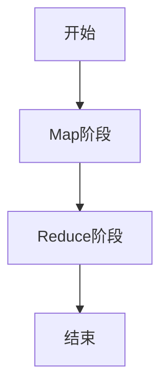
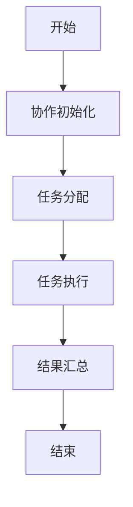

                 


# 多智能体系统实现动态行业吸引力分析

## 关键词
多智能体系统, 动态行业吸引力, 分布式计算, 协作算法, 系统架构设计

## 摘要
本文深入探讨了多智能体系统在动态行业吸引力分析中的应用。通过分析多智能体系统的定义、特点及其在吸引力分析中的作用，结合具体的算法原理和系统架构设计，本文提出了基于多智能体系统的吸引力分析解决方案。通过实际案例分析和数学模型的构建，本文展示了如何利用多智能体系统实现动态行业的吸引力预测和优化。

---

## 第1章：多智能体系统概述

### 1.1 多智能体系统的基本概念
多智能体系统（Multi-Agent System, MAS）是由多个智能体组成的分布式系统，每个智能体都具有一定的自主性、反应性和协作能力。与单智能体系统相比，MAS能够更好地应对复杂环境中的动态问题。

#### 表格：多智能体系统与单智能体系统的对比
| 特性                | 单智能体系统           | 多智能体系统           |
|---------------------|----------------------|----------------------|
| 系统结构            | 单一结构             | 分布式结构           |
| 资源共享            | 集中控制             | 分散控制             |
| 处理能力            | 单点处理             | 并行处理             |
| 协作能力            | 无                   | 强                   |

### 1.2 动态行业吸引力分析的背景与意义
动态行业吸引力分析旨在通过量化行业吸引力的变化，帮助企业制定更有效的市场策略。多智能体系统的引入，使得吸引力分析能够实时响应市场变化，提高分析的准确性和效率。

---

## 第2章：多智能体系统的核心概念与联系

### 2.1 多智能体系统的实体关系分析
#### ER图：多智能体系统的实体关系
```mermaid
er
    %% 多智能体系统的实体关系图
    actor 用户 {
        <String> 用户ID
        <String> 用户名
    }
    actor 智能体 {
        <String> 智能体ID
        <String> 智能体名称
    }
    entity 行业数据 {
        <String> 行业ID
        <String> 行业名称
        <Int> 吸引力评分
    }
    用户 --> 行业数据 : 提供数据
    智能体 --> 行业数据 : 处理数据
```

### 2.2 多智能体系统的算法原理
#### 算法流程图：MapReduce算法


#### Python代码实现：MapReduce算法
```python
def map_function(key, value):
    # 处理单个键值对
    return (key, value)

def reduce_function(key, values):
    # 聚合处理
    total = 0
    for value in values:
        total += value
    return (key, total)

def main():
    import sys
    from collections import defaultdict

    data = [ (i, i) for i in range(10) ]
    # Map阶段
    mapped_data = [ map_function(k, v) for k, v in data ]
    # Reduce阶段
    reduced_data = defaultdict(list)
    for k, v in mapped_data:
        reduced_data[k].append(v)
    # 聚合
    result = []
    for k, vs in reduced_data.items():
        result.append(reduce_function(k, vs))
    # 输出结果
    for k, v in result:
        print(f"{k}: {v}")

if __name__ == "__main__":
    main()
```

---

## 第3章：动态行业吸引力分析的数学模型

### 3.1 行业吸引力的量化指标
行业吸引力可以通过多个指标进行量化，例如市场份额、增长率、竞争程度等。吸引力评分的计算公式如下：
$$吸引力 = \sum_{i=1}^{n} w_i x_i$$
其中，$w_i$ 是第$i$个指标的权重，$x_i$ 是指标的数值。

### 3.2 动态行业的吸引力变化分析
吸引力变化的数学表达式为：
$$\Delta A = A(t+1) - A(t)$$
其中，$A(t)$ 表示第$t$时刻的吸引力评分。

---

## 第4章：多智能体系统实现动态行业吸引力分析的算法与系统设计

### 4.1 多智能体系统算法原理
#### 算法流程图：协作算法


#### Python代码实现：协作算法
```python
import threading

class Agent:
    def __init__(self, id):
        self.id = id
        self.task = None

    def assign_task(self, task):
        self.task = task
        print(f"Agent {self.id} assigned task: {task}")

    def execute_task(self):
        if self.task:
            print(f"Agent {self.id} executing task: {self.task}")
            # 模拟任务执行
            import time
            time.sleep(1)
            print(f"Agent {self.id} completed task: {self.task}")
            self.task = None

def main():
    # 初始化智能体
    agents = [Agent(i) for i in range(1, 4)]
    # 任务分配
    tasks = ["分析市场", "收集数据", "生成报告"]
    for agent in agents:
        tasks_to_assign = tasks.copy()
        agent.assign_task(tasks_to_assign.pop(0))
    # 任务执行
    for agent in agents:
        agent.execute_task()

if __name__ == "__main__":
    main()
```

---

## 第5章：项目实战

### 5.1 项目介绍
#### 环境安装
```bash
# 安装Python和相关库
pip install numpy matplotlib
```

#### 核心代码实现
```python
import numpy as np
import matplotlib.pyplot as plt

def calculate吸引力(data):
    # 计算吸引力
    weights = np.array([0.3, 0.4, 0.3])
    normalized_data = data / np.max(data)
    return np.sum(weights * normalized_data, axis=1)

# 示例数据
data = np.array([[100, 200, 150], [80, 180, 120], [90, 190, 130]])
result = calculate_吸引緒(data)

# 绘制图表
plt.figure(figsize=(10, 6))
plt.plot(result, 'r--')
plt.xlabel('行业')
plt.ylabel('吸引力评分')
plt.show()
```

### 5.2 案例分析
以电商行业为例，通过多智能体系统分析不同平台的吸引力变化。通过代码实现吸引力评分的动态计算，绘制吸引力变化趋势图，为企业制定市场策略提供数据支持。

---

## 第6章：最佳实践与小结

### 6.1 最佳实践
- **算法选择**：根据具体场景选择合适的算法，避免过度复杂化。
- **系统架构**：确保系统的可扩展性和可维护性。
- **性能优化**：通过并行计算和缓存优化提升系统性能。

### 6.2 小结
本文通过理论分析和实际案例，展示了多智能体系统在动态行业吸引力分析中的应用。通过合理的系统设计和算法优化，可以显著提升吸引力分析的效率和准确性。

---

## 第7章：注意事项与拓展阅读

### 7.1 注意事项
- 确保数据的准确性和实时性。
- 处理多智能体系统中的通信延迟和数据同步问题。
- 避免算法选择不当导致的计算错误。

### 7.2 拓展阅读
- 《Multi-Agent Systems: Complexity and Intelligence》
- 《Distributed Computing: Principles and Models》

---

## 总结
通过本文的详细讲解，读者可以深入了解多智能体系统在动态行业吸引力分析中的应用，掌握相关算法和系统设计的关键点。希望本文能够为相关领域的研究和实践提供有价值的参考。

