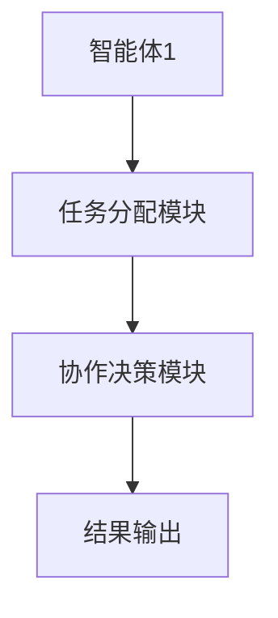
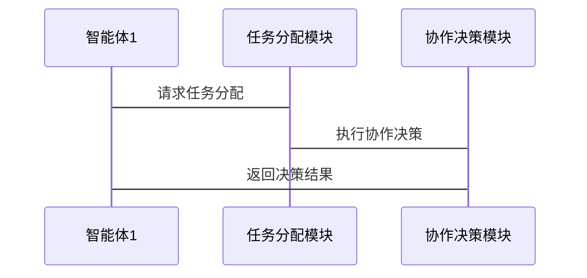

                 


# 多智能体系统实现智能化全球资产配置

> **关键词**：多智能体系统、智能化资产配置、分布式算法、金融投资、协作机制  
> 
> **摘要**：  
> 随着金融市场的日益复杂化和全球化，智能化全球资产配置的需求日益迫切。多智能体系统（Multi-Agent System, MAS）作为一种分布式智能系统，通过多个智能体的协作与交互，能够有效解决传统资产配置中的效率低下、信息孤岛和决策滞后等问题。本文将从多智能体系统的定义与特点出发，深入探讨其在智能化全球资产配置中的核心概念、协作机制、算法原理、系统设计及实际应用，结合具体案例和代码实现，全面解析多智能体系统如何赋能智能化全球资产配置。

---

## 目录大纲

# 1. 多智能体系统与智能化全球资产配置概述

## 1.1 多智能体系统的定义与特点
### 1.1.1 多智能体系统的定义
多智能体系统（MAS）是由多个智能体（Agent）组成的分布式智能系统，每个智能体具有自主性、反应性、社会性和协作性。智能体通过交互和协作完成复杂的任务。

### 1.1.2 多智能体系统的核心特点
- **自主性**：智能体能够自主决策，无需外部干预。
- **反应性**：智能体能够感知环境并实时响应。
- **社会性**：智能体之间可以通过通信协作完成任务。
- **分布式性**：多个智能体分布在不同的位置，协同工作。

### 1.1.3 多智能体系统与传统单智能体系统的区别
| 特性 | 单智能体系统 | 多智能体系统 |
|------|--------------|--------------|
| 决策 | 单一决策中心 | 分布式决策 |
| 通信 | 无 | 智能体间通信 |
| 协作 | 无 | 强协作性 |

## 1.2 智能化全球资产配置的背景
### 1.2.1 全球资产配置的定义与重要性
全球资产配置是指将资金分配到不同国家、地区的资产中，以分散风险、优化收益。智能化资产配置通过技术手段提高配置效率和精准度。

### 1.2.2 传统资产配置方法的局限性
- 信息更新慢：传统方法依赖人工分析，难以实时调整。
- 数据孤岛：不同资产类别、市场数据分散，难以整合。
- 决策滞后：单智能体系统难以快速响应市场变化。

### 1.2.3 智能化资产配置的优势与发展趋势
- **实时性**：多智能体系统能够实时感知市场变化。
- **分布式决策**：多个智能体协同决策，提高效率。
- **风险分散**：通过多智能体协作优化资产配置。

---

# 2. 多智能体系统的协作机制

## 2.1 多智能体系统中的通信与协作
### 2.1.1 智能体之间的通信协议
智能体之间的通信需要遵循特定协议，例如基于消息队列的通信（如Kafka）或基于服务调用的通信（如gRPC）。

### 2.1.2 协作任务的分配机制
协作任务的分配机制包括：
- **静态分配**：任务按照预设规则分配。
- **动态分配**：根据实时状态动态调整任务分配。

### 2.1.3 协作决策的达成过程
协作决策需要通过投票、协商等方式达成共识。

## 2.2 多智能体系统的任务分配与决策
### 2.2.1 任务分配的算法与策略
- **基于角色的任务分配**：根据智能体的能力分配任务。
- **基于优先级的任务分配**：根据任务优先级分配资源。

### 2.2.2 分散式决策与集中式决策的对比
| 特性 | 分散式决策 | 集中式决策 |
|------|------------|------------|
| 决策效率 | 高 | 低 |
| 系统复杂度 | 低 | 高 |

### 2.2.3 协作决策的优化方法
- **一致性算法**：确保决策的统一性。
- **分布式优化**：通过优化算法提高决策效率。

## 2.3 多智能体系统的协作模型
### 2.3.1 基于角色的协作模型
不同智能体根据角色分配任务。

### 2.3.2 基于规则的协作模型
通过预设规则实现协作。

### 2.3.3 基于学习的协作模型
通过机器学习算法优化协作策略。

---

# 3. 多智能体系统在资产配置中的算法原理

## 3.1 多智能体系统的分布式算法
### 3.1.1 分布式一致性算法
一致性算法（如Paxos、Raft）用于保证分布式系统的一致性。

### 3.1.2 分布式优化算法
分布式优化算法（如分布式梯度下降）用于优化资产配置。

## 3.2 多智能体系统的协作算法
### 3.2.1 协作任务分配算法
协作任务分配算法（如任务分配树算法）用于优化任务分配。

### 3.2.2 协作决策算法
协作决策算法（如分布式共识算法）用于优化协作决策。

## 3.3 多智能体系统的算法实现
### 3.3.1 算法实现步骤
1. 初始化智能体。
2. 分配任务。
3. 执行协作算法。
4. 输出结果。

---

# 4. 多智能体系统的系统设计

## 4.1 系统功能设计
### 4.1.1 系统功能模块
- 智能体管理模块。
- 任务分配模块。
- 协作决策模块。

### 4.1.2 系统功能流程
1. 初始化系统。
2. 分配任务。
3. 执行协作算法。
4. 输出结果。

## 4.2 系统架构设计
### 4.2.1 系统架构图


### 4.2.2 接口设计
- 智能体管理接口。
- 任务分配接口。
- 协作决策接口。

## 4.3 系统交互流程
### 4.3.1 交互流程图


---

# 5. 项目实战

## 5.1 环境安装
```bash
pip install multi-agent-system
```

## 5.2 核心代码实现
### 5.2.1 智能体类
```python
class Agent:
    def __init__(self, id):
        self.id = id
        self.state = 'idle'
    
    def receive_task(self, task):
        self.state = 'processing'
        # 处理任务
```

### 5.2.2 任务分配模块
```python
class TaskAllocator:
    def __init__(self, agents):
        self.agents = agents
    
    def allocate_task(self, task):
        # 分配任务到空闲智能体
        for agent in self.agents:
            if agent.state == 'idle':
                agent.receive_task(task)
                break
```

## 5.3 实际案例分析
### 5.3.1 案例描述
假设我们有三个智能体，分别负责股票、债券和基金的配置。

### 5.3.2 案例实现
```python
agents = [Agent(1), Agent(2), Agent(3)]
allocator = TaskAllocator(agents)
allocator.allocate_task('股票配置')
allocator.allocate_task('债券配置')
allocator.allocate_task('基金配置')
```

---

# 6. 总结与展望

## 6.1 本章小结
多智能体系统通过协作与分布式决策，能够有效提升智能化全球资产配置的效率和精准度。

## 6.2 未来展望
未来，随着人工智能和分布式技术的不断发展，多智能体系统在金融领域的应用将更加广泛。

---

通过以上结构和内容安排，本文将深入探讨多智能体系统在智能化全球资产配置中的实现原理和实际应用，帮助读者全面理解多智能体系统在金融领域的潜力和价值。

