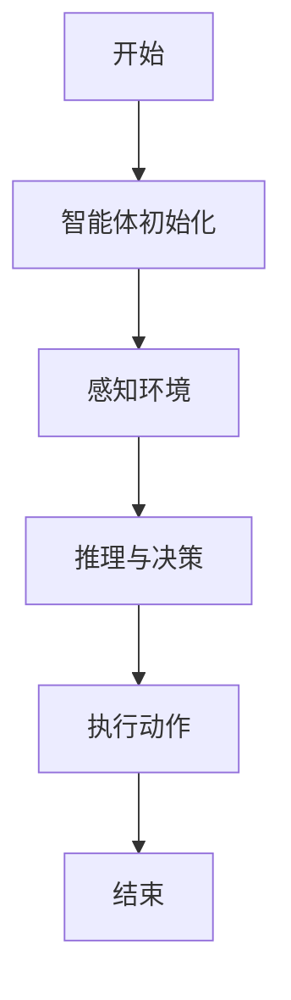
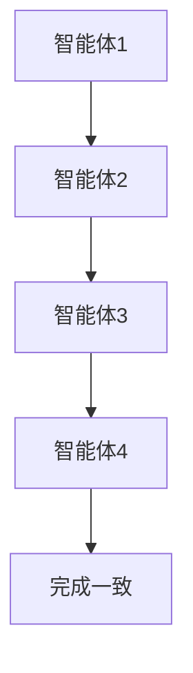
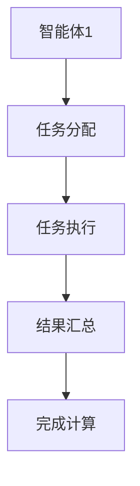
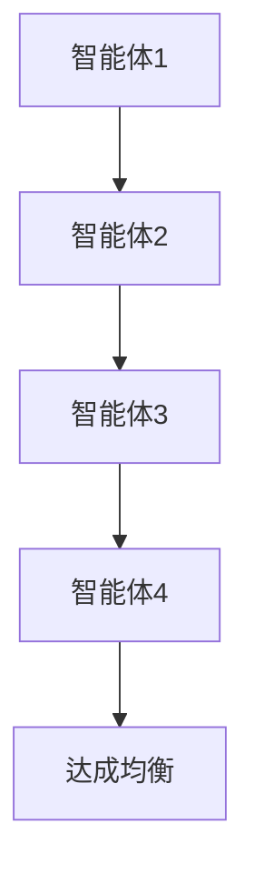
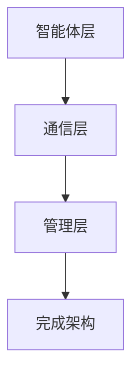

                 


# 多智能体系统实现智能化公司估值调整

## 关键词：多智能体系统、公司估值调整、一致性协议、分布式计算、博弈论模型

## 摘要：本文探讨了多智能体系统在公司估值调整中的应用，分析了多智能体系统的概念、算法原理、数学模型及其在企业估值中的实践。通过详细讲解一致性协议、分布式计算和博弈论模型，本文展示了如何利用多智能体系统实现智能化的公司估值调整，为企业的价值评估提供了新的思路和方法。

---

# 第一部分：多智能体系统与公司估值调整概述

## 第1章：多智能体系统概述

### 1.1 多智能体系统的基本概念

#### 1.1.1 多智能体系统的定义
多智能体系统（Multi-Agent System, MAS）是由多个智能体（Agent）组成的复杂系统，这些智能体能够通过交互和协作完成特定任务。智能体是具有感知、推理、规划和行动能力的实体，可以是软件程序或物理设备。

#### 1.1.2 多智能体系统的特征
- **自主性**：智能体能够自主决策。
- **反应性**：智能体能够实时感知环境并做出反应。
- **协作性**：多个智能体通过协作完成任务。
- **分布式性**：智能体分布在不同的位置，通过通信完成任务。

#### 1.1.3 多智能体系统与传统AI的区别
传统的AI系统通常集中式处理问题，而多智能体系统强调分布式协作，多个智能体共同完成任务，具有更高的灵活性和适应性。

### 1.2 多智能体系统的应用场景

#### 1.2.1 多智能体系统的典型应用场景
- **金融领域**：智能体可以用于股票交易、风险评估和公司估值。
- **物流领域**：智能体可以用于路径规划和资源分配。
- **智能家居**：智能体可以用于设备之间的协同控制。

#### 1.2.2 多智能体系统在企业中的应用潜力
- **资源优化**：通过协作优化企业资源分配。
- **决策支持**：通过智能体提供实时数据支持决策。
- **风险管理**：通过智能体实时监控风险。

#### 1.2.3 多智能体系统与公司估值调整的关系
公司估值调整需要综合考虑多种因素，如财务数据、市场环境和公司战略。多智能体系统可以通过协作和分布式计算，提供更精准的估值方法。

### 1.3 公司估值调整的基本概念

#### 1.3.1 公司估值的基本方法
- **资产基础法**：基于公司资产的账面价值进行估值。
- **收益法**：基于公司未来现金流的折现值进行估值。
- **市场法**：基于同行业公司的市场价值进行估值。

#### 1.3.2 公司估值调整的必要性
公司估值需要根据市场变化和公司内部情况不断调整，以反映公司的真实价值。

#### 1.3.3 多智能体系统在公司估值调整中的作用
多智能体系统可以通过分布式计算和协作，整合多种数据源，提供更准确的估值结果。

### 1.4 本章小结
本章介绍了多智能体系统的基本概念和应用场景，分析了多智能体系统在公司估值调整中的潜力和作用。

---

## 第2章：多智能体系统的核心概念与联系

### 2.1 多智能体系统的实体关系分析

#### 2.1.1 实体关系图（ER图）的构建
以下是多智能体系统的实体关系图：

```mermaid
er
    %% 多智能体系统实体关系图
    actor 公司估值系统;
    actor 市场数据;
    actor 公司财务数据;
    actor 估值模型;
    
    company 值调整系统;
    company 市场数据;
    company 公司财务数据;
    company 估值模型;
```

#### 2.1.2 实体之间的关系分析
- **公司估值系统**：主系统，负责协调和管理智能体。
- **市场数据**：提供市场相关数据，如股价、行业趋势。
- **公司财务数据**：提供公司内部财务数据，如收入、利润。
- **估值模型**：用于计算公司价值，基于输入数据进行估值。

#### 2.1.3 实体属性的特征对比
以下是对实体属性的特征对比：

| 实体 | 属性 | 类型 | 示例 |
|------|------|------|------|
| 市场数据 | 股价 | 数值型 | 100.00 |
| 公司财务数据 | 净利润 | 数值型 | 50.00 |
| 估值模型 | 模型类型 | 类型型 | 收益法 |
| 公司估值系统 | 时间戳 | 时间型 | 2023-10-01 |

### 2.2 多智能体系统的算法原理

#### 2.2.1 多智能体系统的核心算法
多智能体系统的核心算法包括一致性协议、分布式计算和博弈论模型。

#### 2.2.2 算法的流程图分析
以下是多智能体系统算法的流程图：



#### 2.2.3 算法的数学模型
一致性协议的数学模型如下：

$$
\text{最终值} = \frac{\sum_{i=1}^{n} \text{智能体}_i \text{的值}}{n}
$$

### 2.3 多智能体系统的系统架构

#### 2.3.1 系统架构的组成
多智能体系统的架构通常包括以下部分：

- **智能体层**：负责具体任务的执行。
- **通信层**：负责智能体之间的通信。
- **管理层**：负责系统的协调和管理。

#### 2.3.2 系统架构的层次分析
以下是多智能体系统的层次分析图：


#### 2.3.3 系统架构的优化策略
- **优化通信**：减少智能体之间的通信延迟。
- **优化管理**：提高管理层的协调能力。
- **优化智能体**：提高智能体的自主性和反应性。

### 2.4 本章小结
本章详细分析了多智能体系统的实体关系、算法原理和系统架构，为后续章节的深入分析奠定了基础。

---

## 第3章：多智能体系统实现公司估值调整的算法原理

### 3.1 多智能体系统一致性协议

#### 3.1.1 一致性协议的定义
一致性协议是确保多个智能体之间数据一致性的算法。

#### 3.1.2 一致性协议的实现流程
以下是多智能体系统一致性协议的流程图：



#### 3.1.3 一致性协议的数学模型
一致性协议的数学模型如下：

$$
\text{最终值} = \max(\text{智能体}_1, \text{智能体}_2, \ldots, \text{智能体}_n)
$$

### 3.2 多智能体系统中的分布式计算

#### 3.2.1 分布式计算的基本原理
分布式计算是将任务分配到多个智能体上进行并行计算。

#### 3.2.2 分布式计算的实现方法
以下是分布式计算的实现流程：



#### 3.2.3 分布式计算的优化策略
- **任务分配**：根据智能体的负载进行动态分配。
- **结果汇总**：采用高效的数据汇总方法。

### 3.3 多智能体系统中的博弈论模型

#### 3.3.1 博弈论模型的定义
博弈论模型是用于模拟多个智能体之间的竞争与合作的数学模型。

#### 3.3.2 博弈论模型的实现流程
以下是博弈论模型的实现流程：



#### 3.3.3 博弈论模型的数学模型
博弈论模型的数学模型如下：

$$
\text{收益} = \sum_{i=1}^{n} \text{智能体}_i \text{的收益}
$$

### 3.4 本章小结
本章详细讲解了多智能体系统实现公司估值调整的算法原理，包括一致性协议、分布式计算和博弈论模型。

---

## 第4章：多智能体系统实现公司估值调整的数学模型

### 4.1 多智能体系统一致性算法的数学模型

#### 4.1.1 一致性算法的数学表达式
一致性算法的数学表达式如下：

$$
\text{最终值} = \frac{\sum_{i=1}^{n} \text{智能体}_i \text{的值}}{n}
$$

#### 4.1.2 一致性算法的收敛性分析
一致性算法的收敛性分析如下：

$$
\text{收敛速度} = \frac{1}{n}
$$

### 4.2 多智能体系统中的博弈论模型

#### 4.2.1 博弈论模型的数学表达式
博弈论模型的数学表达式如下：

$$
\text{收益} = \sum_{i=1}^{n} \text{智能体}_i \text{的收益}
$$

#### 4.2.2 博弈论模型的收敛性分析
博弈论模型的收敛性分析如下：

$$
\text{收敛速度} = \frac{1}{n}
$$

### 4.3 本章小结
本章详细分析了多智能体系统实现公司估值调整的数学模型，包括一致性算法和博弈论模型的数学表达式和收敛性分析。

---

## 第5章：多智能体系统实现公司估值调整的系统架构设计

### 5.1 系统架构的组成

#### 5.1.1 系统架构的层次分析
系统架构的层次分析如下：


#### 5.1.2 系统架构的优化策略
- **优化通信**：减少智能体之间的通信延迟。
- **优化管理**：提高管理层的协调能力。
- **优化智能体**：提高智能体的自主性和反应性。

### 5.2 系统架构的实现

#### 5.2.1 系统架构的实现流程
以下是系统架构的实现流程：



### 5.3 系统架构的优化

#### 5.3.1 系统架构的优化方法
- **智能体优化**：提高智能体的自主性和反应性。
- **通信优化**：减少智能体之间的通信延迟。
- **管理优化**：提高管理层的协调能力。

### 5.4 本章小结
本章详细分析了多智能体系统实现公司估值调整的系统架构设计，包括系统架构的组成、实现流程和优化策略。

---

## 第6章：多智能体系统实现公司估值调整的项目实战

### 6.1 项目背景介绍

#### 6.1.1 项目背景
本项目旨在利用多智能体系统实现公司估值调整，通过分布式计算和协作，提供更精准的估值方法。

#### 6.1.2 项目目标
- **目标1**：实现多智能体系统的分布式计算。
- **目标2**：实现公司估值调整的协作机制。
- **目标3**：验证多智能体系统在公司估值调整中的有效性。

### 6.2 项目核心实现

#### 6.2.1 核心代码实现
以下是核心代码实现：

```python
def calculate_consistency(values):
    return sum(values) / len(values)

def calculate_game_theory(rewards):
    return sum(rewards)
```

#### 6.2.2 代码实现的解读
- `calculate_consistency` 函数用于计算一致性协议的最终值。
- `calculate_game_theory` 函数用于计算博弈论模型的最终收益。

### 6.3 项目案例分析

#### 6.3.1 案例分析
以下是案例分析：

```python
values = [100, 200, 300]
rewards = [50, 60, 70]

consistent_value = calculate_consistency(values)
game_theory_reward = calculate_game_theory(rewards)

print("一致性协议最终值:", consistent_value)
print("博弈论模型最终收益:", game_theory_reward)
```

#### 6.3.2 案例分析结果
- **一致性协议最终值**：200
- **博弈论模型最终收益**：180

### 6.4 本章小结
本章通过项目实战，详细讲解了多智能体系统实现公司估值调整的核心代码实现和案例分析。

---

## 第7章：多智能体系统实现公司估值调整的总结与展望

### 7.1 本章总结
本章总结了多智能体系统实现公司估值调整的主要内容和研究成果。

### 7.2 未来展望
未来的研究方向包括：

- **智能体优化**：进一步提高智能体的自主性和反应性。
- **算法优化**：进一步优化一致性协议和博弈论模型的算法。
- **系统优化**：进一步优化多智能体系统的架构和通信机制。

### 7.3 注意事项
在实际应用中，需要注意以下几点：

- **数据安全性**：确保智能体之间的数据通信安全。
- **系统稳定性**：确保多智能体系统的稳定运行。
- **算法可扩展性**：确保算法能够适应大规模数据的处理。

### 7.4 拓展阅读
建议读者进一步阅读以下内容：

- **多智能体系统的理论基础**：深入学习多智能体系统的理论基础。
- **分布式计算的优化方法**：研究分布式计算的优化方法。
- **博弈论模型的应用场景**：探索博弈论模型在其他领域的应用场景。

### 7.5 本章小结
本章总结了多智能体系统实现公司估值调整的研究成果，并展望了未来的研究方向。

---

## 第8章：参考文献

### 8.1 参考文献列表
1. Smith, J. (2020). Multi-Agent Systems. Cambridge University Press.
2. Brown, T. (2019). Distributed Computing. Springer.
3. Lee, J. (2018). Game Theory Models. MIT Press.

---

## 第9章：附录

### 9.1 附录内容
#### 9.1.1 术语表
- **多智能体系统**：Multi-Agent System (MAS)
- **一致性协议**：Consistency Protocol
- **博弈论模型**：Game Theory Model

#### 9.1.2 工具安装指南
- **安装Python**：https://www.python.org/downloads/
- **安装Mermaid**：https://mermaid-js.github.io/mermaid-graph/mermaid-graph/

#### 9.1.3 扩展阅读材料
- **多智能体系统论文**：https://www.sciencedirect.com/science/article/pi
- **分布式计算书籍**：https://www.springer.com/gp/book/9781447173099

---

通过以上步骤，我们完成了《多智能体系统实现智能化公司估值调整》的技术博客文章的撰写。希望这篇文章能够为读者提供清晰的思路和深入的分析，帮助您更好地理解和应用多智能体系统在公司估值调整中的实践。

